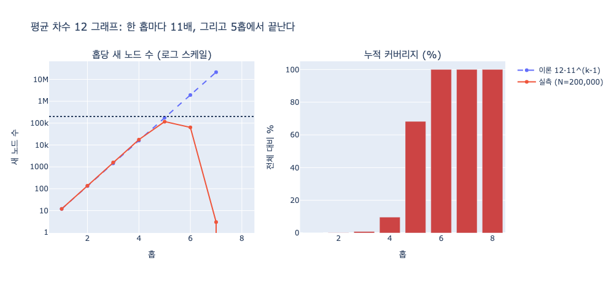

# 평균 차수 12짜리 그래프에서 홉이 하나 늘면 방문 노드는 몇 배가 되는가?

**답: 약 11배씩 늘어난다. 들어온 엣지 하나를 제외한 나머지 방향으로 퍼지기 때문이다.**

## 왜 12배가 아니라 11배인가

직관적으로는 "평균 차수가 12니까 한 홉에 12배"라고 말하기 쉽다. 하지만 틀렸다.

어떤 노드에 **도착했다**는 건 이미 **엣지 하나를 타고 들어왔다**는 뜻이다.
그 엣지는 왔던 길이라 되돌아가 봐야 이미 방문한 노드다.
그러니 그 노드에서 새로 뻗어 나갈 수 있는 방향은 12개가 아니라 **11개**다.

```
        ┌── 새 방향 1
        ├── 새 방향 2
들어온 ─→ (차수 12 노드) ── ... (총 11개)
 엣지   └── 새 방향 11
        ↑
    이 방향은 왔던 길 = 이미 방문함
```

이 11을 **분기 계수(branching factor)** 라고 부른다.

$$b = d - 1 = 12 - 1 = 11$$

시작 노드만 예외다. 시작점은 "들어온 엣지"가 없으니 12방향 전부로 퍼진다.
그래서 첫 홉만 12배, 그 뒤로는 계속 11배다.

$$|L_k| \approx d \cdot b^{\,k-1} = 12 \cdot 11^{\,k-1}$$

| 홉 | 이번 홉 새 노드 | 누적 | 직전 홉 대비 |
|---:|---:|---:|---:|
| 1 | 12 | 13 | 12.0x |
| 2 | 132 | 145 | 11.0x |
| 3 | 1,452 | 1,597 | 11.0x |
| 4 | 15,972 | 17,569 | 11.0x |
| 5 | 175,692 | 193,261 | 11.0x |

1홉에서 5홉까지는 11을 네 번 곱한 것이다.

$$11^4 = 14{,}641 \approx \text{약 1만 4천 배}$$

책에서 "5홉이면 11의 4승, 약 1만 4천 배"라고 한 게 이 계산이다.

## 밑이 1 달라지는 게 왜 중요한가

지수의 **밑**이라서 그렇다. 홉이 쌓이면 1의 차이가 크게 벌어진다.

| 밑 | 4홉 | 5홉 | 6홉 |
|---:|---:|---:|---:|
| 10 | 1,000 | 10,000 | 100,000 |
| **11** | **1,331** | **14,641** | **161,051** |
| 12 | 1,728 | 20,736 | 248,832 |

용량 산정을 어림으로 할 때도 `d`가 아니라 `d-1`을 밑으로 쓰는 게 맞다.

## 실측 — 지수 성장은 결국 N에서 잘린다

책의 `ex1_bfs_explosion.py`가 노드 20만 개, 평균 차수 12짜리 무작위 그래프에서
BFS 레벨을 세어 보는 예제다. 실행하면 이렇게 나온다.

| 홉 | 새 노드 | 누적 | 배수 | 전체 대비 |
|---:|---:|---:|---:|---:|
| 1 | 12 | 13 | 12.0x | 0.0% |
| 2 | 138 | 151 | 11.5x | 0.1% |
| 3 | 1,600 | 1,751 | 11.6x | 0.9% |
| 4 | 17,653 | 19,404 | 11.0x | 9.7% |
| 5 | 117,011 | 136,415 | 6.6x | **68.2%** |
| 6 | 63,582 | 199,997 | 0.5x | **100.0%** |
| 7 | 3 | 200,000 | 0.0x | 100.0% |

읽을 점 두 가지.

**1. 4홉까지는 이론값 11배와 거의 정확히 맞는다.** 초반에는 프런티어가 그래프 전체에
비해 작아서 중복 도달이 거의 없다. 그래서 순수한 $11^k$ 성장이 그대로 관측된다.

**2. 5홉부터 배수가 무너지는 건 성장이 멈춰서가 아니다.** 더 갈 곳이 없어서다.
이론값대로면 5홉에서 175,692개가 새로 나와야 하는데 그래프에 노드가 20만 개뿐이다.
지수 성장이 그래프 크기 $N$에서 **잘린다**.

$$|L_k| \approx \min\left(12 \cdot 11^{\,k-1},\; N - \text{누적}\right)$$

## 그래서 뭐가 문제인가

이게 「여섯 다리 건너면 다 안다」(six degrees of separation)의 정체다.
사교적인 이야기로는 재밌지만, **질의로 쓰면 "전체를 훑어라"와 같은 뜻**이 된다.

```cypher
-- 이 질의는 사실상 풀스캔이다
MATCH (a:Person {id: $id})-[:KNOWS*]-(b:Person)
RETURN b
```

홉 상한 없는 가변 길이 패턴(`[*]`)은 6홉쯤에서 그래프 전부를 방문한다.
서버가 죽는 건 알고리즘이 나빠서가 아니라 **상한이 없어서**다.

**대응 세 가지.**

1. **홉 상한을 박는다.** `[:KNOWS*1..3]`. 3홉이면 약 1,600개, 4홉이면 약 1만 8천 개.
   여기까지가 사람이 감당 가능한 범위다.
2. **도착지를 안다면 양방향 탐색.** 반지름 $d$짜리 공 하나 대신 반지름 $d/2$짜리 공 두 개를
   그린다. 공의 크기가 지수라서 반지름을 절반으로 줄이면 방문 수가 **제곱근**이 된다
   ($11^d \to 2 \cdot 11^{d/2}$). 책의 실측에서 75~88배 줄었다.
   단, "3다리 안의 사람 전부"처럼 도착지가 없는 질의에는 못 쓴다.
3. **결과 개수에 상한을 두고 조기 종료.** 프런티어 크기가 임계값을 넘으면 끊는다.

## 주의할 가정

이 "11배"는 어디까지나 **평균 차수** 기준의 어림이다.

- 실제 소셜 그래프는 차수 분포가 **멱법칙**에 가깝다. 평균은 12여도 팔로워 100만인
  슈퍼 노드가 하나 끼면 그 홉에서 배수가 수천 배로 튄다. 평균으로 잡은 용량 산정이
  슈퍼 노드 하나에 무너지는 게 실무에서 서버가 죽는 실제 경로다.
- **클러스터링 계수**가 높으면(친구의 친구가 서로 친구) 실효 분기 계수는 11보다 낮아진다.
  위 실측이 무작위 그래프라 11에 잘 맞았던 것이다.

## 시각화



왼쪽은 홉당 새 노드 수(로그 스케일). 점선이 이론 $12 \cdot 11^{k-1}$, 실선이 실측이다.
4홉까지 두 선이 겹치다가 $N = 200{,}000$ 천장에 닿으면서 실측이 꺾인다.
오른쪽은 누적 커버리지 — 5홉 68%, 6홉 100%.
