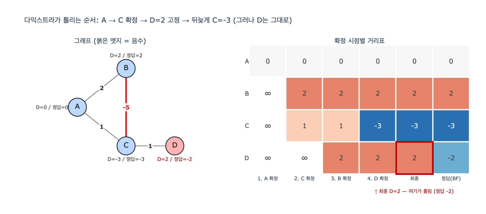

# 다익스트라는 정확히 어떤 순서로 틀리는가

**질문**: `ex3_dijkstra_negative.py`의 그래프에서 다익스트라는 정확히 어떤 순서로 틀리는가?

**답**: A→C가 1이라 C를 먼저 확정하고 D를 1+1=2로 계산한다. 이후 A→B→C가 -3임을 알고 거리표에 적지만 C는 이미 확정이라 다시 펼치지 않아 D가 2로 남는다.

---

## 1. 무대 설정

예제의 그래프는 노드 4개, 방향 엣지 4개가 전부다.

```python
EDGES = [("A", "C", 1), ("A", "B", 2), ("B", "C", -5), ("C", "D", 1)]
```

| 엣지 | 가중치 |
|---|---|
| A → C | 1 |
| A → B | 2 |
| B → C | **-5** ← 음수 |
| C → D | 1 |

A에서 출발했을 때의 **진짜** 최단 거리는 이렇다.

- A = 0
- B = 0 + 2 = 2
- C = min(A→C = 1, A→B→C = 2 + (-5) = **-3**) = **-3**
- D = C + 1 = **-2**

음수 사이클은 없다. 즉 최단 경로 자체는 잘 정의되어 있고, 벨만-포드로는 정확히 구해진다.
그런데 다익스트라는 D를 **2**라고 답한다. 예외도 안 난다.

## 2. 다익스트라가 기대는 전제

원본 코드의 핵심은 이 한 줄이다.

```python
done.add(u)                      # 한 번 확정하면 다시 안 본다
```

다익스트라의 정당성은 이 명제에 기댄다.

> 우선순위 큐에서 가장 작은 `d`로 꺼낸 노드 `u`의 `dist[u]`는 최종값이다. 더 줄어들 수 없다.

이게 성립하는 이유는 "앞으로 더 가는 비용은 항상 0 이상"이기 때문이다. 아직 확정 안 된
어떤 노드를 거쳐 `u`로 오더라도, 그 노드의 현재 거리가 이미 `dist[u]`보다 크거나 같고,
거기서 더 가면 더 커지기만 하니 `u`를 개선할 수 없다.

**음수 엣지가 하나라도 있으면 이 논증이 통째로 무너진다.** 더 먼 노드를 거쳐 오는 길이
음수 엣지 덕분에 더 짧아질 수 있기 때문이다. 여기서는 B(거리 2)가 C(거리 1)보다 "멀지만",
B를 거치면 C가 -3이 된다.

## 3. 틀리는 순서 — 한 걸음씩

`expy.py`의 추적 출력을 그대로 옮기면 이렇다. (`dist` 표: A B C D)

| 단계 | 일어난 일 | A | B | C | D |
|---|---|---|---|---|---|
| 0 | 시작. `dist[A]=0`, 큐 = [(0,A)] | 0 | ∞ | ∞ | ∞ |
| 1 | `pop (0, A)` → **A 확정** | 0 | ∞ | ∞ | ∞ |
| | 완화 A→C: `0+1=1` ⇒ `dist[C]=1`, 큐에 (1,C) | 0 | ∞ | 1 | ∞ |
| | 완화 A→B: `0+2=2` ⇒ `dist[B]=2`, 큐에 (2,B) | 0 | 2 | 1 | ∞ |
| 2 | `pop (1, C)` → **C 확정** ← 1 < 2 라서 B보다 먼저 | 0 | 2 | 1 | ∞ |
| | 완화 C→D: `1+1=2` ⇒ `dist[D]=2`, 큐에 (2,D) | 0 | 2 | 1 | **2** |
| 3 | `pop (2, B)` → **B 확정** | 0 | 2 | 1 | 2 |
| | 완화 B→C: `2+(-5)=-3 < 1` ⇒ `dist[C]=-3`, 큐에 (-3,C) | 0 | 2 | **-3** | 2 |
| 4 | `pop (-3, C)` → **이미 `done`. 버린다.** C의 이웃 D를 다시 펼치지 않는다 | 0 | 2 | -3 | 2 |
| 5 | `pop (2, D)` → D 확정 (값은 이미 오염된 2) | 0 | 2 | -3 | **2** |

확정 순서: **A → C → B → D**

한 문장으로 압축하면:

> **A→C가 1이라 C를 먼저 확정하고, 그 상태에서 D를 1+1=2로 계산해 버린다.
> 뒤늦게 A→B→C가 -3인 걸 알아내 거리표에는 적지만, C는 이미 확정이라
> 큐에서 (-3, C)를 꺼내도 버리고 D를 다시 펼치지 않는다. 그래서 D는 2로 남는다.**

핵심은 두 갈래다.

1. **거리표는 갱신된다.** `dist[C]`는 정확히 -3이 된다. 알고리즘이 정보를 놓친 게 아니다.
2. **그 갱신이 전파되지 않는다.** `done`에 들어간 순간 C는 두 번 다시 이웃을 펼치지 않는다.
   그래서 C의 **하류**인 D만 옛날 값(2)에 굳어 버린다.

## 4. 왜 특히 고약한가

원본 코드의 표현대로 "C는 맞고 D는 틀렸다".

| 노드 | 다익스트라 | 벨만-포드(정답) | 같나 |
|---|---|---|---|
| A | 0 | 0 | 예 |
| B | 2 | 2 | 예 |
| C | -3 | -3 | 예 |
| D | **2** | **-2** | 아니오 |

- **부분적으로 맞다.** 시작점 근처 세 노드가 전부 정답이다. 검증할 때 "A에서 가까운 것들부터
  몇 개 찍어 보자"라고 하면 통과한다.
- **예외가 안 난다.** 힙에서 음수를 꺼내도 `heapq`는 아무 불평도 안 한다. `assert`도 없다.
  그냥 조용히 틀린 숫자를 반환한다.
- **오염이 하류로만 번진다.** 잘못 확정된 노드 자신은 나중에 고쳐지고, 그 노드를 통해 이미
  계산해 둔 자손들만 틀린다. 그래프가 크면 "왜 여기만 이상하지" 하는 산발적 버그로 보인다.

여기서 D 하나가 4만큼 틀렸다. 실제 그래프에서는 잘못 확정된 노드 뒤의 부분 그래프 전체가
오염되므로, 오차가 몇 개 노드에 국한된다는 보장이 전혀 없다.

## 5. 음수가 실무에 스며드는 자리

원본이 꼽는 세 가지:

1. **할인·환급을 "음수 비용"으로 모델링할 때** — 요금 그래프에서 쿠폰을 -500원으로 넣는 식.
2. **유사도를 `1 - 거리`로 바꿨는데 유사도가 1을 넘을 때** — 정규화가 안 된 임베딩 내적 등.
3. **확률에 로그를 취했을 때** — `log(0.5) = -0.69`. 확률 곱 최대화를 최단 경로로 바꾸는
   흔한 기법인데, $\prod p_i$ 를 최대화하려면 $\sum \log p_i$ 를 **최대화**해야 하고,
   그대로 최단 경로에 넣으면 모든 엣지가 음수가 된다.

3번이 제일 자주 나온다. 올바른 변환은 부호를 뒤집는 것이다.

$$\max \prod_i p_i \;\Longleftrightarrow\; \min \sum_i \bigl(-\log p_i\bigr)$$

$p_i \le 1$ 이면 $-\log p_i \ge 0$ 이므로 가중치가 전부 음이 아니게 되고, 다익스트라를
그대로 쓸 수 있다. `log`를 쓰느냐 `-log`를 쓰느냐, 부호 하나 차이다.

## 6. 고치는 법

| 방법 | 특징 |
|---|---|
| **벨만-포드** | $O(VE)$. 음수 엣지 허용. 한 바퀴 더 돌려 음수 사이클까지 검출한다. 원본 예제가 비교군으로 쓴 것. |
| **SPFA / `done` 제거** | 다익스트라에서 확정 집합을 없애고 재확장을 허용. 정답은 맞지만 최악의 경우 지수적으로 같은 노드를 다시 펼친다. |
| **존슨(Johnson) 알고리즘** | 퍼텐셜 재가중으로 음수를 없앤 뒤 다익스트라. 전체 쌍 최단 경로에서 유용. |
| **부호 재설계** | 애초에 가중치가 음수가 안 되게 모델을 고친다($-\log p$, 비용 하한 클램프 등). 제일 싸고 확실한 방법. |
| **입력 검증** | `min(w) < 0`이면 예외를 던진다. "조용히 틀리는" 성질만 없애도 절반은 잡는다. |

`expy.py`의 3단계 셀에서 `done`을 제거한 버전을 돌려 보면 벨만-포드와 완전히 일치한다
(A=0, B=2, C=-3, D=-2). 즉 다익스트라의 오답은 "탐색이 부족해서"가 아니라 **확정이라는
최적화가 전제를 잃었기 때문**임을 확인할 수 있다.

## 7. 외워 둘 문장

> 다익스트라는 음수 가중치에서 **예외 없이, 조용히, 부분적으로** 틀린다.
> 틀리는 곳은 "잘못 확정된 노드"가 아니라 그 노드의 **하류**다.

---

## 시각화



왼쪽은 그래프(붉은 엣지가 음수 -5)와 각 노드의 다익스트라 값 / 정답. 오른쪽은 확정이 일어난
시점마다의 거리표다. C 행이 `∞ → 1 → 1 → -3`으로 뒤늦게 고쳐지는데도, D 행은 C가 확정된
직후 찍힌 `2`에서 끝까지 움직이지 않는 게 보인다.
