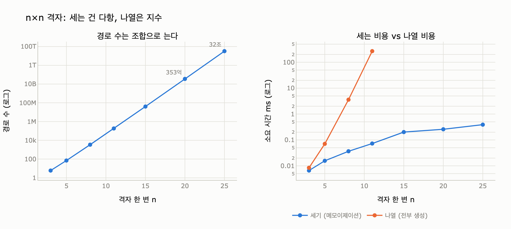

# `count_paths()`는 경로 수를 어떻게 세는가?

> **답**: 메모이제이션 재귀로 각 노드에서 목표까지의 경로 수를 캐시한다. 세는 것은 다항 시간에 가능하지만 나열은 불가능하다.

---

## 1. 원본 코드

9장 `code/ex4_path_explosion.py` 의 핵심은 이 열 줄이다.

```python
def count_paths(adj, s, t):
    memo = {}
    def go(u):
        if u == t:
            return 1
        if u in memo:
            return memo[u]
        memo[u] = sum(go(v) for v in adj[u])
        return memo[u]
    return go(s)
```

그리고 이 함수가 도는 그래프는 격자다.

```python
def grid(w, h):
    adj = defaultdict(list)
    for x in range(w):
        for y in range(h):
            if x + 1 < w:
                adj[(x, y)].append((x + 1, y))   # 오른쪽으로만
            if y + 1 < h:
                adj[(x, y)].append((x, y + 1))   # 위로만
    return adj
```

**엣지가 오른쪽·위로만 난다.** 이게 우연이 아니다. 뒤에서 볼 모든 성질이 여기서 나온다.

---

## 2. 재귀식 — "나에서 목표까지"를 센다

`go(u)` 가 돌려주는 값은 「$u$ 에서 $t$ 까지 가는 서로 다른 경로의 수」다. 출발점 $s$ 가 아니라 **현재 노드** 기준이라는 점이 중요하다. 그래야 $u$ 하나로 캐시 키가 성립한다.

$$
P(u) \;=\;
\begin{cases}
1 & (u = t) \\[4pt]
\displaystyle\sum_{v \in \mathrm{adj}(u)} P(v) & (u \neq t)
\end{cases}
$$

말로 풀면: **$u$ 에서 목표로 가는 방법의 수 = $u$ 의 각 이웃에서 목표로 가는 방법의 수의 합.** 첫 걸음을 어디로 딛느냐로 경우를 나누면 서로 겹치지 않게 완전 분할된다.

`memo[u]` 가 저장하는 것은 「$u$ 를 지나는 경로 목록」이 아니라 **정수 하나**다. 이 차이가 이 장 전체의 요점이다.

### 격자에서 $P(u)$ 는 파스칼 삼각형이다

3x3 격자에서 $t = (2,2)$ 로 두고 각 노드의 $P(u)$ 를 적으면:

| | x=0 | x=1 | x=2 |
|---|---|---|---|
| **y=2** | 1 | 1 | 1 (=t) |
| **y=1** | 3 | 2 | 1 |
| **y=0** | 6 | 3 | 1 |

$P((0,0)) = 6 = \binom{4}{2}$. 일반적으로 $n \times n$ 격자의 코너-투-코너 경로 수는

$$ \binom{2n-2}{\,n-1\,} \;\approx\; \frac{4^{\,n-1}}{\sqrt{\pi (n-1)}} $$

**지수**로 는다. `expy.py` 셀 3에서 `math.comb` 과 일치함을 $n=30$ 까지 확인한다.

---

## 3. "세기는 다항"의 근거 — 노드당 한 번

메모이제이션 재귀의 비용은 이렇게 센다.

**계산(캐시 미스) 횟수 = 노드 수.** `memo[u]` 가 한 번 채워지면 두 번 다시 `sum(...)` 을 돌지 않는다. 그러니 "무거운 일"이 일어나는 횟수는 노드 수를 넘을 수 없다.

**총 재귀 진입 횟수 = 엣지 수 + 1.** `go(u)` 안의 `sum(go(v) for v in adj[u])` 는 $u$ 의 나가는 엣지마다 정확히 한 번 `go` 를 부른다. $u$ 자신은 딱 한 번만 펼쳐지므로, 각 엣지는 평생 한 번만 통과된다. 여기에 루트 호출 1회를 더한 것.

$$ T(V, E) = O(V + E) $$

`expy.py` 셀 1이 이걸 계측한다.

| 격자 | 노드 | 엣지 | go 진입 | 계산 | 캐시 히트 | 경로 수 |
|---|---|---|---|---|---|---|
| 3x3 | 9 | 12 | 13 | 8 | 3 | 6 |
| 8x8 | 64 | 112 | 113 | 63 | 48 | 3,432 |
| 15x15 | 225 | 420 | 421 | 224 | 195 | 40,116,600 |
| 20x20 | 400 | 760 | 761 | 399 | 360 | 35,345,263,800 |

`go 진입 = 엣지 + 1`, `계산 = 노드 − 1` 이 정확히 맞는다 (목표 노드 $t$ 는 `u == t` 로 즉시 반환되어 memo를 안 쓰기 때문에 1이 빠진다).

> **답은 353억인데 작업량은 400노드짜리 그대로다.** 이게 「세기는 다항」의 정확한 의미다.

### 메모를 빼면 (셀 2)

`memo` 두 줄을 지우면 같은 재귀식이 **부분경로 개수만큼** 호출된다. 정확히는 「$s$ 에서 출발해 아무 노드에서 끝나는 경로의 총수」다. 3x3 격자에서 그 값은 1+1+1+1+2+3+1+3+6 = 19 이고, 측정된 naive 호출 수도 19다.

| 격자 | 경로 수 | memo 호출 | naive 호출 | 배수 |
|---|---|---|---|---|
| 3x3 | 6 | 13 | 19 | 1.5x |
| 5x5 | 70 | 41 | 251 | 6.1x |
| 7x7 | 924 | 85 | 3,431 | 40.4x |
| 8x8 | 3,432 | 113 | 12,869 | 113.9x |

왼쪽 열은 2차식으로, 오른쪽 열은 지수로 는다. **한 줄 차이가 복잡도 계급을 바꾼다.**

### 큰 정수 비용에 대한 각주

엄밀히 말하면 $O(V+E)$ 는 "덧셈 한 번 = 상수 시간"을 가정한 것이다. 실제 답은 $\Theta(4^n / \sqrt{n})$ 이므로 자릿수가 $\Theta(n)$ 비트, 곧 그래프 크기에 대해 다항이다. 다항 자릿수 × 다항 회수 = 여전히 다항이다. `expy.py`의 25x25(32조 개)가 0.4ms 에 끝나는 건 그래서다.

---

## 4. "나열은 지수"의 근거 — 출력 자체가 지수

여기서 자주 하는 오해: 「나열이 느린 건 알고리즘이 나빠서 아닌가?」 아니다.

$n \times n$ 격자의 경로가 $\binom{2n-2}{n-1}$ 개라면, 그걸 전부 **출력**하는 어떤 프로그램도 최소한 그만큼의 출력 연산을 해야 한다.

$$ T_{\text{나열}} \;=\; \Omega\!\left(\text{출력 크기}\right) \;=\; \Omega\!\left(\binom{2n-2}{n-1}\right) $$

**알고리즘 문제가 아니라 출력 문제다.** 아무리 영리해도 $4^n$ 개짜리 답을 다항 시간에 쓸 수는 없다. (이 성질을 다루는 척도가 「출력 크기에 대해 다항」인 *output-polynomial* 이고, 경로 나열은 그 의미로는 효율적일 수 있다 — 하지만 실무에서 출력 크기가 350억이면 그건 위로가 안 된다.)

`expy.py` 셀 3의 측정:

| 격자 | 최단 길이 | 경로 수 | 세기 | 나열 |
|---|---|---|---|---|
| 8x8 | 14 | 3,432 | 0.04ms | 3.6ms |
| 11x11 | 20 | 184,756 | 0.08ms | 268ms |
| 20x20 | 38 | 353억 | 0.25ms | (불가) |
| 25x25 | 48 | 32조 | 0.39ms | (불가) |

25x25 를 한 경로당 1ns 로 뽑아도 9시간 가까이 걸린다.

**최단 경로 길이는 $2(n-1)$ 로 선형, 경로 수는 지수.** 이 장 요약의 "「최단 경로 하나」와 「모든 경로」는 다른 문제입니다. 앞은 다항, 뒤는 지수예요" 가 이것이다.

---

## 5. 순환이 있으면 왜 이 방식이 통하지 않나

`count_paths()` 가 성립하는 유일한 전제는 **그래프가 DAG(비순환 방향 그래프)** 라는 것이다. 격자 코드가 오른쪽·위로만 엣지를 놓은 건 그래서다. 엣지 하나만 되돌려도 세 가지가 동시에 깨진다.

### (1) 답이 무한하다

사이클을 한 바퀴 더 돌면 그건 다른 경로다. 두 바퀴도, 세 바퀴도. $s \to t$ 경로 위에 도달 가능한 사이클이 하나라도 있으면 경로 수는 $\infty$ 다. **재귀식 $P(u) = \sum P(v)$ 자체가 잘 정의되지 않는다** — 이건 유한한 값을 가진 방정식이 아니라 $x = x + \ldots$ 꼴의 발산하는 식이 된다.

DAG 위에서 이 재귀가 잘 정의되는 이유는 위상 순서가 있기 때문이다. 위상 정렬(9.5절)을 해 두면 $P(u)$ 는 항상 **자기보다 뒤에 오는 노드들의 값만** 참조한다. 순환이 없다는 건 곧 "재귀에 바닥이 있다"는 뜻이다.

### (2) 재귀가 안 끝난다 — 구현상의 이유

코드를 다시 보자.

```python
memo[u] = sum(go(v) for v in adj[u])   # ← memo[u] 는 sum 이 "끝난 뒤에" 채워진다
```

`memo[u]` 에 값이 들어가는 시점은 `sum(...)` 이 전부 반환된 **뒤**다. 사이클 위에서는 그 계산 도중에 다시 `go(u)` 로 들어오는데, 그때 `u` 는 아직 memo 에 없다. 그래서 `if u in memo` 를 통과하지 못하고 또 펼쳐진다 → 무한 재귀 → `RecursionError`.

`expy.py` 셀 4가 격자에 되돌아가는 엣지 하나를 심어 이걸 재현한다.

```
RecursionError: maximum recursion depth exceeded in comparison
```

즉 **예외가 나는 게 다행인 경우다.** 조용히 틀린 답을 주는 게 아니라 터져 준다.

### (3) "방문 표시로 사이클을 끊으면 되지 않나" — 문제가 바뀐다

DFS 하듯 방문 중 노드를 표시해 사이클을 끊으면 크래시는 막는다. 그런데 그렇게 나온 숫자는 **더 이상 경로 수가 아니다.** 어떤 임의의 DFS 트리 위에서 센 값이라 방문 순서에 따라 답이 달라진다.

제대로 하려면 문제를 **단순 경로(simple path, 노드 반복 없음)** 세기로 바꿔야 한다. 그러면 다항성이 사라진다.

- 이제 "몇 개인가"는 **현재 노드 $u$ 만으로 결정되지 않는다.** 어디를 이미 밟았는지에 따라 답이 달라진다.
- 캐시 키가 $u$ 에서 $(u, \text{visited})$ 로 커진다. 상태 공간은 $O(V \cdot 2^V)$.
- **메모이제이션이 무력해진다** = 사실상 나열과 같은 비용이 된다.

그리고 이건 게으름이 아니라 이론적 벽이다. 일반 그래프에서 $s\text{-}t$ 단순 경로 세기는 **#P-complete** 다 (Valiant, 1979). 다항 시간 알고리즘이 알려져 있지 않고, 있다면 P = NP 급의 사건이다.

`expy.py` 셀 4-2의 측정 (같은 격자를 무방향으로 바꾼 것):

| 격자 | DAG 경로 (메모 O) | 단순 경로 (무방향) | 호출 수 |
|---|---|---|---|
| 2x2 | 2 | 2 | 5 |
| 3x3 | 6 | 12 | 51 |
| 4x4 | 20 | 184 | 1,271 |
| 5x5 | 70 | 8,512 | 90,111 |
| 6x6 | 252 | 1,262,816 | 18,470,411 |

왼쪽은 노드 수에 비례한 작업으로 끝나는데, 오른쪽은 **호출 수가 답과 같은 속도로** 는다. 7x7 은 단순 경로가 5억 7천만 개다.

---

## 6. 세 문제를 한 표로

| | DAG 위 경로 **세기** | DAG 위 경로 **나열** | 일반 그래프 **단순 경로** 세기 |
|---|---|---|---|
| 비용 | $O(V+E)$ | $\Omega(\text{경로 수})$ | #P-complete |
| 왜 | 노드당 한 번만 계산 | 출력 자체가 지수 | 상태에 방문 집합이 붙어 memo 무력화 |
| 캐시 키 | $u$ | (해당 없음) | $(u, \text{visited})$ → $2^V$ |
| 실무 | 그냥 하면 된다 | 상한·조건을 되물어라 | 하지 마라 |

---

## 7. 그래서 실무에서

책의 결론은 알고리즘이 아니라 **요구사항 대화**다.

> 「모든 경로를 보여 줘」라는 요구가 오면 되물어야 한다.
> - 정말 전부인가, 아니면 「가장 짧은 것 몇 개」인가
> - 길이 상한이 있나
> - 중간에 반드시 지나야 할 노드가 있나

`count_paths()` 가 존재한다는 사실이 위험하기도 하다. **"세는 건 순식간이던데?"** 라는 경험이 "그럼 나열도 되겠지"라는 오해로 이어진다. 둘은 복잡도 계급이 다른 문제다.

실전 대안:

- **개수만 필요하면** 그냥 세라. 다항이다. ("영향받는 경로가 몇 개인가" 대시보드 같은 것)
- **최단 경로 하나면** BFS/다익스트라. 다항이다.
- **최단 경로 *들*이면** $k$-shortest paths (Yen). $k$ 를 상한으로 받아라.
- **"영향 범위"면** 경로 열거가 아니라 **도달 가능 노드 집합**(reachability)일 가능성이 높다. 이건 $O(V+E)$ 다. 9장 도입의 장애 사례가 정확히 이 오역이었다 — 「영향 범위를 다 보여 줘」를 모든 경로 열거로 구현했고, 어느 날 노드 하나가 슈퍼 노드가 됐다.
- **Cypher 가변 길이 패턴**(`-[*1..3]->`)을 쓸 때도 같은 함정이다. 상한을 안 걸면 엔진이 경로를 열거하려 든다.

---

## 8. 한 줄 요약

`count_paths()` 는 「$u$ 에서 목표까지의 경로 수」라는 **정수 하나**를 노드마다 캐시한다. 노드당 한 번만 계산하므로 $O(V+E)$. 반면 나열은 출력이 $\binom{2n-2}{n-1}$ 개라 원리적으로 지수. 그리고 이 전부가 **DAG 전제** 위에 서 있다 — 순환이 끼면 답은 무한이 되고, 단순 경로로 문제를 바꾸면 캐시 키에 방문 집합이 붙어 #P-complete 가 된다.

---

## 시각화



왼쪽: $n \times n$ 격자의 경로 수 (로그 축) — 직선으로 보이는 건 지수 증가라는 뜻이다.
오른쪽: 같은 격자에서 **세는 시간**(파랑)과 **나열하는 시간**(주황). 세기는 완만히 늘고 나열은 로그 축에서도 가파르게 올라가다 11x11 에서 끊긴다.
