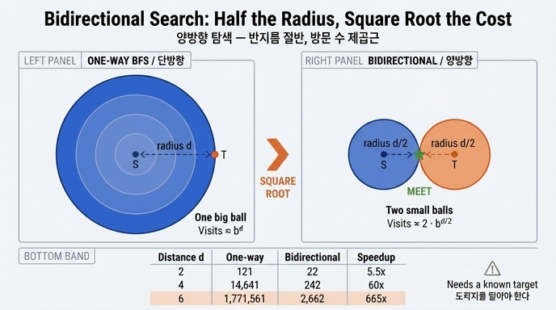

# 두 점 사이 경로를 찾을 때 양방향 탐색이 유리한 이유

## 한 줄 답

단방향 BFS는 출발점에서 **반지름 d짜리 공** 하나를 그리고, 양방향 BFS는 출발점과 도착점에서 **반지름 d/2짜리 공 두 개**를 그린다. 공의 크기(방문 노드 수)가 반지름에 대해 **지수**로 커지므로, 반지름을 절반으로 줄이면 방문 수는 **제곱근**이 된다.

## 1. 전제: 한 홉마다 몇 배씩 늘어나는가

9장의 예제 그래프는 노드 20만 개, 평균 차수 12다 (`code/graph.py`의 `make(n=200_000, avg_deg=12)`).

- 어떤 노드에 도착하면 그 노드로 들어온 간선 1개를 빼고 나머지 11개로 뻗어 나간다. 즉 **분기 계수 b ≈ 11**.
- 그래서 홉이 하나 늘 때마다 프런티어(이번 홉에 새로 만나는 노드)가 대략 11배씩 커진다.
- `ex1_bfs_explosion.py`가 보여 주는 게 정확히 이 표다. 5홉이면 전체의 68%, 6홉이면 사실상 전부.

여기서 중요한 건 "많다"가 아니라 **증가 방식이 지수(b^d)라는 것**이다. 지수라는 성질 하나가 아래 결론을 전부 만든다.

## 2. 왜 절반이 제곱근이 되는가

거리 d만큼 떨어진 두 점 s, t를 잇는 경로를 찾는다고 하자.

### 단방향

s에서만 뻗으면 t를 만나기까지 반지름 d짜리 공을 다 채워야 한다.

```
방문 수 ≈ b^d
```

### 양방향

s에서 앞으로, t에서 뒤로 동시에 뻗는다. 두 프런티어는 **중간쯤(각각 d/2)** 에서 만난다.

```
방문 수 ≈ b^(d/2) + b^(d/2) = 2 · b^(d/2) = 2 · √(b^d)
```

즉 양방향의 비용은 단방향 비용의 **제곱근에 상수 2를 곱한 값**이다. 절감 배수는

```
b^d / (2 · b^(d/2)) = b^(d/2) / 2
```

로, **d가 커질수록 절감 배수 자체가 지수로 커진다**.

### 숫자로

b = 11일 때:

| 거리 d | 단방향 b^d | 양방향 2·b^(d/2) | 절감 배수 |
|---:|---:|---:|---:|
| 2 | 121 | 22 | 5.5x |
| 4 | 14,641 | 242 | 60x |
| 6 | 1,771,561 | 2,662 | 665x |
| 8 | 214,358,881 | 29,282 | 7,320x |

d=6에서 이미 177만 대 2,662다. 같은 답을 얻는데 한쪽은 서버를 죽이고 한쪽은 안 죽인다.

### 직관 하나 더

공의 부피가 반지름의 지수라면, **큰 공 하나보다 작은 공 두 개가 압도적으로 싸다**. 넓이가 반지름의 제곱인 원으로 바꿔 생각해도 방향은 같다. 반지름 10짜리 원 하나(314)보다 반지름 5짜리 원 두 개(157)가 싸다. 다만 실제 그래프는 제곱이 아니라 **지수**여서 차이가 훨씬 극단적으로 벌어진다.

## 3. 코드에서 어떻게 생겼나

`code/ex2_bidirectional.py`의 `bidi_path()`가 이 구조다.

- 방문 표를 **두 개** 둔다: `fwd = {s: None}`, `bwd = {t: None}`
- 큐도 두 개: `fq = deque([s])`, `bq = deque([t])`
- 매 라운드마다 앞쪽 한 층, 뒤쪽 한 층을 번갈아 펼친다
- 새로 만난 노드 `v`가 **상대편 방문 표(`other`)에 이미 있으면** 거기가 만남 지점이다. 그 순간 종료
- `_join()`이 앞쪽 경로를 s까지 거슬러 올라가고, 뒤쪽 경로를 t까지 따라가서 이어 붙인다

비교 대상인 `bfs_path()`는 방문 표가 `seen` 하나뿐이다. 이 **표가 하나냐 둘이냐**가 공 하나냐 둘이냐의 코드상 표현이다.

## 4. 실측에서는 왜 665배가 아니라 75~88배인가

9장 요약은 "실측에서 75~88배 줄었다"고 적는다. 이론값보다 작은 이유는 다음과 같다.

- **그래프가 유한하다.** 노드가 20만 개뿐이라 단방향 공이 b^d까지 자라지 못하고 전체 크기에서 잘린다. log₁₁ 200,000 ≈ 5.1이라 d는 5 언저리에서 포화한다.
- **BFS는 t를 만나면 즉시 멈춘다.** 마지막 층을 끝까지 채우지 않으므로 단방향 쪽도 이론 상한보다 적게 방문한다.
- **상수항 2가 붙는다.** 공이 두 개니까.
- **d가 홀수면 정확히 반씩 나뉘지 않는다.** 한쪽이 한 층 더 깊게 뻗는다.

방향은 그대로다. 이론이 "제곱근"이라고 말하고 실측이 "두 자릿수 배수 절감"으로 답한 것뿐이다.

## 5. 쓸 수 있는 조건 — 여기가 시험에 나온다

양방향 탐색은 공짜가 아니다. 다음이 전부 성립해야 한다.

1. **도착지를 알아야 한다.** 이게 가장 큰 제약이다. 뒤에서 뻗을 시작점이 없으면 공을 두 개 그릴 수 없다.
   - 되는 질의: "A와 B 사이 경로" (두 점 사이)
   - 안 되는 질의: "이 사람과 3다리 안에 있는 사람 전부" (한 점에서 퍼지는 것) — 이건 애초에 반지름 d짜리 공 전체가 답이라 줄일 여지가 없다
2. **역방향으로 걸을 수 있어야 한다.** 방향 그래프면 역인접 리스트가 있거나 역방향 인덱스가 있어야 한다. 없으면 뒤쪽 탐색이 불가능하다.
3. **양쪽 분기 계수가 비슷해야 이득이 크다.** 한쪽이 슈퍼 노드에 걸리면 그쪽 공만 폭발한다. 실무에서는 **프런티어가 작은 쪽을 먼저 펼치는** 전략(작은 큐 우선)을 쓴다.
4. **최단성 보장에 주의.** 무가중치 BFS라도 "상대편 표에서 발견하자마자 반환"하면 층을 마저 채우지 않아 답이 1 길어질 수 있다. 엄밀하게 하려면 현재 층을 끝까지 펼친 뒤 후보 중 최소를 고른다. 가중치 그래프(양방향 다익스트라)는 종료 조건이 더 까다로워서, 잠정 최선값 μ가 양쪽 최소 키의 합 이하가 될 때까지 멈추면 안 된다.

## 6. 흔한 오해

| 오해 | 사실 |
|---|---|
| "양방향이니까 2배 빠르다" | 2배가 아니라 **제곱근**이다. 나누는 게 아니라 지수를 반으로 접는 것 |
| "아무 순회에나 쓰면 된다" | 도착지가 명시된 **점-대-점** 질의에만 쓴다. "N홉 이웃 전부"에는 못 쓴다 |
| "양방향을 쓰면 홉 상한이 필요 없다" | 여전히 필요하다. 경로가 없는 쌍이면 양쪽 공이 모두 그래프 전체로 자란다. 9장의 근본 교훈은 "상한 없는 순회는 전체 스캔"이다 |
| "무조건 절반씩 자란다" | 분기 계수가 비대칭이면 한쪽만 커진다. 프런티어 크기를 보고 펼칠 쪽을 고르는 게 실전 구현 |

## 7. 한 줄 정리

**비용이 지수라면, 지수를 반으로 접는 것이 상수를 줄이는 것보다 압도적으로 크다.** 양방향 탐색은 알고리즘 트릭이 아니라 지수 함수의 성질을 그대로 이용한 것이고, 그 대가로 "도착지를 알아야 한다"는 조건을 받아들인 것이다.

## 참고

- 예제 코드: `content/ch09/code/ex2_bidirectional.py`, `ex1_bfs_explosion.py`, `graph.py`
- [NetworkX `bidirectional_shortest_path`](https://networkx.org/documentation/stable/reference/algorithms/generated/networkx.algorithms.shortest_paths.unweighted.bidirectional_shortest_path.html)
- [NetworkX BFS/순회 알고리즘](https://networkx.org/documentation/stable/reference/algorithms/traversal.html)

## 인포그래픽


