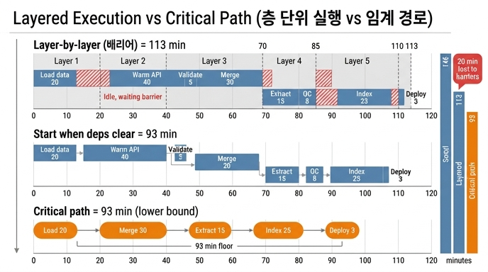

# 위상 정렬 층 단위 실행이 임계 경로보다 느린 이유

> **Q.** 위상 정렬 층 단위 실행이 임계 경로보다 느린 이유는 무엇인가?
>
> **A.** 같은 층의 가장 느린 작업이 끝날 때까지 기다리기 때문이다. 의존이 풀리는 대로 시작하면 임계 경로까지 내려간다.

---

## 1. 용어부터 정리

| 용어 | 뜻 |
|---|---|
| **위상 정렬(topological sort)** | 방향 비순환 그래프(DAG)에서 「의존이 먼저, 의존하는 쪽이 나중」이 되도록 노드를 한 줄로 세우는 것 |
| **층 / 슈퍼스텝(superstep)** | 위상 정렬을 할 때 진입 차수 0인 노드를 **한 번에 한 뭉치씩** 꺼내면 생기는 묶음. 같은 층 안의 작업들은 서로 의존이 없으므로 동시에 돌릴 수 있다 |
| **임계 경로(critical path)** | DAG에서 비용 합이 가장 큰 경로. **아무리 코어를 많이 붙여도 이 시간 밑으로는 못 내려가는 하한** |

층 단위 실행은 「층 1을 전부 끝낸다 → 층 2를 전부 끝낸다 → …」 방식이다. 층과 층 사이에 **배리어(barrier)** 가 있다. BSP(Bulk Synchronous Parallel) 모델의 슈퍼스텝이 정확히 이 구조다.

그래서 층 단위 실행의 총 시간은 이렇게 계산된다.

```
층 단위 총시간 = Σ (각 층에서 가장 오래 걸리는 작업의 비용)
```

`max`의 합이라는 점이 핵심이다. 층 안의 나머지 작업들의 비용은 **총시간에 아무 기여도 하지 않는다.** 대신 그 작업들은 일찍 끝나고 나서 배리어까지 **놀고 있다.**

---

## 2. 왜 느려지나 — 한 문장

> 어떤 작업 B가 층 1의 「빨리 끝난 작업」 A에만 의존하더라도,
> 층 1에 있는 「느린 작업」 X가 끝나야 배리어가 열리므로 B는 **의존이 다 풀렸는데도 기다린다.**

즉 층 단위 실행이 만드는 대기는 **진짜 의존 때문이 아니라, 스케줄러가 인위적으로 그어 놓은 동기화 선 때문에 생기는 가짜 의존**이다. 이 가짜 대기가 층마다 쌓여서 임계 경로 위에 얹힌다.

```
층 단위 총시간 = 임계 경로 + (배리어 때문에 생긴 유휴 시간의 누적)
```

두 값이 같아지는 경우는 층마다 최대 비용 작업들이 마침 하나의 경로로 이어져 있을 때뿐이다. 일반적으로는 층 단위가 느리거나 같고, 절대 빠를 수 없다.

---

## 3. 책의 예제로 확인 (`code/ex5_toposort.py`)

작업 8개와 의존 관계, 그리고 비용(분):

| 작업 | 비용 | 의존 |
|---|---|---|
| 외부 API 예열 | 40 | — |
| 데이터 적재 | 20 | — |
| 스키마 검증 | 5 | 데이터 적재 |
| 엔티티 병합 | 30 | 데이터 적재 |
| 관계 추출 | 15 | 스키마 검증, 엔티티 병합 |
| 품질 검사 | 8 | 관계 추출 |
| 색인 생성 | 25 | 관계 추출 |
| 배포 | 3 | 품질 검사, 색인 생성, 외부 API 예열 |

### 3.1 층(슈퍼스텝) 나누기

| 층 | 작업 | 층의 span = max(비용) |
|---|---|---|
| 1차 | 데이터 적재(20), 외부 API 예열(40) | **40** |
| 2차 | 스키마 검증(5), 엔티티 병합(30) | **30** |
| 3차 | 관계 추출(15) | **15** |
| 4차 | 품질 검사(8), 색인 생성(25) | **25** |
| 5차 | 배포(3) | **3** |

### 3.2 세 가지 실행 시간

```
순차 실행      146분   (그냥 다 더한 값, 146 = 40+20+5+30+15+8+25+3)
층 단위 실행   113분   (40+30+15+25+3)      → 1.3배 단축
임계 경로       93분   (하한)
```

임계 경로 93분의 정체는 이 경로다.

```
데이터 적재(20) → 엔티티 병합(30) → 관계 추출(15) → 색인 생성(25) → 배포(3) = 93
```

### 3.3 20분의 손실은 어디서 나왔나

`113 − 93 = 20분`. 이 20분은 **1차 층에서 통째로 발생**한다.

- 「데이터 적재」는 20분에 끝난다. 그 자식인 「스키마 검증」과 「엔티티 병합」은 **20분 시점에 의존이 다 풀린다.**
- 그런데 같은 층의 「외부 API 예열」이 40분짜리다. 배리어는 40분에 열린다.
- 결과적으로 「엔티티 병합」은 **아무 이유 없이 20분을 서서 기다린다.**
- 「엔티티 병합」은 임계 경로 위의 작업이므로, 이 20분 지연이 그대로 최종 완료 시각까지 밀린다.

특히 얄궂은 점은, **가짜 대기를 만든 「외부 API 예열」은 임계 경로와 아무 상관이 없다**는 것이다. 이 작업은 배포 직전에만 필요하다(배포는 90분에 시작 가능하고 외부 API 예열은 40분에 이미 끝나 있다). 임계 경로 계산에서는 40분짜리가 90분 앞에서 무시되지만, 층 단위 스케줄에서는 이 40분이 첫 층의 span을 결정해 버린다.

### 3.4 두 스케줄의 타임라인 비교

**층 단위 (총 113분, 각 층 끝에 배리어)**

```
 0        40        70    85       110  113
 |---L1---|---L2----|-L3--|---L4---|-L5-|
 데이터적재 ████ (20분에 끝나고 20분 유휴 ░░░░)
 외부API예열 ████████ (40)
           스키마검증 █ (5, 이후 25분 유휴)
           엔티티병합 ██████ (30)
                     관계추출 ███ (15)
                           품질검사 ██ (8, 17분 유휴)
                           색인생성 █████ (25)
                                    배포 █ (3)
```

**의존 단위 (총 93분, 배리어 없음)**

| 작업 | 시작 | 종료 |
|---|---|---|
| 데이터 적재 | 0 | 20 |
| 외부 API 예열 | 0 | 40 |
| 스키마 검증 | 20 | 25 |
| 엔티티 병합 | 20 | 50 |
| 관계 추출 | 50 | 65 |
| 품질 검사 | 65 | 73 |
| 색인 생성 | 65 | 90 |
| 배포 | 90 | 93 |

의존 단위 스케줄에서 각 작업의 시작 시각은 **선행 작업들의 종료 시각의 최댓값**이다. 이 값을 끝까지 따라가면 정확히 임계 경로 길이(93분)가 나온다. 즉 **자원이 무제한이라면 「의존이 풀리는 대로 시작」 = 「임계 경로」** 다.

---

## 4. 그런데 왜 층 단위를 쓰나

층 단위가 항상 나쁜 선택은 아니다. 트레이드오프가 있다.

| | 층 단위 (슈퍼스텝/BSP) | 의존 단위 (이벤트 기반) |
|---|---|---|
| 속도 | 임계 경로보다 느리거나 같다 | 임계 경로에 도달 |
| 구현 | 쉽다. 배리어 하나로 동기화 끝 | 어렵다. 작업별 완료 이벤트 → 자식 진입 차수 감소 → 준비 큐 투입 |
| 디버깅·관측 | 층 번호로 진행률이 딱 떨어진다 | 상태가 흩어져 추적이 어렵다 |
| 실패 복구 | 층 경계가 자연스러운 체크포인트 | 재시도 지점을 따로 설계해야 |
| 자원 제어 | 층 단위로 동시성 상한 관리가 쉽다 | 폭주 방지 로직이 별도로 필요 |

책의 표현대로 **「층 단위는 구현이 쉽고, 의존 단위는 빠르다」**. Airflow·Argo·Spark 같은 실제 시스템도 이 축 위에서 선택을 한다(Spark의 stage 경계는 사실상 배리어다).

층 단위를 쓰면서도 손실을 줄이는 실무 요령:

- **비용이 튀는 작업을 층 밖으로 뺀다.** 위 예의 「외부 API 예열」처럼 의존이 느슨하면서 오래 걸리는 작업은 별도 백그라운드로 돌리고, 실제로 필요한 시점(배포 직전)에만 조인한다.
- **층 안의 비용 편차를 줄인다.** 층 손실은 `span − 평균`에 비례하므로, 작업 분할 단위를 고르게 만들면 배리어 손실이 준다.
- **임계 경로를 먼저 측정한다.** 층 단위 총시간과 임계 경로의 차이가 곧 「스케줄러를 갈아 얻을 수 있는 최대 이득」이다. 위 예에서는 20분(17%)이므로 구현 난이도를 감안하면 안 바꿔도 된다는 판단이 가능하다.

---

## 5. 자주 하는 오해

- **「위상 정렬이 느린 것 아닌가?」** 아니다. 위상 정렬 자체는 O(V+E)로 끝난다. 느린 건 정렬이 아니라 **정렬 결과를 층으로 묶어 배리어를 두고 실행하는 방식**이다.
- **「층 수를 줄이면 빨라지나?」** 층 수는 이미 최소다(층 개수 = DAG의 가장 긴 경로의 노드 수). 문제는 층의 개수가 아니라 **층마다 max를 취한다**는 점이다.
- **「임계 경로보다 빠르게 만들 수 있나?」** 없다. 작업을 더 잘게 쪼개 임계 경로 자체를 바꾸지 않는 한, 93분은 어떤 스케줄러로도 못 깬다.
- **「코어를 더 붙이면?」** 층 단위의 손실은 코어 부족 때문이 아니라 배리어 때문이다. 코어를 무한히 붙여도 113분은 그대로다.

---

## 6. 한 줄 정리

층 단위 실행의 총시간은 `Σ max(층 안의 비용)` 이고 임계 경로는 `max(경로별 비용 합)` 이다. **`Σmax` 가 `max Σ` 보다 크거나 같기 때문에** 층 단위는 절대 임계 경로보다 빠를 수 없고, 그 차이는 「빨리 끝난 작업이 배리어를 기다린 유휴 시간」이다. 배리어를 없애고 의존이 풀리는 즉시 시작하면 하한인 임계 경로에 도달한다.

## 인포그래픽


