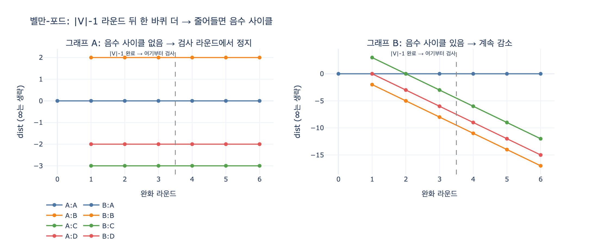

# 벨만-포드의 음수 사이클 검사

## 질문

벨만-포드는 음수 사이클을 어떻게 검사하는가?

## 답

노드 수 - 1회 완화를 마친 뒤 한 바퀴 더 돌려, 여전히 거리가 줄어드는 엣지가 있으면 음수 사이클이 있다고 판정한다.

---

## 1. 코드에서 어디를 보면 되나

9장 `ex3_dijkstra_negative.py`의 `bellman_ford`가 정확히 이 구조다.

```python
def bellman_ford(edges, start, nodes):
    dist = {n: float("inf") for n in nodes}
    dist[start] = 0
    for _ in range(len(nodes) - 1):        # ① |V|-1 라운드
        for a, b, w in edges:              #    모든 엣지를 완화(relax)
            if dist[a] + w < dist[b]:
                dist[b] = dist[a] + w
    for a, b, w in edges:                  # ② 한 바퀴 더 = 음수 사이클 검사
        if dist[a] + w < dist[b]:
            return dist, True
    return dist, False
```

핵심은 두 덩어리다.

- ①번 루프: 엣지 전체를 훑는 라운드를 **정확히 |V| - 1번** 돈다.
- ②번 루프: **똑같은 완화를 한 번 더** 시도한다. 이때 한 개라도 `dist[a] + w < dist[b]`가 참이면 음수 사이클이 있다.

②는 값을 고치는 게 아니라 「아직도 줄어드나?」를 묻는 검사다. 다익스트라와 달리 벨만-포드가 음수를 다룰 수 있는 이유도, 그리고 「음수는 되지만 음수 **사이클**은 안 된다」고 말할 수 있는 이유도 여기에 있다.

---

## 2. 왜 하필 |V| - 1회인가 — 최단 경로의 엣지 수 상한

### 2.1 단순 경로에는 엣지가 |V| - 1개까지만 들어간다

음수 사이클이 없는 그래프라면, 시작점 $s$에서 임의의 노드 $v$까지의 최단 경로 중 **단순 경로(simple path, 같은 노드를 두 번 지나지 않는 경로)** 인 것이 반드시 하나 존재한다.

이유는 간단하다. 최단 경로에 노드가 중복해서 나온다면 그 사이 구간은 사이클이다. 음수 사이클이 없다는 가정 아래 그 사이클의 가중치 합은 $\ge 0$이므로, 사이클 구간을 잘라내도 거리가 늘지 않는다. 잘라내기를 반복하면 같은(또는 더 짧은) 길이의 단순 경로가 남는다.

단순 경로는 노드를 최대 $|V|$개 지나므로 엣지는 최대

$$|V| - 1$$

개다. 즉 **최단 경로의 홉 수 상한이 $|V| - 1$** 이다.

### 2.2 라운드 $k$가 끝나면 「$k$홉 이내 최단 거리」가 확정된다

벨만-포드의 불변식(귀납법으로 증명된다):

> 라운드 $k$를 마친 시점에, 모든 $v$에 대해 `dist[v]`는 **엣지 $k$개 이하로 가는 경로 중 최단 거리** 이하다. (그리고 실제로 그 값과 같아진다.)

- 기저: $k = 0$. `dist[s] = 0`, 나머지 $\infty$. 0홉 최단 거리 그대로다.
- 귀납: $v$까지의 $k$홉 최적 경로가 $s \to \dots \to u \to v$라면, 앞부분 $s \to \dots \to u$는 $k-1$홉 최적이므로 라운드 $k-1$ 끝에 `dist[u]`가 확정돼 있다. 라운드 $k$에서 엣지 $(u, v)$를 완화하는 순간 `dist[v] <= dist[u] + w`가 된다.

여기서 「모든 엣지를 훑는다」가 중요하다. 엣지 순서가 나쁘면 한 라운드에 홉 하나씩만 전진하므로, **홉 수만큼의 라운드가 최악의 경우 필요**하다.

### 2.3 그래서 $|V| - 1$

- 최단 경로의 홉 수 $\le |V| - 1$ (2.1)
- 라운드 $k$면 $k$홉까지 확정 (2.2)

두 개를 합치면 $|V| - 1$ 라운드로 **모든 최단 거리가 확정**된다. 그 이상 돌아도 값이 바뀔 이유가 없다. 이게 상한이 딱 $|V|-1$인 이유이고, 시간 복잡도가 $O(|V| \cdot |E|)$인 이유다.

> 참고: 그래서 「$|V|-1$번 돌기 전에 어떤 라운드에서도 갱신이 없었다」면 조기 종료해도 안전하다. 실무 구현은 대개 이 early-exit 플래그를 둔다.

---

## 3. 왜 「한 바퀴 더」가 음수 사이클 판정이 되나

### 3.1 대우로 보기

$|V| - 1$ 라운드 뒤의 상태를 두 경우로 나눠 보자.

**(A) 음수 사이클이 없다면** → 2절에 따라 `dist`는 이미 진짜 최단 거리다. 최단 거리는 모든 엣지에 대해 삼각 부등식

$$dist[v] \le dist[u] + w(u, v)$$

를 만족한다(만족하지 않으면 더 짧은 경로가 존재한다는 뜻이라 최단이 아니다). 따라서 추가 라운드에서 `dist[u] + w < dist[v]`인 엣지는 **하나도 없다**.

대우를 취하면: **한 바퀴 더 돌렸는데 줄어드는 엣지가 하나라도 있다 → 음수 사이클이 있다.** 이게 판정의 절반(건전성, soundness)이다.

### 3.2 반대 방향 — 음수 사이클이 있으면 반드시 걸린다

$s$에서 도달 가능한 음수 사이클 $v_0 \to v_1 \to \dots \to v_k = v_0$가 있고, 그 가중치 합이

$$\sum_{i=1}^{k} w(v_{i-1}, v_i) < 0$$

이라고 하자. 만약 추가 라운드에서 이 사이클의 모든 엣지가 완화되지 않았다면(= 줄어드는 엣지가 없다면), 모든 $i$에 대해

$$dist[v_i] \le dist[v_{i-1}] + w(v_{i-1}, v_i)$$

가 성립한다. 사이클을 한 바퀴 돌며 이 부등식을 전부 더하면, 좌변과 우변의 $dist$ 항은 같은 집합을 한 번씩 돌기 때문에 서로 상쇄되고

$$0 \le \sum_{i=1}^{k} w(v_{i-1}, v_i)$$

이 남는다. 이는 사이클 가중치 합이 음수라는 가정과 모순이다. 따라서 **음수 사이클이 있으면 추가 라운드에서 반드시 어떤 엣지가 완화된다.** 이게 판정의 나머지 절반(완전성, completeness)이다.

두 방향을 합치면 「$|V|$번째 라운드에서 완화가 일어남 ⟺ ($s$에서 도달 가능한) 음수 사이클 존재」라는 **필요충분조건**이 된다. 그래서 이 검사는 휴리스틱이 아니라 정확한 판정이다.

### 3.3 직관 한 줄

음수 사이클이 있으면 그 사이클을 한 바퀴 돌 때마다 거리가 더 줄어든다. 최단 거리라는 개념 자체가 $-\infty$로 발산하므로 **수렴할 값이 없다**. 그래서 「$|V|-1$번이면 다 끝났어야 하는데 아직도 줄어든다」는 사실이 곧 「수렴이 안 되고 있다」는 증거다.

---

## 4. 자주 하는 실수와 실무 주의점

| 실수 | 무슨 일이 생기나 |
|---|---|
| 노드 수만큼 완화만 하고 검사 라운드를 생략 | 음수 사이클이 있어도 못 잡는다. 거리표가 그럴듯해 보인다. |
| 검사 라운드에서 `dist`를 실제로 갱신 | 판정 자체는 되지만 거리표가 오염된다. 검사는 읽기만 하는 게 안전하다. |
| `dist[a]`가 `inf`인 엣지를 그대로 계산 | 파이썬은 `inf + w = inf`라 `inf < inf`가 거짓이니 무해하다. C/Java에서 `INT_MAX + w`를 쓰면 오버플로로 **음수가 되어 가짜 사이클**을 만든다. 반드시 `if dist[a] != INF` 가드를 둔다. |
| 도달 불가능한 음수 사이클 | 시작점에서 못 가는 음수 사이클은 이 검사로 안 잡힌다. 전역 검사를 원하면 가상의 소스를 만들어 모든 노드에 가중치 0 엣지를 연결한다. |
| 무향 그래프의 음수 엣지 | 무향에서 가중치 $-w$짜리 엣지 하나는 그 자체로 음수 사이클($u \to v \to u$)이다. |

### 「거리가 음수면 사이클」이 아니다

음수 **가중치**와 음수 **사이클**은 다르다. 9장 `ex3`의 예제 그래프

```
A→C (1), A→B (2), B→C (-5), C→D (1)
```

는 `B→C`가 -5인 음수 엣지를 가지지만 사이클 자체가 없다. 벨만-포드는 `has_cycle = False`를 내놓고 정답 `dist[D] = -2`를 준다. 반면 다익스트라는 C를 먼저 확정해 버려서 `dist[D] = 2`라는 틀린 값을 조용히 내놓는다. 9장이 강조하는 지점은 여기다 — **예외가 안 나고 답만 틀린다.**

### 언제 실제로 문제가 되나

9장이 드는 실무 사례:

- 할인/환급을 「음수 비용」으로 모델링할 때
- 유사도를 `1 - 거리`로 바꿨는데 유사도가 1을 넘을 때
- 확률 곱을 최단 경로로 바꾸려고 로그를 취했는데 값이 1보다 작을 때 ($\log 0.5 = -0.69$)

마지막 경우 환전 차익(arbitrage) 탐지가 대표적 응용이다. 환율 $r$에 $-\log r$을 가중치로 주면, **음수 사이클 = 무위험 차익 기회**가 된다. 벨만-포드의 사이클 검사는 그 자체로 쓸모 있는 신호다.

---

## 5. 한 줄 정리

$|V|-1$은 「단순 경로의 엣지 수 상한」이라 그 이상 돌 이유가 없고, 그래서 「그 뒤에도 줄어든다」는 사실이 곧 「최단 거리가 존재하지 않는다 = 음수 사이클이 있다」의 증거다.

---

## 참고

- 9장 예제: `content/ch09/code/ex3_dijkstra_negative.py`
- [NetworkX bellman_ford_path](https://networkx.org/documentation/stable/reference/algorithms/generated/networkx.algorithms.shortest_paths.weighted.bellman_ford_path.html)

## 시각화


