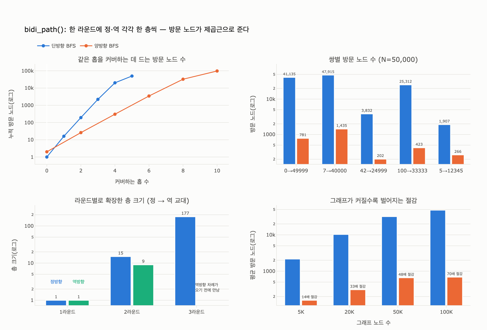

# `bidi_path()`는 두 방향 탐색을 어떻게 번갈아 진행하는가

**답**: 정방향 큐와 역방향 큐를 각각 한 층씩 확장하며, 새로 방문한 노드가 반대쪽 `seen`에 있으면 만난 것으로 보고 경로를 잇는다.

출처: 9장 `code/ex2_bidirectional.py`

---

## 1. 코드부터

```python
def bidi_path(adj, s, t, max_hop=8):
    if s == t:
        return [s], 1
    fwd, bwd = {s: None}, {t: None}      # 방향별 seen. 값은 «부모», 시작점은 None
    fq, bq = deque([s]), deque([t])      # 방향별 큐
    for _ in range(max_hop):                                    # (1) 라운드
        for q, seen, other in ((fq, fwd, bwd), (bq, bwd, fwd)): # (2) 방향 교대
            for _ in range(len(q)):                             # (3) 딱 한 층
                u = q.popleft()
                for v in adj.get(u, ()):
                    if v in seen:
                        continue
                    seen[v] = u
                    if v in other:                              # (4) 만남 판정
                        return _join(v, fwd, bwd), len(fwd) + len(bwd)
                    q.append(v)
    return None, len(fwd) + len(bwd)
```

네 개의 장치가 전부다.

### (1) 라운드 — `for _ in range(max_hop)`

바깥 루프 한 바퀴가 **한 라운드**다. 라운드 하나에 정방향 한 층 + 역방향 한 층이 나간다.
그래서 `max_hop`은 **홉 상한이 아니라 라운드 수**이고, 실제 탐색 반경은 최대 `2 * max_hop` 홉이다.
단방향 `bfs_path()`의 `max_hop`과 이름은 같지만 의미가 다르다는 점이 이 코드의 함정 중 하나다.

### (2) 방향 교대 — `for q, seen, other in ((fq, fwd, bwd), (bq, bwd, fwd))`

교대 로직 전체가 이 튜플 하나에 들어 있다. 각 원소는 `(내 큐, 내 seen, 상대 seen)`이고,
두 번째 원소에서 `seen`과 `other`가 **뒤바뀐다**. 덕분에 아래 확장 코드는 방향을 몰라도 되고,
정방향/역방향 코드를 두 벌 쓸 필요가 없다. 순서는 항상 정방향 먼저, 역방향 다음이다.

무방향 그래프라 역방향도 `adj.get(u)`를 그대로 쓴다. **방향 그래프라면 이 코드는 틀린다.**
역방향 큐는 「들어오는 엣지」 인접 리스트를 따로 받아야 한다.

### (3) 딱 한 층 — `for _ in range(len(q))`

가장 중요한 한 줄이다. `len(q)`를 **루프에 들어가기 전에 한 번만** 평가하므로, 이번에 pop 할 개수가
그 시점 프런티어 크기로 고정된다. 루프 안에서 `q.append(v)`로 넣는 노드들은 이번 라운드에 pop 되지 않고
다음 라운드로 밀린다. 즉 큐가 자연스럽게 **층(level) 단위**로 갈린다. BFS에서 깊이를 따로 저장하지 않고
층을 세는 관용구다.

이걸 `while q`로 바꾸면 한쪽이 큐를 끝까지 비울 때까지 상대에게 차례가 넘어가지 않는다.
교대가 사라지고 사실상 단방향 BFS가 된다 (`expy.py` §3에서 실측: 41,135 → 41,136으로 동일).

### (4) 만남 판정 — `if v in other`

새로 방문한 노드 `v`를 **내 쪽 `seen`에 기록한 직후** 반대쪽 `seen`에 있는지 본다. 있으면 `v`를 통해
`s`에서 `t`까지 이어지는 경로가 완성된 것이다. 판정 위치가 중요하다.

- `seen[v] = u`를 **먼저** 하기 때문에, 만난 시점에 `v`는 `fwd`와 `bwd` **양쪽 모두에** 들어 있다.
  방금 넣은 쪽이 이번에 기록했고, 반대쪽은 이전 라운드에 이미 기록해 뒀다.
- 그래서 `_join()`이 방향을 구분하지 않아도 된다.

```python
def _join(meet, fwd, bwd):
    left = [meet]
    while fwd[left[-1]] is not None:   # meet → … → s (fwd 부모를 거슬러 올라감)
        left.append(fwd[left[-1]])
    right = []
    cur = bwd[meet]
    while cur is not None:             # meet 의 뒤쪽 → … → t (bwd 부모를 따라감)
        right.append(cur)
        cur = bwd[cur]
    return list(reversed(left)) + right    # s … meet … t
```

`left`는 뒤집어 붙이고 `right`는 `bwd[meet]`부터 시작한다(`meet`가 두 번 들어가지 않도록).

---

## 2. 실제로 어떻게 굴러가나

노드 5만 개, 평균 차수 12인 그래프에서 `0 → 49999`를 찾을 때의 라운드별 기록 (`expy.py` §3):

| 라운드 | 방향 | 확장한 층 크기 | 새 노드 | `fwd` 크기 | `bwd` 크기 | 비고 |
|---|---|---|---|---|---|---|
| 1 | 정방향 | 1 | 15 | 16 | 1 | |
| 1 | 역방향 | 1 | 9 | 16 | 10 | |
| 2 | 정방향 | 15 | 177 | 193 | 10 | |
| 2 | 역방향 | 9 | 100 | 193 | 110 | |
| 3 | 정방향 | 177 | 478 | 671 | 110 | **만남! v=27561** |

- 라운드 1: 정방향이 `s` 하나를 펼치고, 곧바로 역방향이 `t` 하나를 펼친다.
- 이번 라운드에 «새로 넣은 노드 수»가 다음 라운드의 «확장할 층 크기»가 된다 (15 → 15, 9 → 9).
  `len(q)` 스냅숏이 층을 갈라 주기 때문이다.
- 라운드 3 정방향 도중 새 노드 27561이 이미 `bwd`에 있는 걸 보고 즉시 멈춘다.
  역방향은 3라운드 차례를 받지도 못했다.
- 총 방문 노드는 `671 + 110 = 781`. 같은 쌍의 단방향 BFS는 41,135개를 봤다 (**52.7배**).
- 경로: `[0, 7953, 34623, 27561, 8855, 49999]` — 5홉, 단방향이 찾은 것과 같은 길이.

---

## 3. 왜 이렇게 줄어드나

평균 차수 $k$ 인 그래프에서 한 홉마다 대략 $k-1$ 배씩 늘어난다. 거리 $d$ 인 두 점을 찾을 때

$$V_{\text{단방향}} \approx (k-1)^{d}, \qquad V_{\text{양방향}} \approx 2\,(k-1)^{d/2} = 2\sqrt{V_{\text{단방향}}}$$

반지름 $d$ 짜리 공 하나 대신 반지름 $d/2$ 짜리 공 **두 개**를 그린다. 공의 크기가 지수라서
반지름을 절반으로 줄이면 방문 수가 **제곱근**이 된다. 절감 배수는 $\tfrac{1}{2}(k-1)^{d/2}$ 이므로
그래프가 커져 $d$ 가 커질수록 벌어진다 (`expy.py` §6 실측).

| 노드 수 | 단방향 평균 방문 | 양방향 평균 방문 | 절감 |
|---|---|---|---|
| 5,000 | 2,166 | 158 | 13.7x |
| 20,000 | 10,300 | 309 | 33.4x |
| 50,000 | 31,898 | 659 | 48.4x |
| 100,000 | 48,089 | 687 | 70.0x |

책이 20만 노드에서 75~88배를 본 것과 같은 곡선이다.

---

## 4. 첫 만남이 최단인가 — 그렇다 (조건부)

`if v in other: return` 은 만남을 발견하는 **즉시** 반환한다. 같은 층 뒤쪽에 더 짧게 만나지는 노드가
있을 것 같지만, **층을 맞춰 교대**하면 그럴 수 없다.

라운드 $r$ 이 끝나면 `fwd`는 깊이 $0..r$ 을, `bwd`도 깊이 $0..r$ 을 **완전히** 담고 있다.
실제 최단 거리를 $D$ 라 하면,

- $D = 2m$ 인 경우: 라운드 $m$ 의 정방향 차례에는 만남이 없다(있었다면 $D \le 2m-1$).
  이어지는 역방향 차례에서 발견되는 노드 $v$ 는 $d_b(v) = m$ 이고 $d_f(v) \ge D - m = m$ 인데
  $d_f(v) \le m$ 이므로 정확히 $m$. 찾은 길이 $= 2m = D$.
- $D = 2m+1$ 인 경우: 라운드 $m$ 까지 만남이 없고, 라운드 $m+1$ 정방향에서
  $d_f(v) = m+1$, $d_b(v) \ge D-(m+1) = m$ 이며 $d_b(v) \le m$ 이므로 정확히 $m$. 찾은 길이 $= D$.

무작위 200쌍으로 확인하면 단방향 BFS 결과와 길이가 **200/200 일치**한다 (`expy.py` §5).

단, 이 보장은 다음을 전제로 한다.

- **층 단위 교대**. `for _ in range(len(q))`를 `while q`로 바꾸면 보장과 절감이 함께 사라진다.
- **무방향(대칭) 그래프**. 방향 그래프에서 역 인접 리스트 없이 쓰면 답 자체가 틀린다.
- **비가중 그래프**. 가중치가 붙으면 이 논증이 깨지고, 양방향 다익스트라의 별도 종료 조건
  (양쪽 확정 거리의 합이 지금까지의 최선 이상이면 종료)이 필요하다.

---

## 5. 남은 함정들

| 함정 | 내용 |
|---|---|
| `max_hop` 의미 차이 | 단방향은 홉 상한, 양방향은 라운드 수. 12홉 목표를 단방향은 `max_hop=12`, 양방향은 `max_hop=6`에 찾는다 |
| 방문 수 이중 계산 | `len(fwd) + len(bwd)` 는 두 dict 크기의 합이라 겹치는 노드가 두 번 세어진다 (만남 직전에는 겹침이 거의 없어 실용상 무시) |
| 도착지를 알아야 한다 | 양방향의 전제는 «어디서 거꾸로 걸어올지»를 아는 것. **「이 사람과 3다리 안에 있는 사람 전부」는 양방향으로 못 푼다** — 도착점이 없으니 역방향 공을 그릴 수 없다 |
| 프런티어 크기 비대칭 | 어느 쪽 프런티어가 더 큰지는 시작·도착 노드의 차수에 달렸다. 실전 구현(NetworkX 등)은 매번 **작은 쪽 큐를 먼저** 확장해 더 아낀다 |
| 슈퍼 노드 | 한쪽 프런티어에 차수 수십만짜리 노드가 끼면 그 층 하나로 폭발한다. 양방향이라도 상한은 여전히 필요하다 |

참고: [NetworkX `bidirectional_shortest_path`](https://networkx.org/documentation/stable/reference/algorithms/generated/networkx.algorithms.shortest_paths.unweighted.bidirectional_shortest_path.html)

---

## 한 줄 정리

라운드마다 `((fq, fwd, bwd), (bq, bwd, fwd))` 를 순회해 **정방향 → 역방향 순으로 각각 한 층씩** 확장하고
(`for _ in range(len(q))` 가 층을 갈라 준다), 새로 방문한 노드가 **반대쪽 `seen`** 에 있으면 만난 것으로 보아
`_join()`으로 앞 절반과 뒤 절반을 이어 붙인다.

## 시각화


