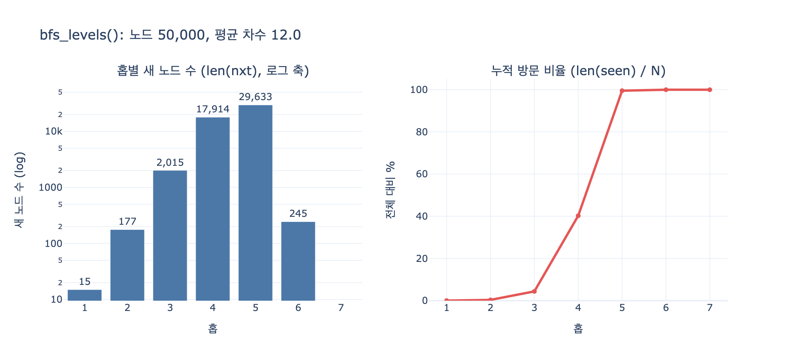

# `bfs_levels()`는 홉별 통계를 어떻게 계산하는가

**답**: frontier를 유지하며 홉마다 아직 보지 않은 이웃만 모아 다음 frontier로 삼고, 이번 홉의 새 노드 수와 누적 방문 수를 기록한다.

---

## 원본 코드

9장 `code/ex1_bfs_explosion.py`의 함수다.

```python
def bfs_levels(adj, start, max_hop):
    seen = {start}
    frontier = [start]
    out = []
    for hop in range(1, max_hop + 1):
        nxt = []
        for u in frontier:
            for v in adj.get(u, ()):
                if v not in seen:
                    seen.add(v)
                    nxt.append(v)
        out.append((hop, len(nxt), len(seen)))
        frontier = nxt
        if not frontier:
            break
    return out
```

## 세 개의 상태 변수

| 변수 | 자료구조 | 역할 | 통계에서의 의미 |
|---|---|---|---|
| `seen` | `set` | 지금까지 **발견한** 노드 전부 (시작 노드 포함) | `len(seen)` = 누적 방문 수 |
| `frontier` | `list` | **직전 홉에서 처음 발견된** 노드들 = 지금 펼칠 층 | 이번 홉에 훑을 대상 |
| `nxt` | `list` | 이번 홉에 처음 발견된 노드들 = 다음 층 | `len(nxt)` = 이번 홉의 새 노드 수 |

`out`에는 홉마다 튜플 하나씩 `(hop, len(nxt), len(seen))`이 쌓인다. 각각 **홉 번호 / 이번 홉의 새 노드 수 / 누적 방문 수**다. `main()`은 이 세 값으로 표를 그리고, 배수(`new / prev`)와 전체 대비 비율(`total / len(adj)`)을 추가로 계산한다.

## 한 홉이 도는 순서

1. `nxt = []` — 다음 층을 담을 빈 리스트를 만든다.
2. `for u in frontier` — **현재 층의 노드만** 펼친다. 이전 층은 다시 보지 않는다.
3. `for v in adj.get(u, ())` — 그 이웃을 훑는다. `.get(u, ())`은 차수 0인(인접 리스트에 없는) 노드에서 `KeyError`가 나지 않게 하는 방어다.
4. `if v not in seen` — **처음 보는 노드만** 통과시킨다.
5. `seen.add(v)` — 발견 즉시 `seen`에 넣는다. 나중에 넣으면 같은 층 안에서 두 노드가 같은 이웃을 가리켰을 때 그 이웃이 두 번 세어진다.
6. `out.append(...)` — 이번 홉 집계를 기록한다.
7. `frontier = nxt` — 층을 교체한다. 이 한 줄이 "홉"의 경계를 만든다.
8. `if not frontier: break` — 더 뻗을 곳이 없으면(도달 가능한 성분을 다 덮었으면) 조기 종료한다.

## 왜 큐가 아니라 리스트 두 개인가

일반적인 BFS는 `deque` 하나로 돌면서 노드별 거리를 따로 저장한다. `bfs_levels()`는 그 대신 **층 단위 리스트 두 개를 교대로** 쓴다(`frontier` → `nxt` → `frontier`). 이 방식의 이점:

- 거리 딕셔너리 없이도 홉별 집계가 자연스럽게 나온다. 리스트의 길이가 곧 그 홉의 새 노드 수다.
- 홉 상한(`max_hop`)을 for 루프 횟수로 직접 표현할 수 있다. 큐 방식에서는 `(node, depth)` 튜플을 넣고 매번 depth를 비교해야 한다(같은 파일 이웃인 `ex2_bidirectional.py`의 `bfs_path()`가 그 방식이다).
- 각 층은 서로 독립적이라 병렬화나 배치 처리(예: 층 하나를 DB 한 번의 `IN` 질의로 확장)로 옮기기 쉽다.

무가중 그래프에서 BFS의 층은 곧 최단 거리이므로, 홉 `h`의 `nxt`는 "시작점으로부터 최단 거리가 정확히 `h`인 노드 집합"이다.

## `seen` 검사가 없으면

`if v not in seen`을 빼면 홉마다 왔던 길로 되돌아간다. 그러면 "새 노드 수"가 새 노드가 아니라 **훑은 엣지 수**를 세게 되고, 그래프가 아무리 작아도 값이 무한히 커진다. `expy.py`의 4단계에 고장난 버전과의 비교가 있다. 8노드짜리 그래프에서 올바른 버전은 누적 8에서 멈추지만, 고장난 버전은 6홉에 누적 308까지 간다.

## 이 통계가 말하는 것

평균 차수가 $\bar{d}$ 인 랜덤 그래프에서, 되돌아오는 엣지를 무시하면 홉마다 대략 $\bar{d}-1$ 배씩 늘어난다. 홉 $h$ 까지의 누적 방문 수는

$$ |S_h| \approx 1 + \bar{d}\sum_{i=0}^{h-1}(\bar{d}-1)^i $$

로 지수 증가한다. 책의 평균 차수 12짜리 20만 노드 그래프에서는 5홉이면 전체의 68%, 6홉이면 사실상 전부에 닿는다. 곡선은 S자를 그리는데, 초반 지수 구간이 끝나고 그래프를 다 덮는 순간 배수가 급격히 1 밑으로 꺾인다.

그래서 `bfs_levels()`가 찍는 표의 결론은 이것이다.

> **홉 수에 상한을 두지 않은 순회는 사실상 전체 스캔이다. 서버가 죽는 건 알고리즘이 나빠서가 아니라 상한이 없어서다.**

`max_hop`이 이 폭발을 잘라 주는 유일한 안전장치다. 시간 복잡도는 도달 범위 안의 $O(V+E)$이고, `max_hop`은 그 $V, E$를 얼마나 볼지를 정한다.

## 관련 함수와의 차이

| 함수 | 목적 | 반환 |
|---|---|---|
| `bfs_levels()` (ex1) | 홉별 **통계** 수집 | `[(hop, 새 노드 수, 누적), ...]` |
| `bfs_path()` (ex2) | 두 점 사이 **경로 하나** | `(경로, 방문 수)` — 부모 포인터(`seen[v] = u`)를 저장한다 |
| `bidi_path()` (ex2) | 양방향으로 같은 경로 | 반지름을 절반으로 줄여 방문 수가 제곱근이 된다 |

`bfs_levels()`는 경로를 복원하지 않으므로 `seen`이 딕셔너리가 아니라 **집합**이다. 부모를 저장할 필요가 없기 때문이다.

## 시각화



왼쪽은 홉별 새 노드 수(로그 축) — 초반 몇 홉이 거의 직선이면 지수 증가라는 뜻이다. 오른쪽은 누적 방문 비율로, 5~6홉에서 100%에 닿는 S자 곡선이다. 이 두 곡선이 `bfs_levels()`가 반환하는 튜플의 두 번째·세 번째 값이다.
