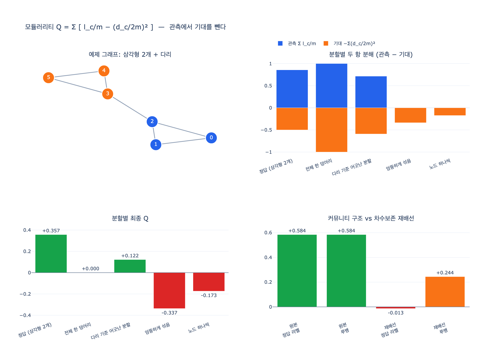

# 모듈러리티 $Q$ 는 어떤 두 항으로 이루어지는가

## 질문과 답

**질문.** 모듈러리티 $Q$ 의 계산식은 어떤 두 항으로 구성되는가?

**답.** 커뮤니티 내부 엣지 비율 $l_c/m$ 에서 기대값 $(d_c/2m)^2$ 을 뺀 값을 모든 커뮤니티에 대해 더한다.

$$
Q \;=\; \sum_{c \in C} \left[ \frac{l_c}{m} \;-\; \left(\frac{d_c}{2m}\right)^{2} \right]
$$

- $m$ : 그래프 전체의 엣지 수
- $l_c$ : 커뮤니티 $c$ **안쪽**에서 양 끝이 모두 $c$ 에 속하는 엣지 수
- $d_c$ : 커뮤니티 $c$ 에 속한 노드들의 **차수 합** ($=2l_c + b_c$, 여기서 $b_c$ 는 $c$ 밖으로 나가는 엣지 수)

이 장의 예제 코드(`code/ex4_communities.py`)가 그대로 이 식입니다.

```python
def modularity(adj, communities):
    m = sum(len(v) for v in adj.values()) / 2
    q = 0.0
    for c in communities:
        s = set(c)
        lc = sum(1 for v in c for u in adj[v] if u in s) / 2   # 내부 엣지 수
        dc = sum(len(adj[v]) for v in c)                        # 차수 합
        q += lc / m - (dc / (2 * m)) ** 2
    return q
```

한 줄 요약: **`관측` 빼기 `우연히 그렇게 될 정도`**. 두 항은 각각 이 역할입니다.

| 항 | 이름 | 뜻 |
|---|---|---|
| $l_c/m$ | 관측 항 (observed) | 실제 그래프에서 커뮤니티 $c$ 안에 갇혀 있는 엣지의 비율 |
| $(d_c/2m)^2$ | 기대 항 (expected, null model) | 차수는 그대로 두고 연결만 무작위로 다시 이었을 때 기대되는 같은 비율 |

---

## 왜 첫 항만으로는 안 되는가

"커뮤니티는 안쪽이 촘촘해야 한다"를 그대로 옮기면 $\sum_c l_c/m$ 이 됩니다. 그런데 이 값 하나만 쓰면 **전체를 커뮤니티 하나로 묶는 답이 항상 이깁니다.** 그때 $l_c = m$ 이라 값이 1로 최대가 되죠. 아무것도 나누지 않는 답이 만점을 받는 지표는 쓸모가 없습니다.

그래서 "이 정도는 아무 그래프나 다 되는 수준이다"라는 기준선을 빼 줍니다. 그 기준선이 두 번째 항입니다. 실제로 전체를 하나로 묶으면 $l_c=m$, $d_c=2m$ 이므로

$$
Q = \frac{m}{m} - \left(\frac{2m}{2m}\right)^2 = 1 - 1 = 0
$$

정확히 0이 됩니다. 아무것도 나누지 않은 답은 0점 — 설계 의도대로입니다.

---

## 기대 항 $(d_c/2m)^2$ 은 어디서 나오는가 (구성 모형)

기대값을 계산하려면 "무작위란 무엇인가"를 정해야 합니다. 모듈러리티가 쓰는 귀무 모형(null model)은 **구성 모형(configuration model)** 입니다.

### 스텁(stub) 그림

각 노드 $i$ 의 엣지를 반토막 내서, 노드마다 $d_i$ 개의 **반쪽 엣지(stub)** 가 삐져나와 있다고 봅니다. 그래프 전체의 스텁 개수는

$$
\sum_i d_i = 2m
$$

입니다(악수 정리 — 엣지 하나가 스텁 두 개를 만든다). 이제 이 $2m$ 개의 스텁을 **완전히 무작위로 짝지어** 그래프를 다시 만듭니다. 이렇게 하면 **각 노드의 차수는 원래대로 보존되면서 연결 상대만 무작위**가 됩니다.

### 두 노드가 이어질 확률

노드 $i$ 의 스텁 하나를 집어서 짝을 찾습니다. 남은 스텁 중 노드 $j$ 의 것을 고를 확률은 대략

$$
\frac{d_j}{2m}
$$

입니다($2m$ 이 크면 $-1$ 보정은 무시합니다). 노드 $i$ 에는 스텁이 $d_i$ 개 있으므로, $i$–$j$ 사이에 생기는 엣지 개수의 기대값은

$$
P_{ij} \;=\; d_i \cdot \frac{d_j}{2m} \;=\; \frac{d_i d_j}{2m}
$$

이 $\dfrac{d_i d_j}{2m}$ 이 모듈러리티 기대 항의 씨앗입니다.

### 커뮤니티 하나로 합산

커뮤니티 $c$ 안쪽에 생기는 엣지 수의 기대값은 $c$ 안의 모든 순서쌍 $(i,j)$ 에 대해 더한 뒤(엣지가 두 번 세어지므로) 2로 나눈 값입니다.

$$
\mathbb{E}[l_c] \;=\; \frac{1}{2}\sum_{i \in c}\sum_{j \in c} \frac{d_i d_j}{2m}
\;=\; \frac{1}{2}\cdot\frac{1}{2m}\left(\sum_{i\in c} d_i\right)\left(\sum_{j\in c} d_j\right)
\;=\; \frac{d_c^{\,2}}{4m}
$$

이제 관측 항과 같은 단위(전체 엣지 수 $m$ 에 대한 비율)로 맞추려고 $m$ 으로 나누면

$$
\frac{\mathbb{E}[l_c]}{m} \;=\; \frac{d_c^{\,2}}{4m^2} \;=\; \left(\frac{d_c}{2m}\right)^{2}
$$

**제곱이 나오는 이유가 여기 있습니다.** $d_c$ 를 두 번 곱하는 건 "커뮤니티 $c$ 에서 나온 스텁이 또 $c$ 로 되돌아오는" 사건이기 때문입니다. $d_c/2m$ 은 "무작위로 뽑은 스텁 하나가 $c$ 소속일 확률"이고, 그 사건이 엣지의 양쪽 끝에서 **독립적으로 두 번** 일어나야 내부 엣지가 됩니다. 그래서 확률의 곱, 즉 제곱입니다.

---

## Newman–Girvan(2004) 원식과의 대응

원논문([Newman & Girvan, *Finding and evaluating community structure in networks*, 2004](https://arxiv.org/abs/cond-mat/0308217))의 표준형은 인접행렬 $A$ 로 씁니다.

$$
Q \;=\; \frac{1}{2m}\sum_{i}\sum_{j}\left[A_{ij} - \frac{d_i d_j}{2m}\right]\delta(c_i, c_j)
$$

$\delta(c_i,c_j)$ 는 $i$ 와 $j$ 가 같은 커뮤니티일 때만 1인 크로네커 델타입니다. 즉 **같은 커뮤니티 안의 쌍만 골라서** `실제 연결 − 무작위였다면 기대되는 연결`을 더하는 식이죠.

델타 함수가 하는 일은 결국 "커뮤니티별로 묶어서 더하라"이므로, 커뮤니티 단위로 정리하면 카드의 형태가 그대로 나옵니다.

**첫 항 —**
$$
\frac{1}{2m}\sum_{i,j \in c} A_{ij} \;=\; \frac{1}{2m}\cdot 2l_c \;=\; \frac{l_c}{m}
$$
($\sum_{i,j\in c}A_{ij}$ 는 내부 엣지를 양방향으로 두 번 세므로 $2l_c$.)

**둘째 항 —**
$$
\frac{1}{2m}\sum_{i,j \in c}\frac{d_i d_j}{2m} \;=\; \frac{1}{2m}\cdot\frac{d_c^{\,2}}{2m} \;=\; \left(\frac{d_c}{2m}\right)^{2}
$$

두 형태는 **완전히 같은 식**입니다. 행렬형은 증명·스펙트럴 해석(모듈러리티 행렬 $B = A - \frac{dd^{\mathsf T}}{2m}$)에 편하고, 커뮤니티형은 구현·증분 계산(루뱅에서 노드를 옮길 때 $\Delta Q$ 를 $O(1)$ 로 갱신)에 편합니다. 루뱅/라이덴이 빠른 이유도 커뮤니티형 덕분에 $l_c, d_c$ 두 숫자만 들고 다니면 되기 때문입니다.

가중 그래프로 넘어가면 $A_{ij}$ 를 가중치 $w_{ij}$ 로, $d_i$ 를 가중 차수(strength)로, $m$ 을 가중치 총합으로 바꾸면 그대로 성립합니다.

---

## $Q$ 의 범위와 해석 관례

### 범위

$$
-\frac{1}{2} \;\le\; Q \;<\; 1
$$

- **상한.** 1에는 도달하지 못합니다. 관측 항 $\sum_c l_c/m \le 1$ 이고, 기대 항은 항상 양수라 조금씩 깎입니다. 커뮤니티 수가 아주 많고 모두 완전히 분리되어 있으면 1에 가까워집니다(커뮤니티 $k$ 개가 서로 완전히 끊긴 균등 분할이면 $Q = 1 - 1/k$).
- **하한.** $-1/2$ 입니다. 이분 그래프처럼 "같은 커뮤니티에 넣은 노드끼리 오히려 안 이어져 있는" 최악의 분할에서 나옵니다.
- **0.** 전체를 한 덩어리로 묶은 자명한 분할이 정확히 0입니다. 노드 하나씩 쪼갠 분할은 $l_c=0$ 이라 $Q = -\sum_i (d_i/2m)^2 < 0$ 으로 **음수**입니다.

### 해석 관례

원논문과 이후 관행에서 대략 이렇게 읽습니다.

| $Q$ 값 | 통상적 해석 |
|---|---|
| $\lesssim 0.3$ | 커뮤니티 구조가 뚜렷하지 않음 (또는 분할이 나쁨) |
| $0.3 \sim 0.7$ | 유의미한 커뮤니티 구조 |
| $\gtrsim 0.7$ | 아주 강한 분리 (실제 망에서는 드묾) |

다만 이 눈금은 **경험칙일 뿐 통계적 유의성이 아닙니다.** 실무에서 조심할 점 세 가지.

1. **무작위 그래프도 $Q$ 가 0이 아니다.** 에르되시–레니 같은 무작위 그래프에서도 최적화를 돌리면 0.2~0.4쯤 되는 분할이 나옵니다. 그래서 "$Q=0.35$ 니까 커뮤니티가 있다"가 아니라, **같은 차수 수열의 무작위 그래프를 여러 번 돌려 $Q$ 분포를 만들고 비교**해야 합니다.
2. **해상도 한계(resolution limit).** 기대 항이 $m$ 에 의존하기 때문에, 그래프가 커지면 $\sqrt{2m}$ 보다 작은 커뮤니티는 이웃과 붙여 버리는 편이 $Q$ 를 높입니다([Fortunato & Barthélemy, 2007](https://www.pnas.org/doi/10.1073/pnas.0605965104)). 이 장 `ex5_resolution.py` 가 보여 주는 현상입니다. 대처로 해상도 매개변수 $\gamma$ 를 넣은 일반화를 씁니다.

   $$Q_\gamma = \sum_c \left[\frac{l_c}{m} - \gamma\left(\frac{d_c}{2m}\right)^2\right]$$

   $\gamma > 1$ 이면 기대 항 벌점이 세져서 잘게, $\gamma < 1$ 이면 크게 나뉩니다.
3. **$Q$ 값끼리의 비교는 같은 그래프 안에서만.** 그래프가 다르면 $m$ 도 차수 분포도 달라서 $Q=0.45$ 끼리 비교하는 게 의미 없습니다.

### 값이 서로 다른 분할을 고르는 도구일 뿐

$Q$ 는 "이 분할이 저 분할보다 나은가"를 답하는 **점수 함수**지, 커뮤니티가 몇 개인지 알려 주는 진리가 아닙니다. 이 장 요약이 짚는 그대로입니다 — "개수는 알고리즘이 아니라 쓰임새로 정하세요."

---

## 외우는 법

$$
Q = \sum_{\text{커뮤니티}} \Big( \underbrace{\text{실제로 안에 있는 엣지 비율}}_{l_c/m} - \underbrace{\text{우연이라도 그만큼은 생겼을 비율}}_{(d_c/2m)^2} \Big)
$$

- 앞항의 분모는 $m$, 뒷항의 분모는 $2m$ **이고 제곱**이다. (헷갈리기 쉬운 지점)
- 뒷항이 제곱인 이유는 엣지의 **양쪽 끝**이 모두 그 커뮤니티에 떨어져야 하기 때문이다.
- $l_c$ 는 엣지 수, $d_c$ 는 차수 합. 단위가 다르다는 걸 기억하면 분모 $m$ vs $2m$ 도 자연히 따라온다.

---

## 참고

- Newman, Girvan (2004), *Finding and evaluating community structure in networks* — https://arxiv.org/abs/cond-mat/0308217
- Blondel et al. (2008), *Fast unfolding of communities in large networks* (루뱅) — https://arxiv.org/abs/0803.0476
- Traag et al. (2019), *From Louvain to Leiden* — https://www.nature.com/articles/s41598-019-41695-z
- Fortunato, Barthélemy (2007), *Resolution limit in community detection* — https://www.pnas.org/doi/10.1073/pnas.0605965104

## 시각화


