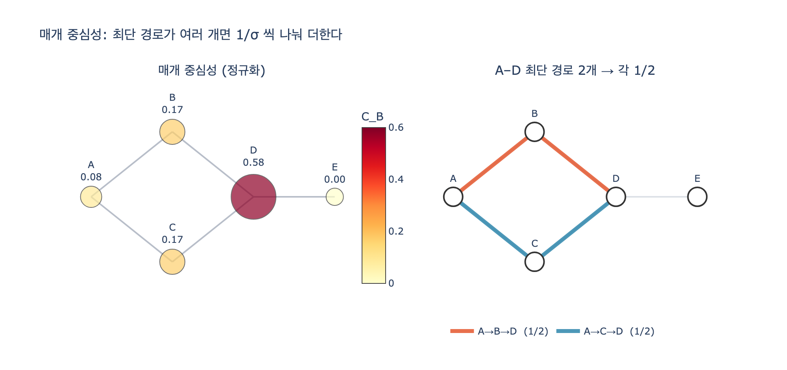

# 매개 중심성의 정의는 무엇인가?

> **답.** 모든 노드 쌍의 최단 경로 중 그 노드가 중간에 놓인 비율의 합이다.
> 최단 경로가 여러 개면 $1/\text{경로 수}$씩 나눠 더한다.

## 한 줄 직관

차수가 「아는 사람이 몇 명인가」라면, 매개(betweenness)는 **「없으면 갈라지는가」**를 묻습니다.
남들이 서로 오갈 때 내 자리를 얼마나 자주 밟고 지나가는지를 세는 지표입니다.

10장의 표현을 빌리면, 네 가지 중심성은 네 가지 다른 질문입니다.

| 지표 | 질문 |
|---|---|
| 차수(degree) | 아는 사람이 많은가 |
| 근접(closeness) | 소문이 제일 빨리 퍼지는가 |
| **매개(betweenness)** | **없으면 조직이 갈라지는가** |
| 고유벡터(eigenvector) | 힘 있는 사람과 이어져 있는가 |

## 수식

노드 $v$ 의 매개 중심성은

$$C_B(v) \;=\; \sum_{s \neq v \neq t} \frac{\sigma_{st}(v)}{\sigma_{st}}$$

- $\sigma_{st}$ : $s$ 에서 $t$ 로 가는 **최단 경로의 개수**
- $\sigma_{st}(v)$ : 그 최단 경로들 중 $v$ 를 **거쳐 가는** 것의 개수
- $\sigma_{st}(v)/\sigma_{st}$ 가 곧 「그 노드가 중간에 놓인 **비율**」

세 부분으로 뜯어 읽으면 됩니다.

1. **모든 노드 쌍**을 훑는다 — $v$ 자신은 출발점도 도착점도 아닌 쌍만.
2. 각 쌍마다 **최단 경로**만 본다 — 돌아가는 길은 세지 않는다.
3. 그 쌍의 최단 경로가 $\sigma_{st}$ 개면 표 한 장을 $\sigma_{st}$ 등분해서 나눠 준다.

### 왜 $1/\sigma_{st}$ 로 나누는가

「쌍 하나가 가진 통행량은 1」이라고 두고, 그 통행량이 최단 경로들에 **균등하게** 흘러간다고 보기 때문입니다.
나누지 않고 경로마다 1점씩 주면, **대체 경로가 많은 곳**이 부풀려집니다.
그러면 「없으면 갈라지는가」라는 원래 질문의 답이 흐려집니다 —
대체 경로가 있다는 건 오히려 그 노드가 **덜** 결정적이라는 뜻이니까요.

예를 들어 아래 다이아몬드에서 $A \to D$ 의 최단 경로는 두 개($A{\to}B{\to}D$, $A{\to}C{\to}D$)입니다.
$B$ 가 없어도 $C$ 로 돌아가면 되므로, $B$ 와 $C$ 는 각각 $1/2$ 만 받습니다.

```
    B
   / \
  A   D — E
   \ /
    C
```

| 쌍 | $\sigma_{st}$ | 중간 노드가 받는 몫 |
|---|---|---|
| A–D | 2 | B $+\tfrac12$, C $+\tfrac12$ |
| A–E | 2 | B $+\tfrac12$, C $+\tfrac12$, D $+1$ (두 경로 **모두**에 D가 있으므로 $2/2$) |
| B–C | 2 | A $+\tfrac12$, D $+\tfrac12$ |
| B–E | 1 | D $+1$ |
| C–E | 1 | D $+1$ |
| 나머지(인접한 쌍) | 1 | 중간 노드 없음 |

합치면 $A=0.5,\; B=1,\; C=1,\; D=3.5,\; E=0$.

### 양 끝점은 세지 않는다

정의의 $s \neq v \neq t$ 가 그 뜻입니다. 출발점과 도착점은 「중간에 놓인」 게 아닙니다.
그래서 잎(leaf) 노드는 **항상 0** 입니다 — 위 예제의 $E$ 처럼요.

### 정규화

값을 그래프 크기와 무관하게 보려면 「낄 수 있는 쌍의 최대 개수」로 나눕니다.

- 무방향: $\dfrac{(n-1)(n-2)}{2}$  ← 쌍 $(s,t)$ 를 한 번만 세므로
- 유방향: $(n-1)(n-2)$  ← 순서쌍이므로 두 배

위 예제는 $n=5$ 라 6으로 나눠 $D = 3.5/6 = 0.583$ 이 됩니다.
`networkx.betweenness_centrality()` 의 기본값이 바로 이 정규화된 값이고,
`normalized=False` 를 주면 정규화 전의 원값이 나옵니다.

10장 예제 코드의 구현도 정확히 이 정의를 그대로 옮긴 것입니다.

```python
def betweenness_c(adj):
    """모든 쌍의 최단 경로를 세고, 각 노드가 몇 번 «지나가는 길목»이었는지 센다."""
    score = {v: 0.0 for v in adj}
    for s, t in combinations(sorted(adj), 2):
        paths = all_shortest(adj, s, t)
        for p in paths:
            for mid in p[1:-1]:              # 양 끝점 제외
                score[mid] += 1 / len(paths)  # ← 1/σ 씩 쪼개 더한다
    n = len(adj)
    norm = (n - 1) * (n - 2) / 2
    return {v: s / norm for v, s in score.items()}
```

## 왜 이 지표가 값어치 있는가

10장의 회사 그래프에서 **차수 1등과 매개 1등은 다른 사람**입니다.
차수 1등은 팀원 전원과 이어진 김개발이지만, 매개 상위권은 팀과 팀 사이에 낀 사람들입니다.

특히 서영업은 이웃이 3명뿐(차수 하위권)인데도 외주 공장으로 가는 **유일한** 통로라
같은 차수 3인 사람들 중 매개가 압도적으로 높습니다.
조직도에도 안 보이고 차수 순위에도 안 뜨는데, 휴가를 가면 공장이 멈추는 사람 —
**「지표 사이의 순위 차이」가 1등 명단보다 값어치 있다**는 게 10장의 핵심 메시지입니다.

## 정의는 쉬운데 계산은 비싸다

정의를 곧이곧대로 구현하면 모든 쌍의 최단 경로를 **전부 열거**해야 합니다.
쌍의 개수만 $O(V^2)$ 이고, 경로 개수는 지수적으로 늘 수도 있습니다.

실무에서는 **브랜디스(Brandes) 알고리즘**을 씁니다. 시작 노드 $s$ 마다,

1. **전방 패스** — BFS 로 거리 $d$ 와 최단 경로 개수 $\sigma$ 를 센다.
   경로를 만들지 않고 개수만 셉니다: $\sigma_w \mathrel{+}= \sigma_v$.
2. **후방 패스** — 먼 노드부터 거꾸로 내려오며 의존도를 누적한다.

$$\delta_s(v) \;=\; \sum_{w\,:\,v \in \mathrm{pred}(w)} \frac{\sigma_v}{\sigma_w}\bigl(1 + \delta_s(w)\bigr)$$

여기 $\sigma_v/\sigma_w$ 가 바로 정의의 $1/\sigma$ 분배가 재귀 형태로 접힌 것입니다.
경로를 열거하지 않으므로 가중치 없는 그래프에서 $O(VE)$, 가중치 그래프에서 $O(VE + V^2\log V)$ 로 끝납니다.

그래도 100만 노드에서는 며칠이 걸립니다. 10장이 권하는 타협은 **시작 노드 표본**입니다.
구조(커뮤니티 + 다리)가 있는 그래프라면 시작 노드를 5% 만 뽑아도 상위권 순위는 거의 그대로입니다.
다만,

- 근사는 **하위권에서 많이 틀립니다**. 값 자체를 보고할 거면 전수 계산을 쓰세요.
- 표본 시드를 고정하지 않으면 **매번 순위가 흔들립니다**.
- 완전 무작위 그래프에서는 매개 중심성이 거의 평평해 근사 일치율이 10~50% 로 떨어집니다.
  근사가 잘 듣는 건 「진짜 급소가 있는」 그래프에서입니다 (그리고 실무 그래프는 대개 그렇습니다).

## 자주 틀리는 지점

- **$1/\sigma$ 를 빼먹기.** 경로마다 1점씩 주면 대체 경로가 많은 노드가 과대평가됩니다.
- **양 끝점을 세기.** $s$ 와 $t$ 는 중간 노드가 아닙니다.
- **연결이 끊긴 쌍.** 도달 불가능한 쌍은 $\sigma_{st}=0$ 이므로 그냥 건너뜁니다(기여 0).
- **무방향인데 유방향 정규화 상수 쓰기.** 쌍을 두 번 세면 값이 2배가 됩니다.
- **최단 경로가 아닌 경로를 세기.** 「그 노드를 지나는 모든 경로」가 아니라 **최단 경로만** 셉니다.

## 참고

- [networkx centrality measures](https://networkx.org/documentation/stable/reference/algorithms/centrality.html) [사실상 표준]
- [Brandes, "A faster algorithm for betweenness centrality" (2001)](https://www.tandfonline.com/doi/abs/10.1080/0022250X.2001.9990249) [사실상 표준]

## 시각화


