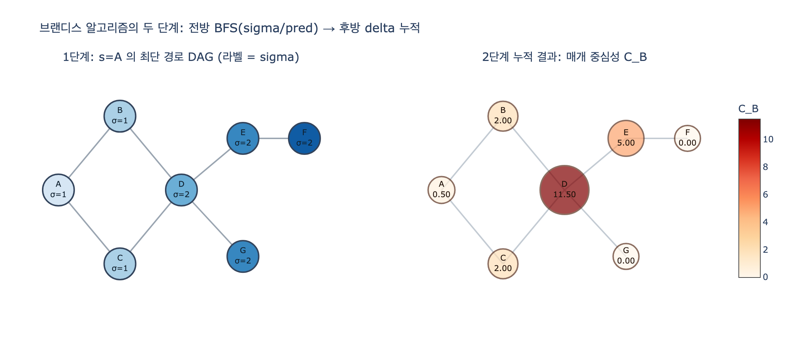

# 브랜디스(Brandes) 알고리즘의 두 단계

> **질문** 브랜디스(Brandes) 알고리즘의 두 단계는 무엇인가?
>
> **답** 전방 BFS로 각 노드의 최단 경로 수 sigma와 선행자 목록 pred를 모으고, 후방으로 스택을 되짚으며 delta 의존도를 누적해 매개 중심성을 더한다.

---

## 0. 1차 출처

- Ulrik Brandes, **"A Faster Algorithm for Betweenness Centrality"**, *Journal of Mathematical Sociology* **25**(2), 2001, pp. 163–177. DOI: [10.1080/0022250X.2001.9990249](https://www.tandfonline.com/doi/abs/10.1080/0022250X.2001.9990249)
- 후속 정정/확장: Ulrik Brandes, "On Variants of Shortest-Path Betweenness Centrality and their Generic Computation", *Social Networks* 30(2), 2008, pp. 136–145.
- 이 장의 키워드 표에서도 **매개 중심성 고속 계산 / [사실상 표준] / Brandes' algorithm** 으로 같은 논문을 가리킵니다.
- 구현 참고: `networkx.betweenness_centrality` 는 이 논문의 알고리즘을 그대로 씁니다.

---

## 1. 먼저, 매개 중심성이란 무엇인가

노드 $v$ 의 매개 중심성(betweenness centrality)은

$$
C_B(v) \;=\; \sum_{s \neq v \neq t} \frac{\sigma_{st}(v)}{\sigma_{st}}
$$

- $\sigma_{st}$: $s$ 에서 $t$ 로 가는 **최단 경로의 개수**
- $\sigma_{st}(v)$: 그중 $v$ 를 **거쳐 가는** 최단 경로의 개수

즉 "$s \to t$ 최단 경로 하나를 균등하게 무작위로 골랐을 때 $v$ 를 지날 확률"을 모든 $(s,t)$ 쌍에 대해 더한 값입니다. 이 장 요약의 표현으로는 **"없으면 갈라지는지"** 를 재는 지표예요.

한 출발점 $s$ 에 대해 몰아 놓은 양을 **의존도(dependency)** 라고 부릅니다.

$$
\delta_{s\bullet}(v) \;=\; \sum_{t \neq s,\, t\neq v} \frac{\sigma_{st}(v)}{\sigma_{st}},
\qquad
C_B(v) = \sum_{s \neq v} \delta_{s\bullet}(v)
$$

브랜디스 알고리즘은 **출발점 $s$ 를 하나씩 잡아 $\delta_{s\bullet}(\cdot)$ 를 통째로 계산해 더하는** 구조입니다. 그리고 그 계산을 두 단계로 나눕니다.

---

## 2. 두 단계

이 장의 `ex3_betweenness_cost.py` 에 있는 구현이 정확히 이 두 단계입니다.

```python
def brandes(adj, sources=None):
    """브랜디스 알고리즘. sources 를 주면 그 노드에서만 시작한다(근사)."""
    cb = {v: 0.0 for v in adj}
    for s in (sources if sources is not None else adj):
        # ── 1단계: 전방 BFS ────────────────────────────────
        stack, pred = [], {v: [] for v in adj}
        sigma = {v: 0 for v in adj}; sigma[s] = 1
        dist = {v: -1 for v in adj}; dist[s] = 0
        q = deque([s])
        while q:
            v = q.popleft(); stack.append(v)
            for w in adj[v]:
                if dist[w] < 0:                      # 처음 보는 노드
                    dist[w] = dist[v] + 1; q.append(w)
                if dist[w] == dist[v] + 1:           # 최단 경로 DAG 의 간선
                    sigma[w] += sigma[v]; pred[w].append(v)
        # ── 2단계: 후방 누적 ──────────────────────────────
        delta = {v: 0.0 for v in adj}
        while stack:
            w = stack.pop()
            for v in pred[w]:
                delta[v] += sigma[v] / sigma[w] * (1 + delta[w])
            if w != s:
                cb[w] += delta[w]
    return cb
```

### 1단계 — 전방 BFS (forward pass)

출발점 $s$ 에서 BFS를 한 번 돌면서 세 가지를 만듭니다.

| 자료구조 | 뜻 | 갱신 규칙 |
|---|---|---|
| `dist[v]` | $s{\to}v$ 최단 거리 | BFS 표준 |
| `sigma[v]` = $\sigma_{sv}$ | $s{\to}v$ 최단 경로 **개수** | $\sigma_{sv} = \sum_{u \in pred(v)} \sigma_{su}$, 시작값 $\sigma_{ss}=1$ |
| `pred[v]` | $v$ 의 **선행자 목록** | $dist[v] = dist[u]+1$ 인 간선 $(u,v)$ 를 모두 저장 |
| `stack` | BFS 방문 순서 | 거리 **비내림차순**으로 쌓인다 |

핵심은 `if dist[w] == dist[v] + 1` 이 `if dist[w] < 0` 과 **분리된 조건**이라는 점입니다. 이미 방문한 노드라도 거리가 정확히 1 더 크면 그 간선은 **또 다른 최단 경로**이므로 $\sigma$ 에 더하고 `pred` 에도 넣어야 합니다. 이렇게 모아 놓은 간선 집합이 바로 **최단 경로 DAG**(shortest-path DAG)이고, 두 번째 단계는 이 DAG 위에서만 돕니다.

같은 거리에 있는 두 노드를 잇는 간선(예: $dist[v] = dist[w]$)은 어떤 최단 경로에도 못 들어가므로 자동으로 걸러집니다.

### 2단계 — 후방 의존도 누적 (backward accumulation)

`stack` 을 pop 하면 거리가 **비증가** 순서, 즉 $s$ 에서 먼 노드부터 나옵니다. 이 순서 덕분에 노드 $w$ 를 꺼낼 시점에는 $w$ 의 모든 후속자(successor) 처리가 이미 끝나 있어서 `delta[w]` 가 **최종값으로 확정**되어 있습니다. 그래서 그대로 `cb[w]` 에 더할 수 있고(단 $w = s$ 는 제외), 동시에 자기 선행자들에게 몫을 나눠 줍니다.

$$
\boxed{\;\delta_{s\bullet}(v) \;=\; \sum_{w \,:\, v \in pred(w)} \frac{\sigma_{sv}}{\sigma_{sw}}\bigl(1 + \delta_{s\bullet}(w)\bigr)\;}
$$

> 카드의 표기 $\displaystyle \delta_v = \sum_{w \in succ(v)} \frac{\sigma_v}{\sigma_w}(1+\delta_w)$ 와 같은 식입니다. $succ(v) = \{w : v \in pred(w)\}$, 즉 DAG에서 $v$ 의 바로 다음 노드들이에요.

---

## 3. 왜 이 누적식이 성립하는가

논문의 Theorem 6 입니다. 증명은 "확률 분해"로 읽으면 가장 빠릅니다.

**설정.** $s{\to}t$ 최단 경로 하나를 균등 확률로 뽑는다고 하죠. $\dfrac{\sigma_{st}(v)}{\sigma_{st}}$ 는 그 경로가 $v$ 를 지날 확률이고, $\delta_{s\bullet}(v)$ 는 모든 $t$ 에 대한 그 확률의 합(=기댓값의 합)입니다.

**관찰 1 — 경로 수는 곱으로 쪼개진다.**
$v$ 가 $s{\to}w$ 최단 경로 위에 있다면
$$
\sigma_{sw}(v) = \sigma_{sv}\cdot\sigma_{vw}
$$
$s{\to}v$ 구간을 고르는 방법과 $v{\to}w$ 구간을 고르는 방법이 독립적으로 곱해지기 때문입니다. 특히 $w$ 가 DAG에서 $v$ 의 **바로 다음** 노드면 $\sigma_{vw}=1$ 이므로
$$
\frac{\sigma_{sw}(v)}{\sigma_{sw}} = \frac{\sigma_{sv}}{\sigma_{sw}}
$$
이 값이 "$s{\to}w$ 최단 경로가 마지막 간선으로 $v{\to}w$ 를 쓸 확률"입니다.

**관찰 2 — $v$ 를 지나는 경로는 반드시 $v$ 의 후속자 중 하나를 거친다.**
$v$ 를 지나 $t$ 로 가는 최단 경로를 생각하면, $v$ 다음 노드 $w$ 는 반드시 $succ(v)$ 의 원소이고, 그런 $w$ 는 **정확히 하나** 결정됩니다(경로마다). 그러니 $t$ 로 가는 경로들을 "$v$ 다음에 어떤 $w$ 를 거쳤나"로 **분할**할 수 있습니다.

**분해.** $t$ 를 두 종류로 나눕니다.

$$
\delta_{s\bullet}(v)
= \underbrace{\sum_{w \in succ(v)} \frac{\sigma_{sv}}{\sigma_{sw}}}_{\text{(가) } t=w \text{ 인 경우}}
\;+\;
\underbrace{\sum_{w \in succ(v)} \frac{\sigma_{sv}}{\sigma_{sw}}\,\delta_{s\bullet}(w)}_{\text{(나) } t \text{ 가 } w \text{ 너머인 경우}}
$$

- **(가)** 목적지가 바로 이웃 $w$ 자신인 경우의 기여. 관찰 1에 의해 $\sigma_{sw}(v)/\sigma_{sw} = \sigma_{sv}/\sigma_{sw}$.
- **(나)** 목적지가 $w$ 를 지나 더 멀리 있는 경우. $s{\to}t$ 최단 경로가 $w$ 를 지날 확률이 $\sigma_{st}(w)/\sigma_{st}$ 이고, **그 조건 아래에서** 다시 $v{\to}w$ 간선을 썼을 확률이 $\sigma_{sv}/\sigma_{sw}$ 입니다. 두 사건이 곱해지고, $t$ 에 대해 합하면 $\dfrac{\sigma_{sv}}{\sigma_{sw}}\delta_{s\bullet}(w)$ 가 됩니다.

둘을 묶으면 $\frac{\sigma_{sv}}{\sigma_{sw}}(1 + \delta_{s\bullet}(w))$ 이고, $w$ 에 대해 합한 것이 위의 누적식입니다. 코드의 `delta[v] += sigma[v] / sigma[w] * (1 + delta[w])` 에서 **`1`** 이 "$t=w$" 항, **`delta[w]`** 가 "$t$ 가 $w$ 너머" 항이에요.

> **왜 재귀가 아니라 스택 pop 인가?** (나) 항이 $\delta_{s\bullet}(w)$ 의 *최종값*을 요구하므로, $w$ 를 처리할 때 $w$ 의 후속자가 전부 끝나 있어야 합니다. 최단 경로 DAG에서 $w$ 의 후속자는 항상 $dist$ 가 1 더 큽니다. 따라서 **거리 비증가 순서 = 위상 정렬의 역순**이고, BFS 순서로 쌓은 스택을 pop 하는 것만으로 이 조건이 공짜로 만족됩니다. 별도의 위상 정렬이 필요 없어요.

### 마지막에 2로 나누는 이유

무향 그래프에서는 $(s,t)$ 와 $(t,s)$ 가 같은 쌍을 두 번 세므로 $C_B(v)$ 를 2로 나눕니다. 정규화까지 하려면 $(n-1)(n-2)/2$ 로 나눕니다(이 장 `ex1` 의 `betweenness_c` 가 쓰는 `norm`). `networkx` 에서는 `normalized=True/False` 로 고릅니다.

---

## 4. 왜 $O(V^3)$ 이 $O(VE)$ 로 줄어드는가

### 소박한 방법의 비용

정의를 그대로 따라가면 $(s,t,v)$ **세 쌍 전부**에 대해 $\sigma_{st}(v)/\sigma_{st}$ 를 만들어 더해야 합니다. 삼중항의 개수 자체가 $\Theta(V^3)$ 이므로, 전 쌍 최단 경로를 아무리 빨리 구해도 **합산 단계에서만 $\Theta(V^3)$** 이 발생합니다. 공간도 쌍별 의존도 표 때문에 $\Theta(V^2)$ 가 듭니다. 이 장의 `ex1_centralities.py` 에 있는 `betweenness_c` 는 아예 최단 경로를 *열거*하기까지 하므로 더 나쁩니다(경로 수가 지수적으로 많을 수 있음).

> 브랜디스 이전의 표준 구현이 딱 이랬습니다. Floyd–Warshall 로 $O(V^3)$ 시간·$O(V^2)$ 공간의 전 쌍 거리와 경로 수를 만들고, 다시 $O(V^3)$ 로 삼중항을 합산.

### 브랜디스가 줄이는 지점

핵심은 **쌍별 의존도 $\sigma_{st}(v)/\sigma_{st}$ 를 절대 만들지 않는 것**입니다. 대신 $t$ 에 대한 합 $\delta_{s\bullet}(v)$ 를 **재귀식으로 한 번에** 얻습니다. 그 결과 출발점 $s$ 하나당 비용이 삼중항 개수 $O(V^2)$ 가 아니라 **DAG 간선 개수 $O(E)$** 로 떨어집니다.

출발점 하나당:

| 단계 | 비용 |
|---|---|
| 1단계 BFS | 각 정점 1회 큐 삽입 + 각 간선 1회 검사 → $O(V+E)$ |
| 2단계 후방 누적 | 각 노드 1회 pop + `pred` 리스트 전체 순회. `pred` 원소의 총합 = DAG 간선 수 $\le E$ → $O(V+E)$ |

출발점이 $V$ 개이므로 **총 $O(VE)$ 시간**(연결 그래프면 $E \ge V-1$ 이라 $O(V+E)$ 를 $O(E)$ 로 흡수). 공간은 `sigma/dist/delta/stack` 이 $O(V)$, `pred` 가 $O(E)$ 로 **$O(V+E)$** 뿐입니다. $V^2$ 짜리 표가 사라지는 게 실무에서는 시간 못지않게 큽니다.

가중 그래프에서는 BFS 대신 다익스트라를 쓰므로 $O(VE + V^2\log V)$ 가 됩니다.

**요약하면**: 줄어든 이유는 "더 빠른 최단 경로 알고리즘"이 아니라 **합산의 순서를 바꿔 중간 결과를 공유**한 것입니다. $\sum_t$ 를 마지막에 하지 않고 DAG를 거슬러 올라가며 접어(fold) 버리는, 전형적인 **DAG 위의 동적 계획법**이에요.

$$
\Theta(V^3),\ \Theta(V^2)\ \text{공간}
\quad\longrightarrow\quad
O(VE),\ O(V+E)\ \text{공간}
$$

성긴 그래프($E \approx cV$)라면 $O(V^3) \to O(V^2)$, 즉 **$V$ 배** 빨라집니다.

### 그래도 비싸다 — 표본 근사

$O(VE)$ 라도 노드 100만·간선 1000만이면 며칠입니다. 이 장의 `ex3` 이 보여 주듯, 브랜디스 루프의 바깥쪽 `for s in ...` 은 **출발점마다 독립**이므로 그냥 일부만 돌면 그대로 근사가 됩니다.

```python
sample = random.Random(3).sample(sorted(adj), max(5, n // 20))   # 5%
approx = brandes(adj, sample)
```

- 구조(커뮤니티 + 다리)가 있는 그래프에서는 **표본 5% 로도 상위 20위가 거의 일치**합니다.
- 다만 **하위권 값은 많이 틀립니다.** 값 자체를 보고할 거면 전수 계산이 필요합니다.
- 표본 시드를 고정하지 않으면 실행마다 순위가 흔들립니다.
- 완전 무작위 그래프에서는 매개 중심성이 거의 평평해서 일치율이 10~50%로 떨어집니다. 근사가 잘 듣는 건 **진짜 급소가 있는** 그래프입니다.

이론적 뒷받침은 Brandes & Pich (2007), Bader et al. (2007) 의 적응적 표본 추출, Riondato & Kornaropoulos (2016) 의 VC 차원 기반 표본 크기 등이 있습니다.

---

## 5. 한 줄로 다시

> **1단계(전방)**: $s$ 에서 BFS 한 번 → 최단 경로 수 $\sigma$ 와 선행자 `pred` 로 **최단 경로 DAG** 를 만들고, 방문 순서를 스택에 쌓는다.
> **2단계(후방)**: 스택을 pop 하며(= 먼 노드부터) $\delta_v \mathrel{+}= \frac{\sigma_v}{\sigma_w}(1+\delta_w)$ 로 의존도를 아래에서 위로 접어 올리고, 확정된 $\delta_w$ 를 $C_B(w)$ 에 더한다.

## 시각화


