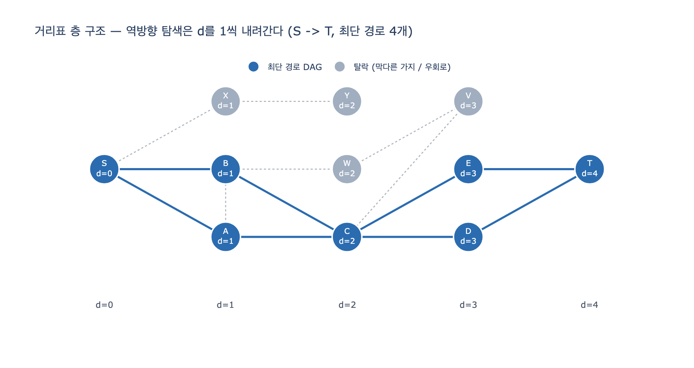

# `all_shortest()`는 모든 최단 경로를 어떻게 찾는가

**답:** 먼저 BFS로 시작점 기준 거리표를 만들고, 목표에서 거꾸로 `d[v] == d[u] - 1`인 이웃만 따라가며 스택 탐색으로 경로를 모은다.

---

## 원본 코드

10장 `ex1_centralities.py`의 매개 중심성 계산에 쓰이는 함수다.

```python
def bfs_dist(adj, s):
    d = {s: 0}
    q = deque([s])
    while q:
        u = q.popleft()
        for v in adj[u]:
            if v not in d:
                d[v] = d[u] + 1
                q.append(v)
    return d


def all_shortest(adj, s, t):
    d = bfs_dist(adj, s)              # 1. 전방 BFS 거리표
    if t not in d:
        return []                     # 2. 도달 불가면 빈 목록
    out, stack = [], [(t, [t])]       # 3. t 에서 거꾸로 시작
    while stack:
        u, path = stack.pop()
        if u == s:
            out.append(list(reversed(path)))   # 4. s 도착 -> 뒤집어서 저장
            continue
        for v in adj[u]:
            if d.get(v, -1) == d[u] - 1:       # 5. «한 칸 가까운» 이웃만
                stack.append((v, path + [v]))
    return out
```

호출부는 이렇다. 경로를 세는 게 아니라 **경로마다 $1/|paths|$씩** 중간 노드에 나눠 준다.

```python
for s, t in combinations(sorted(adj), 2):
    paths = all_shortest(adj, s, t)
    for p in paths:
        for mid in p[1:-1]:          # 양 끝(출발/도착)은 제외
            score[mid] += 1 / len(paths)
```

---

## 1단계 — BFS 거리표가 만드는 불변식

`bfs_dist`는 **무가중** 그래프에서 $s$로부터의 최단 거리 $d[v]$를 준다. BFS가 큐를 거리 오름차순으로 비우기 때문에, 노드를 **처음 방문했을 때** 기록한 값이 곧 최단 거리다.

여기서 나오는 결정적인 성질이 하나 있다.

> **불변식.** 간선 $(u, v)$가 존재하면 항상 $|d[u] - d[v]| \le 1$이다.

증명은 짧다. $s \to u$ 최단 경로에 간선 $(u,v)$를 붙이면 $s \to v$ 경로가 되므로 $d[v] \le d[u]+1$. 대칭으로 $d[u] \le d[v]+1$. 둘을 합치면 끝이다.

따라서 어떤 노드 $u$에서 이웃 $v$를 볼 때 가능성은 **딱 세 가지**뿐이다.

| $d[v] - d[u]$ | 뜻 | 역방향 탐색에서 |
|---|---|---|
| $-1$ | 한 칸 가까움 (선행자) | **채택** |
| $0$ | 같은 층 «옆걸음» | 버림 |
| $+1$ | 한 칸 멂 (후행자) | 버림 |

`d[v] == d[u] - 1` 조건은 이 세 가지 중 첫 번째만 고르겠다는 뜻이다.

---

## 2단계 — 왜 역방향 탐색이 «최단 경로만» 뽑아내는가

두 방향으로 봐야 한다.

### 건전성 (뽑은 게 전부 최단 경로다)

역방향 한 걸음마다 거리가 **정확히 1** 줄어든다. $t$에서 출발했으니 $d[t]$번 만에 $d=0$인 노드, 즉 $s$에 정확히 도달한다. 뒤집어 놓으면 간선 수가 $d[t]$개인 경로다. $d[t]$가 최단 거리이므로 이보다 짧은 경로는 없다 — **나온 경로는 예외 없이 최단 경로**다.

덤으로 얻는 것들:
- **사이클이 생길 수 없다.** 거리가 단조 감소하니 같은 노드를 두 번 밟을 수 없다. 그래서 `visited` 집합이 아예 필요 없다.
- **종료가 보장된다.** 모든 가지의 깊이가 정확히 $d[t]$다.

### 완전성 (최단 경로를 하나도 안 빠뜨린다)

거꾸로, 임의의 최단 경로 $s = p_0, p_1, \dots, p_k = t$ (단 $k = d[t]$)를 잡자. 각 접두사 $p_0 \dots p_i$는 길이 $i$인 $s \to p_i$ 경로이므로 $d[p_i] \le i$. 한편 불변식에 의해 $d[p_i] \le d[p_{i-1}] + 1$이고, 전체 길이가 $d[t]$와 같으려면 **모든 단계에서 등호**가 성립해야 한다. 즉 $d[p_i] = i$이고 $d[p_{i-1}] = d[p_i] - 1$이다.

이 말은 **모든 최단 경로의 모든 간선이 `d[v] == d[u] - 1` 조건을 통과한다**는 뜻이다. 탐색이 그 경로를 놓칠 수가 없다.

### 왜 하필 거꾸로인가 — 헛걸음이 0이다

정방향($s$에서 `d[v] == d[u] + 1`을 따라가기)으로도 최단 경로를 만들 수는 있다. 문제는 **막다른 가지**다. 정방향으로 뻗어 나가면 $t$와 상관없는 곁가지로도 잔뜩 뻗고, 도착해 보니 $t$가 아니라 전부 버리게 된다.

역방향은 다르다. $d[u] > 0$인 노드는 **반드시** $d[v] = d[u]-1$인 이웃을 하나 이상 가진다 — BFS가 바로 그런 노드로부터 $u$를 발견했기 때문이다. 따라서 역방향 탐색에서 뻗은 **모든 가지는 예외 없이 $s$에 도달**한다. 스택에서 pop되는 모든 항목이 결국 어떤 최단 경로의 한 조각이다. 버리는 작업이 0이고, 그래서 이 탐색의 비용은 **출력 크기에 정확히 비례**한다.

`expy.py`의 예제에서 노드 11개짜리 그래프의 pop 횟수는 13번, 그중 헛걸음은 0번이었다.

---

## 3단계 — 최단 경로 DAG

`d[v] == d[u] - 1` 조건은 사실 원본 무향 그래프의 **간선에 방향을 붙이는** 일이다. 거리가 커지는 쪽으로 향하게 하면 사이클 없는 그래프(DAG)가 나온다. 이걸 **최단 경로 DAG**라고 부른다.

- 이 DAG에서 «같은 층» 간선과 «막다른 가지», «우회로»는 전부 떨어져 나간다.
- `all_shortest`가 하는 일은 정확히 **이 DAG 위에서 $s \to t$ 경로를 전부 열거**하는 것이다.
- 브랜디스 알고리즘(10장 `ex3`)도 같은 DAG를 쓴다. 다만 경로를 만들지 않고 `pred[w]`와 `sigma[w]`만 유지한다.

---

## 4단계 — 경로 수가 폭발한다

여기가 이 구현의 실전 함정이다.

**최단 경로 개수는 노드 수에 대해 지수적일 수 있다.** 「다이아몬드」($u \to \{a,b\} \to w$) 하나를 직렬로 $k$개 이으면, 노드는 $3k+1$개인데 최단 경로는

$$P(k) = 2^{k}$$

개다. $k = 18$이면 노드 55개짜리 «작은» 그래프에서 경로가 262,144개다. `expy.py`로 실측한 값:

| $k$ | 노드 | 경로 수 | 시간 |
|---:|---:|---:|---:|
| 8 | 25 | 256 | 0.5 ms |
| 12 | 37 | 4,096 | 7.6 ms |
| 16 | 49 | 65,536 | 134 ms |
| 18 | 55 | 262,144 | 622 ms |

노드를 6개 더 넣을 때마다 시간이 8배가 된다. 격자 그래프에서도 같은 일이 벌어진다 — $n \times n$ 격자의 대각선 양 끝 사이 최단 경로 수는 $\binom{2n}{n}$개다.

게다가 코드가 `path + [v]`로 **매 push마다 리스트를 통째로 복사**한다. 시간·메모리가 모두 $\Theta(P \cdot L)$ ($P$=경로 수, $L$=경로 길이)이라 메모리가 먼저 터진다.

### 매개 중심성에서 왜 이게 치명적인가

`betweenness_c`는 **모든 노드 쌍**에 대해 `all_shortest`를 부른다. $\binom{V}{2}$번 호출이고, 매번 BFS를 새로 돈다(같은 $s$에 대해 재사용도 안 한다). 여기에 경로 열거 비용까지 곱해지니 노드 수백 개만 넘어도 못 쓴다.

### 해법 — 세기만 하고 열거하지 않는다

매개 중심성에 필요한 건 경로 «목록»이 아니라 **개수와 비율**뿐이다. BFS 도중에

$$\sigma[w] \mathrel{+}= \sigma[v] \quad (\text{단 } d[w] = d[v]+1)$$

로 누적하면 경로를 만들지 않고도 개수 $\sigma$를 얻는다. $2^{18}$이어도 정수 하나면 된다. 실측으로 622 ms → **0.07 ms**다.

이어서 스택을 역순으로 비우며 의존도

$$\delta[v] \mathrel{+}= \frac{\sigma[v]}{\sigma[w]}\,(1 + \delta[w])$$

를 누적하면 매개 중심성이 나온다. 이것이 10장 `ex3_betweenness_cost.py`의 **브랜디스 알고리즘**이고, 전체가 $O(V \cdot E)$로 끝난다. `all_shortest` 방식은 개념을 보여 주기 위한 «교과서 구현»이지, 실무 코드가 아니다.

---

## 짚고 넘어갈 것들

- **무가중 전용이다.** 간선에 가중치가 있으면 BFS 거리표가 최단 거리가 아니고, 불변식 $|d[u]-d[v]| \le 1$도 깨진다. 이때는 다익스트라 + 「$d[v] + w(v,u) = d[u]$」 조건으로 바꿔야 한다.
- **`d.get(v, -1)`의 역할.** $s$에서 도달 불가능한 노드는 $d$에 아예 없다. 기본값 $-1$은 어떤 $d[u]-1$과도 같아지지 않는다($u = s$일 때만 $-1$이 되는데 그 경우는 이미 `continue`로 빠져나간 뒤다). 방어적인 코드다.
- **결과 순서는 스택 순서다.** DFS라 인접 리스트의 역순으로 나온다. 순서에 의존하는 코드를 쓰면 안 된다.
- **`if not paths: continue`가 있는 이유.** 그래프가 여러 컴포넌트로 갈라져 있으면 도달 불가 쌍이 생긴다. 이 쌍은 매개 중심성 계산에서 빠진다.
- **정규화 분모.** `norm = (n-1)(n-2)/2`는 무향 그래프에서 한 노드가 «중간에 낄 수 있는» 최대 쌍의 수다. 컴포넌트가 갈라진 그래프에서는 이 분모가 과대평가라 값이 실제보다 작게 나온다.

---

## 시각화



노드를 $d[v]$ 값에 따라 층으로 세운 그림이다. 굵은 파란 화살표가 최단 경로 DAG의 간선, 회색 점선은 탈락한 간선이다. `X`, `Y`는 막다른 가지고 `W`, `V`는 6홉짜리 우회로다. 역방향 탐색은 오른쪽 `T`(d=4)에서 시작해 층을 하나씩만 내려가므로, 회색 점선 쪽으로는 애초에 발을 딛지 않는다.
