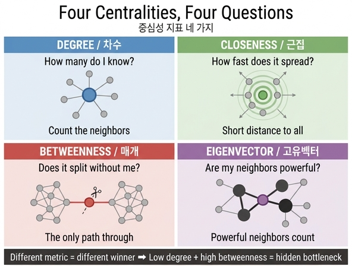

# 중심성 지표 네 가지는 각각 어떤 질문에 답하는가?

> **답**: 차수는 아는 사람 수, 근접은 퍼지는 속도, 매개는 없으면 갈라지는지, 고유벡터는 힘 있는 이웃을 가졌는지를 묻는다.

## 왜 이게 중요한가

"우리 조직에서 제일 중요한 사람이 누군지 그래프로 뽑아 주세요."

이 요청에는 답이 없습니다. **「중요하다」의 정의가 빠져 있기 때문**입니다. 중심성 지표는 서로 다른 네 가지 정의이고, 같은 그래프에서 **서로 다른 사람을 1등으로 가리킵니다**. 그러니 이 요청을 받으면 지표를 고르기 전에 되물어야 합니다 — 어떤 의미에서 중요한 사람인가요?

## 네 가지 지표, 네 가지 질문

| 지표 | 묻는 질문 | 세는 것 | 계산 방식 | 비용 |
|---|---|---|---|---|
| **차수(Degree)** | 아는 사람이 많은가? | 이웃 수 | 이웃 수 / (전체 노드 - 1) | O(V+E), 거의 공짜 |
| **근접(Closeness)** | 소문이 제일 빨리 퍼지는가? | 남들까지의 평균 거리 | (도달 가능 노드 수) / (거리 합) | 노드마다 BFS 1회 |
| **매개(Betweenness)** | 없으면 조직이 갈라지는가? | 최단 경로가 나를 지나간 횟수 | 모든 쌍의 최단 경로 중 자기가 중간에 낀 비율의 합 | O(V·E), 제일 비쌈 |
| **고유벡터(Eigenvector)** | 힘 있는 사람과 이어져 있는가? | 이웃의 중요도 합 | 이웃 점수의 합을 반복해 수렴시킴(멱법) | 반복 수렴 |

### 차수 — 아는 사람 수

가장 단순합니다. 이웃을 세면 끝. 직관적이고 싸지만 **국소적**입니다. 100명을 아는데 그 100명이 전부 한 팀 안이면, 조직 전체에서는 별 영향력이 없을 수 있습니다.

```python
def degree_c(adj):
    n = len(adj) - 1
    return {v: len(nb) / n for v, nb in adj.items()}
```

### 근접 — 퍼지는 속도

나에게서 다른 모든 노드까지의 최단 거리를 다 더하고, 그 역수를 씁니다. 거리 합이 작다 = 모두에게 가깝다 = **소문·전파가 빠르다**. 감염 확산, 공지 도달 시간, 캐시 배치 지점 같은 걸 볼 때 씁니다.

```python
def closeness_c(adj):
    for v in adj:
        d = bfs_dist(adj, v)          # v 에서 모두까지의 거리
        out[v] = (len(d) - 1) / sum(d.values())
```

### 매개 — 없으면 갈라지는가

모든 노드 쌍의 최단 경로를 구해서, **각 노드가 그 길목에 몇 번 끼었는지** 셉니다. 값이 크면 「통로」입니다. 그 노드가 사라지면 최단 경로가 길어지거나 아예 그래프가 두 덩어리로 쪼개집니다.

병목·단일 장애점·브로커를 찾는 유일한 지표라서 값어치가 큰데, **제일 비쌉니다**. 브랜디스(Brandes) 알고리즘으로도 O(V·E)라 100만 노드면 며칠입니다. 구조가 있는(커뮤니티+다리) 그래프라면 출발 노드를 **5%만 표본**으로 뽑아도 상위 20위는 대부분 맞습니다.

### 고유벡터 — 힘 있는 이웃

"중요한 노드와 이어진 노드가 중요하다"는 재귀적 정의입니다. 자기 점수를 이웃에게 나눠 주는 걸 수렴할 때까지 반복합니다(멱법, power iteration).

```python
def eigen_c(adj, rounds=100):
    x = {v: 1.0 for v in adj}
    for _ in range(rounds):
        nx = {v: sum(x[u] for u in adj[v]) for v in adj}   # 이웃 점수 합
        nx = {v: y / max(nx.values()) for v, y in nx.items()}  # 정규화
        ...
```

유향 그래프에 감쇠 계수(damping)와 싱크 보정을 붙인 변형이 **페이지랭크**입니다.

## 실제로 1등이 다르다 — 10장 예제 그래프

`content/ch10/code/ex1_centralities.py` 를 돌린 결과입니다. 작은 회사의 "누가 누구와 일하는가" 그래프(노드 19개)인데도 1등이 갈립니다.

| 지표 | 1등 | 2등 |
|---|---|---|
| 차수 | 김개발 | 정영업 |
| 근접 | 대표 | 김개발 |
| 매개 | 대표 | 김개발 |
| 고유벡터 | 김개발 | 개발3 |

주요 노드의 값:

| 노드 | 차수 | 근접 | 매개 | 고유벡터 |
|---|---|---|---|---|
| 김개발 | **0.389** | 0.429 | 0.504 | **1.000** |
| 대표 | 0.167 | **0.462** | **0.597** | 0.364 |
| 서영업 | 0.167 | 0.333 | **0.294** | 0.077 |
| 공장B | 0.111 | 0.217 | 0.000 | 0.010 |

- **김개발**은 아는 사람이 제일 많고(차수 1등), 개발팀이라는 촘촘한 뭉치의 중심이라 고유벡터도 1등입니다.
- **대표**는 차수가 0.167로 낮습니다(팀장 셋만 압니다). 그런데 팀장들을 잇는 유일한 지점이라 근접·매개가 1등입니다.
- **서영업**은 차수 0.167로 눈에 안 띄는데 매개가 0.294입니다. 외주 공장(공장A/B/C)으로 가는 **유일한 통로**거든요. 조직도에도 안 보이고 차수 순위에도 안 뜨지만, 휴가를 가면 공장이 멈춥니다.

## 제일 값어치 있는 건 1등이 아니라 「순위 차이」

이 장의 진짜 교훈은 여기 있습니다. 한 지표의 1등은 대개 이미 다들 아는 사람입니다. 새 정보는 **지표 사이의 어긋남**에 있습니다.

> **차수는 낮은데 매개가 높은 노드 = 아무도 모르는 급소**

서영업이 그 예입니다. 인프라로 옮기면 "트래픽은 적은데 경로상 필수인 서비스", 코드로 옮기면 "호출자는 적은데 모든 흐름이 거쳐 가는 어댑터"입니다. 리스크 목록에 넣어야 할 건 1등이 아니라 이런 노드입니다.

반대 방향도 정보입니다. **차수는 높은데 매개가 0**이면 자기 뭉치 안에서만 인기 있는 노드 — 빼도 아무것도 안 갈라집니다(위 표의 개발6, 한영업, 임디자가 매개 0.000).

## 정리

| 요청 | 골라야 할 지표 |
|---|---|
| 인플루언서 / 허브를 찾자 | 차수 |
| 공지·소문이 제일 빨리 도는 지점 | 근접 |
| 빠지면 끊기는 병목 / 단일 장애점 | 매개 |
| 권력·권위·평판이 몰린 곳 | 고유벡터(유향이면 페이지랭크) |
| **드러나지 않은 급소** | **차수 낮음 + 매개 높음** |

"중요한 사람을 찾아 주세요"는 질문이 아니라 질문 네 개의 묶음입니다. 어느 걸 묻는지 먼저 정하세요.

## 인포그래픽


