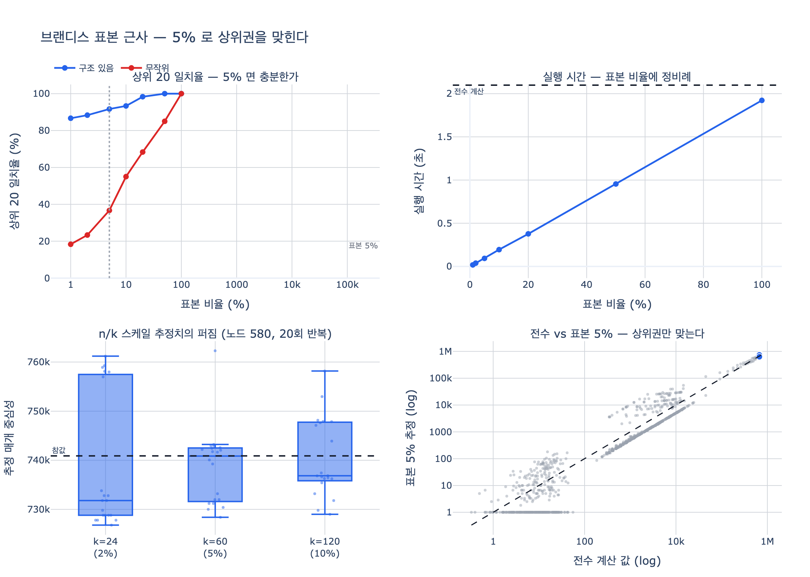

# 브랜디스 알고리즘으로 근사 계산을 하는 방법

> **질문.** 브랜디스 알고리즘으로 근사 계산을 하는 방법은 무엇인가?
>
> **답.** 모든 노드가 아니라 표본으로 뽑은 sources 에서만 BFS 를 시작한다. 표본 5%로도 상위 20개는 대부분 일치한다.

---

## 1. 한 줄 요약

브랜디스 알고리즘은 **모든 노드를 한 번씩 시작점 $s$ 로 삼아 BFS 를 도는 바깥 루프**로 되어 있다.
근사는 그 바깥 루프를 표본으로 줄이는 것이 전부다. **알고리즘 내부(BFS + 후방 패스)는 한 줄도 안 바뀐다.**

```python
def brandes(adj, sources=None):
    cb = {v: 0.0 for v in adj}
    for s in (adj if sources is None else sources):   # ← 여기 하나만 바뀐다
        ...  # 전방 BFS + 후방 누적, 그대로
```

전수 계산에서는 `sources = 전체 노드`, 근사에서는 `sources = random.sample(nodes, k)`.
그리고 마지막에 $n/k$ 를 곱해 눈금을 되돌린다(§4).

---

## 2. 왜 근사가 필요한가

매개 중심성의 정의는 모든 노드쌍의 최단 경로를 훑는다.

$$C_B(v) \;=\; \sum_{s \neq v \neq t} \frac{\sigma_{st}(v)}{\sigma_{st}}$$

여기서 $\sigma_{st}$ 는 $s{\to}t$ 최단 경로의 개수, $\sigma_{st}(v)$ 는 그중 $v$ 를 지나는 것의 개수다.

정의를 그대로 구현하면 쌍이 $O(V^2)$ 개, 쌍마다 경로 탐색이 붙어 $O(V^3)$ 이 된다.
브랜디스(2001)가 이걸 **$O(VE)$** (가중 그래프는 $O(VE + V^2\log V)$) 로 낮췄다.

하지만 $O(VE)$ 도 여전히 비싸다. 10장 본문의 표현대로 **「노드가 두 배가 되면 시간이 네 배쯤 되고, 100만 노드에서는 며칠이 걸린다」**.
$V$ 가 곱해져 있는 한 대형 그래프에서는 답이 안 나온다. 그래서 그 $V$ 를 $k$ 로 바꾸는 것이다.

| | 비용 |
|---|---|
| 정의 그대로 | $O(V^3)$ |
| 브랜디스 전수 | $O(VE)$ |
| **브랜디스 표본** | $O(kE)$ ← $k \ll V$ |

---

## 3. 브랜디스의 구조 — 왜 «합»이라서 표본이 되는가

브랜디스의 핵심은 **의존도(dependency)** 라는 중간량이다.

$$\delta_{s\bullet}(v) \;=\; \sum_{t \in V \setminus \{s, v\}} \frac{\sigma_{st}(v)}{\sigma_{st}}$$

「시작점 $s$ 하나가 $v$ 에게 준 기여」다. 그러면 매개 중심성은 **$s$ 에 대한 단순 합**으로 다시 쓰인다.

$$\boxed{\;C_B(v) \;=\; \sum_{s \neq v} \delta_{s\bullet}(v)\;}$$

그리고 $\delta$ 는 BFS 트리를 **거꾸로** 훑으며 재귀로 한 번에 계산된다. 이게 브랜디스의 발명이다.

$$\delta_{s\bullet}(v) \;=\; \sum_{w:\; v \in \mathrm{pred}_s(w)} \frac{\sigma_{sv}}{\sigma_{sw}}\bigl(1 + \delta_{s\bullet}(w)\bigr)$$

**여기서 근사가 자동으로 따라 나온다.** $C_B$ 가 $s$ 에 대한 합이므로, 합을 다 더하는 대신 **표본 평균 × 개수** 로 추정하면 된다.
이건 「알고리즘을 근사 버전으로 고쳐 쓴다」가 아니라 **「합을 표본추출로 추정한다」는 통계 문제**다.

> 근접 중심성도 같은 이유로 표본이 잘 듣는다($\sum_t d(v,t)$ 역시 $t$ 에 대한 합).
> 반면 고유벡터 중심성은 합이 아니라 고정점이라 이 트릭이 그대로 안 통한다.

---

## 4. $n/k$ 스케일 — 불편추정량 만들기

시작점 $s$ 를 $V$ 에서 **균등하게** 하나 뽑았다고 하자. 그 기여의 기댓값은

$$\mathbb{E}_s\bigl[\delta_{s\bullet}(v)\bigr] \;=\; \frac{1}{n}\sum_{s \in V} \delta_{s\bullet}(v) \;=\; \frac{C_B(v)}{n}$$

즉 표본 하나의 기여는 평균적으로 참값의 $1/n$ 이다. 그러니 $k$ 개를 뽑아 더한 뒤 $n/k$ 를 곱하면

$$\hat{C}_B(v) \;=\; \frac{n}{k}\sum_{s \in S} \delta_{s\bullet}(v),
\qquad \mathbb{E}\bigl[\hat{C}_B(v)\bigr] \;=\; \frac{n}{k}\cdot k \cdot \frac{C_B(v)}{n} \;=\; C_B(v)$$

**편향이 정확히 0인 불편추정량(unbiased estimator)** 이 된다. 남는 건 분산뿐이다.

### 스케일을 빼먹으면

값이 통째로 $k/n$ 배로 쪼그라든다. `expy.py` 실측:

```
1등 노드 = 580
  전수 계산      :     740890.7
  표본 5% (스케일X):      36460.0   ← 전수의 0.049배 (≈ k/n = 0.05)
  표본 5% (n/k 곱):     729200.0   ← 전수의 0.984배
```

**순위만 볼 거면 상관없다.** 모든 노드에 같은 상수가 곱해지니 순서는 그대로다.
문제는 **절대 임계값**을 쓰고 있을 때다. 「매개 중심성 0.01 이상이면 급소로 경보」 같은 규칙이 조용히 의미를 잃는다.
10장 페이지랭크 절의 「싱크 노드가 점수를 삼킨다」와 정확히 같은 종류의 함정이다 — 순위는 멀쩡해서 발견이 늦는다.

### 분산과 표본 크기

복원추출 기준으로

$$\mathrm{Var}\bigl[\hat{C}_B(v)\bigr] \;=\; \frac{n^2}{k}\,\mathrm{Var}_s\bigl[\delta_{s\bullet}(v)\bigr]
\quad\Longrightarrow\quad \text{표준오차} \;\propto\; \frac{1}{\sqrt{k}}$$

**정확도를 2배 올리려면 표본을 4배 뽑아야 한다.** 5% → 10% 로 늘려도 오차는 30% 밖에 안 줄어든다.
반대로 말하면 **초반 표본의 가성비가 압도적**이다. 이게 「5%면 충분하다」의 정체다.

`expy.py` 실측 (같은 노드를 20번 다시 표본추출):

```
k=  24 (  2%)  평균   738532.2  편향  -0.32%  표준편차  1.86%
k=  60 (  5%)  평균   738585.9  편향  -0.31%  표준편차  1.06%
k= 120 ( 10%)  평균   740481.1  편향  -0.06%  표준편차  1.09%
참값                       740890.7
```

평균은 참값에 붙어 있다(편향 0.35% 이내). 표준편차는 $k$ 가 커지며 줄어든다.
$k{=}120$ 에서 살짝 되오른 건 20회 반복으로 잰 표준편차 자체의 잡음이다(표준편차 추정의 상대오차가 $1/\sqrt{2(T-1)}\approx 16\%$).

> **비복원 vs 복원.** `random.sample` 과 networkx 는 비복원 추출이다.
> 균등 확률이므로 여전히 불편추정량이고, 분산에는 유한모집단 보정 $\frac{n-k}{n-1}$ 이 붙어 복원추출보다 **조금 더** 정확하다.
> $k \ll n$ 이면 차이는 무시할 만하다.

---

## 5. 어디서 틀리는가 — 상위권은 맞고 하위권은 망가진다

표본 근사의 오차는 **값에 비례하지 않는다.**

- **매개 중심성이 큰 노드**는 어느 시작점에서 출발하든 길목이다. 표본 60개 중 상당수가 그 노드를 지난다 → 잘 잡힌다.
- **값이 작은 노드**는 「운 좋게 뽑힌 시작점 하나」에 좌우된다 → 상대오차가 폭발한다.

`expy.py` 실측 (구조 있는 그래프, 표본 5%):

```
상위 20개 평균 상대오차 :    3.0%
하위 200개 평균 상대오차:  139.0%
값이 0으로 추정된 노드 수: 265 / 1200
```

**1200개 중 265개가 0으로 추정됐다.** 참값은 0이 아닌데, 뽑힌 시작점 60개 중 어느 것도 그 노드를 지나지 않았기 때문이다.
불편추정량이라도 「한 번의 표본에서 나온 값」은 이렇게 통째로 사라질 수 있다. 편향이 0이라는 건 **여러 번 반복했을 때의 평균** 이야기다.

> **규칙.** 근사는 「누가 위에 있나」에만 답한다.
> 값 자체를 보고하거나 임계값에 걸 거면 전수 계산을 써야 한다. 다행히 실무에서 필요한 건 대개 순위뿐이다.

---

## 6. 근사가 잘 듣는 조건 — 그래프에 «급소»가 있어야 한다

카드의 「5%로도 상위 20개는 대부분 일치」에는 **숨은 전제**가 있다.

`expy.py` 는 같은 크기(간선 3071개)의 그래프 두 개로 같은 실험을 한다.

| 표본 비율 | $k$ | **구조 있음** (커뮤니티+다리) | **무작위** (Erdős–Rényi) |
|---:|---:|---:|---:|
| 1% | 12 | 87% | 18% |
| 2% | 24 | 88% | 23% |
| **5%** | **60** | **92%** | **37%** |
| 10% | 120 | 93% | 55% |
| 20% | 240 | 98% | 68% |
| 50% | 600 | 100% | 85% |
| 100% | 1200 | 100% | 100% |

같은 알고리즘, 같은 표본 비율인데 92% 대 37% 로 갈린다.

**이유.** 무작위 그래프에서는 매개 중심성이 거의 평평하다. 1등과 100등의 차이가 표본 잡음보다 작아서
「상위 20개」라는 순위 자체가 사실상 무작위다. 근사가 못 맞히는 게 아니라 **맞힐 대상이 없다.**

근사가 잘 듣는 건 **진짜 급소가 있는 그래프**에서다. 그리고 실무 그래프(조직도, 소셜, 인프라, 지식 그래프)는 대개 그렇다 —
커뮤니티가 있고 그 사이를 잇는 소수의 다리가 있다. 10장 `org.py` 의 **서영업**(외주 공장으로 가는 유일한 통로)이 그 축소판이다.

**실행 시간 쪽은 이런 조건이 없다.** BFS 를 $k$ 번 도니 시간은 표본 비율에 정확히 비례한다 — 5%면 약 20배, 1%면 약 100배 빠르다.

---

## 7. `nx.betweenness_centrality(k=...)` 는 정확히 이 일을 한다

networkx 3.2.1 의 `algorithms/centrality/betweenness.py` 에서 관련된 곳은 딱 두 군데다.

**(1) 시작점 표본추출** — 바깥 루프의 `nodes` 만 바뀐다:

```python
if k is None:
    nodes = G
else:
    nodes = seed.sample(list(G.nodes()), k)   # ← 비복원 추출
for s in nodes:
    S, P, sigma, _ = _single_source_shortest_path_basic(G, s)
    betweenness, _ = _accumulate_basic(betweenness, S, P, sigma, s)
```

**(2) `_rescale()` 안의 $n/k$ 보정**:

```python
def _rescale(betweenness, n, normalized, directed=False, k=None, endpoints=False):
    if normalized:
        ...
        scale = 1 / ((n - 1) * (n - 2))
    else:                       # 정규화를 안 하면
        if not directed:
            scale = 0.5         # 무방향은 쌍을 두 번 세니 0.5
        else:
            scale = None        # 유방향은 «아무것도 안 곱함»
    if scale is not None:
        if k is not None:
            scale = scale * n / k     # ← 우리가 손으로 한 n/k 가 여기 있다
        for v in betweenness:
            betweenness[v] *= scale
    return betweenness
```

즉 (1) 시작점만 표본으로 뽑고 (2) $n/k$ 로 되돌린다. §3–4 에서 손으로 한 것과 완전히 같다.

```python
nx.betweenness_centrality(G, k=60, seed=42)   # 시작점 60개만
```

실측:

```
nx 전수 1등          :     370445.4
우리 전수 1등 × 0.5  :     370445.4     ← 무방향이라 nx 는 0.5 를 곱한다
nx k=60 (n/k 자동보정):     374612.0     ← 참값 대비 +1.1%
상위 20 일치 (nx 전수 vs nx k=60): 90%
```

### `seed` 를 반드시 고정한다

`seed` 를 안 주면 호출할 때마다 다른 시작점이 뽑혀 **순위가 흔들린다.**
「어제 보고서의 1등이 오늘은 3등」이 되는 재현성 사고의 전형이다.
10장 라벨 전파 절의 「시드를 고정하고, 고정했다는 사실을 문서에 적어야 한다」가 여기에도 그대로 적용된다.

### 함정 — 유방향 + `normalized=False` 면 $n/k$ 보정이 통째로 빠진다

위 `_rescale()` 을 다시 보자. 유방향 그래프에 `normalized=False` 를 주면 `scale = None` 이 되고,
`if scale is not None:` 에서 그냥 빠져나간다. **`k` 를 줬는데도 $n/k$ 가 적용되지 않는다.**

```
유방향, normalized=False  전수 합계  :   272827.0
유방향, normalized=False  k=30 합계  :    26478.0  ← 약 k/n=0.1 배
                                비율 :      0.097
유방향, normalized=True   k=30/전수  :      0.971  ← 정상
```

값이 $k/n$ 배로 나오는데 **순위는 멀쩡해서 눈치채기 어렵다.**
유방향 그래프에서 근사값을 절대값으로 쓸 일이 있으면 `normalized=True` 를 쓰거나 직접 $n/k$ 를 곱해라.
(networkx 3.2.1 기준. 버전에 따라 달라질 수 있으니 쓰는 버전에서 `_rescale` 을 확인하는 게 안전하다.)

### 참고: 다른 라이브러리

| 라이브러리 | 근사 API | 방식 |
|---|---|---|
| networkx | `betweenness_centrality(G, k=..., seed=...)` | 시작점 **균등** 표본 + $n/k$ 보정 |
| graph-tool | `betweenness(g, pivots=[...])` | 시작점(pivot) 표본. 문서가 「무작위로 고르면 불편추정량」이라고 명시. $O(VE) \to O(PE)$ |
| Neo4j GDS | `gds.betweenness` 의 `samplingSize` / `samplingSeed` | RA-Brandes. **차수에 비례한 확률**로 시작점을 뽑는다 |
| igraph | `betweenness(cutoff=...)` | 표본이 아니라 **경로 길이 절단** |

두 가지를 주의해서 볼 것.

**(1) Neo4j GDS 는 균등 추출이 아니다.** 나가는 차수에 비례해 시작점을 뽑는다.
「차수가 큰 노드가 많은 최단 경로에 얹혀 있으니 정보량이 많다」는 발상인데,
그 대가로 **균등 추출의 불편성이 깨진다.** §8 의 Brandes–Pich 가 바로 이런 차수 기반 전략들을
균등 무작위와 비교한 연구다. 값을 다른 구현과 맞춰 봐야 한다면 이 차이를 먼저 의심하라.

**(2) `cutoff` 계열은 아예 다른 근사다.** 「길이 $\ell$ 이하 경로만 센다」(range-limited betweenness)라서
표본추출이 아니고 불편추정량도 아니다. 결정적이고 재현 가능한 대신, **긴 경로 위의 다리 노드를 구조적으로 놓친다.**
`ℓ` 이 작으면 지역적 중심성에 가까워진다. 표본 근사와 헷갈리지 말 것.

---

## 8. 후속 연구 — 「어떤 시작점을」, 「몇 개면 충분한가」

균등 무작위 시작점은 출발점일 뿐이다. 20년간 두 방향으로 발전했다.

### 앞선 뿌리: Eppstein & Wang (2001/2004)

*Fast Approximation of Centrality*. 「시작점을 표본으로 뽑는다」는 발상 자체는 여기서 나왔다.
다만 대상은 **근접 중심성**이었다. 호에프딩 부등식으로 $k = \Theta\!\left(\frac{\log n}{\varepsilon^2}\right)$ 개 표본이면
모든 노드에서 오차가 $\varepsilon\Delta$ 이내($\Delta$ 는 지름)임을 확률 $1 - 1/n$ 로 보장했다.
브랜디스–피히가 이걸 매개 중심성으로 일반화한 것이다.

### Brandes & Pich (2007) — 「어떤 시작점(pivot)을 뽑을까」

*Centrality Estimation in Large Networks*, IJBC 17(7):2303–2318. **여섯 가지** 시작점 선택 전략을 실험 비교했다.

| 전략 | 방식 |
|---|---|
| **Random** | 균등 무작위 |
| **RanDeg** | 차수에 비례한 확률 (허브가 많은 경로에 얹혀 있으니까) |
| **MaxMin** | 결정적. 이미 뽑은 pivot 들에서 **가장 먼** 노드 ($k$-center 2-근사) |
| **MaxSum** | 결정적. 기존 pivot 들까지 거리 합이 **최대**인 노드 (가장 변두리) |
| **MinSum** | 결정적. 거리 합이 **최소**인 노드 (가장 중심). pivot 집합이 연결된 덩어리로 자란다 |
| **Mixed** | Random + MaxMin + MinSum 라운드로빈 |

**결론(6절)은 균등 무작위의 손을 들어 준다.**

> "선행 실험이 시사하는 바는, **시작점을 균등 무작위로 고르는 것이 더 정교한 선택 전략들보다 우월하다**는 것이다.
> 대부분의 네트워크에 존재하는 구조적 불균형이 결정적 전략들을 함정에 빠뜨리기 때문이며,
> **심지어 pivot 을 더 많이 넣을수록 추정이 나빠지는 지경에까지 이른다.**"

마지막 구절이 무섭다. 영리한 전략은 **표본을 늘리면 더 나빠질 수 있다.**
(단백질 상호작용 네트워크에서 결정적 전략들이 처음 pivot 을 매달린 나무의 잎에 놓아, 중심 쪽 노드를 과소평가한 사례를 든다.)
반면 균등 무작위는 정확도가 표본 수에 대해 **거의 단조**로 좋아지고 실행 간 분산도 작다.
「내가 더 똑똑하게 뽑을 수 있다」는 유혹을 참으라는 뜻이다.

이 논문은 또 하나 중요한 경고를 한다. 매개 중심성의 한 pivot 기여 $\delta(p_i|v)$ 는 $[0, n-2]$ 범위를 **실제로 다 쓴다**
(차수 1 이웃을 가진 노드가 pivot 으로 뽑히는 경우). 그래서 호에프딩 상한이 근접 중심성보다 훨씬 헐거워지고,
**「비정규화 매개 중심성의 추정은 근접 중심성보다 훨씬 어렵고 불안정하다」**. §5 에서 본 하위권 139% 오차의 이론적 배경이다.

### Geisberger, Sanders, Schultes (2008) — pivot 근처의 과대평가

ALENEX'08, *Better Approximation of Betweenness Centrality*. 초록의 표현대로
**「SSSP 의 출발점 근처 노드가 자주 과대평가된다」**. 뽑힌 시작점 $s$ 의 바로 옆 노드는
$s$ 에서 나가는 거의 모든 최단 경로에 얹혀 있어서, $n/k$ 로 뻥튀기될 때 같이 부풀려진다.

해법은 **경로 위에서 $v$ 의 상대적 위치에 따라 기여를 선형으로 스케일**하는 것이다. $x = d(s,v)$, $\ell = d(s,t)$ 일 때

$$f_\ell(x) = \frac{x}{\ell}, \qquad \bar f_\ell(x) = 1 - \frac{x}{\ell}$$

$s$ 를 순방향 pivot 으로 쓸 때는 $f$, 역방향 pivot 으로 쓸 때는 $\bar f$ 를 곱한다.
$s$ 바로 옆($x$ 가 작음)은 거의 0 이 곱해져 과대평가가 사라진다.

> **정확히 말하면 이건 「편향 제거」가 아니다.** 논문의 Lemma 1 은
> $f_\ell(x) + \bar f_\ell(\ell - x) = 1$ 이기만 하면 **브랜디스의 원래 추정량을 포함해 이 틀의 모든 방법이 불편**임을 증명한다.
> 즉 §4 의 $n/k$ 추정량은 이미 편향 0 이 맞다. 선형 스케일이 없애는 것은
> **작은 표본 하나에서 나타나는 계통적 과대평가(=분산·실제 오차)** 다.
> 저자들은 같은 실행 시간에 유클리드 오차를 **4배** 줄였다고 보고한다(영화배우 네트워크).
> 이분(bisection) 스케일 $f_\ell(x) = [\,x \ge \ell/2\,]$ 은 그보다도 조금 더 좋았다.

### Riondato & Kornaropoulos (2016) — 「표본 개수를 그래프 크기와 무관하게」

WSDM'14, 확장판은 *Data Mining and Knowledge Discovery* 30(2):438–475 (2016).
발상 자체가 다르다. **노드(시작점)가 아니라 최단 경로 자체를 표본으로 뽑는다.**

반복 $r$ 번, 매번:

1. 노드쌍 $(u,v)$ 를 **균등하게** 하나 뽑는다
2. 그 쌍의 최단 경로들을 구한 뒤, $v$ 에서 $u$ 쪽으로 거꾸로 걸으며 선행자 $z$ 를 확률 $\sigma_{uz}/\sigma_{ut}$ 로 골라 **최단 경로 하나를 뽑는다**
3. 그 경로의 **내부 노드에만 $1/r$ 씩** 더한다

시작점 표본과 달리 한 번의 반복에서 **경로 하나**만 건드린다. 그래서 「몇 번 반복하면 되는가」에 답할 수 있다.

그 답이 **VC 차원(Vapnik–Chervonenkis dimension)** 이다. 논문의 Corollary 1:

$$\mathrm{VC}(\mathcal{R}_G) \;\le\; \bigl\lfloor \log_2 (VD(G) - 2) \bigr\rfloor + 1$$

$VD(G)$ 는 **정점 지름(vertex-diameter)** — 최단 경로가 지나는 노드 수의 최댓값이다(비가중 그래프에서 $VD = D + 1$).
VC 차원 $d$ 에 대한 표준 결과 $|S| = \frac{c}{\varepsilon^2}(d + \ln\frac1\delta)$ 와 합치면, 필요한 표본 수는

$$\boxed{\;r \;=\; \frac{c}{\varepsilon^2}\Bigl(\bigl\lfloor \log_2 (VD(G)-2)\bigr\rfloor + 1 + \ln\tfrac{1}{\delta}\Bigr)\;}$$

($c$ 는 보편 상수로 $c \approx 0.5$ 로 추정된다.) 이 $r$ 개면 **모든 노드의 정규화 매개 중심성이 동시에**
$\pm\varepsilon$ 안에 들어갈 확률이 $1-\delta$ 이상이다.

**$n$ 도 $m$ 도 식에 없다.** 그래프가 10배 커져도 $VD$ 만 안 커지면 표본 수는 그대로다.
좁은 세상(small-world) 그래프는 $VD$ 가 로그 규모라 $\log_2 VD$ 는 거의 상수다.

극단적인 경우도 있다. **모든 쌍의 최단 경로가 유일한 그래프**(도로망처럼 가중치를 조금 흔들어 유일성을 강제한 경우)는
논문의 Lemma 2 로 $\mathrm{VC}(\mathcal{R}_G) \le 3$ 이다. 표본 수가 **그래프의 어떤 성질과도 무관하게** $\varepsilon, \delta$ 만으로 정해진다.

**숫자를 넣어 보면** 감이 온다. $VD = 20$, $\delta = 0.1$, $c = 0.5$ 일 때 $\lfloor\log_2 18\rfloor + 1 = 5$ 이므로

| $\varepsilon$ (정규화 값 기준 절대오차) | $r$ |
|---:|---:|
| 0.05 | 약 1,500 |
| 0.01 | 약 36,500 |

노드가 1천만이든 1억이든 이 숫자는 그대로다. 대신 $1/\varepsilon^2$ 이라 정밀도를 올리는 값은 여전히 비싸다(§4 와 같은 이야기).

두 가지 실용적 사족.

- 이 VC 상한은 **타이트하다.** 저자들은 $VD(G_d) = 2^d + 1$ 이면서 VC 차원이 정확히 $d$ 인 그래프를 구성해 보였다.
- $VD$ 를 정확히 알 필요는 없다. $O(n+m)$ 에 구하는 **2-근사** $\widetilde{VD} \in [VD,\, 2VD]$ 면 충분하다 — $\log_2$ 안에 들어가니 표본이 1 늘 뿐이다.

> **이게 카드의 「5%」를 다시 보게 만든다.**
> 우리 실험의 5% 는 $n{=}1200$ 이라 $k{=}60$ 이었다는 뜻일 뿐이다.
> $n$ 이 100만이면 5% 는 5만 개고, 이론이 요구하는 양보다 한참 많다.
> **표본은 비율이 아니라 개수로 정해야 한다.** 실무에서는 $k$ 를 수백~수천으로 고정하는 쪽이 맞다.

### 그 뒤

- **Riondato & Upfal (2018) ABRA** (TKDD 12(5)) — 표본 수를 미리 정하지 않는다.
  **Rademacher 평균**으로 「지금까지 뽑은 표본이 충분한가」를 실행 중에 판정하는 점진적 표본추출이다.
  $VD$ 같은 그래프 특성값을 미리 알 필요가 없고, 유방향·동적 그래프도 다룬다.
- **Borassi & Natale (2019) KADABRA** (ESA'16 / JEA 24) — 경로 하나 뽑는 **비용** 자체를 줄였다.
  균형 잡힌 **양방향(bidirectional) BFS** 로 현실적인 랜덤 그래프 모델에서 표본당 $|E|^{1/2 + o(1)}$ (최악 $\Theta(|E|)$ 대신),
  거기에 엄밀한 적응적 표본추출을 얹었다. 노드 1만 규모에서 RK 대비 무방향 약 100배, 유방향 약 70배 빠르다고 보고한다.

정리하면 발전 방향은 셋이다.

1. **무엇을 뽑을까** — 시작점 → 최단 경로 자체
2. **몇 개 뽑을까** — 비율 → $VD$ 기반 이론적 상한 → 실행 중 적응적 판정
3. **하나 뽑는 데 얼마나 드나** — 단방향 BFS → 양방향 BFS

카드의 「표본 5%」는 이 중 **첫 세대**다. 가장 단순하고, 그래서 가장 널리 구현돼 있다.

---

## 9. 실무 체크리스트

| 항목 | 지침 |
|---|---|
| **무엇을 표본으로** | 바깥 루프(시작점 $s$)만. BFS·후방 패스는 그대로 |
| **보정** | $\hat{C}_B = \frac{n}{k}\sum_{s\in S}\delta_{s\bullet}$. 안 하면 $k/n$ 배로 축소 |
| **표본 크기** | 비율이 아니라 **개수**로 정한다. 순위용이면 수백 개로 시작 |
| **시드** | 반드시 고정하고, 고정했다는 사실을 문서에 적는다 |
| **쓸 수 있는 것** | 순위, 상위 $N$ 추출, 「누가 급소인가」 |
| **쓰면 안 되는 것** | 절대값 보고, 고정 임계 경보, 하위권 순위, 0/비0 판정 |
| **networkx 함정** | 유방향 + `normalized=False` → $n/k$ 보정 누락 |
| **전제** | 커뮤니티+다리 구조가 있어야 잘 듣는다. 평평한 그래프에서는 순위 자체가 무의미 |

**한 문장으로.** 브랜디스는 「시작점마다의 기여를 더한 것」이라 합을 표본으로 바꾸면 그대로 근사가 되고,
$n/k$ 만 곱해 주면 편향 없는 추정치가 나오며, 오차는 상위권에서 작고 하위권에서 크기 때문에
**「누가 위에 있나」에는 5%로 충분하고 「값이 얼마인가」에는 전혀 충분하지 않다.**

---

## 시각화

`expy.py` 를 실행하면 만들어지는 그림이다.

- **왼쪽 위** — 표본 비율 vs 상위 20 일치율. 구조 있는 그래프(파랑)는 5%에서 이미 90%를 넘고, 무작위 그래프(빨강)는 계속 못 따라온다
- **오른쪽 위** — 표본 비율 vs 실행 시간. 정확히 선형이다 (BFS 를 $k$ 번 도니까)
- **왼쪽 아래** — $n/k$ 스케일 추정치의 퍼짐. 상자의 중심은 참값(점선)에 붙어 있고(불편), $k$ 가 커질수록 좁아진다(분산 $\propto 1/k$)
- **오른쪽 아래** — 전수 vs 표본 5% 산점도(로그-로그). 상위 20(파랑)은 대각선에 붙고, 하위권(회색)만 흩어진다


