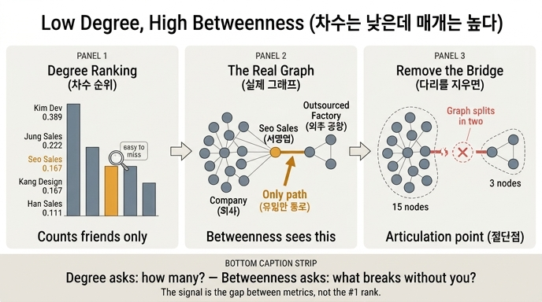

# 서영업이 조직도와 차수 순위에서 안 보이는 이유

**질문** 서영업이 조직도와 차수 순위에서 안 보이는 이유는 무엇인가?

**답** 아는 사람이 적어 차수가 낮기 때문이다. 그러나 외주 공장으로 가는 유일한 통로라 매개 중심성이 가장 높다.

---

## 한 줄로

「중요하다」를 **아는 사람 수**로 정의하면 서영업은 안 보인다. **없으면 갈라지는가**로 정의하면 비로소 보인다.
서영업은 **차수는 낮은데 매개는 상위권**인 노드다. 이 어긋남 자체가 정보다.

## 왜 안 보이나 — 두 개의 서로 다른 렌즈

### 조직도라는 렌즈

조직도는 **결재선**을 그린 트리다. 서영업은 정영업 팀장 아래 영업팀원 세 명 중 하나로, 한영업·오영업과 아무 차이 없는 칸 하나를 차지한다.
조직도에는 「외주 공장 담당」이라는 사실이 그려지지 않는다. 공장은 회사 조직이 아니기 때문이다.

### 차수 순위라는 렌즈

차수 중심성(degree centrality)은 **이웃 수 / (전체 노드 - 1)** 이다. 「아는 사람이 몇 명인가」만 센다.
`org.py`의 `EDGES`에서 서영업의 이웃은 딱 셋이다.

```
서영업 → 정영업, 오영업, 공장A     (차수 3 / 0.167)
김개발 → 개발1~6, 대표             (차수 7 / 0.389)
```

차수 순위표에서 서영업은 0.167로, 개발1~5·강디자·윤디자·대표·공장A와 **공동 등수**다. 눈에 띌 이유가 없다.

## 그런데 왜 급소인가 — 매개 중심성

매개 중심성(betweenness centrality)은 질문이 다르다.
**「모든 노드 쌍의 최단 경로 중, 나를 지나가는 게 몇 퍼센트인가」**

`org.py`의 그래프에서 외주 공장은 이 한 줄로만 회사에 붙어 있다.

```python
# 외주 공장 — 서영업 한 사람을 통해서만 회사와 이어진다
("서영업", "공장A"),
("공장A", "공장B"), ("공장A", "공장C"), ("공장B", "공장C"),
```

그래서 **공장A·공장B·공장C ↔ 나머지 15명** 사이의 모든 경로가 서영업을 통과한다. 우회로가 없다.
서영업을 그래프에서 지우면 그래프가 **15명 + 3명**으로 두 조각이 난다(그래프 이론 용어로 **절단점**, articulation point).

```
서영업 제거 → 컴포넌트 크기 [15, 3]   조각난 쪽: 공장A, 공장B, 공장C
```

차수로는 3명. 매개로는 회사와 공장을 잇는 유일한 다리. 같은 사람인데 지표를 바꾸면 다른 얼굴이 나온다.
휴가를 가면 공장이 멈추는 건 차수 3 때문이 아니라 이 「유일함」 때문이다.

## 실측값 — 이 그래프에서 진짜 순위

`content/ch10/code/ex1_centralities.py`를 그대로 돌린 결과다.

| 노드 | 차수 | 근접 | 매개 | 고유벡터 |
|---|---:|---:|---:|---:|
| 대표 | 0.167 | **0.462** | **0.597** | 0.364 |
| 김개발 | **0.389** | 0.429 | 0.504 | **1.000** |
| 정영업 | 0.222 | 0.409 | 0.484 | 0.165 |
| **서영업** | **0.167** | 0.333 | **0.294** | 0.077 |
| 공장A | 0.167 | 0.269 | 0.209 | 0.027 |
| 강디자 | 0.167 | 0.360 | 0.182 | 0.149 |
| 개발1 | 0.167 | 0.340 | 0.093 | 0.481 |
| 청소담당 | 0.111 | 0.281 | 0.044 | 0.162 |
| 개발6 / 한영업 / 임디자 / 공장B / 공장C | 0.111 | … | 0.000 | … |

읽는 법:

- **차수 1등은 김개발**(0.389). 개발팀 전원 + 대표를 안다.
- **고유벡터 1등도 김개발**(1.000). 힘 있는 개발팀 안쪽에 묻혀 있다.
- **근접·매개 1등은 대표**(0.462 / 0.597). 세 팀장을 통해 어디로든 두세 다리다.
- **서영업은 차수 공동 하위권인데 매개는 4위**(0.294). 차수 0.167인 아홉 명 중에서는 매개가 압도적 1위다. 같은 차수 0.167인 개발3은 매개가 0.003이다. **100배 차이**다.

> **각주 — 원문 서술과 실측의 차이**
> `org.py` 주석과 `ex1` 마무리 문구는 서영업을 「매개 1등」으로 소개하지만, 실제로 `EDGES`로 계산하면 매개 1등은 **대표(0.597)**, 서영업은 **4위(0.294)**다.
> 이유는 대표·정영업도 절단점이라서다. 대표를 지우면 `[11, 7]`로, 정영업을 지우면 `[12, 6]`로 갈라진다. 잘려 나가는 조각이 서영업(3명)보다 커서 매개 점수가 더 높게 나온다.
> 그래서 이 카드의 요지는 **「매개 1등」이 아니라 「차수는 낮은데 매개는 상위권」**으로 잡는 게 정확하다. 그리고 카드가 말하려는 교훈 — *지표 사이의 순위 차이가 진짜 정보다* — 는 실측값에서도 그대로 성립한다.

## 이 카드가 말하는 진짜 교훈

10장 요약의 문장 그대로다.

> 제일 값어치 있는 정보는 1등이 아니라 **지표 사이의 순위 차이**입니다. 차수는 낮은데 매개가 높은 노드가 아무도 모르는 급소예요.

「1등이 누구냐」는 지표를 바꾸면 바뀐다. 그래서 1등 자체는 별 정보가 없다.
정보는 **어긋남**에 있다. 차수 순위 12위인데 매개 순위 4위인 사람. 그 간극이 「조직도에도 안 보이고 아무도 안 알아보는데 없으면 멈추는 자리」의 신호다.

`ex1_centralities.py`가 마지막에 하는 계산이 정확히 이거다.

```python
# 차수는 낮은데 매개가 높은 사람 — 아무도 안 알아보는 급소
hidden = sorted(adj, key=lambda v: -(metrics["매개"][v] - metrics["차수"][v]))[0]
```

(참고로 이 19노드 그래프에서 `매개 - 차수`의 최댓값은 **대표**(0.597 - 0.167 = 0.430)이고, 서영업은 0.127로 그다음 구간이다. 지표가 작은 그래프에서는 이런 「어긋남 탐지」도 노이즈를 탄다.)

## 실무로 옮기면

- **「우리 조직에서 제일 중요한 사람을 뽑아 주세요」라는 요구는 그대로 받으면 안 된다.** 되물어야 한다.
  - 아는 사람이 많은 사람인가 → **차수**
  - 없으면 조직이 갈라지는 사람인가 → **매개**
  - 소문이 제일 빨리 퍼지는 사람인가 → **근접**
  - 힘 있는 사람과 이어진 사람인가 → **고유벡터**
- **버스 팩터(bus factor) 진단은 차수가 아니라 매개로 한다.** 「이 사람이 나가면 무엇이 끊기는가」는 절단점·매개의 질문이다.
- **네트워크 인프라도 똑같다.** 트래픽이 제일 많은 라우터(차수)와, 죽으면 망이 두 동강 나는 라우터(매개)는 다른 장비다. 이중화 예산은 후자에 써야 한다.
- **매개는 비싸다.** O(V·E)라 100만 노드에서는 며칠이 걸린다. 다행히 「누가 위에 있나」만 알면 되는 경우가 대부분이고, 구조가 있는 그래프라면 표본 5%로도 상위권을 맞힌다(`ex3_betweenness_cost.py`).

## 관련 파일

- `content/ch10/code/org.py` — `EDGES`(무향 협업 그래프), `REPORTS`(유향 결재 그래프)
- `content/ch10/code/ex1_centralities.py` — 네 가지 중심성 직접 구현, 지표별 1등 비교
- `content/ch10/code/ex3_betweenness_cost.py` — 브랜디스 알고리즘과 표본 근사

## 인포그래픽


