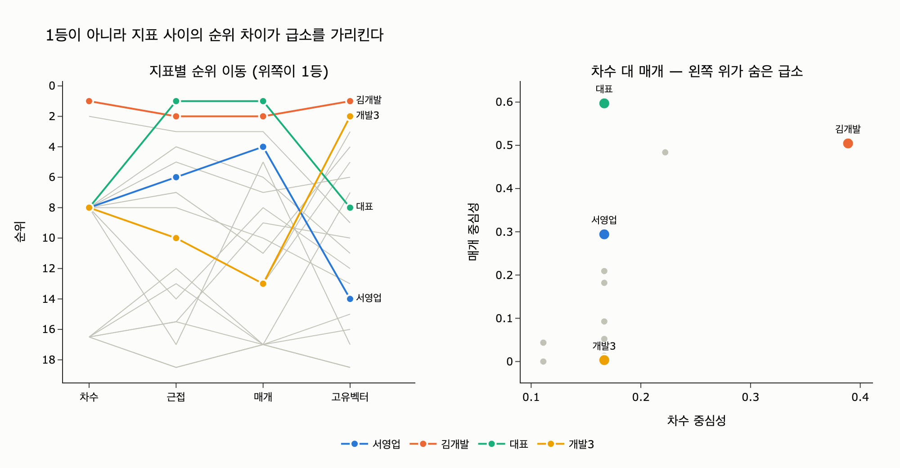

# 중심성 분석에서 가장 값어치 있는 정보는 무엇인가?

> **답** 1등이 아니라 **지표 사이의 순위 차이**다.
> 차수는 낮은데 매개가 높은 노드가 아무도 모르는 급소다.

---

## 1. 왜 «1등»은 값어치가 없는가

「우리 조직에서 제일 중요한 사람이 누군지 그래프로 뽑아 주세요」라는 요구를 받으면,
보통 중심성 하나를 골라 정렬한 뒤 맨 위 이름을 보고한다. 문제는 두 가지다.

1. **1등은 대개 이미 알고 있는 사람이다.** 조직도에서 제일 위에 있거나, 회의에 제일
   많이 나오는 사람이다. 그래프를 돌린 값어치가 없다.
2. **어떤 지표를 골랐느냐에 따라 1등이 바뀐다.** 그러니 「1등이 누구냐」는 사실
   「너 어떤 지표 골랐냐」와 같은 질문이다.

중심성 지표는 **「중요하다」의 서로 다른 정의**다. 하나의 정답을 놓고 넷이 근사하는 게
아니라, 애초에 네 개가 다른 질문이다.

| 지표 | 묻는 질문 | 수식 |
|---|---|---|
| **차수** (degree) | 아는 사람이 많은가 | $C_D(v)=\dfrac{\lvert N(v)\rvert}{n-1}$ |
| **근접** (closeness) | 소문이 제일 빨리 퍼지는가 | $C_C(v)=\dfrac{n-1}{\sum_u d(v,u)}$ |
| **매개** (betweenness) | 없으면 조직이 갈라지는가 | $C_B(v)=\dfrac{2}{(n-1)(n-2)}\displaystyle\sum_{s\ne v\ne t}\dfrac{\sigma_{st}(v)}{\sigma_{st}}$ |
| **고유벡터** (eigenvector) | 힘 있는 사람과 이어졌는가 | $\lambda\,x = A\,x$ (최대 고윳값의 고유벡터) |

네 개가 다른 질문이니 **답이 서로 다른 것은 버그가 아니라 정보**다.
그 「다름」 자체가 우리가 캐내야 할 신호다.

---

## 2. 값어치는 «순위 차이»에 있다

노드 $v$ 의 차수 순위를 $r_D(v)$, 매개 순위를 $r_B(v)$ 라 하자 (1이 제일 높음).

$$\mathrm{gap}(v)\;=\;r_D(v)-r_B(v)$$

이 값이 크게 양수인 노드, 즉 **차수 순위는 뒤쪽인데 매개 순위는 앞쪽인 노드**가
조직도에도 안 뜨고 인기 순위에도 안 뜨는 급소다.

두 방향 모두 읽을 값어치가 있다.

| 패턴 | 뜻 | 실무 조치 |
|---|---|---|
| **차수↓ / 매개↑** | 다리(bridge) 역할. 두 집단을 잇는 **유일한** 통로 | 단일 장애점(SPOF). 백업 인력·우회 경로를 만들어야 한다 |
| 차수↑ / 매개↓ | 인기는 많지만 **대체 가능**. 주변에 우회로가 많다 | 빠져도 조직이 안 멈춘다. 과대평가 주의 |
| 차수↑ / 매개↑ | 진짜 허브 | 이미 다들 안다 |
| 차수↓ / 매개↓ | 주변부 | — |

---

## 3. 10장의 «작은 회사» 그래프로 확인하기

`content/ch10/code/org.py` 의 `EDGES`는 일부러 세 사람을 심어 둔 협업 그래프다
(노드 19, 엣지 28).

- **김개발**: 개발팀 전원과 이어져 있다 → 아는 사람이 제일 많다
- **서영업**: 외주 공장(공장A/B/C)으로 가는 **유일한** 통로다
- **대표**: 팀장들하고만 이어져 있다

계산 결과 (`expy.py` 실행값):

| 노드 | 차수 | 차수 순위 | 매개 | 매개 순위 | gap |
|---|---|---|---|---|---|
| 김개발 | 0.389 | **1** | 0.504 | 2 | −1 |
| 정영업 | 0.222 | 2 | 0.484 | 3 | −1 |
| 대표 | 0.167 | 공동 8 | **0.597** | **1** | **+7** |
| **서영업** | 0.167 | 공동 8 | 0.294 | **4** | **+4** |
| 개발3 | 0.167 | 공동 8 | 0.003 | 13 | −5 |
| 청소담당 | 0.111 | 공동 16.5 | 0.044 | 9 | +7.5 |

지표별 1·2·3등을 뽑으면 이렇다.

```
차수      1등 김개발   2등 정영업   3등 개발1
근접      1등 대표     2등 김개발   3등 정영업
매개      1등 대표     2등 김개발   3등 정영업
고유벡터  1등 김개발   2등 개발3    3등 개발4
```

1등만 보면 「김개발 아니면 대표」다. 둘 다 조직도로도 아는 사람이다.
**그래프가 새로 알려준 건 하나도 없다.**

---

## 4. 검증 — 진짜로 빼 보면 안다

매개 중심성의 정의가 「없으면 갈라지는가」였으니, 노드를 실제로 지우고 그래프가
몇 조각으로 쪼개지는지 세면 검증이 된다.

| 제거한 노드 | 차수 순위 | 매개 순위 | 조각 수 | 떨어져 나간 노드 |
|---|---|---|---|---|
| (없음) | — | — | 1 | — |
| **김개발** | **1** | 2 | 1 | 없음 |
| 개발1 | 공동 8 | 7 | 1 | 없음 |
| 청소담당 | 공동 16.5 | 9 | 1 | 없음 |
| **서영업** | **공동 8** | **4** | **2** | 공장A, 공장B, 공장C |
| 대표 | 공동 8 | 1 | 2 | 공장A/B/C, 서영업, 오영업, 정영업, 한영업 |

읽는 법:

- **김개발을 빼도 회사는 안 갈라진다.** 차수 1등이자 고유벡터 1등인데도 그렇다.
  개발팀은 자기들끼리도 이어져 있고, 대표를 통한 우회로가 있다.
  *차수 1등은 「대체 가능한 인기인」일 수 있다.*
- **서영업은 차수 공동 8위로 지극히 평범하다.** 그런데 빼면 외주 공장 세 곳이
  통째로 떨어져 나간다. 조직도에도 안 보이고 차수 순위에도 안 뜬다.
  휴가를 가면 공장이 멈춘다. **이 사람이 「아무도 모르는 급소」다.**
- 대표도 차수 공동 8위에 매개 1등이라 gap이 크지만, 대표는 조직도만 봐도 아는
  사람이다. 그래프가 *새로* 알려준 쪽은 서영업이다.

---

## 5. 실무 레시피와 함정

### 순위 차이는 «필터»이지 «결론»이 아니다

gap이 제일 큰 노드는 사실 **청소담당**(+7.5)이다. 하지만 매개 절댓값이 0.044로
바닥이다. 순위가 워낙 뒤라서 조금만 올라와도 gap이 커지는 것뿐이다.

그래서 실무에서는 두 조건을 함께 건다.

1. **매개 상위 $k$ 안에 든다** (절대 수준 확인)
2. **차수 상위 $k$ 에는 없다** (순위 차이 확인)
3. **노드를 실제로 제거해 연결 요소가 쪼개지는지 검증한다** (인과 확인)

$k=5$ 로 걸면 이 그래프에서는 대표·서영업·공장A가 남고, 3번 검증을 통과하는 건
서영업(과 이미 아는 대표)이다.

### 요구사항을 받으면 되물어야 한다

> 「제일 중요한 사람 뽑아 주세요」

- 아는 사람이 많은 사람인가? → **차수**
- 없으면 조직이 갈라지는 사람인가? → **매개**
- 소문이 제일 빨리 퍼지는 사람인가? → **근접**
- 힘 있는 사람과 이어진 사람인가? → **고유벡터**

넷은 다 다른 질문이고, 다른 사람을 가리킨다. 되묻지 않고 하나를 고르면
그 선택이 곧 답이 되어 버린다.

### 곁들여 기억할 것 (10장 나머지 주제)

- **매개는 비싸다.** 브랜디스 알고리즘으로도 $O(V\cdot E)$ 다. 다만 구조가 있는
  그래프라면 시작 노드를 5%만 표본으로 써도 상위권은 대개 맞는다. 「정확한 값」이
  필요한 경우는 드물고 「누가 위에 있나」만 필요할 때가 많다.
- **표본을 쓸 거면 시드를 고정한다.** 아니면 매번 순위가 흔들려 보고서를 못 쓴다.
- **완전 무작위 그래프에서는 이 기법이 안 먹힌다.** 매개가 거의 평평해서 상위권이
  사실상 무작위이기 때문이다. 순위 차이가 의미 있으려면 「진짜 급소가 있는」
  구조여야 하고, 실제 그래프는 대개 그렇다.

---

## 6. 한 줄 정리

| 보는 방식 | 나오는 답 | 값어치 |
|---|---|---|
| 지표 하나의 1등 | 김개발 / 대표 | 조직도로도 아는 사실 |
| 네 지표의 1등 비교 | 지표마다 다르다 | 「어떤 중요함이냐」를 되묻게 됨 |
| **지표 사이 순위 차이** | **서영업** | **아무도 모르던 급소** |

---

## 시각화



왼쪽 범프 차트는 네 지표에서 각 노드의 **순위가 어떻게 움직이는지**를 보여준다.
선이 가파를수록 「지표에 따라 평가가 갈리는 노드」다. 서영업(파랑)은 차수 8위에서
매개 4위로 올라가고, 개발3(노랑)은 고유벡터 2위인데 매개는 13위로 바닥이다.

오른쪽 산점도는 차수(x) 대 매개(y)다. 오른쪽 아래는 「인기만 많은 노드」,
**왼쪽 위**가 찾던 영역 — 차수는 낮은데 매개가 높은 급소다.
