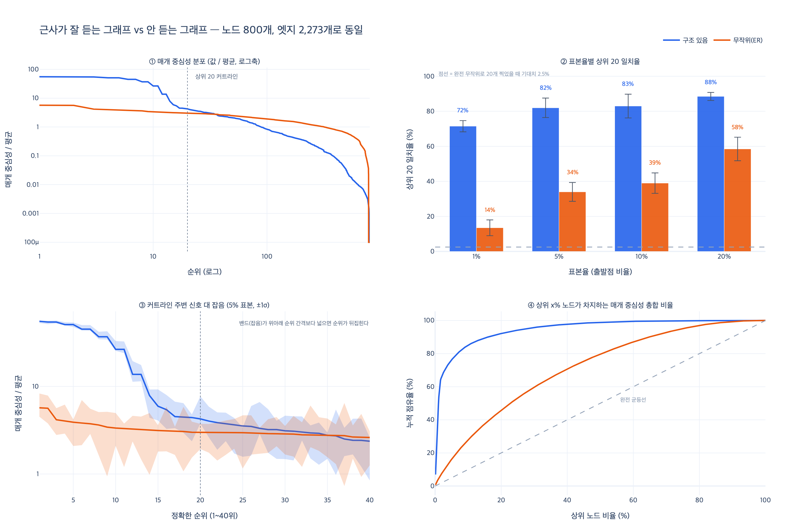

# 근사가 잘 듣는 그래프와 그렇지 않은 그래프

## 한 줄 답

**커뮤니티와 다리가 있는 «구조 있는» 그래프에서는 표본 5%로도 상위 20개를 82% 맞히지만,
완전 무작위(에르되시–레니) 그래프에서는 일치율이 10~50%로 떨어진다.
매개 중심성 값이 평평해서 «상위 20개»라는 게 사실상 무작위이기 때문이다.**

에셋 `ex3_betweenness_cost.py`의 마지막 문단이 그대로 이 이야기다.

> 이 예제의 그래프는 커뮤니티와 다리가 있는 «구조 있는» 그래프다.
> 완전 무작위 그래프에서 같은 실험을 하면 일치율이 10~50%로 떨어진다.
> 매개 중심성이 거의 평평해서 상위 20개라는 게 사실상 무작위이기 때문이다.
> 근사가 잘 듣는 건 «진짜 급소가 있는» 그래프에서다. 그리고 대개 그렇다.

핵심은 **근사의 성패를 알고리즘이 아니라 값의 분포가 정한다**는 것이다.
브랜디스 표본 근사는 두 경우에 똑같이 동작한다. 결과가 갈리는 건 그래프 탓이다.

## 두 그래프는 무엇이 다른가

`expy.py`에서 **노드 800개, 엣지 2,273개로 완전히 똑같이** 맞춘 두 그래프를 만들었다.
밀도 차이가 아니라 **배치 차이**만 남기기 위해서다.

| | 구조 있음 | 무작위 (ER) |
|---|---|---|
| 만드는 법 | 커뮤니티 13개, 그룹 안은 촘촘히 + 그룹 사이 다리 하나씩 | 같은 엣지 수를 무작위 쌍에 뿌린다 |
| 최단 경로가 지나가는 곳 | **다리 노드에 집중** | 온 그래프에 고루 흩어짐 |
| 매개 중심성 최댓값 | 355,795 | 13,852 |
| 중앙값 | 553 | 1,944 |
| 상위 20의 중앙값 ÷ 전체 중앙값 | **306.8배** | **4.1배** |
| 20위 값 대비 20위–40위 간극 | 0.44 | 0.13 |
| 상위 5% 노드가 차지하는 총합 비율 | 76.3% | 16.2% |
| 지니 계수 | 0.896 | 0.427 |

구조 있는 그래프에서 그룹 사이를 잇는 다리는 **하나뿐**이다.
그러니 그룹 A의 61명이 그룹 B의 61명에게 가려면 무조건 그 다리를 지난다.
그 노드 하나가 3,700쌍의 최단 경로를 독점한다. 이게 «진짜 급소»다.

무작위 그래프에는 그런 독점이 없다. 어느 두 노드 사이에도 우회로가 여러 개 있고,
최단 경로가 모든 노드에 고르게 흩어진다. 그래서 값이 평평하다.

## 값 분포가 평평하면 순위가 잡음에 지배된다

### 표본 근사가 만들어 내는 잡음

브랜디스 표본 근사는 전체 $n$개 출발점 중 $k$개만 골라 BFS를 돌리고 되돌린다.

$$\hat{c}(v) = \frac{n}{k} \sum_{s \in S} \delta_s(v), \qquad |S| = k$$

이건 불편 추정량이고, 표준오차는 표본 크기의 제곱근에 반비례한다.

$$\mathrm{SE}[\hat{c}(v)] = \frac{n\,\sigma_v}{\sqrt{k}} \;\propto\; \frac{1}{\sqrt{k}}$$

여기까지는 그래프와 무관하다. **잡음은 우리가 돈(표본 크기)으로 살 수 있다.**

### 그런데 우리가 원하는 건 값이 아니라 순위다

노드 $v$와 $w$의 순위가 뒤집히지 않으려면 참값의 간극이 잡음보다 커야 한다.

$$\mathrm{SNR}_{v,w} = \frac{|c(v) - c(w)|}{\sqrt{\mathrm{SE}[\hat c(v)]^2 + \mathrm{SE}[\hat c(w)]^2}} \gg 1$$

- **분모(잡음)** — $k$를 늘리면 $1/\sqrt{k}$로 줄어든다. 내 손 안에 있다.
- **분자(신호)** — 참값의 간극. **그래프가 정해 준다. 내가 어쩔 수 없다.**

분포가 평평하다는 건 정확히 **분자가 0에 가깝다**는 뜻이다.
그러면 $k$를 아무리 키워도 SNR이 안 올라간다.
근사가 틀린 게 아니라, **애초에 «상위 20개»라는 게 존재하지 않는다.**

### 실측 (표본율 5%, 시드 10개)

| | 신호: 20위−21위 | 신호: 10위−40위 | 잡음: 표본 표준편차 | SNR(인접) | SNR(창) |
|---|---:|---:|---:|---:|---:|
| 구조 있음 | 1,490 | 154,664 | 16,343 | 0.09 | **9.46** |
| 무작위(ER) | 24 | 1,677 | 3,255 | 0.01 | **0.52** |

읽는 법이 두 단계다.

**첫째, SNR(인접)은 둘 다 1보다 훨씬 작다.**
20위와 21위를 표본으로 구분하는 건 어느 쪽에서도 불가능하다.
그래서 구조 있는 그래프에서도 일치율이 100%가 아니라 82%인 것이다.
**틀리는 곳은 언제나 커트라인 바로 근처**다. 이건 근사의 정상적인 한계다.

**둘째, 창을 넓히면 갈린다.** 10위와 40위처럼 확실히 떨어진 두 노드를 보면

- 구조 있음: SNR **9.46** — 신호가 잡음의 열 배. 10위와 40위를 헷갈릴 일이 없다.
- 무작위: SNR **0.52** — 신호가 잡음보다 **작다**. 10위와 40위조차 구분이 안 된다.

무작위 그래프의 잡음(3,255)은 20위 참값(7,276)의 45%다. 신호와 잡음이 같은 크기다.
이 상태에서 «상위 20개»를 뽑으면 그건 순위가 아니라 추첨이다.

## 실측 일치율 — 에셋의 «10~50%» 재현

노드 800개, 상위 20개, 표본 시드 10개.

| 표본율 | 구조 있음 | 무작위(ER) |
|---|---:|---:|
| 1% | 71.5% | 13.5% |
| 5% | 82.0% | 34.0% |
| 10% | 83.0% | 39.0% |
| 20% | 88.5% | 58.5% |
| *(완전 무작위로 20개 찍기)* | *2.5%* | *2.5%* |

두 가지를 눈여겨봐야 한다.

1. **구조 있는 그래프는 표본 1%로도 71.5%를 맞힌다.** 5%에서 82%, 그 뒤로는 완만하다.
   에셋이 「표본 5%로도 상위권을 맞힌다」고 한 것과 같다.
2. **무작위 그래프는 표본을 20배(1%→20%) 늘려도 58.5%다.**
   잡음은 $\sqrt{20} \approx 4.5$배 줄었는데 일치율은 4배로 안 는다. 신호가 없어서다.
   $k \to n$이면 물론 100%가 되지만, 그건 근사가 아니라 전수 계산이다.

그리고 ER의 «34%»에 안심하면 안 된다. 2.5%보다 높긴 하다.
그런데 20위와 40위의 참값 차이가 13%뿐인데 그중 20개를 골라낸들 무슨 의미가 있나.
**«상위권»이라는 집합 자체가 없는 그래프에서 상위권을 맞혔다는 말은 성립하지 않는다.**

## 실무 사전 점검 — 근사를 믿어도 되는지 먼저 본다

여기까지는 정답(전수 계산)을 알고 비교한 것이다. 실무에서는 그게 없다.
다행히 **분포 모양은 표본 추정값만으로도 알 수 있다.**
5% 표본을 한 번 돌리고, 나온 값들의 분포를 보면 된다. 추가 비용은 0이다.

### 점검 지표

$c_{(i)}$를 내림차순 $i$번째 값, $\tilde c$를 중앙값, $k$를 뽑으려는 상위 개수라고 하자.

| 지표 | 정의 | 무엇을 보는가 |
|---|---|---|
| **상위/중앙값 비율** | $\rho = c_{(k/2)} / \tilde c$ | 상위권이 대중과 얼마나 떨어져 있나 |
| **커트라인 간극** | $g = (c_{(k)} - c_{(2k)}) / c_{(k)}$ | 컷 근처가 뭉개져 있나 |
| **변동계수** | $\mathrm{CV} = \sigma / \mu$ | 분포가 얼마나 퍼져 있나 |
| **상위 5% 점유율** | $\sum_{i \le n/20} c_{(i)} \big/ \sum_i c_i$ | 소수가 독점하나 |
| **지니 계수** | 로렌츠 곡선 면적 | 위와 같은 이야기, 스케일 무관 |

`expy.py` 실측 (5% 표본만으로 계산한 값 / 괄호는 전수 참값):

| 지표 | 구조 있음 | 무작위(ER) |
|---|---:|---:|
| 상위/중앙값 비율 $\rho$ | **412.4** (306.8) | **6.7** (4.1) |
| 커트라인 간극 $g$ | 0.417 (0.444) | 0.113 (0.128) |
| 변동계수 CV | 5.35 (5.31) | 1.06 (0.81) |
| 상위 5% 점유율 | 78.2% (76.3%) | 21.0% (16.2%) |
| 지니 | 0.914 (0.896) | 0.517 (0.427) |

**전수를 안 돌려도 결론이 같다.** $\rho$가 412 대 6.7 — 두 자릿수 가까이 벌어진다.

### 임계와 처방

| 판정 | 기준 (5% 표본 기준) | 뜻 | 할 일 |
|---|---|---|---|
| 🟢 초록 | $\rho \ge 50$ **그리고** $g \ge 0.2$ | 급소가 확실히 있다 | 표본 1~5%로 상위권을 보고해도 된다 |
| 🟡 노랑 | $10 \le \rho < 50$ | 애매하다 | 표본율을 두 배로 늘려 상위 $k$가 유지되는지 확인 |
| 🔴 빨강 | $\rho < 10$ | 평평하다 | 근사 순위를 믿지 마라. 전수를 쓰거나 지표를 바꿔라 |

**주의: 이 점검은 «통과» 쪽으로 편향돼 있다.**
표본 추정은 잡음 때문에 분포를 실제보다 뾰족하게 만든다 (306.8 → 412.4, 4.1 → 6.7).
그래서 임계를 넉넉히 잡아야 한다. 「$\rho \ge 5$면 OK」 같은 기준은 완전 무작위 그래프도 통과시킨다.

### 제일 싼 최종 확인 — 표본율을 두 배로

숫자 하나로 안 끝내고 싶으면 이걸 하면 된다. 정답을 몰라도 판정이 된다.

```python
a = brandes(adj, sample(nodes, int(n * 0.05)))   # 5%
b = brandes(adj, sample(nodes, int(n * 0.10)))   # 10%
overlap = len(top_k(a) & top_k(b)) / k
```

| 그래프 | 5% vs 10% 상위 20 일치 |
|---|---:|
| 구조 있음 | **80%** |
| 무작위(ER) | **45%** |

80%면 커트라인 근처만 몇 개 바뀐 것이고, 45%면 절반 이상이 갈아치워진 것이다.
**표본율만 바꿔 두 번 돌려 보고 상위 $k$가 흔들리면 근사를 못 믿는 것이다.**
추가 비용은 BFS 몇십 번. 이보다 싼 점검은 없다.

## 실무에서 «평평한 그래프»는 언제 나오나

「대개 구조가 있다」는 말은 맞다. 조직도, 소셜 그래프, 인프라 토폴로지, 지식 그래프에는
다리와 급소가 실재한다. 다만 «대개»를 «항상»으로 읽으면 안 된다. 아래가 위험한 경우다.

| 상황 | 왜 평평해지나 |
|---|---|
| **임계를 낮게 잡은 공출현 그래프** | 노이즈 엣지가 잔뜩 붙어 사실상 ER에 가까워진다. 실무에서 제일 흔한 함정 |
| **무작위 해시로 샤딩한 뒤 샤드 하나만 계산** | 다리 엣지가 통째로 잘려 나가 구조가 파괴된다 |
| **노드/엣지를 무작위 샘플링해 만든 서브그래프** | 위와 같은 이유. 원 그래프의 급소가 표본에 안 남는다 |
| **격자·메시 (물리 시뮬, 균질한 도로 격자)** | 차수가 다 같고 우회로가 많다 |
| **정규 그래프, 밀집 커뮤니티 하나뿐인 그래프** | 우회로가 넘쳐 최단 경로가 독점되지 않는다 |
| **이미 커뮤니티 안으로 잘라 낸 부분 그래프** | 다리를 밖에 두고 왔다. 안쪽은 평평하다 |

앞의 세 개가 특히 무섭다. **원래 구조가 있던 그래프를 우리가 직접 평평하게 만든 경우**라서,
「우리 데이터는 구조가 있으니 괜찮다」는 믿음이 틀리지 않았는데도 결과가 틀린다.
전처리 파이프라인을 통과한 **그 그래프**로 점검해야지, 원본 데이터를 근거로 삼으면 안 된다.

## 자주 하는 오해

| 오해 | 사실 |
|---|---|
| 「표본을 늘리면 언젠가 맞는다」 | 잡음만 $1/\sqrt{k}$로 준다. 신호는 안 는다. 평평한 그래프에서 20배를 늘려도 58.5%다 |
| 「일치율 34%면 그래도 2.5%(무작위)보단 낫다」 | 20위와 40위가 13% 차이인데 그 34%가 무슨 의미인가. 순위 자체가 없다 |
| 「구조 있는 그래프면 100% 맞아야 하는 것 아닌가」 | 아니다. 커트라인 인접 SNR은 구조가 있어도 0.09다. 82%가 정상이다 |
| 「값이 크면 신호가 큰 것」 | 스케일이 아니라 **간극**이 신호다. 그래서 $\rho$, $g$, 지니처럼 스케일 무관한 지표를 본다 |
| 「근사는 하위권에서만 틀린다」 | 에셋 본문 그대로 하위권에서 많이 틀린다. 다만 상위권 안에서도 **커트라인 근처**는 항상 흔들린다 |
| 「이건 매개 중심성만의 이야기」 | 아니다. 몬테카를로 페이지랭크, 표본 기반 근접 중심성 등 **표본으로 순위를 매기는 모든 것**에 같은 논리가 적용된다 |

## 엔지니어링 판단

1. **값을 보고할 거면 전수.** 근사는 순위용이다. 에셋 본문도 「값 자체를 보고할 거면 전수를 써야 한다」고 못 박는다.
2. **순위를 보고할 거면 사전 점검 후 근사.** $\rho$와 $g$를 먼저 보고, 애매하면 표본율 두 배 확인.
3. **시드를 고정하고 문서에 적는다.** 안 고정하면 매번 순위가 흔들린다. 이건 그래프가 좋아도 마찬가지다.
4. **커트라인을 딱 잘라 쓰지 마라.** $g < 0.2$면 «상위 20»은 임의적인 컷이다.
   $k$를 늘려 «상위권 집합»으로 보고하거나, 컷 근처는 사람이 보게 넘기는 게 낫다.
5. **평평하다는 판정이 나오면 지표를 바꾼다.** 매개 중심성이 평평하다는 건
   「이 그래프에는 구조적 급소가 없다」는 **답이 나온 것**이다. 근사를 고칠 게 아니라
   질문을 고쳐야 한다 — 차수, 페이지랭크, 커뮤니티 탐지 쪽이 더 맞을 수 있다.

## 시각화



- **① 매개 중심성 분포** — 노드 수도 엣지 수도 같은 두 그래프. 로그축인데도 파란 선(구조 있음)은
  1위에서 평균의 56배, 하위권에서 0.001배 아래로 **다섯 자릿수를 넘나든다.**
  주황 선(무작위)은 맨 끝 몇 개를 빼면 상위권부터 하위권까지 5.7배 안에 다 들어간다.
  이 «평평함»이 모든 것의 원인이다.
- **② 표본율별 상위 20 일치율** — 오차막대는 시드 10개의 표준편차.
  파란 쪽은 1%에서 이미 72%, 주황 쪽은 20%를 써도 58%다. 회색 점선이 완전 무작위 선택 기대치(2.5%).
- **③ 커트라인 주변 신호 대 잡음** — 실선이 참값, 밴드가 5% 표본 추정의 ±1σ.
  파란 쪽은 1~13위 구간에서 **밴드가 선 굵기만큼 얇다** — 순위가 안 흔들린다.
  주황 쪽은 밴드가 값의 절반을 넘나들며 위아래 순위를 통째로 덮는다. 저 상태의 순위는 추첨이다.
- **④ 누적 점유율** — 구조 있는 그래프는 상위 5%가 총합의 76%를 가져간다(파랑이 급히 꺾인다).
  무작위 그래프는 완전 균등선(회색 점선)에서 별로 안 떨어져 있다.
