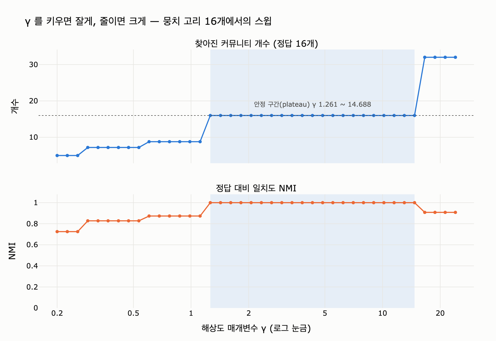

# 해상도 매개변수 $\gamma$ 는 모듈러리티 식에서 어떤 역할을 하는가

## 한 줄 답

$\gamma$ 는 모듈러리티 식의 **기대값 항** $(d_c/2m)^2$ 에만 곱해지는 계수다.
크게 잡으면 커뮤니티가 **잘게** 나뉘고, 작게 잡으면 **크게** 뭉친다.
「옳은 $\gamma$」를 주는 공식은 없고 실험(스윕)으로 정한다.

---

## 1. 원래 모듈러리티부터

뉴먼–거번(Newman–Girvan)의 모듈러리티는 「관측 − 기대」다.

$$
Q = \sum_{c \in C}\left[\frac{L_c}{m} - \left(\frac{d_c}{2m}\right)^2\right]
$$

| 기호 | 뜻 |
|---|---|
| $C$ | 커뮤니티 분할 (노드를 겹치지 않게 나눈 집합들) |
| $L_c$ | 커뮤니티 $c$ **안쪽**에 있는 간선 수 |
| $d_c$ | $c$ 에 속한 노드들의 차수 합 |
| $m$ | 그래프 전체 간선 수 |

- 앞의 $L_c/m$ 은 **관측 항**. 「이 커뮤니티가 실제로 얼마나 안쪽으로 뭉쳐 있나」.
- 뒤의 $(d_c/2m)^2$ 은 **기대 항**. 「차수만 똑같이 유지한 채 간선을 무작위로 다시 뿌렸다면
  이 정도는 안쪽에 떨어졌을 것」이라는 널 모델(configuration model)의 기댓값이다.

즉 $Q$ 는 「우연 이상으로 뭉쳐 있는 정도」다. $Q$ 를 최대화하는 분할을 찾는 게 루뱅·라이덴 같은 알고리즘이 하는 일이다.

## 2. 일반화 모듈러리티 $Q_\gamma$ — Reichardt–Bornholdt (2006)

Reichardt와 Bornholdt는 커뮤니티 탐지를 **스핀 글래스(Potts 모형)의 바닥 상태 찾기**로 다시 쓰면서,
관측 항과 기대 항의 **저울추**를 밖으로 빼냈다. 그게 $\gamma$ 다.

$$
Q_\gamma = \sum_{c \in C}\left[\frac{L_c}{m} - \gamma\left(\frac{d_c}{2m}\right)^2\right]
$$

- $\gamma$ 는 **기대 항에만** 붙는다. 관측 항 $L_c/m$ 은 건드리지 않는다.
- $\gamma = 1$ 이면 원래 모듈러리티와 정확히 같다.
- 원 논문: Reichardt & Bornholdt, *Statistical mechanics of community detection*,
  Phys. Rev. E 74, 016110 (2006) — <https://arxiv.org/abs/cond-mat/0603718>
- networkx에서는 `resolution` 인자가 곧 $\gamma$ 다:
  `nx.community.modularity(G, comms, resolution=γ)`, `nx.community.louvain_communities(G, resolution=γ)`.

> 참고로 이 장의 `code/ex5_resolution.py` 에도 같은 식이 그대로 들어 있다.
> `q += lc / m - gamma * (dc / (2 * m)) ** 2` 한 줄이 위 식이다.

## 3. 왜 $\gamma$ 가 크면 잘게 나뉘는가 — 직관

핵심은 **기대 항이 커뮤니티 크기에 대해 제곱으로 자란다**는 점이다.

커뮤니티 두 개 $a$, $b$ 를 하나로 **합쳤을 때**의 점수 변화를 보자.
합치면 두 커뮤니티를 잇던 간선 $\ell_{ab}$ 개가 「안쪽 간선」으로 승격되므로 관측 항은 $\ell_{ab}/m$ 만큼 는다.
반면 기대 항은 $d_a^2 + d_b^2$ 에서 $(d_a + d_b)^2$ 로 뛰므로 $2 d_a d_b$ 만큼 더 커진다.

$$
\Delta Q_\gamma(a \cup b) = \frac{\ell_{ab}}{m} - \gamma\,\frac{2 d_a d_b}{(2m)^2}
$$

- **병합 이득**은 $\ell_{ab}/m$ 로 고정이다. $\gamma$ 와 무관하다.
- **병합 벌점**은 $\gamma \cdot \dfrac{d_a d_b}{2m^2}$ 로, $\gamma$ 에 정비례한다.

그래서

- $\gamma \uparrow$ → 벌점이 커짐 → $\Delta Q_\gamma < 0$ 이 되는 쌍이 많아짐 → **합치면 손해** → 잘게 나뉜다.
- $\gamma \downarrow$ → 벌점이 작아짐 → 웬만하면 합치는 게 이득 → **크게 뭉친다**.
- 극단으로 $\gamma \to 0$ 이면 「전부 한 덩어리」가 최적이고, $\gamma$ 가 아주 크면 「전부 개별 노드」가 최적이다.

$\gamma$ 를 「**얼마나 촘촘해야 한 뭉치로 인정해 줄 것인가**」의 문턱이라고 읽으면 된다.
실제로 $\Delta Q_\gamma = 0$ 이 되는 지점을 풀면 $\gamma$ 는 커뮤니티 사이의 임계 연결 밀도를 정하는 값이 된다.

## 4. 왜 이게 필요한가 — 해상도 한계 (resolution limit)

Fortunato–Barthélemy(2007, PNAS)가 보인 사실: $\gamma = 1$ 인 고전 모듈러리티는
**$\sqrt{2m}$ 보다 작은 커뮤니티를 개별적으로 볼 수 없다**. 그래프가 커질수록($m$ 이 클수록)
작은 뭉치들은 붙여 놓는 편이 $Q$ 가 더 높아지기 때문이다.

- 논문: <https://www.pnas.org/doi/10.1073/pnas.0605965104>
- 이 장의 예제(`ex5_resolution.py`)가 만드는 「뭉치 고리」가 바로 그 반례다.
  크기 4짜리 완전 그래프를 고리로 이어 놓으면 정답은 명백히 뭉치 하나하나인데,
  뭉치 수가 늘어나면 **이웃한 둘을 붙인 답의 $Q$ 가 정답을 이긴다.**

`expy.py` 실행 결과(뭉치 16개, 크기 4, $m=112$):

| $\gamma$ | 정답 $Q$ (16개) | 둘씩 붙인 $Q$ (8개) | 이기는 쪽 |
|---|---|---|---|
| 0.5 | 0.8259 | 0.8661 | 붙인 쪽 (틀림) |
| 0.8 | 0.8071 | 0.8286 | 붙인 쪽 (틀림) |
| **1.0** | 0.7946 | **0.8036** | **붙인 쪽 (틀림)** |
| 1.2 | 0.7821 | 0.7786 | 정답 |
| 2.0 | 0.7321 | 0.6786 | 정답 |

$\gamma$ 를 1.2 이상으로 올리는 순간 정답이 이긴다. 즉 $\gamma$ 는 해상도 한계에 대한 **직접적인 손잡이**다.

**주의**: $\gamma$ 를 올리는 것은 해상도 한계를 *옮기는* 것이지 *없애는* 것이 아니다.
$\gamma$ 가 커지면 볼 수 있는 최소 크기가 작아지지만, 그 아래에서는 여전히 같은 문제가 생긴다.
크기가 제각각인 뭉치가 섞여 있으면 어떤 $\gamma$ 하나로도 전부 맞히지 못할 수 있다.

## 5. 실무 절차 — $\gamma$ 스윕과 안정 구간(plateau)

$\gamma$ 를 정해 주는 이론적 정답은 없다. 실무에서는 이렇게 한다.

1. **넓게, 로그 간격으로 스윕한다.** 보통 $\gamma \in [0.1, 10]$ 을 로그 눈금으로 30~50점.
   선형 간격으로 뜨면 작은 $\gamma$ 쪽이 성기게 잡혀서 병합 구간을 놓친다.
2. **각 $\gamma$ 마다 여러 시드로 여러 번 돌린다.** 루뱅·라이덴은 무작위성이 있어서 답이 흔들린다.
   시드 5~10개의 커뮤니티 개수 분포를 함께 본다.
3. **$\gamma$ 를 흔들어도 결과가 잘 안 변하는 구간을 찾는다.** 이게 plateau(안정 구간)다.
   - 「커뮤니티 개수가 $\gamma$ 에 대해 거의 평평한 구간」
   - 「시드를 바꿔도 분할이 거의 같은 구간」(시드 간 NMI/ARI가 높은 구간)
   - 둘 다 만족하는 구간이 그 그래프에 **실제로 존재하는 구조의 스케일**이다.
4. **plateau 한가운데 값을 고른다.** 경계 근처 값은 데이터가 조금만 바뀌어도 분할이 통째로 바뀐다.
   로그 눈금으로 스윕했으면 「한가운데」는 산술평균이 아니라 **기하평균** $\sqrt{\gamma_{lo}\gamma_{hi}}$ 다.
5. **plateau가 여러 개면 계층 구조가 있는 것이다.** 하나를 고르지 말고 계층으로 보고하는 편이 낫다
   (예: 큰 단위 4개 → 그 안의 작은 단위 30개).
6. **plateau가 없으면** 그 그래프에는 뚜렷한 커뮤니티 구조가 없거나, 크기가 제각각이라
   단일 $\gamma$ 로는 안 된다는 신호다. 이때는 계층적 실행이나 다른 목적함수를 본다.

`expy.py` 가 자동으로 찾은 결과: **plateau = $\gamma\ 1.26 \sim 14.7$ (커뮤니티 16개 고정), 추천 $\gamma \approx 4.3$.**
$\gamma \lesssim 1.2$ 에서는 뭉치를 붙여 버리고(5~9개), $\gamma \gtrsim 16$ 에서는 뭉치를 쪼개 버린다(32개 → 64개).

## 6. 곁가지 — 같이 알아 두면 좋은 것

- **정답 개수는 알고리즘이 아니라 쓰임새로 정한다.** 이 장의 결론이기도 하다.
  요약문을 만들 거면 요약 하나가 감당할 크기로, 라우팅에 쓸 거면 라우팅 단위로.
  $\gamma$ 스윕은 「어떤 스케일이 존재하는가」를 알려 줄 뿐 「어떤 스케일을 써야 하는가」는 답하지 않는다.
- **다른 대처법**: 커뮤니티를 찾은 뒤 각 커뮤니티 안에서 다시 돌리는 **계층적(recursive) 방식**.
  $\gamma$ 를 건드리지 않고도 작은 뭉치를 볼 수 있다.
- **라이덴(Leiden)** 은 루뱅의 「연결이 끊긴 커뮤니티가 나올 수 있다」는 결함을 고친 알고리즘이며
  역시 `resolution_parameter` 를 받는다. 실무에서는 루뱅 대신 라이덴을 쓰는 편이 낫다.
  <https://www.nature.com/articles/s41598-019-41695-z>
- **CPM(Constant Potts Model)** 은 아예 널 모델을 버리고
  $\sum_c (L_c - \gamma \binom{n_c}{2})$ 를 쓴다. 여기서 $\gamma$ 는 「커뮤니티 안쪽 최소 밀도」라는
  더 직접적인 의미를 갖고, 해상도 한계에서 자유롭다. 대신 $\gamma$ 감각이 그래프마다 달라진다.
- **가중 그래프**에서는 $L_c$, $d_c$, $m$ 을 전부 가중치 합으로 바꿔 읽으면 식이 그대로 성립한다.

## 7. 카드로 되돌아가면

> **Q.** 해상도 매개변수 gamma는 모듈러리티 식에서 어떤 역할을 하는가?
> **A.** 기대값 항 $(d_c/2m)^2$ 에 곱해진다. 크면 잘게 나뉘고 작으면 크게 나뉘며, 값은 실험으로 정한다.

세 조각으로 외우면 된다.

1. **위치** — 기대 항에만 곱한다 (관측 항은 그대로).
2. **방향** — 크면 잘게, 작으면 크게. ($\gamma$ 는 병합 벌점의 세기)
3. **정하는 법** — 공식 없음. 스윕해서 plateau를 찾고, 최종 개수는 쓰임새로 결정.

## 시각화

$\gamma$ 를 0.2에서 24까지 로그 간격으로 스윕하면서 `louvain_communities(G, resolution=γ)` 의 결과를 잰 것이다.
위: 찾아진 커뮤니티 개수(점선이 정답 16개). 아래: 정답 대비 NMI.
음영이 자동으로 찾은 **안정 구간(plateau)** 이며, 그 안에서는 $\gamma$ 를 10배 이상 흔들어도 답이 그대로다.
