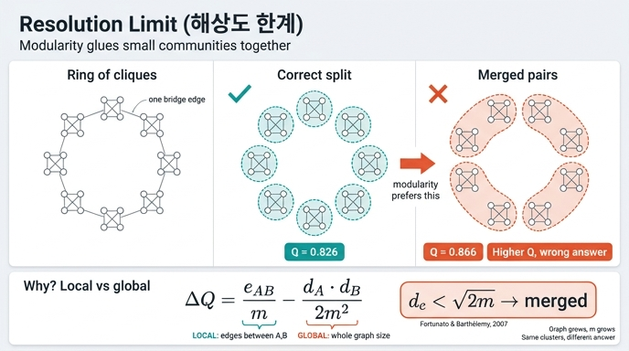

# 해상도 한계(resolution limit)

> **Q.** 해상도 한계(resolution limit)란 무엇인가?
>
> **A.** 모듈러리티를 최대화하면 작은 커뮤니티들을 하나로 붙여 버리는 현상이다. 버그가 아니라 지표의 성질이다.

---

## 1. 한 줄로

모듈러리티 $Q$ 를 최대로 만드는 분할은, 그래프 전체 크기에 비해 **너무 작은 커뮤니티를 그냥 없애 버린다**. 실제로 명백히 따로 노는 뭉치인데도 이웃 뭉치와 합쳐야 $Q$ 가 더 커진다. 알고리즘의 구현 실수가 아니라 **$Q$ 라는 목적함수 자체의 성질**이므로, 루뱅을 라이덴으로 바꾸든 최적해를 완전탐색으로 찾든 사라지지 않는다. 오히려 **최적화를 잘할수록 더 심해진다**.

---

## 2. 모듈러리티의 정의부터

무향 그래프의 전체 엣지 수를 $m$, 분할 $\mathcal{C} = \{c_1, \dots, c_n\}$ 이라 할 때

$$
Q \;=\; \sum_{c \in \mathcal{C}} \left[ \frac{l_c}{m} \;-\; \left(\frac{d_c}{2m}\right)^{\!2} \right]
$$

- $l_c$ : 커뮤니티 $c$ **안쪽** 엣지 수
- $d_c$ : $c$ 에 속한 노드들의 차수 합 (= 내부 엣지 $\times 2$ + 밖으로 나가는 엣지)

앞항 $l_c/m$ 은 「실제로 안에 뭉쳐 있는 비율」, 뒷항 $(d_c/2m)^2$ 은 「**차수만 유지한 채 엣지를 무작위로 다시 꽂았을 때** 안쪽에 떨어질 기대 비율」이다. 즉 $Q$ 는 *관측 − 기댓값*이고, 기댓값은 **널 모델(configuration model)** 에서 온다.

`ex5_resolution.py` 의 구현이 정확히 이 식이다(`gamma` 는 뒤에서 설명).

```python
q += lc / m - gamma * (dc / (2 * m)) ** 2
```

---

## 3. 왜 붙는가 — 병합 이득 $\Delta Q$ 를 직접 계산해 보자

두 커뮤니티 $A$, $B$ 를 하나로 합쳤을 때 $Q$ 가 얼마나 변하는지 보면 원인이 한 줄로 드러난다. 둘 사이 엣지 수를 $e_{AB}$ 라 하면, 합친 커뮤니티는 $l_{AB} = l_A + l_B + e_{AB}$, $d_{AB} = d_A + d_B$ 이므로

$$
\Delta Q \;=\; \underbrace{\left[\frac{l_A+l_B+e_{AB}}{m} - \left(\frac{d_A+d_B}{2m}\right)^{\!2}\right]}_{\text{합친 뒤}} \;-\; \underbrace{\left[\frac{l_A}{m} - \left(\frac{d_A}{2m}\right)^{\!2}\right] - \left[\frac{l_B}{m} - \left(\frac{d_B}{2m}\right)^{\!2}\right]}_{\text{합치기 전}}
$$

전개하면 $l_A, l_B$ 는 소거되고 제곱항의 교차항만 남는다:

$$
\boxed{\;\Delta Q \;=\; \frac{e_{AB}}{m} \;-\; \frac{d_A\, d_B}{2m^2}\;}
$$

따라서 **병합이 이득인 조건**은

$$
e_{AB} \;>\; \frac{d_A\, d_B}{2m}
$$

여기서 결정적인 관찰: 우변은 $A$ 와 $B$ 만 보는 값이 아니라 **$m$(그래프 전체 엣지 수)로 나뉘어 있다.** $m$ 이 커지면 우변은 0으로 간다. 그러면 $e_{AB} = 1$ — 다리가 **딱 하나**뿐이어도 병합이 이득이 된다. 그 조건은

$$
1 > \frac{d_A d_B}{2m} \quad\Longleftrightarrow\quad d_A d_B < 2m
$$

이고, $d_A = d_B = d$ 인 대칭 상황이면

$$
d \;<\; \sqrt{2m}
$$

이것이 **Fortunato–Barthélemy(2007, PNAS)** 의 결론이다. **전체 차수 합이 $\sqrt{2m}$ 규모보다 작은 커뮤니티는, 이웃과 엣지 하나로만 이어져 있어도 병합되는 편이 $Q$ 를 높인다.** 커뮤니티가 아무리 완전 그래프에 가까울 만큼 안이 조밀해도 소용없다 — 앞항 $l_c/m$ 은 크기가 작으면 어차피 작기 때문이다.

> 출처: Fortunato & Barthélemy, *Resolution limit in community detection*, PNAS 104(1):36–41 (2007). <https://www.pnas.org/doi/10.1073/pnas.0605965104>

---

## 4. 전역/국소 불일치 — 이게 진짜 병

위 식이 말하는 건 이거다.

| | 판단에 쓰이는 것 |
|---|---|
| 관측항 $e_{AB}$ | **국소** — $A$ 와 $B$ 사이만 본다 |
| 기대항 $d_A d_B / 2m$ | **전역** — 그래프 전체 $m$ 이 들어간다 |

$A$ 와 $B$ 는 손대지 않고, **저 멀리 관계없는 곳에 엣지를 잔뜩 추가**해 보자. $e_{AB}$, $d_A$, $d_B$ 는 그대로인데 $m$ 만 커진다. 그러면 어느 순간 $\Delta Q$ 의 부호가 뒤집혀서, **아까까지 따로 두는 게 맞았던 두 뭉치를 이제는 합쳐야 한다**는 답이 나온다. 두 뭉치의 내부 구조는 아무것도 변하지 않았는데도 말이다.

이게 「해상도」라는 이름의 뜻이다. 모듈러리티는 자기 눈금을 스스로 못 정하고 **$\sqrt{2m}$ 이라는 눈금을 그래프 전체 크기로부터 강제로 물려받는다**. 그래서

- 그래프가 커질수록 ($m \uparrow$) 볼 수 있는 최소 커뮤니티 크기도 커지고,
- 커뮤니티 개수는 대략 $\sqrt{2m}$ 언저리에서 위로 막힌다.

널 모델이 「모든 노드가 다른 모든 노드와 연결될 수 있다」고 가정하는 게 근본 원인이다. 현실의 큰 그래프에서 서로 5홉 떨어진 노드는 애초에 연결될 일이 없는데, 널 모델은 그런 연결도 기대값에 넣어 준다. 그래서 실제로는 「없어야 정상」인 엣지가 하나만 있어도 「기대보다 많다 → 같은 커뮤니티다」로 읽힌다.

---

## 5. 교과서 반례 — 뭉치 고리(ring of cliques)

`ex5_resolution.py` 가 만드는 그래프다. **크기 $s$ 의 완전 그래프(clique) $k$ 개**를 다리 엣지 하나씩으로 고리 모양으로 잇는다.

```python
def ring_of_cliques(k, size):
    edges = []
    for c in range(k):
        base = c * size
        for i in range(size):
            for j in range(i + 1, size):
                edges.append((base + i, base + j))   # 뭉치 내부: 완전 그래프
        edges.append((base, ((c + 1) % k) * size))   # 다음 뭉치와 다리 하나
    return edges
```

누가 봐도 정답은 **뭉치 $k$ 개**다. 그런데 $Q$ 는 그렇게 말하지 않는다.

### 닫힌 형태로 풀어 보기

$a = \binom{s}{2}$ 라 두면 뭉치 하나의 내부 엣지가 $a$, 다리가 $k$ 개이므로

$$
m = k(a+1), \qquad l_c = a, \qquad d_c = 2a + 2
$$

**정답 분할**(뭉치 하나 = 커뮤니티 하나):

$$
Q_{\text{true}} = k\left[\frac{a}{m} - \left(\frac{2a+2}{2m}\right)^{2}\right] = \frac{a}{a+1} - \frac{1}{k}
$$

**둘씩 붙인 분할**($k/2$ 개, 각 커뮤니티는 뭉치 2개 + 그 사이 다리 1개):

$$
Q_{\text{merged}} = \frac{k}{2}\left[\frac{2a+1}{m} - \left(\frac{4a+4}{2m}\right)^{2}\right] = \frac{2a+1}{2(a+1)} - \frac{2}{k}
$$

빼면 놀랍도록 깔끔하다:

$$
Q_{\text{merged}} - Q_{\text{true}} \;=\; \frac{1}{2(a+1)} - \frac{1}{k}
$$

즉 **틀린 답이 이기는 조건**은

$$
k \;>\; 2(a+1) \;=\; 2\binom{s}{2} + 2
$$

양변에 $k$ 를 곱하면 $k^2 > 2k(a+1) = 2m$, 곧

$$
k > \sqrt{2m} \quad\Longleftrightarrow\quad d_c = \frac{2m}{k} < \sqrt{2m}
$$

3절에서 유도한 $\sqrt{2m}$ 기준과 **정확히 같은 식**이다.

### 숫자로 확인 ($s=4$, 따라서 $a=6$, 임계 $k=14$)

| 뭉치 수 $k$ | $m$ | $\sqrt{2m}$ | $d_c$ | $Q_{\text{true}}$ | $Q_{\text{merged}}$ | 이기는 쪽 |
|---:|---:|---:|---:|---:|---:|:---|
| 4 | 28 | 7.48 | 14 | **0.6071** | 0.4286 | 정답 |
| 8 | 56 | 10.58 | 14 | **0.7321** | 0.6786 | 정답 |
| 12 | 84 | 12.96 | 14 | **0.7738** | 0.7619 | 정답 |
| 14 | 98 | 14.00 | 14 | 0.7857 | 0.7857 | 무승부 (임계점) |
| 16 | 112 | 14.97 | 14 | 0.7946 | **0.8036** | 붙인 쪽 (틀림) |
| 24 | 168 | 18.33 | 14 | 0.8155 | **0.8452** | 붙인 쪽 (틀림) |
| 32 | 224 | 21.17 | 14 | 0.8259 | **0.8661** | 붙인 쪽 (틀림) |

$d_c = 14$ 는 $k$ 와 무관하게 고정이다. 뭉치는 하나도 안 변했다. 변한 건 오직 **그래프 전체 크기 $m$** 이고, $\sqrt{2m}$ 이 14를 넘어서는 순간($k=14$, $m=98$) 승패가 뒤집힌다. 4절에서 말한 전역/국소 불일치가 그대로 눈에 보인다.

$k=32$ 에서 실제로 $Q$ 를 최대화하면 알고리즘은 뭉치 32개가 아니라 16개를 (혹은 더 적게) 내놓는다. **버그가 아니라 목적함수가 시킨 대로 한 것이다.**

---

## 6. 대처법과 그 한계

### (1) 해상도 매개변수 $\gamma$

$$
Q_\gamma = \sum_{c}\left[\frac{l_c}{m} - \gamma\left(\frac{d_c}{2m}\right)^{2}\right]
$$

병합 조건은 $e_{AB} > \gamma \cdot \dfrac{d_A d_B}{2m}$ 로 바뀐다. $\gamma$ 를 올리면 기대항 벌점이 커져서 잘게 나뉘고, 내리면 크게 뭉친다. 위 예제 $k=32$ 에서:

| $\gamma$ | $Q_{\text{true}}$ | $Q_{\text{merged}}$ | 이기는 쪽 |
|---:|---:|---:|:---|
| 1.0 | 0.8259 | **0.8661** | 붙인 쪽 |
| 2.0 | 0.7946 | **0.8036** | 붙인 쪽 |
| 3.0 | **0.7634** | 0.7411 | 정답 |

($\gamma > 2m/(d_Ad_B) = 448/196 \approx 2.29$ 에서 뒤집힌다.)

**한계:** 눈금을 옮겼을 뿐 눈금 자체는 여전히 하나다. 큰 커뮤니티와 작은 커뮤니티가 **섞여 있는** 그래프에서는 어떤 $\gamma$ 로도 둘 다 맞힐 수 없다. 게다가 $\gamma$ 값은 이론이 아니라 실험으로 정해야 한다.

### (2) 계층적 재실행

커뮤니티를 찾은 뒤, 각 커뮤니티를 **독립된 그래프로 떼어내** 다시 돌린다. 부분 그래프에서는 $m$ 이 작아지므로 $\sqrt{2m}$ 도 작아져서 안쪽의 작은 뭉치가 보인다.

**한계:** 어느 깊이에서 멈출지는 여전히 사람이 정해야 한다.

### (3) 다른 목적함수

CPM(Constant Potts Model)처럼 기대항에 전체 $m$ 이 들어가지 않는 품질함수를 쓰면 이 형태의 해상도 한계는 사라진다. 라이덴(Leiden) 알고리즘은 CPM을 지원하고, 덤으로 루뱅이 가진 **비연결 커뮤니티** 문제도 고친다. 다만 여기서도 해상도 매개변수는 여전히 사용자가 골라야 한다.

> 라이덴: <https://www.nature.com/articles/s41598-019-41695-z>

---

## 7. 실무 결론 (10장이 주는 교훈)

`ex5_resolution.py` 의 마지막 출력이 그대로 답이다.

> 둘 다 「정답이 몇 개인지 모른다」는 문제를 근본적으로 풀지는 못한다.
> 그래서 커뮤니티 개수는 알고리즘이 정하게 두지 말고 **쓰임새**로 정하는 게 낫다.
> 요약문을 만들 거면 요약 하나가 다룰 만한 크기로, 라우팅에 쓸 거면 라우팅 단위로.

- 모듈러리티 값 $Q$ 자체를 「정답에 가까운 정도」로 해석하지 말 것. $Q$ 가 더 높은 분할이 더 틀린 분할일 수 있다(위 표가 그 증거다).
- 커뮤니티 개수를 SLA나 임계값에 박아 두면, 그래프가 커지는 것만으로 개수가 조용히 줄어든다.
- 「작은 팀이 안 잡힌다」는 리포트를 받았을 때 알고리즘 버그부터 뒤지지 말 것. 먼저 $d_c$ 와 $\sqrt{2m}$ 을 재 보라.

---

## 8. 30초 복습

- **정의**: 모듈러리티 최대화가 그래프 전체 크기 대비 작은 커뮤니티를 이웃과 합쳐 버리는 현상.
- **원인**: $\Delta Q = \dfrac{e_{AB}}{m} - \dfrac{d_A d_B}{2m^2}$ — 국소 관측을 **전역** $m$ 으로 재는 데서 오는 불일치.
- **기준**: $d_c \lesssim \sqrt{2m}$ 인 커뮤니티는 엣지 하나로만 이어져 있어도 병합된다 (Fortunato–Barthélemy 2007).
- **성격**: 최적화 실패가 아니라 목적함수의 성질. 더 잘 최적화할수록 더 심해진다.
- **대처**: $\gamma$ 조정 / 계층적 재실행 / CPM 같은 다른 품질함수. 어느 것도 「개수는 몇 개인가」를 대신 정해 주지 않는다.

## 인포그래픽


