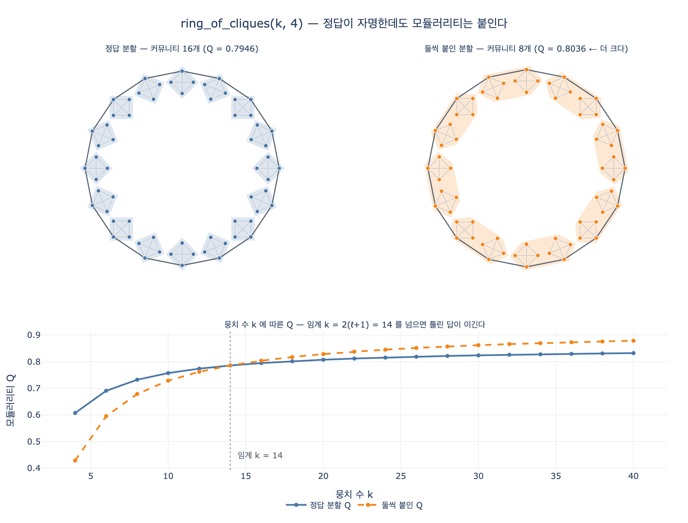

# `ring_of_cliques()`는 어떤 구조를 만드는가?

**답:** 크기 `size`인 완전 그래프(클리크) `k`개를 만들고, 각 뭉치를 다음 뭉치와 **다리 하나**로 이어 고리를 만든다. 정답 커뮤니티는 `k`개다.

---

## 1. 구조

10장 `code/ex5_resolution.py`의 생성기다.

```python
def ring_of_cliques(k, size):
    """크기 size 인 완전 그래프 k 개를 고리 모양으로 잇는다. 정답 커뮤니티 = k 개."""
    edges = []
    for c in range(k):
        base = c * size
        for i in range(size):
            for j in range(i + 1, size):
                edges.append((base + i, base + j))     # 뭉치 내부는 완전 그래프
        edges.append((base, ((c + 1) % k) * size))     # 다음 뭉치와 다리 하나
    return edges
```

읽는 법은 두 줄이다.

- **안쪽**: 뭉치 하나는 `size`개 노드가 서로 다 이어진 완전 그래프. 뭉치 안 밀도는 최대치(1.0).
- **바깥쪽**: 뭉치 `c`와 뭉치 `c+1` 사이에는 **엣지 딱 하나**. 마지막 뭉치는 `% k`로 첫 뭉치와 이어져 **고리**가 닫힌다.

즉 「안은 꽉 차고 밖은 실 한 가닥」인 뭉치가 원형으로 늘어선 그래프다. 커뮤니티가 무엇인지 사람이 눈으로 보면 논쟁의 여지가 없다 — **뭉치 하나가 커뮤니티 하나, 정답은 `k`개**.

## 2. 노드 수와 엣지 수

뭉치 하나의 내부 엣지 수를 $\ell = \binom{s}{2} = \dfrac{s(s-1)}{2}$라 두면 ($s$ = `size`):

$$N = k\,s, \qquad E = k\left(\binom{s}{2} + 1\right) = k(\ell + 1)$$

다리는 뭉치당 정확히 하나씩 `k`개가 추가된다(고리라서 `k`개 뭉치에 `k`개 다리).

| k | size | $\ell$ | N | E |
|---:|---:|---:|---:|---:|
| 4 | 3 | 3 | 12 | 16 |
| 4 | 4 | 6 | 16 | 28 |
| 8 | 4 | 6 | 32 | 56 |
| 16 | 4 | 6 | 64 | 112 |
| 24 | 5 | 10 | 120 | 264 |
| 32 | 6 | 15 | 192 | 512 |

책 예제가 쓰는 `size=4`면 $\ell = 6$, 엣지는 $7k$개다.

## 3. 왜 해상도 한계의 「표준 반례」인가

이 구조가 유명한 이유는 정답이 **자명한데도** 모듈러리티 최대화가 다른 답을 고르기 때문이다. Fortunato & Barthélemy가 2007년 PNAS 논문 [Resolution limit in community detection](https://www.pnas.org/doi/10.1073/pnas.0605965104)에서 바로 이 「클리크의 고리」로 논증했다.

모듈러리티는 이렇게 정의된다.

$$Q = \sum_{c}\left[\frac{L_c}{E} - \gamma\left(\frac{d_c}{2E}\right)^{2}\right]$$

$L_c$는 커뮤니티 $c$ 안의 엣지 수, $d_c$는 그 안 노드들의 차수 합, $\gamma$는 해상도 매개변수(기본 1).

두 후보 분할을 비교한다.

**(가) 정답 분할** — 뭉치 하나가 커뮤니티 하나, $k$개.
커뮤니티마다 $L_c = \ell$, $d_c = 2\ell + 2$ (다리 두 개가 붙어 있다). $E = k(\ell+1)$을 넣으면

$$Q_{\text{정답}} = k\left[\frac{\ell}{k(\ell+1)} - \left(\frac{2\ell+2}{2k(\ell+1)}\right)^2\right] = \frac{\ell}{\ell+1} - \frac{1}{k}$$

**(나) 둘씩 붙인 분할** — 이웃한 두 뭉치를 하나로 묶어 $k/2$개.
커뮤니티마다 $L_c = 2\ell + 1$ (두 뭉치 내부 + 사이 다리 하나), $d_c = 4\ell + 4$. 정리하면

$$Q_{\text{병합}} = \frac{2\ell+1}{2(\ell+1)} - \frac{2}{k}$$

차이만 남기면 놀랍도록 깔끔하다.

$$\boxed{\;Q_{\text{병합}} - Q_{\text{정답}} = \frac{1}{2(\ell+1)} - \frac{1}{k}\;}$$

**즉 $k > 2(\ell+1)$이면 틀린 답이 이긴다.** $E = k(\ell+1)$이므로 이 조건은

$$k > 2(\ell+1) \iff k^2 > 2E \iff k > \sqrt{2E}$$

와 같다. 논문의 유명한 진술 「내부 링크 수가 $\sqrt{2E}$ 정도보다 작은 모듈은 이웃과 병합될 수 있다」와 정확히 같은 말이다. 핵심은 **모듈러리티의 기대값 항 $(d_c/2E)^2$이 전체 그래프 크기 $E$를 참조한다**는 것 — 커뮤니티의 좋고 나쁨을 그 커뮤니티만 보고 판정하지 않고 전역 크기에 견주므로, 그래프가 커질수록 작은 뭉치는 「우연이라 보기 어려울 만큼 조밀」하다는 자격을 잃는다.

`size=4`($\ell=6$)면 임계는 $k > 14$. 실제 계산값:

| 뭉치 수 k | 정답 Q | 둘씩 붙인 Q | 이기는 쪽 |
|---:|---:|---:|---|
| 4 | 0.6071 | 0.4286 | 정답 |
| 8 | 0.7321 | 0.6786 | 정답 |
| 12 | 0.7738 | 0.7619 | 정답 |
| 14 | 0.7857 | 0.7857 | 동률(임계점) |
| 16 | 0.7946 | **0.8036** | 붙인 쪽 (틀림) |
| 24 | 0.8155 | **0.8452** | 붙인 쪽 (틀림) |
| 32 | 0.8259 | **0.8661** | 붙인 쪽 (틀림) |

`size`를 키우면 임계도 같이 커진다($k > 2(\ell+1) = s(s-1) + 2$).

| size | $\ell$ | 임계 k |
|---:|---:|---:|
| 3 | 3 | 8 |
| 4 | 6 | 14 |
| 5 | 10 | 22 |
| 6 | 15 | 32 |

**버그가 아니라 지표의 성질이다.** 루뱅·라이덴 같은 실제 알고리즘은 모듈러리티를 최대화하려 애쓰므로, 잘 동작할수록 오히려 이 병합을 더 확실히 저지른다. 실제로 `k=32, size=4`에 networkx의 루뱅을 돌리면 커뮤니티 32개가 아니라 15개(크기 8·12짜리)가 나온다.

## 4. `networkx.ring_of_cliques`와의 관계

networkx에 같은 이름의 생성기가 있다.

```python
import networkx as nx
G = nx.ring_of_cliques(num_cliques=8, clique_size=4)   # 32 노드, 56 엣지
```

- **같은 것**: 완전 그래프 `num_cliques`개 + 이웃끼리 단일 링크 → 고리. 노드/엣지 수 공식이 위와 동일하다.
- **다른 것**: 다리를 붙이는 노드가 다르다. 책 코드는 뭉치 $c$의 `base` → 뭉치 $c{+}1$의 `base`라서 **한 노드에 다리 두 개가 몰리고**, networkx는 `i*size + 1` → `(i+1)*size`라 **다리가 뭉치 안 서로 다른 두 노드에 나뉜다**. 그래서 두 그래프는 엄밀히는 동형(isomorphic)이 아니다. 다만 커뮤니티별 내부 엣지 수 $L_c$와 차수 합 $d_c$는 같으므로 **위 $Q$ 계산과 임계 조건은 그대로 성립한다**.
- **헷갈리기 쉬운 이웃**: `nx.connected_caveman_graph(l, k)`는 클리크를 잇기 위해 **클리크 내부 엣지를 하나 끊어 재배선**한다(엣지 수가 늘지 않음). `ring_of_cliques`는 아무것도 끊지 않고 **더하기만** 한다. networkx 문서가 Notes에서 굳이 이 차이를 명시해 둔다.

## 5. 그래서 실무에서는

해상도 한계는 「없애는」 게 아니라 「알고 다루는」 문제다.

1. **해상도 매개변수 $\gamma$를 올린다.** $\gamma$가 크면 잘게 나뉜다. 대신 적정값은 실험으로 찾아야 하고, 데이터가 바뀌면 다시 찾아야 한다.
2. **계층적으로 다시 돌린다.** 한 번 찾은 커뮤니티 안에서 알고리즘을 재귀적으로 다시 실행한다.
3. **다른 목적함수를 쓴다.** CPM(Constant Potts Model) 같은 목적함수는 전역 $E$를 참조하지 않아 해상도 한계가 없다. 라이덴 구현이 이를 지원한다.

셋 다 **「정답이 몇 개인지 모른다」**는 근본 문제를 풀지는 못한다. 그래서 10장의 결론은 이렇다 — 커뮤니티 개수는 알고리즘이 정하게 두지 말고 **쓰임새로** 정하라. 요약문을 만들 거면 요약 하나가 다룰 만한 크기로, 라우팅에 쓸 거면 라우팅 단위로.

## 6. 한 줄 정리

`ring_of_cliques(k, size)`는 **정답을 미리 알고 있는 그래프**를 만드는 도구다. 정답을 알기에, 알고리즘이 틀리는 순간과 그 임계($k > \sqrt{2E}$)를 정확히 짚어 보일 수 있다.

## 시각화


