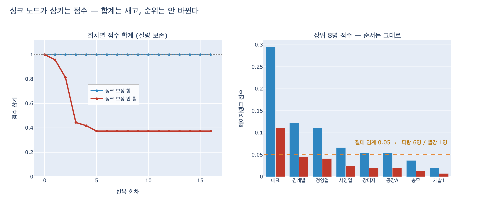

# 페이지랭크에서 싱크 노드는 어떤 문제를 일으키는가?

> **답**: 점수를 받기만 하고 흘려보내지 않아 매 회 점수가 새어 나간다.
> 순위는 잘 안 바뀌어 발견이 늦지만, 절대 임계를 쓰고 있다면 그 임계가 조용히 의미를 잃는다.

10장 10.2절 「페이지랭크와 새는 점수」, 예제 `ex2_pagerank.py` 의 핵심입니다.

---

## 1. 싱크 노드란

**나가는 엣지가 하나도 없는 노드**입니다. 문헌에서는 dangling node(막다른 노드)라고도 부릅니다.

- 웹: 어디로도 링크를 걸지 않는 페이지 (PDF, 이미지 페이지, 크롤링이 안 끝난 페이지)
- 조직 결재선: **대표**. 아무에게도 결재를 올리지 않습니다
- 인용 그래프: 참고문헌이 아직 파싱 안 된 논문
- 상품 그래프: 「같이 본 상품」이 비어 있는 신규 상품

10장의 `org.py` 에 있는 `REPORTS` 그래프(노드 20개)에서 싱크는 정확히 하나, `대표` 입니다.

---

## 2. 왜 점수가 새는가

감쇠 계수 $d = 0.85$ 일 때 페이지랭크의 표준 갱신식은 이렇습니다.

$$ PR_{t+1}(v) \;=\; \frac{1-d}{N} \;+\; d \sum_{u \to v} \frac{PR_t(u)}{|\text{out}(u)|} $$

여기에는 말하지 않은 가정이 하나 숨어 있습니다. **모든 노드가 자기 점수를 전부 내보낸다**는 것. 그 가정이 참이면 전체 합이 보존됩니다.

$$ \sum_v PR_{t+1}(v) \;=\; (1-d) \;+\; d \sum_u PR_t(u) \;=\; (1-d) + d = 1 $$

그런데 $|\text{out}(u)| = 0$ 인 싱크 노드는 저 안쪽 합에 **아예 등장하지 않습니다**. 그 노드가 들고 있던 점수는 다음 회로 넘어갈 통로가 없어서 그냥 사라집니다.

$$ \sum_v PR_{t+1}(v) \;=\; (1-d) \;+\; d\Big(S_t - \underbrace{\textstyle\sum_{u \in \text{sink}} PR_t(u)}_{\text{샌 양}}\Big) $$

랜덤 서퍼 비유로는, **막다른 페이지에 도착한 서퍼가 증발해 버리는** 모형입니다. 원래 모형에서는 서퍼가 무작위 페이지로 순간이동해야 하는데, 그 규칙이 빠진 것이죠.

`REPORTS` 그래프에서 회차별 합계를 찍어 보면 이렇습니다.

| 회차 | 보정 함 | 보정 안 함 | 그 회에 샌 양 |
|---|---|---|---|
| 0 | 1.000000 | 1.000000 | — |
| 1 | 1.000000 | 0.957500 | 0.042500 |
| 2 | 1.000000 | 0.813000 | 0.144500 |
| 3 | 1.000000 | 0.444525 | 0.368475 |
| 4 | 1.000000 | 0.418425 | 0.026100 |
| 5 | 1.000000 | 0.374054 | 0.044371 |
| 6 | 1.000000 | 0.374054 | 0.000000 |

확률분포여야 할 값의 합이 **0.374** 에 눌러앉습니다. 63%가 증발했습니다.

> 결재선은 사이클이 없는 DAG 라서 6회 만에 딱 멈춥니다. 3회차에 0.368 이 한꺼번에 빠지는 건 팀장들이 모아 온 점수가 대표에게 도착한 회차예요. 실제 웹 그래프처럼 사이클이 있으면 훨씬 완만하게, 여러 회에 걸쳐 샙니다.

---

## 3. 순위는 왜 «잘 안 바뀌는가»

카드의 답은 「순위는 잘 안 바뀐다」인데, 이 보정 방식에 한해서는 **더 강한 말**을 할 수 있습니다. 순위가 **아예 안 바뀝니다.**

두 반복식의 고정점을 나란히 써 보면 이유가 보입니다. $M$ 을 전이 행렬, $e$ 를 1 벡터, $L$ 을 싱크가 들고 있는 질량이라 하면

$$ r_{\text{샘}} = \tfrac{1-d}{N} e + d M\, r_{\text{샘}}, \qquad
   r_{\text{보정}} = \Big(\tfrac{1-d}{N} + \tfrac{dL}{N}\Big) e + d M\, r_{\text{보정}} $$

고정점에서 $L$ 은 그냥 상수이므로, 둘 다 $r = \alpha (I - dM)^{-1} e$ 라는 **똑같은 꼴**이고 $\alpha$ 만 다릅니다. 따라서

$$ r_{\text{샘}} \;=\; \Big(\textstyle\sum_v r_{\text{샘}}(v)\Big)\, \cdot\, r_{\text{보정}} $$

**모든 노드가 정확히 같은 배율로 줄어듭니다.** 실제로 계산해 보면 비율이 소수점 아래까지 똑같습니다.

| 순위 | 보정 함 | 점수 | 보정 안 함 | 점수 | 비율 |
|---|---|---|---|---|---|
| 1 | 대표 | 0.2953 | 대표 | 0.1105 | 0.374 |
| 2 | 김개발 | 0.1223 | 김개발 | 0.0458 | 0.374 |
| 3 | 정영업 | 0.1103 | 정영업 | 0.0413 | 0.374 |
| 4 | 서영업 | 0.0661 | 서영업 | 0.0247 | 0.374 |
| 5 | 강디자 | 0.0541 | 강디자 | 0.0203 | 0.374 |

순위가 그대로인 자리: **20/20**. `max |rank_bad/합계 − rank_fix| = 1.5e-13` 으로 부동소수점 오차 수준입니다.

이게 이 버그가 **무서운 이유**입니다. 대시보드의 「중요 인물 Top 10」은 티끌만큼도 이상해 보이지 않습니다. 예외도 안 나고, 로그도 안 남고, 테스트도 통과합니다. 순위만 검증하는 테스트로는 절대 못 잡습니다.

---

## 4. 조용히 무너지는 것 — 절대 임계

「페이지랭크 **0.05 이상**이면 핵심 인물로 보고한다」 같은 **절댓값 규칙**을 코드에 박아 두었다면, 전체 질량이 37%로 줄어든 순간 그 규칙은 완전히 다른 뜻이 됩니다.

| 임계 | 보정 함 | 보정 안 함 |
|---|---|---|
| 0.10 | 3명 (김개발, 대표, 정영업) | **1명** (대표) |
| 0.05 | 6명 (강디자, 공장A, 김개발, 대표, 서영업, 정영업) | **1명** (대표) |
| 0.02 | 20명 (전원) | **6명** |

임계 0.05 규칙이 6명 → 1명이 됩니다. **순위표는 완벽히 동일한데 보고 대상만 사라집니다.**

현업에서 이런 절대 임계가 박히는 자리:

- 추천 후보 필터 (`WHERE pagerank > 0.001`)
- 알림/에스컬레이션 트리거
- 스팸·어뷰징 점수 컷오프
- 캐시 우선순위, 크롤링 예산 배분
- 대시보드의 「중요도」 색 구간

싱크 노드가 하나 늘거나 그래프가 커지면 새는 양도 달라지므로, **어제 통하던 임계가 오늘은 다른 인원 수를 뽑습니다.** 코드는 한 줄도 안 바뀌었는데요.

---

## 5. 보정하는 방법

| 방법 | 내용 | 특징 |
|---|---|---|
| **되돌리기 (재분배)** | 싱크가 든 질량을 전 노드에 $1/N$ 로 나눠 준다 | 가장 흔함. 싱크에서 전체로 가는 가상 엣지를 그은 것과 동치 |
| **자기 루프** | 싱크에 $v \to v$ 엣지를 단다 | 간단하지만 싱크 점수가 부풀려진다 |
| **끝에 정규화** | 새는 대로 두고 마지막에 합계로 나눈다 | 균등 재분배와 **결과가 정확히 같다**(3절). 다만 반복 중 합계로 수렴 판정을 못 하고, 개인화 벡터가 균등하지 않으면 1번과 갈라진다 |
| **싱크 제거** | 싱크를 빼고 계산 후 다시 붙인다 | 싱크를 제거하면 새 싱크가 생겨서 반복해야 함 |

`ex2_pagerank.py` 가 쓰는 건 첫 번째입니다.

```python
leaked = sum(rank[v] for v in sinks) if fix_sinks else 0.0
...
if fix_sinks:
    for v in nodes:
        nxt[v] += damping * leaked / n     # 샌 점수를 고루 되돌린다
```

**실무 확인법은 어이없을 만큼 단순합니다. 점수 합계를 찍어 보고 1.0 인지 봅니다.**

```python
assert abs(sum(rank.values()) - 1.0) < 1e-6, "싱크 노드가 점수를 삼키고 있다"
```

NetworkX 를 비롯한 주요 구현은 대부분 재분배를 합니다. 하지만 직접 짠 반복문, 일부 그래프 DB 내장 함수, 분산 처리용 자체 구현에서는 빠져 있는 경우가 있습니다. 라이브러리를 바꿀 때 이 부분을 확인하세요.

---

## 6. 한 줄 정리

싱크 노드는 **결과를 틀리게 만들지 않습니다. 스케일을 바꿉니다.** 그래서 순위 기반으로 쓰면 아무 문제가 없고, 절댓값 기반으로 쓰면 조용히 무너집니다. 페이지랭크 점수를 임계와 비교하는 코드가 어딘가에 있다면, 그 위에 `sum == 1.0` 검사를 하나 두는 게 좋습니다.

---

## 참고

- [PageRank 원 논문 (Page & Brin, 1999)](http://ilpubs.stanford.edu:8090/422/) — dangling node 처리를 명시하고 있다
- [NetworkX centrality 문서](https://networkx.org/documentation/stable/reference/algorithms/centrality.html)
- 10장 예제: `content/ch10/code/ex2_pagerank.py`, `content/ch10/code/org.py`

---

## 시각화



왼쪽은 회차별 전체 점수 합계입니다. 보정을 끄면 1.0 에서 미끄러져 0.374 에 눌러앉습니다.
오른쪽은 상위 8명의 점수입니다. 막대 **높이만** 낮아지고 **순서는 완전히 동일**해서, 순위표만 보면 아무것도 눈치챌 수 없습니다. 주황 점선이 절대 임계 0.05 — 파란 막대는 6개가 넘지만 빨간 막대는 1개만 넘습니다.
