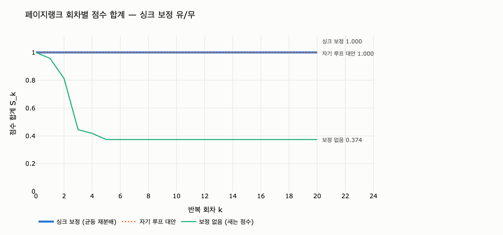

# 페이지랭크의 싱크 보정은 어떻게 구현하는가?

> **답.** 나가는 엣지가 없는 노드들의 점수 합(`leaked`)을 구해, 감쇠 계수를 곱한 뒤 전체 노드에 균등하게 다시 나눠 준다.

10장 「10.2 페이지랭크와 새는 점수」의 핵심입니다. 코드로는 네 줄이지만, **왜 하필 `damping * leaked / n` 인가**를 따라가 보면 페이지랭크가 무엇을 세는 모형인지가 그대로 드러납니다.

---

## 1. 무엇이 새는가

10장 `org.py` 의 `REPORTS` 는 「누가 누구에게 결재를 올리는가」의 유향 그래프입니다. 결재선을 따라 올라가면 모두 결국 `대표` 에서 멈춥니다.

```
공장C → 공장A → 서영업 → 정영업 → 대표
청소담당 → 총무 → 대표
개발1..6 → 김개발 → 대표
```

노드 20개 중 나가는 엣지가 하나도 없는 노드는 `대표` 하나뿐입니다. 이런 노드를 **싱크(sink)** 또는 **댕글링 노드(dangling node)** 라고 부릅니다.

페이지랭크 한 회차의 갱신은 「내 점수의 $d$ 배를 내가 가리키는 이웃들에게 똑같이 나눠 준다」입니다. 그런데 싱크는 **나눠 줄 상대가 없습니다.** 그 몫은 누구에게도 가지 않고 그냥 사라집니다. 이게 「새는 점수」입니다.

$$
L_k \;=\; \sum_{u \in \mathrm{Sink}} r_k(u)
$$

`expy.py` 를 돌리면 그 결과가 이렇게 나옵니다.

```
[보정 함]     반복 68회  합계 1.000000
[보정 안 함]  반복  6회  합계 0.374054
```

합계가 $1.0$ 이 아니라 $0.374$ 입니다. 확률 분포여야 할 값이 확률 분포가 아니게 된 겁니다.

> **주의 — 0으로 사라지지는 않는다.** 흔한 오해입니다. 매 회차 텔레포트 항 $(1-d)/n$ 이 총 $1-d$ 만큼을 새로 주입하므로, 합계는 $0$ 이 아니라 **$1$ 보다 작은 어떤 값에 눌러앉습니다.** 이 데이터에서는 $0.374054$ 입니다. 조용히 눌러앉기 때문에 더 발견하기 어렵습니다.

---

## 2. 구현 — 네 줄

10장 `ex2_pagerank.py` 의 해당 부분입니다.

```python
for it in range(rounds):
    nxt = {v: (1 - damping) / n for v in nodes}          # ① 텔레포트
    leaked = sum(rank[v] for v in sinks) if fix_sinks else 0.0   # ② 새는 몫을 모은다
    for v in nodes:
        if out[v]:
            share = damping * rank[v] / len(out[v])      # ③ 평소의 전파
            for w in out[v]:
                nxt[w] += share
    if fix_sinks:
        for v in nodes:
            nxt[v] += damping * leaked / n               # ④ 감쇠 곱해 균등 재분배
    rank = nxt
```

정리하면 갱신식은 이렇습니다.

$$
r_{k+1}(v) \;=\; \underbrace{\frac{1-d}{n}}_{\text{텔레포트}}
  \;+\; \underbrace{d \sum_{u \to v} \frac{r_k(u)}{|\mathrm{out}(u)|}}_{\text{엣지 전파}}
  \;+\; \underbrace{d \cdot \frac{L_k}{n}}_{\text{싱크 보정}}
$$

구현상 챙길 점 세 가지입니다.

1. **`leaked` 는 회차 시작 시점의 `rank` 로 계산한다.** `nxt` 를 채워 가면서 섞어 쓰면 안 됩니다. 한 회차는 「직전 벡터 → 다음 벡터」의 동시 갱신이어야 합니다.
2. **`leaked` 는 매 회차 새로 구한다.** 싱크 집합은 고정이지만 그 노드들이 들고 있는 점수는 회차마다 달라집니다.
3. **싱크 집합은 그래프가 안 변하는 한 루프 밖에서 한 번만 구한다.** `sinks = [v for v in nodes if not out[v]]` 는 루프 안에 둘 이유가 없습니다.

비용은 회차당 $O(n)$ 입니다. 원래 전파가 $O(|E|)$ 이므로 사실상 공짜입니다.

---

## 3. 왜 합계가 정확히 $1.0$ 으로 돌아오는가

노드별 값이 아니라 **합계만** 따로 더해 보면 유도가 끝납니다. $S_k = \sum_v r_k(v)$ 라고 둡시다.

### 보정이 없을 때

세 항을 각각 $n$ 개 노드에 대해 더합니다.

- 텔레포트 항: $n \times \dfrac{1-d}{n} = 1-d$
- 엣지 전파 항: 노드 $u$ 가 내보낸 $d\,r_k(u)$ 는 이웃들에게 쪼개져도 **총합은 보존**됩니다. 단, 싱크는 내보내지 못하므로 그 몫이 빠집니다. 따라서 $d\,(S_k - L_k)$

$$
S_{k+1} \;=\; (1-d) \;+\; d\,(S_k - L_k)
$$

싱크가 있어 $L_k > 0$ 인 한 매 회차 $1$ 아래로 밀려납니다. 고정점 $S^\ast$ 는 $S^\ast = (1-d) + d(S^\ast - L^\ast)$ 를 만족하는 값입니다. 실제 수치로 검산하면

$$
0.15 + 0.85 \times (0.374054 - 0.110461) = 0.374054 \quad \checkmark
$$

`expy.py` 는 이 재귀식의 예측값과 실측값을 소수점 9자리까지 나란히 찍어 확인합니다.

```
  k     예측 S_(k+1)     실측 S_(k+1)
  0    0.957500000    0.957500000
  1    0.813000000    0.813000000
  2    0.444525000    0.444525000
  3    0.418424688    0.418424688
  4    0.374054156    0.374054156
```

### 보정을 넣으면

보정 항 $d\,L_k/n$ 을 $n$ 개 노드 전부에 얹으므로, 더해지는 총량은 정확히

$$
n \times \frac{d\,L_k}{n} \;=\; d\,L_k
$$

즉 **빠져나간 것과 글자 그대로 같은 양**이 되돌아옵니다.

$$
S_{k+1} \;=\; (1-d) \;+\; d\,(S_k - L_k) \;+\; d\,L_k \;=\; (1-d) + d\,S_k
$$

$S_0 = 1$ 이면 $S_1 = (1-d) + d \cdot 1 = 1$ 이고, 귀납적으로 모든 $k$ 에서 $S_k = 1$ 입니다. 게다가 이 사상은 $|d| < 1$ 이라 **축약 사상**이므로, 초기값이 $1$ 이 아니어도 $S_k \to 1$ 로 수렴합니다. 초기화를 대충 해도 자동으로 복구된다는 뜻입니다.

$L_k$ 가 **어떤 값이든** 상쇄된다는 점이 핵심입니다. 싱크가 몇 개든, 각각 얼마를 들고 있든, 회차마다 값이 어떻게 출렁이든 보정식은 항상 정확히 맞아떨어집니다.

---

## 4. 왜 $d$ 를 곱하는가 — 가장 흔한 실수

`leaked / n` 을 그냥 더하고 싶은 유혹이 있습니다. 「싱크가 $L_k$ 를 삼켰으니 $L_k$ 를 돌려주면 되지 않나?」

아닙니다. 싱크가 잃은 것은 자기 점수 $L_k$ **전부**가 아닙니다. 갱신식을 다시 보면, 어떤 노드든 자기 점수 중 이웃에게 흘려보내는 몫은 $d\,r_k(u)$ 이고 나머지 $(1-d)\,r_k(u)$ 는 애초에 아무에게도 안 갑니다 — 그 자리는 텔레포트 항 $(1-d)/n$ 이 이미 담당합니다. 그러니까 **잃어버린 것은 $d\,L_k$ 뿐**입니다.

$d$ 를 빼먹으면 있지도 않던 $(1-d)L_k$ 를 매 회차 새로 만들어 내는 셈이고, 합계는 이번엔 반대로 $1$ 을 **넘어갑니다.**

```
d 를 빼먹은 «보정»의 합계: 1.400589  (1.0 이 아니다)
```

$1.4$ 라는 숫자도 유도됩니다. 잘못된 갱신의 합계 재귀식은 $S_{k+1} = (1-d) + d(S_k - L_k) + L_k = (1-d) + d\,S_k + (1-d)L_k$ 이므로, 고정점에서 $L$ 만큼 과잉이 누적됩니다.

> 합계가 $1$ 을 **넘는** 버그는 그나마 낫습니다. 눈에 띄니까요. $1$ 보다 **작아지는** 원래 버그가 더 위험합니다.

---

## 5. 보정은 순위를 바꾸지 않는다 — 그래서 발견이 늦다

10장 요약의 「순위는 안 바뀌어서 발견이 늦지만, 절대 임계를 쓰고 있다면 조용히 의미를 잃습니다」가 이 이야기인데, 사실 이건 **경향이 아니라 정리**입니다.

$M$ 을 전파 행렬(싱크 열은 $0$)이라 두면 두 고정점은 이렇습니다.

$$
r^\ast = \tfrac{1-d}{n}\mathbf{1} + d\,M r^\ast \quad (\text{보정 없음}), \qquad
q = \tfrac{1-d}{n}\mathbf{1} + d\,M q + \tfrac{d L_q}{n}\mathbf{1} \quad (\text{보정})
$$

$q = r^\ast / S^\ast$ 라고 놓고 대입해 보면, 필요한 조건은 딱 하나입니다.

$$
\frac{1-d}{n} + \frac{d\,L^\ast}{n\,S^\ast} \;=\; \frac{1-d}{n\,S^\ast}
\quad\Longleftrightarrow\quad
(1-d)\,S^\ast + d\,L^\ast \;=\; 1-d
$$

그런데 이 등식은 3절에서 이미 얻은 합계 재귀식의 고정점 조건 $S^\ast = (1-d) + d(S^\ast - L^\ast)$ 를 정리한 것과 **똑같습니다.** 따라서 항상 성립합니다.

$$
\boxed{\;q \;=\; \frac{r^\ast}{S^\ast}\;}
$$

**싱크 보정을 한 결과는 보정 안 한 결과를 합계로 나눈 것과 정확히 같습니다.** `expy.py` 로 확인하면 최대 차이가 $5.6 \times 10^{-17}$, 부동소수점 오차 수준입니다.

여기서 나오는 실무적 결론이 두 개입니다.

- **순위만 볼 거면 보정 유무는 아무 상관이 없습니다.** 상대 순서가 수학적으로 동일합니다. 그래서 「1등 뽑기」로 검수하면 버그가 절대 안 잡힙니다.
- **절대 임계를 쓰면 즉시 망가집니다.** 모든 점수가 일률적으로 $S^\ast = 0.374$ 배로 축소되니까요. 「0.05 이상만 추천」 같은 규칙은 실질적으로 「0.134 이상만 추천」이 되어 버립니다. 10장 예제의 `강디자` 는 보정하면 $0.0541$, 안 하면 $0.0203$ 입니다.

> **단, 이 정리는 텔레포트 분포와 재분배 분포가 같을 때만 성립합니다.** 개인화 벡터(`personalization`)와 dangling 분포가 다르면 두 항이 서로 다른 벡터라 상쇄가 깨지고, 그때는 순위도 실제로 달라집니다.

---

## 6. 대안 A — 싱크에서 모든 노드로 가는 엣지를 실제로 그리기

원논문(Page & Brin)의 원래 서술은 「싱크에서 전체 노드로 향하는 가상의 엣지를 놓는다」입니다. 싱크 $u$ 에 나가는 엣지 $n$ 개가 생기면 흘려보내는 몫 $d\,r_k(u)$ 가 $n$ 등분되어 모두에게 $d\,r_k(u)/n$ 씩 갑니다.

$$
\sum_{u \in \mathrm{Sink}} \frac{d\,r_k(u)}{n} \;=\; \frac{d\,L_k}{n}
$$

우리가 쓴 `damping * leaked / n` 과 **완전히 같은 식**입니다. 즉 `leaked` 보정은 새로운 아이디어가 아니라, 그 $O(n \cdot |\mathrm{Sink}|)$ 개의 가상 엣지를 **만들지 않고 한 줄로 접은 최적화**입니다.

`expy.py` 는 실제로 엣지를 다 그려서 비교합니다.

```
«싱크→전 노드 엣지» 결과와 «leaked 보정» 결과의 최대 차이: 5.551e-17
엣지 수: 19 → 39  (n=20 개가 추가됨)
```

노드 20개짜리 장난감에서는 엣지가 19개에서 39개가 되는 정도지만, 웹 규모 그래프에서 싱크가 수억 개라면 이 행렬은 밀집 행렬이 되어 아예 메모리에 올라가지 않습니다. **실무에서 이 방식을 쓸 이유는 없습니다.** 다만 「보정식이 어디서 왔는가」를 이해할 때 가장 좋은 그림입니다.

---

## 7. 대안 B — 싱크에 자기 자신으로 가는 엣지를 넣기

「싱크가 문제라면 싱크를 없애 버리자」는 발상입니다. `대표 → 대표` 자기 루프를 넣으면 나가는 엣지가 생기니 싱크가 아니게 되고, 합계는 자동으로 보존됩니다. 구현도 한 줄입니다.

```python
for v in nodes:
    if not out[v]:
        out[v].append(v)      # 자기 루프
```

**합계는 확실히 $1.0$ 이 됩니다. 그런데 답이 달라집니다.**

| 노드 | 보정(균등 재분배) | 자기 루프 | 보정 없음 |
|---|---:|---:|---:|
| 대표 | **0.2953** | **0.7364** | 0.1105 |
| 김개발 | 0.1223 | 0.0458 | 0.0458 |
| 정영업 | 0.1103 | 0.0413 | 0.0413 |
| 서영업 | 0.0661 | 0.0247 | 0.0247 |
| 강디자 | 0.0541 | 0.0203 | 0.0203 |
| 공장A | 0.0541 | 0.0203 | 0.0203 |
| **합계** | **1.0000** | **1.0000** | **0.3741** |

두 가지를 보세요.

**(1) `대표` 혼자 전체의 73.6% 를 가져갑니다.** 균등 재분배에서는 29.5% 입니다. 「가장 중요한 노드」의 크기가 두 배 넘게 부풀었습니다. 합계가 $1.0$ 이라고 해서 「고쳤다」고 판단하면 안 된다는 뜻입니다.

**(2) 자기 루프 열과 보정 없음 열의 비싱크 값이 완전히 같습니다.** `김개발` 은 양쪽 다 $0.0458$ 입니다. 당연합니다 — 자기 루프는 싱크가 내보낸 점수를 **싱크 자신에게만** 돌려주므로, 나머지 노드들의 갱신식이 보정 없는 경우와 한 글자도 다르지 않습니다. 즉 자기 루프는 「새는 점수를 되돌린」 게 아니라 **「새는 점수를 싱크 안에 가둔」** 것입니다.

모형 차원에서 보면 이렇습니다. 페이지랭크는 랜덤 서퍼 모형입니다.

- **균등 재분배** = 「막다른 페이지에 도달하면 주소창에 아무 페이지나 쳐서 점프한다」 — 원래 모형 그대로
- **자기 루프** = 「막다른 페이지에서 새로고침을 무한히 누른다」 — 흡수벽에 가까운 **다른 마르코프 연쇄**

두 번째는 틀렸다기보다 **다른 질문에 답하는 것**입니다. 그리고 그 다른 답이 보통은 원하는 답이 아닙니다.

---

## 8. `networkx.pagerank` 의 dangling 처리

`nx.pagerank` 는 이 보정을 **기본으로 켜 놓습니다.** 별도 인자를 주지 않아도 됩니다. 실제 구현 핵심부(`_pagerank_python`)입니다.

```python
dangling_nodes = [n for n in W if W.out_degree(n, weight=weight) == 0.0]

for _ in range(max_iter):
    xlast = x
    x = dict.fromkeys(xlast.keys(), 0)
    danglesum = alpha * sum(xlast[n] for n in dangling_nodes)     # = d * leaked
    for n in x:
        for _, nbr, wt in W.edges(n, data=weight):
            x[nbr] += alpha * xlast[n] * wt
        x[n] += danglesum * dangling_weights.get(n, 0) + (1.0 - alpha) * p.get(n, 0)
```

우리 구현과 한 줄씩 대응합니다.

| `nx.pagerank` | `expy.py` / `ex2_pagerank.py` |
|---|---|
| `dangling_nodes` (가중 출차수 $0$) | `sinks = [v for v in nodes if not out[v]]` |
| `alpha` | `damping` |
| `danglesum = alpha * sum(xlast[n] ...)` | `damping * leaked` |
| `dangling_weights` (기본 = 개인화 벡터 `p`, 그 기본 = 균등 $1/n$) | `/ n` |
| `(1.0 - alpha) * p.get(n, 0)` | `(1 - damping) / n` |

즉 **기본 동작이 우리 식과 수학적으로 동일합니다.** 실측으로도 확인됩니다.

```
networkx 결과 합계: 1.000000
직접 구현(leaked 보정)과의 최대 차이: 1.881e-13
```

차이 $10^{-13}$ 은 수렴 판정 기준(`tol`)이 서로 달라 생기는 잔차일 뿐입니다.

다른 점은 **분배 비율을 바꿀 수 있다**는 것 하나입니다. `dangling=` 인자에 딕셔너리를 주면 「막다른 길에 빠졌을 때 어디로 점프하는가」를 균등이 아닌 임의 분포로 지정할 수 있습니다. 그리고 이걸로 7절의 자기 루프를 재현할 수 있습니다.

```python
dang = {v: (1.0 if v == "대표" else 0.0) for v in NODES}
nx.pagerank(G, alpha=0.85, dangling=dang)
```

```
dangling=대표 100% 일 때 대표 점수: 0.7364 (자기 루프 구현: 0.7364)
```

소수점 넷째 자리까지 같습니다. **자기 루프는 dangling 분배를 싱크 자신에게 100% 몰아준 특수 경우**입니다. 즉 균등 재분배와 자기 루프는 「맞고 틀림」이 아니라 같은 틀 안의 서로 다른 선택지이고, 페이지랭크의 원래 의미에 맞는 기본값이 균등 쪽인 것입니다.

주의할 API 동작 하나 — `personalization=` 을 주면 `dangling` 의 기본값도 그 개인화 분포를 따라갑니다(균등이 아니라). 개인화 페이지랭크에서는 이게 보통 원하는 동작이지만, 5절의 「순위 불변」 정리는 이 경우에도 여전히 성립합니다(두 분포가 같으니까). 반대로 `personalization` 과 `dangling` 을 **서로 다르게** 주면 그때는 순위가 실제로 달라집니다.

### 다른 라이브러리는?

10장 본문의 「라이브러리를 쓸 때도 이 보정을 하는지 확인하는 게 좋다. 대부분 한다. 안 하는 것도 있다」가 여기에 걸립니다. 확인할 것은 두 가지뿐입니다.

1. **dangling 보정을 하는가?** — 싱크가 있는 그래프를 넣고 `sum(scores)` 가 $1.0$ 인지 보면 30초에 끝납니다.
2. **한다면 어느 분포로 되돌리는가?** — 균등인가, 개인화 벡터인가, 아니면 자기 루프처럼 싱크 자신인가.

---

## 9. 한눈에 보기

| 방식 | 합계 | 구현 비용 | 순위 | 의미 |
|---|---|---|---|---|
| 보정 없음 | $S^\ast < 1$ 에 눌러앉음 | — | 정답과 동일 | 절대 임계가 조용히 망가짐 |
| **`leaked` 균등 재분배** | $1.0$ | 회차당 $O(n)$, 한 줄 | 기준 | 랜덤 서퍼 모형 그대로. **표준** |
| 싱크 → 전 노드 가상 엣지 | $1.0$ | 엣지 $+O(n \cdot \lvert \mathrm{Sink} \rvert)$ | 위와 동일 | 수학적으로 동일, 웹 규모에서 비현실적 |
| 싱크에 자기 루프 | $1.0$ | 한 줄 | **왜곡됨** | 다른 마르코프 연쇄. 싱크가 점수를 쌓음 |
| `nx.pagerank` 기본값 | $1.0$ | 무료 | 기준과 동일 | `leaked` 균등 재분배와 같음 |

**외울 문장 하나.** 싱크가 잃은 것은 $L_k$ 가 아니라 $d\,L_k$ 이고, 그걸 전체에 $n$ 등분해 얹으면 합계가 정확히 상쇄되어 $1$ 로 돌아온다. 그리고 그 보정은 **모든 점수를 같은 비율로 키울 뿐 순위는 건드리지 않는다** — 그래서 순위 검수로는 절대 못 잡는다.

---

## 시각화

회차별 점수 합계 $S_k$ 를 세 가지 방식으로 추적한 그림입니다. 보정을 켜면 첫 회차부터 $1.0$ 에 붙어 움직이지 않고, 자기 루프도 합계만 보면 $1.0$ 을 유지합니다(7절에서 봤듯 값 자체는 왜곡되어 있습니다). 보정이 없으면 몇 회차 만에 $0.374$ 로 주저앉고 그대로 눌러앉습니다.


