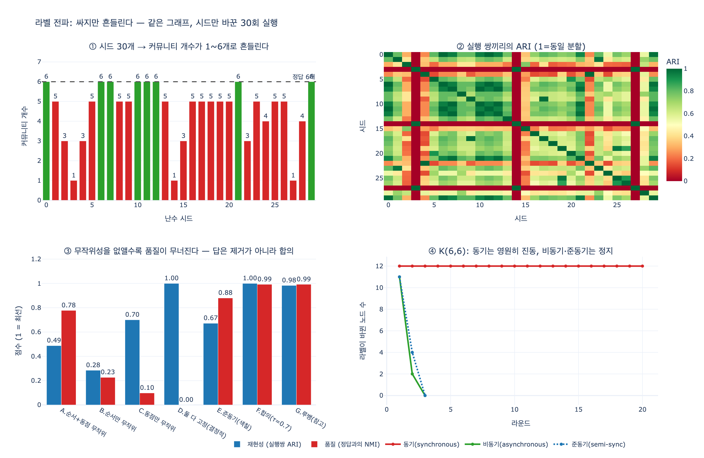

# 라벨 전파의 장단점은 무엇인가?

> **답:** 빠르지만 시드에 따라 결과가 달라진다. 같은 데이터로 어제와 오늘 다른 커뮤니티가 나오면 보고서를 쓸 수 없다.

10장 4절 「뭉치 찾기, 그리고 매번 다른 답」의 핵심 카드다. 이 카드는 알고리즘의 성능 이야기가 아니라 **운영 가능성(operability)** 이야기다. 아무리 빨라도 매번 답이 바뀌면 조직에 보고할 수 없다.

---

## 1. 라벨 전파는 무엇인가

Raghavan, Albert, Kumara(2007)가 제안한 커뮤니티 탐지 알고리즘이다. 원논문은 [Near linear time algorithm to detect community structures in large-scale networks](https://arxiv.org/abs/0709.2938).

절차가 놀랄 만큼 짧다.

1. 모든 노드에 **서로 다른 라벨**을 준다. $L_0(v) = v$
2. 노드를 **무작위 순서**로 하나씩 방문하면서, 이웃에서 가장 많이 보이는 라벨로 자기 라벨을 바꾼다.
   $$L(v) \;\leftarrow\; \arg\max_{\ell} \; \bigl|\{\, u \in N(v) \;:\; L(u) = \ell \,\}\bigr|$$
3. 최댓값을 가진 라벨이 여럿이면 그중 **하나를 무작위로** 고른다.
4. 모든 노드가 이미 "이웃 최다 라벨"을 갖고 있으면 멈춘다. 같은 라벨을 가진 노드 집합이 커뮤니티다.

목적함수가 없다. 최적화하는 값이 없고, 커뮤니티 개수를 미리 정할 필요도 없다. 파라미터가 사실상 **하나도 없다**. 모듈러리티 계열이 해상도 $\gamma$를 요구하는 것과 대조된다.

10장 예제 `ex4_communities.py`의 `label_propagation()`이 정확히 이 절차다.

---

## 2. 장점 — 싸다. 그것도 아주 싸다

### $O(m)$ 준선형

한 라운드에서 각 노드 $v$는 자기 이웃 목록을 한 번 훑는다. 전체 비용은

$$\sum_{v \in V} \deg(v) = 2m$$

즉 **라운드당 $O(m)$**이다. 원논문 제목의 "near linear time"이 이 뜻이다. 라운드 수는 이론적으로 보장되지 않지만 실측상 대부분 5회 안팎에서 정리된다. 원논문은 노드의 95%가 5회 이내에 최종 라벨에 도달함을 보고했다.

`expy.py`의 3절 실측:

| n | m | 라운드 | 전체 | 라운드당 |
|---:|---:|---:|---:|---:|
| 240 | 1,681 | 4 | 2.7 ms | 0.407 µs/간선 |
| 1,200 | 8,258 | 8 | 27.0 ms | 0.409 µs/간선 |
| 6,000 | 41,571 | 16 | 291.3 ms | 0.438 µs/간선 |

노드가 25배로 늘어도 **라운드당 간선 하나에 드는 시간은 0.41 µs로 상수**다. 순수 파이썬으로도 이 정도다.

### 그 밖의 장점

- **파라미터가 없다.** 커뮤니티 개수도 알고리즘이 정한다.
- **국소적이다.** 각 노드가 이웃만 보므로 Pregel/GraphX 같은 분산 프레임워크에 그대로 얹힌다. 실제로 대규모 그래프 시스템에서 기본 제공되는 커뮤니티 알고리즘은 대개 라벨 전파다.
- **증분 갱신이 자연스럽다.** 그래프가 조금 바뀌면 영향받은 이웃만 다시 돌리면 된다.

억 단위 간선에서 "일단 뭉치가 어디 있는지 훑어보자"에 이보다 나은 도구는 드물다.

---

## 3. 단점 — 비결정적이다. 원인은 정확히 둘

같은 그래프, 같은 코드, 같은 파라미터인데 시드만 바꾸면 답이 달라진다. 무작위성이 들어가는 자리는 두 곳뿐이다.

### (a) 방문 순서 무작위화

라운드마다 노드 방문 순서를 섞는다. 비동기 갱신이라 **먼저 갱신된 노드의 새 라벨이 같은 라운드 안에서 뒤 노드에게 즉시 영향을 준다.** 순서가 바뀌면 전파 경로가 바뀌고, 경계에 걸친 노드들의 귀속이 바뀐다.

### (b) 동점 라벨 임의 선택

이웃 라벨 개수가 동점일 때 하나를 무작위로 고른다. 경계 노드에서 동점은 흔하다. 초기 라운드에서는 모든 라벨의 세력이 같아 사방에서 동점이 발생한다.

### 실측 — 시드만 바꿔 30번

`expy.py` 5~6절, 150노드 planted-partition 그래프(정답 커뮤니티 6개):

```
커뮤니티 개수 분포: {1: 3, 3: 4, 4: 2, 5: 13, 6: 8}
개수 범위 1 ~ 6 (평균 4.53)
정답과의 NMI: 최소 0.000 / 평균 0.778 / 최대 1.000
실행 쌍 ARI: 평균 0.488  최소 0.000
완전히 동일한 분할(ARI=1) 쌍 비율: 2.3%
```

**커뮤니티가 1개에서 6개까지 나온다.** 30번 실행 중 두 번이 정확히 같은 분할을 낸 경우는 2.3%뿐이다. 최악의 시드에서는 그래프 전체가 한 덩어리로 뭉개진다(거대 커뮤니티, monster community). 이러면 "우리 조직은 5개 팀입니다"라고 쓸 수 없다. 내일 돌리면 1개일 수도 있으니까.

흔들림을 재는 자로는 **NMI**(정규화 상호정보량)와 **ARI**(조정 랜드 지수)를 쓴다. 분할 비교에서 라벨 이름은 의미가 없으므로 이름에 무관한 지표가 필요하다.

$$\mathrm{NMI}(X,Y) = \frac{2\,I(X;Y)}{H(X)+H(Y)}, \qquad \mathrm{ARI} = \frac{\mathrm{RI} - \mathbb{E}[\mathrm{RI}]}{\max(\mathrm{RI}) - \mathbb{E}[\mathrm{RI}]}$$

정답을 모르는 실무에서도 **실행끼리** 비교하면 불안정성이 그대로 드러난다. 이것이 가장 실용적인 진단이다.

---

## 4. 반전 — 무작위성을 없애면 더 나빠진다

"그럼 순서를 고정하고 동점도 결정적으로 처리하면 되지 않나?" 라는 자연스러운 반응에 대한 답이 이 카드에서 가장 중요한 부분이다.

`expy.py` 7절에서 무작위성 스위치 두 개를 따로 껐다.

| 변형 | 방문 순서 | 동점 처리 | 실행쌍 ARI | 서로 다른 분할 | **정답 NMI** |
|---|---|---|---:|---:|---:|
| A. 원논문 | 무작위 | 무작위 | 0.488 | 30/30 | **0.778** |
| B | 무작위 | 결정적 | 0.285 | 16/30 | **0.226** |
| C | 고정 | 무작위 | 0.700 | 21/30 | **0.098** |
| D | 고정 | 결정적 | **1.000** | **1/30** | **0.000** |

D는 30번 모두 같은 답을 준다. 완벽한 재현성이다. 그런데 그 답은 **"커뮤니티 1개"**, 즉 그래프 전체가 한 덩어리다. 정답과의 NMI가 0이다. **재현 가능한 쓰레기**를 얻은 것이다.

이유는 알고리즘의 작동 원리에 있다. 무작위성은 **대칭을 깨는 장치**다. 초기에 모든 라벨의 세력이 같을 때 무작위로 갈라 주지 않으면 한 라벨이 연쇄적으로 전체를 삼킨다. 즉 **비결정성은 떼어낼 수 있는 결함이 아니라 알고리즘이 작동하는 메커니즘의 일부**다.

이것이 라벨 전파의 본질적 맞교환이다. 속도와 파라미터 없음을 얻는 대가로 재현성을 내준 것이지, 구현이 게을러서 생긴 문제가 아니다.

---

## 5. 수렴 보장이 없다 — 진동 문제

원논문의 정지 조건("모든 노드가 이웃 최다 라벨을 가짐")은 도달한다는 **보장이 없다**. 특히 모든 노드를 직전 라운드 라벨만 보고 한꺼번에 갱신하는 **동기(synchronous)** 방식은 이분 구조에서 영원히 진동한다.

완전 이분 그래프 $K_{a,b}$를 보자. 한쪽 집단 전체가 상대편 라벨을 받고, 상대편도 동시에 이쪽 라벨을 받는다. 두 집단의 라벨이 매 라운드 **맞바꿔진다**. 주기 2의 진동이고 끝나지 않는다.

`expy.py` 8절, $K_{6,6}$:

```
동기   라운드별 변경 노드 수: [12, 12, 12, 12, ... 12]   ← 20라운드 내내 전부 뒤집힘
비동기 라운드별 변경 노드 수: [11, 2, 0]                  ← 3라운드에 정지
```

원논문이 비동기를 택한 이유가 바로 이것이다. 그런데 **진동을 피하려고 도입한 무작위 방문 순서가 결과를 흔든다.** 3절의 비결정성과 이 진동 문제는 같은 동전의 양면이다.

비동기도 "확실히 멈춘다"는 증명은 없어서, 실무 구현은 대부분 `max_iter` 상한을 둔다(networkx `asyn_lpa_communities`도 마찬가지다).

---

## 6. 준동기(semi-synchronous) 변형

Cordasco & Gargano(2010), [Community detection via semi-synchronous label propagation algorithms](https://arxiv.org/abs/1103.4550)가 이 맞교환을 개선한다.

1. 그래프를 **색칠**한다 (인접한 노드는 다른 색). 그리디 색칠은 $O(m)$.
2. 같은 색 노드끼리는 서로 인접하지 않으므로 **독립집합**이다.
3. **색 클래스 단위로 동시에 갱신**하고, 색은 순차적으로 처리한다.

독립집합 안에서는 서로의 라벨을 보지 않으니 동시 갱신해도 충돌이 없다. 그래서 **동기 방식의 병렬성**(색 클래스 안은 한꺼번에)과 **비동기 방식의 수렴성**을 동시에 얻는다. 논문은 이 방식이 **항상 종료함을 증명**한다.

`expy.py` 9절 실측:

```
K(6,6) 준동기 색 2개, 라운드별 변경 [11, 4, 0] (라운드 3회에 정지)   ← 진동 없음
150노드 준동기: 커뮤니티 수 2~6, 실행쌍 ARI 0.672, 정답 NMI 평균 0.880
150노드 준동기(동점도 결정적): 서로 다른 분할 1종, 커뮤니티 1개, 정답 NMI 0.000
```

품질도 원논문 비동기(0.778)보다 낫다. 다만 마지막 줄이 중요하다 — **준동기가 고쳐 주는 것은 진동이지 비결정성이 아니다.** 동점 처리에서 무작위성을 빼면 여기서도 붕괴한다. networkx의 `nx.community.label_propagation_communities()`가 이 준동기 변형이다.

---

## 7. 그러면 실무에서는 어떻게 쓰나

### 처방 1 — 시드를 고정하고, 고정했다는 사실을 문서에 적는다

10장 본문의 처방이다. 파이프라인 인자로 노출하고, 결과 리포트에 시드 값을 함께 남긴다. 재현 가능성은 알고리즘이 아니라 **운영 규율**로 확보한다.

### 처방 2 — 한 번만 돌리지 않는다

여러 시드로 돌려 **실행쌍 NMI/ARI를 함께 보고**한다. 평균 ARI가 0.5 수준이면 그 분할은 보고서에 올릴 물건이 아니라는 신호다. 안정성 지표 없이 커뮤니티 목록만 내놓는 리포트는 신뢰할 수 없다.

### 처방 3 — 합의 군집화(consensus clustering)

무작위성을 없앨 수 없다면 여러 실행을 **합의**시킨다.

1. 시드를 바꿔 $R$번 돌린다.
2. 공동출현 행렬을 만든다. $\;C_{uv} = \frac{1}{R}\sum_{r} \mathbb{1}[\,L_r(u) = L_r(v)\,]$
3. $C_{uv} \ge \tau$ 인 쌍만 남긴 그래프의 연결 성분을 최종 분할로 삼는다.

"몇 번을 돌려도 늘 같이 묶이는 노드"만 같은 커뮤니티로 인정하는 것이다. `expy.py` 10절:

```
τ=0.5: 커뮤니티  4개   정답 NMI 0.819  ARI 0.563
τ=0.7: 커뮤니티  7개   정답 NMI 0.992  ARI 0.992
τ=0.9: 커뮤니티  9개   정답 NMI 0.968  ARI 0.961
```

개별 실행 평균 NMI 0.778(최악 0.000)이 합의를 거치면 **0.992**가 된다. 불안정한 알고리즘을 $R$번 돌려 안정적인 추정기로 바꾼 것이다. 비용이 $R$배 늘지만 원래가 $O(m)$이라 감당된다 — **이것이 라벨 전파의 속도를 실제로 쓰는 방식이다.**

덤으로 $C_{uv}$ 자체가 **신뢰도**가 된다. 보고서에 "이 두 사람은 30번 중 28번 같은 팀으로 묶였습니다"라고 쓸 수 있다. 1등을 단정하는 것보다 이쪽이 정직하다.

### 처방 4 — 최종 보고는 안정적인 알고리즘으로

같은 그래프에서 루뱅은 실행쌍 ARI 평균 0.983, 커뮤니티 개수는 15번 모두 6개였다. 목적함수(모듈러리티)를 놓고 개선 방향으로만 움직이기 때문이다. 대신 루뱅에는 **해상도 한계**라는 다른 병이 있다(10장 5절). 라이덴은 루뱅의 연결성 결함까지 고친 후속이다.

**라벨 전파는 정찰, 라이덴은 보고서.**

---

## 8. 한눈 비교

| 항목 | 라벨 전파 | 모듈러리티 최적화(루뱅/라이덴) |
|---|---|---|
| 비용 | 라운드당 $O(m)$, 사실상 준선형 | $O(m \log n)$ 이상 |
| 파라미터 | 없음 (커뮤니티 수도 자동) | 해상도 $\gamma$ |
| 재현성 | **시드마다 다름** (실행쌍 ARI 0.49) | 대체로 안정 (0.98) |
| 수렴 보장 | 없음 (동기는 진동, 준동기는 보장) | 단조 증가라 종료 보장 |
| 병리 | 거대 커뮤니티 붕괴, 진동 | 해상도 한계(작은 뭉치 병합) |
| 쓸 자리 | 억 단위 간선 정찰, 분산 처리 | 최종 보고, 재현 필요한 분석 |

**커뮤니티 개수는 알고리즘이 아니라 쓰임새로 정한다.** 이것이 10장 4절의 결론이다.

---

## 출처

- [Raghavan, Albert, Kumara (2007), Near linear time algorithm to detect community structures in large-scale networks](https://arxiv.org/abs/0709.2938) — 라벨 전파 원논문
- [Cordasco & Gargano (2010), Community detection via semi-synchronous label propagation algorithms](https://arxiv.org/abs/1103.4550) — 준동기 변형, 종료 보장
- [Blondel et al. (2008), Fast unfolding of communities in large networks](https://arxiv.org/abs/0803.0476) — 루뱅
- [Traag et al. (2019), From Louvain to Leiden](https://www.nature.com/articles/s41598-019-41695-z) — 라이덴
- [Newman & Girvan (2004), Finding and evaluating community structure in networks](https://arxiv.org/abs/cond-mat/0308217) — 모듈러리티
- [Fortunato & Barthélemy (2007), Resolution limit in community detection](https://www.pnas.org/doi/10.1073/pnas.0605965104) — 해상도 한계

## 시각화



- **①** 시드 30개로 같은 그래프를 돌린 결과. 커뮤니티 개수가 1~6개로 흔들린다. 초록이 정답(6개)과 일치한 실행.
- **②** 실행 쌍끼리의 ARI 히트맵. 붉은 줄무늬가 통째로 붕괴한 시드(커뮤니티 1개)다.
- **③** 무작위성을 없앨수록(A→D) 재현성(파랑)은 오르지만 품질(빨강)이 0으로 무너진다. 답은 무작위성 제거가 아니라 합의(F)다.
- **④** $K_{6,6}$에서 동기 갱신은 20라운드 내내 12개 노드가 전부 뒤집히며 진동한다. 비동기·준동기는 3라운드에 정지한다.
