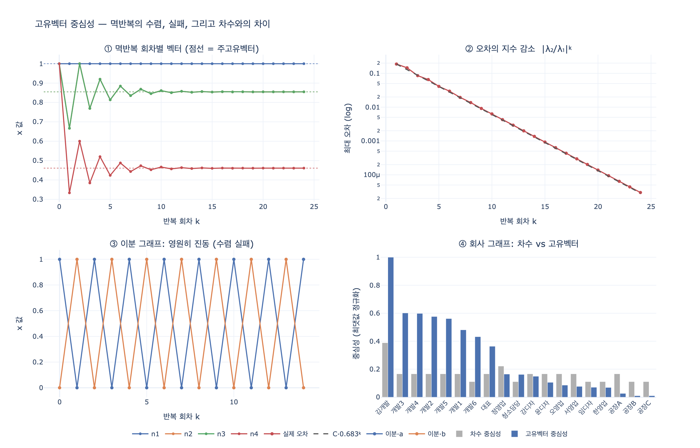

# 고유벡터 중심성은 어떤 원리로 계산하는가?

**답:** "중요한 이웃을 가진 노드가 중요하다"는 원리로, 각 노드 값을 이웃 값의 합으로 갱신하고 최댓값으로 정규화하는 **멱반복(power iteration)** 을 수렴할 때까지 반복한다.

---

## 1. 왜 이 지표가 필요한가

10장은 "중요하다"의 정의가 네 가지라고 말합니다.

| 지표 | 묻는 질문 |
|---|---|
| 차수(degree) | 아는 사람이 몇 명인가 |
| 근접(closeness) | 소문이 제일 빨리 퍼지는가 |
| 매개(betweenness) | 없으면 조직이 갈라지는가 |
| **고유벡터(eigenvector)** | **힘 있는 사람과 이어져 있는가** |

차수는 이웃을 **세기만** 합니다. 이웃이 누구든 1점입니다. 고유벡터 중심성은 여기서 한 발 더 나갑니다. **이웃의 점수를 더합니다.** 잡상인 100명을 아는 사람보다, 임원 3명을 아는 사람이 높게 나옵니다.

문제는 이게 순환 정의라는 점입니다.

> 내 점수 = 내 이웃들의 점수 합
> 그런데 이웃의 점수도 그 이웃들의 점수 합
> 그런데 그 이웃 중에는 나도 있고…

닭이 먼저냐 달걀이 먼저냐입니다. 이 순환을 푸는 방법이 두 가지 있는데, **같은 것의 두 얼굴**입니다.

1. 선형대수로 푼다 → 인접행렬의 고유벡터
2. 반복해서 푼다 → 멱반복

---

## 2. 정의: 순환식을 그대로 쓴다

노드 $v$의 중심성을 $x_v$라 하고, 순환 정의를 그대로 식으로 옮깁니다. 다만 그냥 "합 = 자기 자신"으로 두면 대부분의 그래프에서 해가 없으므로, 비례상수 $\lambda$를 하나 둡니다.

$$
\lambda x_v = \sum_{u \in N(v)} x_u
$$

무향 그래프의 인접행렬을 $A$라 하면 ($A_{vu}=1$ ⟺ $v$와 $u$가 이웃), 위 식은

$$
\lambda x_v = \sum_{u} A_{vu} x_u
\qquad\Longleftrightarrow\qquad
\boxed{A\mathbf{x} = \lambda \mathbf{x}}
$$

즉 **고유벡터 중심성 = 인접행렬 $A$의 고유벡터**입니다. 이름 그대로예요.

고유벡터는 여러 개 있습니다($n\times n$ 행렬이면 최대 $n$개). 그중 어느 것을 쓰느냐 — **가장 큰 고윳값 $\lambda_1$에 대응하는 고유벡터**(주고유벡터, principal eigenvector)를 씁니다. 이유는 3절의 페론–프로베니우스 정리입니다.

### 왜 하필 최대 고윳값인가 — 두 가지 이유

- **부호**: 중심성은 "점수"이므로 모든 성분이 음수가 아니어야 의미가 있습니다. 다른 고유벡터들은 반드시 양수·음수가 섞여 있습니다(주고유벡터와 직교해야 하므로).
- **수렴**: 멱반복이 자연스럽게 수렴하는 곳이 바로 여기입니다.

---

## 3. 페론–프로베니우스 정리 — "말이 되는 답"의 보증서

**페론–프로베니우스 정리(Perron–Frobenius theorem)** 를 비음수 행렬 버전으로 씁니다.

> $A \ge 0$(모든 성분이 0 이상)이고 **기약(irreducible)** 이면,
> 1. $\lambda_1 = \rho(A)$ (스펙트럼 반지름)는 **실수이고 양수**인 고윳값이다.
> 2. $\lambda_1$의 **대수적 중복도가 1**이다 (단순 고윳값).
> 3. 그에 대응하는 고유벡터를 **모든 성분이 양수**($x_v > 0$)가 되도록 잡을 수 있고, 스칼라배를 빼면 유일하다.
> 4. 다른 어떤 고유벡터도 성분이 전부 음수 아닌 것은 없다.

그래프 용어로 번역하면:

- **비음수**: 인접행렬은 0/1 또는 양의 가중치이므로 자동으로 만족.
- **기약(irreducible)** ⟺ 그래프가 **강연결(strongly connected)** — 무향이면 그냥 **연결(connected)**.
- 결론: 연결된 무향 그래프에서는 **"모든 노드에 양수 점수를 주는 고유벡터가 딱 하나 있다"** 가 보장됩니다.

이게 없으면 고유벡터 중심성은 정의 자체가 흔들립니다. 예를 들어 그래프가 두 조각으로 끊어져 있으면(기약이 아니면):

- 두 조각의 $\lambda_1$이 우연히 같지 않은 한, 주고유벡터는 **큰 쪽 조각에만 값이 실리고 작은 쪽은 전부 0**이 됩니다.
- 두 조각의 $\lambda_1$이 같으면 고유공간이 2차원이 되어 **답이 유일하지 않습니다**. 어떤 조합을 뽑느냐에 따라 순위가 달라집니다.

> **실무 규칙**: 고유벡터 중심성은 **연결 요소(connected component)별로** 계산하세요. 그래프 전체에 한 번 돌리고 "저쪽 팀은 전부 0점"이라는 결과를 그대로 보고하면 사고입니다.

---

## 4. 멱반복(power iteration) — 순환을 반복으로 푼다

고윳값 분해를 직접 하려면 $O(n^3)$이고 밀집행렬을 메모리에 올려야 합니다. 노드 100만 개짜리 그래프에서는 불가능합니다. 대신 **행렬–벡터 곱만 반복**합니다. 이게 멱반복입니다.

```
x ← (1, 1, ..., 1)            # 아무 값으로나 시작
repeat:
    y ← A x                   # 각 노드 = 이웃 값의 합
    x ← y / max(y)            # 정규화
until  ‖x_new − x_old‖ < ε
```

10장 `ex1_centralities.py`의 구현이 정확히 이겁니다.

```python
def eigen_c(adj, rounds=100):
    """고유벡터 중심성 — «중요한 이웃»을 가진 노드가 중요하다."""
    x = {v: 1.0 for v in adj}
    for _ in range(rounds):
        nx = {v: sum(x[u] for u in adj[v]) for v in adj}   # y = A x
        norm = max(nx.values()) or 1
        nx = {v: y / norm for v, y in nx.items()}          # 최댓값으로 정규화
        if all(abs(nx[v] - x[v]) < 1e-9 for v in adj):     # 수렴 판정
            break
        x = nx
    return x
```

- `sum(x[u] for u in adj[v])` ← 이게 $A\mathbf{x}$입니다. 인접행렬을 만들지 않고 인접 리스트로 곱셈을 흉내 냅니다. 비용은 $O(E)$.
- `max(nx.values())` ← 정규화. 최댓값 노드가 정확히 1.0이 되므로 "1등 대비 몇 %"로 읽힙니다.
- `rounds=100` ← 최대 반복 횟수. 안전장치입니다.

### 왜 수렴하는가

$A$가 대각화 가능하다고 하고, 고윳값을 $|\lambda_1| > |\lambda_2| \ge \cdots \ge |\lambda_n|$, 고유벡터를 $\mathbf{v}_1,\dots,\mathbf{v}_n$이라 합시다. 시작 벡터를 고유벡터들의 합으로 씁니다.

$$
\mathbf{x}^{(0)} = c_1\mathbf{v}_1 + c_2\mathbf{v}_2 + \cdots + c_n\mathbf{v}_n
$$

$k$번 곱하면

$$
A^k\mathbf{x}^{(0)} = c_1\lambda_1^k\mathbf{v}_1 + c_2\lambda_2^k\mathbf{v}_2 + \cdots
= \lambda_1^k\left[c_1\mathbf{v}_1 + \sum_{i\ge2} c_i\left(\frac{\lambda_i}{\lambda_1}\right)^{k}\mathbf{v}_i\right]
$$

$|\lambda_i/\lambda_1| < 1$이므로 괄호 안의 뒷항들은 지수적으로 0으로 사라지고, 방향은 $\mathbf{v}_1$으로 수렴합니다. 정규화는 $\lambda_1^k$가 폭발(또는 소멸)하는 걸 매 회 잘라 주는 역할입니다.

**수렴 속도는 $\left|\lambda_2/\lambda_1\right|^k$** 로 줄어듭니다. 이 비율을 **스펙트럼 갭(spectral gap)** 이라고 부르고, 갭이 클수록(=$\lambda_2$가 $\lambda_1$보다 많이 작을수록) 빨리 수렴합니다. 커뮤니티가 뚜렷하게 두 덩어리로 갈린 그래프는 $\lambda_2$가 $\lambda_1$에 붙어서 느립니다.

### 수렴 조건 정리

| 조건 | 왜 필요한가 | 깨지면 |
|---|---|---|
| **연결(기약)** | 유일한 양수 해의 존재 | 답이 여러 개거나, 한쪽 성분이 전부 0 |
| **$\vert\lambda_1\vert > \vert\lambda_2\vert$** (원시적, primitive) | 지배적 성분이 살아남음 | 진동하고 안 멈춤 |
| **$c_1 \ne 0$** (시작 벡터가 $\mathbf{v}_1$ 성분을 가짐) | 뽑아낼 성분이 있어야 함 | 이론상 수렴 안 함 |

세 번째는 실무에서 거의 문제가 안 됩니다. `x = (1,1,...,1)`로 시작하면 페론–프로베니우스에 의해 $\mathbf{v}_1 > 0$이므로 내적이 양수, 즉 $c_1 \ne 0$이 자동입니다. (부동소수 오차가 오히려 도와주기도 합니다.)

두 번째가 진짜 함정입니다.

### 이분 그래프 — 멱반복이 안 멈추는 대표 사례

무향 그래프가 **이분(bipartite)** 이면 $A$의 스펙트럼이 0 기준 대칭이라서 $\lambda_n = -\lambda_1$입니다. 즉 $|\lambda_1| = |\lambda_2|$.

가장 작은 예: 노드 두 개, 엣지 하나 (`a — b`).

$$
A = \begin{pmatrix} 0 & 1 \\ 1 & 0\end{pmatrix},\quad \lambda = \pm 1
$$

$\mathbf{x}^{(0)} = (1, 0)$에서 시작하면 $(0,1) \to (1,0) \to (0,1) \to \cdots$ 로 **영원히 진동**합니다. 절대 수렴하지 않습니다. `rounds` 상한이 없으면 무한 루프고, 있으면 반복 횟수의 홀짝에 따라 답이 달라집니다.

> 그래프 이론에서 "이분 ⟺ 홀수 길이 사이클이 없음"이므로, 격자·트리·사용자–아이템 그래프처럼 흔한 구조가 전부 여기 걸립니다. **한 노드에라도 자기 루프가 있거나 홀수 사이클이 있으면** 원시적(primitive)이 되어 문제가 사라집니다.
>
> 회피법: $A$ 대신 $A + I$(또는 $\frac{1}{2}(A+I)$)에 멱반복을 돌립니다. 고유벡터는 그대로이고 고윳값만 $\lambda+1$로 옮겨져서 $|\lambda_1+1| > |\lambda_n+1|$이 됩니다. 이걸 **shifted power iteration**이라고 합니다.

---

## 5. 정규화 방법 — 순위는 안 바뀐다

고유벡터는 스칼라배가 자유롭습니다. $\mathbf{x}$가 해면 $3\mathbf{x}$도 해입니다. 그래서 어딘가에서 크기를 고정해야 하고, 방법이 여러 가지입니다.

| 정규화 | 식 | 성질 |
|---|---|---|
| **최댓값** ($L^\infty$) | $x / \max_v x_v$ | 1등이 정확히 1.0. 책 예제와 이 카드의 답. 읽기 쉽다 |
| $L^2$ | $x / \sqrt{\sum x_v^2}$ | NumPy `eig`, NetworkX 기본값 |
| $L^1$ | $x / \sum x_v$ | 확률분포처럼 읽힘. 페이지랭크 관례 |

**셋 다 순위는 완전히 같습니다.** 값의 절댓값만 다릅니다. 그러니 라이브러리와 손구현 결과가 숫자로 안 맞아도 당황하지 말고 비율을 보세요. 반대로 말하면, **절댓값에 임계를 걸어 두면 정규화 방식이 바뀔 때 조용히 망가집니다** — 10장 페이지랭크 절의 싱크 노드 경고와 정확히 같은 종류의 함정입니다.

---

## 6. 친척들 — 왜 페이지랭크가 따로 있는가

고유벡터 중심성은 유향 그래프에서 잘 무너집니다.

- 들어오는 엣지가 없는 노드는 점수 0 → 그 노드만 가리키는 노드도 0 → 연쇄적으로 0.
- 유향 그래프는 대개 강연결이 아니라서 페론–프로베니우스의 보증이 사라집니다.

그래서 나온 변형들입니다.

| 이름 | 식 | 무엇을 고쳤나 |
|---|---|---|
| 고유벡터 중심성 | $\lambda\mathbf{x} = A\mathbf{x}$ | — |
| **카츠(Katz) 중심성** | $\mathbf{x} = \alpha A\mathbf{x} + \beta\mathbf{1}$ | 모두에게 기본점 $\beta$를 준다 → 0 연쇄 차단. $\alpha < 1/\lambda_1$ 이어야 수렴 |
| **페이지랭크** | $\mathbf{x} = d\,M\mathbf{x} + \frac{1-d}{n}\mathbf{1}$ | 카츠 + **나가는 차수로 나눔**($M$은 열 확률행렬) → 링크 팜 방지, 확률 해석 가능 |

세 가지 다 **멱반복으로 계산합니다.** 10장 `ex2_pagerank.py`의 반복문이 `ex1`의 `eigen_c`와 구조가 판박이인 이유가 이겁니다. 페이지랭크의 감쇠계수 $d=0.85$는 구글 관례이고, 이 값이 곧 수렴 속도($0.85^k$)를 정합니다.

---

## 7. 이 장 데이터에서 실제로 어떻게 나오나

`org.py`의 회사 그래프(노드 19개)에 멱반복을 돌리면 이렇게 나옵니다. ($\lambda_1 = 3.6146$, $|\lambda_2/\lambda_1| = 0.7782$, 104회 만에 수렴)

| 노드 | 차수 | 차수 중심성 | 고유벡터 |
|---|---:|---:|---:|
| 김개발 | 7 | 0.389 | **1.0000** |
| 개발3 | 3 | 0.167 | 0.6016 |
| 개발4 | 3 | 0.167 | 0.5985 |
| 개발2 | 3 | 0.167 | 0.5761 |
| 개발5 | 3 | 0.167 | 0.5618 |
| 개발1 | 3 | 0.167 | 0.4809 |
| 개발6 | 2 | 0.111 | 0.4321 |
| 대표 | 3 | 0.167 | 0.3636 |
| 정영업 | **4** | **0.222** | 0.1649 |
| … | | | |
| 서영업 | 3 | 0.167 | 0.0769 |
| 공장C | 2 | 0.111 | 0.0103 |

읽는 법:

- **김개발**: 개발팀 6명 + 대표와 연결. 차수 1등이고 고유벡터도 1등입니다.
- **개발3 (차수 3, 0.6016) vs 정영업 (차수 4, 0.1649)** — 차수는 정영업이 더 높은데 고유벡터는 개발3이 3.6배입니다. **개발3의 이웃이 김개발이라는 거물이기 때문**입니다. 이 뒤집힘이 이 지표의 존재 이유입니다.
- **개발6 (차수 2, 0.4321) > 대표 (차수 3, 0.3636)** — 이웃 수가 아니라 이웃의 질이 순위를 정합니다.
- **서영업 0.0769**: 매개 중심성 1등(공장으로 가는 유일한 통로)인데 **고유벡터는 하위권**입니다. 이웃(정영업·오영업·공장A)이 별로 안 중요하니까요.
- **공장 A/B/C는 0.03 이하**: 김개발 덩어리에서 멀어질수록 값이 지수적으로 죽습니다.

> 고유벡터 중심성은 **밀집한 덩어리 안쪽을 편애**합니다. 큰 클리크(clique)에 속하면 서로가 서로를 밀어 올려서 점수가 몰립니다. "구조적 급소"(서영업)를 찾는 데는 쓸모가 없고, 그건 매개 중심성의 일입니다. 지표는 질문에 맞춰 고르는 것이지, 하나로 다 되는 게 아닙니다.

---

## 8. 한 줄 요약

- **원리**: 중요한 이웃을 가진 노드가 중요하다 → $\lambda x_v = \sum_{u \in N(v)} x_u$
- **정체**: 인접행렬의 최대 고윳값에 대응하는 고유벡터 ($A\mathbf{x} = \lambda\mathbf{x}$)
- **보증**: 페론–프로베니우스 — 연결(기약) 그래프면 양수 해가 유일하게 존재
- **계산**: 멱반복 — $\mathbf{x} \leftarrow A\mathbf{x}$, 최댓값으로 정규화, 수렴까지 반복. 한 회 $O(E)$
- **속도**: $|\lambda_2/\lambda_1|^k$. 스펙트럼 갭이 좁으면 느리다
- **주의**: 비연결 그래프(0점 연쇄), 이분 그래프(진동), 절댓값 임계(정규화 의존)

## 참고

- [NetworkX — eigenvector_centrality](https://networkx.org/documentation/stable/reference/algorithms/centrality.html)
- [PageRank 원 논문 (Stanford)](http://ilpubs.stanford.edu:8090/422/)
- Newman, *Networks: An Introduction*, 7장 (중심성)

## 시각화



`expy.py`를 실행하면 나오는 네 개의 패널입니다.

1. **멱반복 회차별 벡터** — 목표값(점선 = numpy 주고유벡터)을 위아래로 오버슛하며 좁혀 들어갑니다. 진동하는 이유는 절댓값 2등 고윳값이 $-1.4812$로 **음수**라서 $(\lambda_2/\lambda_1)^k$의 부호가 매 회 뒤집히기 때문입니다.
2. **오차의 지수 감소** — 로그 축에서 직선입니다. 기울기가 예측 $C\cdot|\lambda_2/\lambda_1|^k = C\cdot 0.683^k$와 정확히 겹칩니다.
3. **이분 그래프의 진동** — 노드 두 개짜리 그래프($\lambda = \pm 1$)에서 멱반복이 영원히 $(1,0) \leftrightarrow (0,1)$을 오갑니다. 수렴 조건 $|\lambda_1| > |\lambda_2|$가 깨진 결과입니다.
4. **차수 vs 고유벡터** — 회사 그래프에서 두 지표의 순위가 갈리는 지점. 정영업은 차수가 더 높은데도 고유벡터는 개발팀원들보다 한참 아래입니다.
