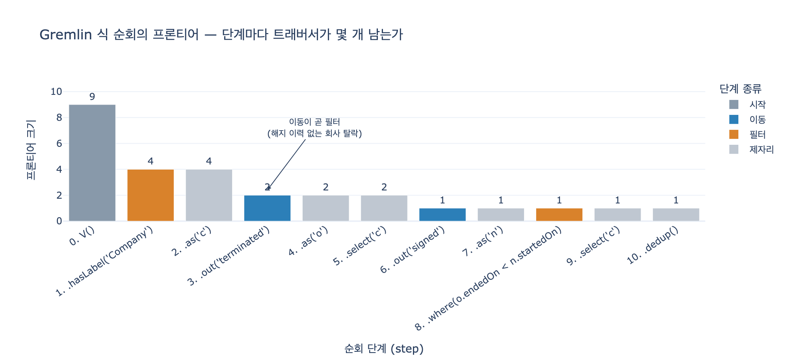

# `gremlin_style()` 함수는 무엇을 흉내 내는가

## 한 줄 답

**Gremlin의 순회(traversal) 사고를 파이썬으로 구현한 것**이다.
`.hasLabel('Company').out('terminated')` 같은 **단계별 이동을 `for` 루프로** 표현한다.

## 왜 흉내를 내야 했나

11장 `code/ex1_three_languages.py`는 같은 질문 하나를 세 언어로 쓴다.

| 언어 | 실행 방법 | 이 예제에서 |
|---|---|---|
| Cypher | 임베디드 엔진 **Kuzu 0.11.3** | 실제로 돈다 |
| SPARQL | **rdflib 7.5.0** (순수 파이썬) | 실제로 돈다 |
| Gremlin | **서버/엔진이 필요**하다 (TinkerPop Gremlin Server, JanusGraph, Neptune 등) | 파이썬으로 흉내 낸다 |

예제 파일의 독스트링이 이유를 직접 밝힌다.

> Gremlin 은 엔진이 필요해서, 여기서는 «걸음»을 파이썬으로 흉내 낸다.
> 문법이 아니라 «사고 방식»이 다르다는 걸 보여 주려는 것이다.

즉 목적은 **Gremlin 문법을 정확히 재현하는 게 아니다.** Cypher/SPARQL과
「그래프를 어떻게 생각하는가」가 어떻게 다른지를 보여 주는 데 있다.

## 이 장의 세 가지 비유

11장의 축은 이 셋이다.

| 언어 | 비유 | 대표 표기 | 성격 |
|---|---|---|---|
| Cypher | **그림** | `(c)-[:Signed]->(n)` — 화이트보드에 그린 모양 | 선언형 |
| SPARQL | **문장** | `?c ex:signed ?n .` — 사실을 한 줄씩 늘어놓는다 | 선언형 |
| Gremlin | **걸음** | `.out('signed')` — 어디로 갈지 순서대로 지시한다 | **명령형에 가깝다** |

앞의 둘은 「무엇을 원하는지」만 적고 방법은 엔진이 정한다.
Gremlin은 **순회 순서를 내가 정한다.** 그래서 세밀한 제어가 되는 대신,
최적화기가 도와줄 여지가 적다.

`gremlin_style()`이 흉내 내는 것은 정확히 이 **세 번째 성격**이다.

## 원본 코드와 주석 대응

```python
def gremlin_style():
    """Gremlin 의 «걸음»을 파이썬으로. g.V().out('terminated')... 와 같은 사고."""
    ended = {a: next(e for c, s, e in CONTRACTS if c == b) for a, b in TERMINATED}
    started = defaultdict(list)
    for a, b in SIGNED:
        started[a].append(next(s for c, s, e in CONTRACTS if c == b))
    out = []
    for company, end in ended.items():                 # .hasLabel('Company').out('terminated')
        for start in started.get(company, []):         # .in().out('signed')
            if end < start:                            # .where(...)
                out.append(company)
    return sorted(set(out))
```

주석이 붙은 자리가 곧 대응표다.

| 파이썬 구성 | Gremlin 단계 | 하는 일 |
|---|---|---|
| `ended`, `started` 딕셔너리 | 그래프의 **인접 리스트** | 정점에서 정점으로 갈 길 |
| `for company, end in ended.items()` | `.hasLabel('Company').out('terminated')` | Company에서 시작해 해지 계약으로 **한 걸음** |
| `for start in started.get(company, [])` | `.in().out('signed')` | 회사로 **되돌아와** 신규 계약으로 한 걸음 |
| `if end < start` | `.where(...)` | 조건으로 걸러내기 |
| `sorted(set(out))` | `.dedup()` + `ORDER BY` | 중복 제거·정렬 |

핵심은 이 한 문장이다. **`for` 루프 한 겹 = 순회 단계(step) 하나.**

### `.in().out('signed')` 가 왜 필요한가

질문은 「**해지했다가 그 뒤에 다시 계약한 고객**」이다. 회사 하나에서
서로 다른 두 방향으로 뻗은 두 계약을 **동시에** 봐야 한다.

```
        (해지 계약 o) <--terminated-- (회사 c) --signed--> (신규 계약 n)
                       o.endedOn  <  n.startedOn
```

Gremlin은 한 번에 한 정점씩만 움직이므로, 계약까지 갔다가 **회사로 되돌아와야**
다른 방향으로 다시 나갈 수 있다. 두 가지 방법이 있다.

- 역간선을 타고 돌아가기 → `.in('terminated')` (책 주석이 쓴 표기)
- 별칭으로 기억했다가 되돌아오기 → `.as('c')` … `.select('c')` (실무에서 더 흔하다)

파이썬 코드에서는 바깥 루프 변수 `company`가 그 「기억」 역할을 한다.
안쪽 루프에서 `started.get(company, ...)`로 다시 꺼내 쓰기 때문에,
사실상 `.as('c')` / `.select('c')`와 같은 일을 하고 있다.

## 실제 Gremlin으로 쓰면

같은 질문을 TinkerPop Gremlin(Groovy)으로 쓰면 대략 이렇다.

```groovy
g.V().hasLabel('Company').as('c')
     .out('terminated').as('o')
     .select('c')
     .out('signed').as('n')
     .where('o', lt('n')).by('endedOn').by('startedOn')
     .select('c')
     .dedup()
     .values('name')
     .order()
```

- `V()` — 모든 정점에서 출발 (**시작 단계**)
- `hasLabel(...)` / `where(...)` — 트래버서를 걸러낸다 (**필터 단계**)
- `out(...)` / `in(...)` — 간선을 타고 이동한다 (**flatMap 단계**)
- `as(...)` / `select(...)` — 움직이지 않고 경로를 기억·회수 (**사이드이펙트/경로**)
- `dedup()` / `values(...)` / `order()` — 정리와 종결

참고: [Apache TinkerPop Reference — Steps](https://tinkerpop.apache.org/docs/current/reference/#graph-traversal-steps)

## 흉내가 「어디까지」 같고 「어디부터」 다른가

같은 것

- **결과가 같다.** `ex1`은 Cypher·SPARQL·Gremlin식 셋의 답이 일치하는지 실제로 비교하고
  `셋이 같은가: 예`를 출력한다.
- **사고 순서가 같다.** 어느 정점에서 출발해 어느 간선을 어떤 순서로 타는지를
  질의 작성자가 지정한다.
- **중간 결과가 「정점 집합」이다.** 순회는 단계마다 프론티어(현재 트래버서 집합)를 갱신한다.

다른 것

- Gremlin의 **지연 평가·배리어(barrier)·프로파일링**(`profile()`)이 없다.
- **경로 추적**(`path()`), **분기**(`union`, `choose`), **반복**(`repeat().times()/until()`) 같은
  풍부한 단계가 없다.
- 실제 엔진은 인접 리스트가 아니라 색인·저장 엔진 위에서 돈다.
- `gremlin_style()`은 딕셔너리를 **미리** 만들어 두므로, 사실 첫 두 단계는
  「전체 스캔 후 색인 만들기」에 가깝다. 진짜 Gremlin이라면 그 색인이 이미 있다.

## 시험에 나올 포인트

- `gremlin_style()`은 Gremlin **엔진을 대체**하는 게 아니라, Gremlin의 **순회 사고를 예시**한다.
- `for` 루프 중첩이 곧 **단계 연결(step chaining)**, `if`가 곧 `.where()`, 딕셔너리 조회가 `.out()`.
- 이 흉내가 증명하려는 명제: **문법이 아니라 사고 방식이 다르다.**
  Cypher/SPARQL은 선언형(무엇), Gremlin은 명령형(어떻게).

## 시각화

`expy.py`는 체이닝 가능한 미니 순회 클래스(`Traversal.V().hasLabel(...).out(...)`)를
만들어, 단계마다 프론티어가 몇 개로 줄었는지 찍어 본다.

```
0  V()                                9개
1  .hasLabel('Company')               4개
3  .out('terminated')                 2개   ← 이동이 곧 필터
5  .select('c')                       2개   ← 움직이지 않고 되돌아온다
6  .out('signed')                     1개
8  .where(o.endedOn < n.startedOn)    1개   ← 비교는 딱 1번
```

같은 답을 선언형(집합 컴프리헨션)으로 쓰면 `|TERMINATED| × |SIGNED| = 6`쌍을
훑는 모양이 된다. 순서를 엔진에게 맡긴 대가이자 이점이다.
순회는 **내가 순서를 정했으니** 마지막 비교를 1번만 했다.


