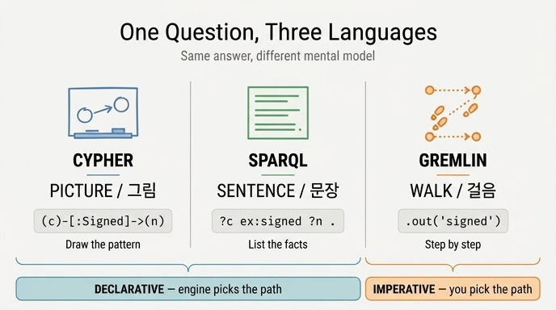

# Cypher는 그림, SPARQL은 문장, Gremlin은 걸음

## 한 줄 답

같은 질문에 같은 답을 내면서도 **세 언어는 그래프를 다르게 상상한다**.

| 언어 | 은유 | 대표 표기 | 패러다임 |
|---|---|---|---|
| Cypher | **그림** (picture) | `(c)-[:Signed]->(n)` | 선언형 |
| SPARQL | **문장** (sentence) | `?c ex:signed ?n .` | 선언형 |
| Gremlin | **걸음** (walk) | `.out('signed')` | 명령형에 가까움 |

앞의 둘은 "무엇을 원하는가"만 적고 방법은 엔진이 정한다. Gremlin은 "어디로 어떤 순서로 갈지"를 내가 정한다.

## 같은 질문을 세 언어로

11장 예제 1(`ex1_three_languages.py`)이 던지는 질문은 하나입니다.

> **"해지했다가 그 뒤에 다시 계약한 고객은?"**

### 1) Cypher — 그림

```cypher
MATCH (c:Company)-[:Terminated]->(o:Contract),
      (c)-[:Signed]->(n:Contract)
WHERE o.endedOn < n.startedOn
RETURN c.name AS 고객
ORDER BY 고객
```

`(c)-[:Terminated]->(o)`. 화살표가 그대로 화살표입니다. 화이트보드에 동그라미 두 개 그리고 선 하나 이어 놓은 모양을 그대로 텍스트로 옮긴 것 — 이게 Cypher의 **ASCII-art 패턴**입니다. 그래서 처음 보는 사람도 "회사에서 계약으로 선이 두 개 나가는구나"를 눈으로 읽습니다. 질의문이 곧 다이어그램입니다.

### 2) SPARQL — 문장

```sparql
PREFIX ex: <http://example.org/>
SELECT ?고객 WHERE {
    ?c ex:name ?고객 ; ex:terminated ?o ; ex:signed ?n .
    ?o ex:endedOn   ?end .
    ?n ex:startedOn ?start .
    FILTER(?end < ?start)
} ORDER BY ?고객
```

여기엔 화살표가 없습니다. 대신 **주어–서술어–목적어** 세 칸이 있고, 마침표(`.`)로 문장이 끝납니다. "?c는 ?o를 해지했다. ?c는 ?n에 서명했다." 사실(fact)을 한 줄씩 늘어놓고, 그 사실들이 동시에 참이 되는 조합을 찾는 겁니다. RDF의 트리플(triple)이라는 데이터 모형이 언어의 문장 구조가 된 결과예요. `;`는 같은 주어를 반복하지 않기 위한 축약이라, 사실상 문장 세 개가 나열된 것과 같습니다.

### 3) Gremlin — 걸음

```groovy
g.V().hasLabel('Company').out('terminated')...
```

예제에서는 Gremlin 엔진 없이 파이썬으로 그 **사고 방식**만 흉내 냅니다.

```python
for company, end in ended.items():            # .hasLabel('Company').out('terminated')
    for start in started.get(company, []):    # .in().out('signed')
        if end < start:                       # .where(...)
            out.append(company)
```

`.out()`, `.in()`, `.where()`가 점(`.`)으로 이어집니다. 각 점이 **한 걸음**이고, 스텝을 쓴 순서가 곧 순회 순서입니다. 그림을 그리는 것도, 사실을 늘어놓는 것도 아니라 "여기서 출발해서, 이 간선을 타고, 그다음 이쪽으로" 하는 **경로 안내**입니다.

## 선언형 둘 vs 명령형 하나

이게 단순한 취향 차이가 아닙니다. 실행 전략을 누가 정하느냐가 갈립니다.

- **선언형(Cypher, SPARQL)**: 원하는 패턴만 적고 실행 순서는 옵티마이저가 정합니다. 짧고 읽기 쉽지만, 느릴 때 "왜 느린지"는 질의문에 안 적혀 있습니다. 그래서 예제 5(`ex5_read_plan.py`)가 **실행 계획(EXPLAIN)** 읽기를 따로 가르칩니다. 같은 뜻의 질의라도 작은 쪽(City 12개)에서 시작하느냐 큰 쪽(Person 2만 명)에서 시작하느냐로 속도가 갈리고, 그 선택은 계획에 들어 있습니다.
- **명령형에 가까움(Gremlin)**: 순회 순서를 내가 정합니다. 세밀한 제어가 되는 대신 **최적화기가 도와줄 여지가 적습니다**. 내가 나쁜 순서를 쓰면 그 나쁜 순서대로 돕니다.

"가까움"이라는 단서가 붙는 이유: Gremlin에도 트래버설 전략(traversal strategy)이라는 재작성 계층이 있어서 순수 명령형은 아닙니다. 다만 표기의 성격과 개발자가 지는 책임은 명령형 쪽입니다.

## 차이가 제일 크게 벌어지는 자리 — 경로 표현

세 언어가 "다르게 생각한다"는 말이 추상적으로 들리면, 예제 2(`ex2_path_queries.py`)의 **가변 길이 경로**를 보면 됩니다.

```
Cypher : -[:ParentOf*1..3]->      상한을 «반드시» 쓸 수 있다
SPARQL : ex:parentOf+             상한 표기가 없다
SQL    : WITH RECURSIVE ... 20줄  (3장 참조)
```

그림으로 생각하는 언어는 "선을 1~3개까지"를 그림 표기 안에 자연스럽게 넣습니다. 문장으로 생각하는 언어는 정규식 스타일의 `+`/`*`를 쓰는데, SPARQL 1.1 속성 경로(property path)에는 **"최대 몇 홉"을 적는 표준 문법이 없습니다**. 그래서 9장의 "상한을 걸어라"를 SPARQL에서는 질의 타임아웃, 결과 개수 제한, 아니면 깊이를 손으로 펼쳐 쓰는 식으로 우회해야 합니다.

## 왜 이 은유를 외워 두면 쓸모가 있나

1. **면접·설계 논의의 답이 바뀝니다.** "Cypher랑 SPARQL 중 뭐가 좋냐"는 질문은 우열이 아니라 데이터 모형 질문입니다. 속성 그래프면 그림이 편하고, RDF/트리플·추론·연결 데이터면 문장이 맞습니다.
2. **문법을 외우기 전에 사고 틀이 잡힙니다.** 새 질의를 쓸 때 Cypher에서는 "먼저 그림을 그려 보고", SPARQL에서는 "사실을 문장으로 나열하고", Gremlin에서는 "출발점을 정하고 걸음을 세는" 순서로 접근하면 막히지 않습니다.
3. **표준화 흐름을 이해하는 밑바탕이 됩니다.** 2024년 ISO/IEC 39075로 표준이 된 **GQL**은 Cypher 계열(그림)의 후계입니다. 다만 예제 3(`ex3_gql_dialects.py`)이 보여 주듯 `LET`/`NEXT`/`FILTER` 같은 GQL 전용 절은 엔진들이 아직 안 받습니다 — "표준이 나왔다"와 "표준대로 돌아간다" 사이에 몇 년이 있습니다.

## 1차 출처

| 항목 | 링크 |
|---|---|
| Cypher Manual | https://neo4j.com/docs/cypher-manual/current/ |
| SPARQL 1.1 Query Language | https://www.w3.org/TR/sparql11-query/ |
| SPARQL 속성 경로 | https://www.w3.org/TR/sparql11-query/#propertypaths |
| Apache TinkerPop (Gremlin) | https://tinkerpop.apache.org/docs/current/reference/ |
| GQL (ISO/IEC 39075:2024) | https://www.iso.org/standard/76120.html |

## 한 줄로 다시

**Cypher는 그리고, SPARQL은 말하고, Gremlin은 걷는다.** 앞의 둘은 결과만 선언하고 길은 엔진에 맡기며, Gremlin은 길을 직접 지시한다.

## 인포그래픽


