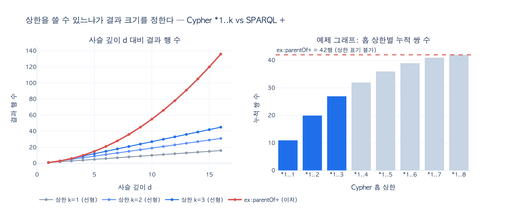

# Cypher `*1..3` vs SPARQL `+` — 가변 길이 경로 표기의 차이

> **질문** — Cypher와 SPARQL의 가변 길이 경로 표기는 어떻게 다른가?
>
> **답** — Cypher는 `-[:ParentOf*1..3]->`로 상한을 반드시 쓸 수 있고, SPARQL은 `ex:parentOf+`로 한 번 이상만 표현할 수 있어 상한 표기가 없다.

11장(`ex2_path_queries.py`)이 이 차이를 실행 결과로 못 박습니다.

```
  Cypher : -[:ParentOf*1..3]->     상한을 «반드시» 쓸 수 있다
  SPARQL : ex:parentOf+            상한 표기가 없다
  SQL    : WITH RECURSIVE ... 20줄  (3장 참조)
```

세 언어의 사고 방식 차이(그림 / 문장 / 걸음)는 취향 문제로 넘길 수 있습니다. 그런데 경로 표현은 취향이 아니라 **표현할 수 있는 것 자체가 다릅니다**. 그래서 11장은 여기가 "차이가 제일 크게 벌어지는 자리"라고 씁니다.

---

## 1. Cypher의 `*min..max`

Cypher의 가변 길이 관계(variable-length relationship)는 관계 패턴 안에 `*`와 홉 범위를 씁니다.

| 표기 | 뜻 |
|---|---|
| `-[:ParentOf]->` | 정확히 1홉 |
| `-[:ParentOf*1..3]->` | 1홉 이상 3홉 **이하** |
| `-[:ParentOf*3]->` | 정확히 3홉 |
| `-[:ParentOf*..5]->` | 1~5홉 (하한 생략 = 1) |
| `-[:ParentOf*2..]->` | 2홉 이상 (상한 생략 = 엔진 기본값) |
| `-[:ParentOf*]->` | 하한·상한 모두 엔진 기본값 (Neo4j는 1..무제한, Kuzu는 1..30) |

핵심은 `*1..3`의 `3`입니다. **홉 상한이 질의문 안의 리터럴로 들어갑니다.** 9장에서 배운 "상한을 걸어라"를 Cypher에서는 질의를 쓰면서 그냥 지킬 수 있습니다. 상한을 잊으면 문법이 어색해질 정도로 표기가 유도합니다.

부수 효과도 하나 있습니다. 상한이 질의문에 있으면 **옵티마이저가 그걸 보고 계획을 세울 수 있습니다.** 최대 3홉이라는 걸 알면 확장 횟수를 3회로 고정하고 중간 결과 크기를 추정할 수 있죠(11장 `ex5_read_plan.py`의 논지와 이어집니다).

한편 이 `*1..3` 표기는 **GQL 표준 문법이 아닙니다.** Neo4j 문서가 직접 밝히고 있습니다 — "This syntax is still available, but it is not GQL conformant." GQL 준수 표기는 정량 경로 패턴(quantified path pattern)이고, 그 문법이 하필 **`{1,3}`** 입니다.

```cypher
-- Cypher 전통 표기 (GQL 비준수)
MATCH (a:Co)-[:ParentOf*1..3]->(b:Co) RETURN a.name, b.name

-- GQL 준수 표기 (정량 경로 패턴)
MATCH (a:Co) (()-[:ParentOf]->()){1,3} (b:Co) RETURN a.name, b.name
```

이 중괄호를 기억해 두세요. 3절에서 다시 나옵니다.

---

## 2. SPARQL 1.1 property path 연산자 전부

SPARQL 1.1의 property path는 [명세 9.1절](https://www.w3.org/TR/sparql11-query/#propertypaths)에 이게 **전부**입니다.

| 표기 | 이름 | 뜻 | 중복(duplicate) |
|---|---|---|---|
| `iri` | PredicatePath | IRI 하나, 길이 1의 경로 | — |
| `^elt` | InversePath | 역방향 (객체 → 주어) | 보존 |
| `elt1 / elt2` | SequencePath | `elt1` 다음에 `elt2` | **보존** |
| `elt1 \| elt2` | AlternativePath | `elt1` 또는 `elt2` | **보존** |
| `elt*` | ZeroOrMorePath | `elt` 0회 이상 | **제거** |
| `elt+` | OneOrMorePath | `elt` 1회 이상 | **제거** |
| `elt?` | ZeroOrOnePath | `elt` 0회 또는 1회 | **제거** |
| `!iri`, `!(iri1\|…\|irin)` | NegatedPropertySet | 목록에 없는 술어 | 보존 |
| `!^iri`, `!(^iri1\|…)` | NegatedPropertySet | 목록에 없는 역방향 술어 | 보존 |
| `(elt)` | GroupPath | 우선순위 묶음 | — |

목록에 **횟수를 적는 표기가 없습니다.** `+`는 "1회 이상"이고 `*`는 "0회 이상"이고 `?`는 "0회 또는 1회"입니다. `*1..3`에 대응하는 표기가 아예 존재하지 않습니다.

그리고 이 표가 알려주는 두 번째 사실이 실무에서 사람을 잡습니다. **`*`, `+`, `?`만 중복을 제거하고 `/`, `|`, `!`는 중복을 보존합니다.** 왜 이렇게 비대칭인지가 3절의 이야기입니다.

### 대응 관계 정리

| | Cypher | SPARQL 1.1 |
|---|---|---|
| 1홉 이상 | `*1..` 또는 `*` | `+` |
| 0홉 이상 | 별도 표기 필요 (`*0..`) | `*` |
| 0 또는 1홉 | `*0..1` | `?` |
| 정확히 3홉 | `*3` | `p/p/p` |
| **1~3홉** | **`*1..3`** | **표기 없음** |

양 끝(1홉, 무제한)은 두 언어가 정확히 같은 답을 냅니다. `expy.py`에서 실측하면 Cypher `*1..30`과 SPARQL `ex:parentOf+`가 둘 다 42행입니다. **가운데 칸만 SPARQL에 없습니다.**

---

## 3. 왜 SPARQL 표준에는 홉 상한 표기가 없나 — 초안에는 있었다

여기가 이 카드의 핵심입니다. 표준 설계자들이 홉 상한을 생각 못 한 게 아닙니다. **초안에는 있었고, 표준화 마지막 단계에서 빼기로 결정했습니다.**

### 3.1 초안에는 `{n,m}`이 있었다

W3C SPARQL Working Group의 property path 기능 제안 문서([Feature:PropertyPaths](https://www.w3.org/2009/sparql/wiki/Feature_PropertyPaths.html))는 Jena/ARQ의 구현 경험을 근거로 삼았고, 거기에 중괄호 표기가 들어 있었습니다.

> `{n,m}` A path between n and m occurrences of elt. The forms `{n}`, `{,m}` and `{n,}` are similar to the regular expression forms based on `{n,m}`
> — *Feature:PropertyPaths, "Implementation Experience in ARQ" 절*

즉 `ex:parentOf{1,3}`으로 Cypher의 `*1..3`과 똑같이 쓸 수 있는 문법이 Last Call working draft까지 살아 있었습니다.

### 3.2 빠진 경위 — 경로 개수 세기의 복잡도

문제는 **bag semantics(중복 보존)** 였습니다. 초안 semantics는 property path가 매칭한 순서쌍을 "경로 개수만큼" 돌려주게 되어 있었습니다. 두 노드 사이에 매칭하는 경로가 7개면 그 쌍이 7번 나옵니다. 무한 길이 경로에서 결과가 무한해지지 않도록 단순 경로(simple path) 제약까지 붙었죠.

그러자 "몇 개의 경로가 있는가"를 세는 문제가 되었고, 이 계산의 복잡도가 폭발했습니다. Arenas, Conca, Pérez의 논문 제목이 상황을 그대로 말해 줍니다.

> **"Counting beyond a Yottabyte, or how SPARQL 1.1 property paths will prevent adoption of the standard"**
> — Marcelo Arenas, Sebastián Conca, Jorge Pérez, *WWW 2012*, pp. 629–638

이들은 당시 SPARQL 1.1 구현체 여러 개에 property path 질의를 넣어 보고, 단순한 상황에서도 성능이 무너지는 걸 보였습니다. 이어서 이론적 복잡도 분석을 붙였습니다. Losemann과 Martens도 같은 시기에 SPARQL 경로 표현식 평가 복잡도를 다뤘습니다.

### 3.3 2012년 4월, Working Group의 결정

Working Group은 이 지적을 받아들여 property path 설계를 다시 했습니다. 2012년 4월 12일, Lee Feigenbaum이 WG를 대표해 `public-rdf-dawg-comments`에 답신을 보냅니다. 결정은 셋입니다.

1. **`*`, `+`, `?`의 semantics를 non-counting으로 바꾼다** — "the semantics of `*`, `+`, and `?` are changed to be non-counting (they no longer preserve duplicates)". 경로 개수를 세지 않고 순서쌍 집합만 내면 복잡도 문제가 사라지니까요.
2. **`/`, `|`, `!`는 그대로 둔다** — 이 연산자들은 "often used as shortcuts for writing out equivalent graph patterns longhand"라서, 중복을 없애면 합계 계산이나 RDF 리스트 순회에서 직관에 어긋나는 답이 나옵니다.
3. **중괄호 표기를 전부 뺀다** — "The curly brace forms — `{n}`, `{n,m}`, `{n,}`, `{,m}` — have all been removed."

3번의 이유가 명시되어 있습니다. **"due to a lack of experience with appropriate counting/non-counting semantics"** — 유한 횟수 반복에 counting/non-counting 중 어느 쪽이 맞는지에 대한 구현 경험이 부족했다는 겁니다. `+`는 무한 길이라 counting을 포기할 근거가 명확했지만, `{1,3}`은 길이가 유한하니 중복을 세도 결과가 유한합니다. 그러면 `/`처럼 중복을 보존해야 할까요, `+`처럼 제거해야 할까요? WG는 답을 정할 근거가 없다고 판단했고, 구현체들이 각자 실험한 뒤 나중에 표준화하자며 뺐습니다.

WG가 스스로 밝힌 다섯 개 설계 목표가 이 결정의 배경입니다.

- 유스케이스 표현력 (use case expressivity)
- 사용자의 학습 곡선 / 직관 (users' learning curve / intuition)
- 구현 난이도 (ease of implementation)
- 효율적 평가 가능성 (potential for efficient evaluation)
- **일정 (schedule)**

마지막 항목이 솔직합니다. SPARQL 1.1은 2013년 3월 권고안이 되어야 했습니다. 마감 앞에서 semantics가 확정 안 된 기능을 들고 가느니 빼는 쪽을 골랐고, "나중에"는 결국 오지 않았습니다. 2026년 현재도 SPARQL 표준에 홉 상한 표기는 없습니다.

> **역설** — SPARQL이 2012년에 버린 중괄호 `{n,m}`이, 2024년 ISO/IEC 39075 **GQL 표준**의 정량 경로 패턴 표기로 채택됐습니다(`{1,3}`). 같은 문법이 한 표준에서는 빠지고 다른 표준에서는 들어간 겁니다. 12년 사이에 "구현 경험 부족"이 해소됐다는 뜻이기도 합니다.

---

## 4. 그래서 SPARQL에서는 어떻게 하나

11장이 제시하는 우회로는 셋입니다.

### 4.1 깊이를 명시적으로 펼쳐 쓰기 (가장 정확)

`p | p/p | p/p/p`로 1~3홉을 직접 나열합니다.

```sparql
PREFIX ex: <http://example.org/>
SELECT DISTINCT ?a ?b WHERE {
  ?a ex:parentOf | ex:parentOf/ex:parentOf | ex:parentOf/ex:parentOf/ex:parentOf ?b
}
```

**`DISTINCT`가 필수입니다.** 2절 표를 다시 보세요. `/`와 `|`는 중복을 보존합니다. 두 노드 사이에 경로가 여러 개면(다이아몬드 구조) 같은 쌍이 여러 번 나옵니다. `expy.py`의 6단계가 이걸 실측합니다 — 다이아몬드 그래프에서 `+`는 5행, 펼친 질의는 `DISTINCT` 없이 6행, `DISTINCT`를 붙이면 5행. 2012년 WG가 "counting/non-counting semantics 경험 부족"이라고 한 문제가 우회로에 그대로 되돌아옵니다.

단점은 명확합니다. 상한이 커지면 질의문이 폭발하고(`k=10`이면 항이 10개), 상한을 바꿀 때 질의문을 다시 생성해야 합니다.

### 4.2 질의 타임아웃 / 결과 개수 제한

`LIMIT`을 걸거나 엔드포인트 타임아웃에 맡깁니다. 쓰기는 쉽지만 **"3홉까지"라는 의도가 질의문에 안 남습니다.** 답이 잘렸는지 원래 그만큼인지 구분할 수 없고, 홉 상한과 결과 개수 상한은 애초에 다른 개념입니다.

### 4.3 깊이를 데이터로 물질화

전이 폐쇄를 미리 계산해 `ex:depth` 같은 술어로 저장해 두고 `FILTER(?depth <= 3)`으로 거릅니다. 질의는 깔끔해지지만 적재 시점에 비용을 내고 갱신 일관성을 관리해야 합니다.

---

## 5. 왜 이게 성능 문제인가 — 선형 vs 이차

상한이 있느냐 없느냐는 문법 취향이 아니라 **결과 크기의 증가 차수**를 바꿉니다.

길이 $d$의 사슬(노드 $d+1$개)에서 정확히 $j$홉 떨어진 순서쌍은 $d+1-j$개입니다. 따라서

$$|R_{\le k}(d)| = \sum_{j=1}^{\min(k,d)} (d+1-j) \approx kd, \qquad
  |R_{+}(d)| = \sum_{j=1}^{d} (d+1-j) = \frac{d(d+1)}{2}$$

상한 $k$를 고정하면 $O(kd)$로 **선형**, `+`는 $O(d^2)$로 **이차**입니다. `expy.py`의 실측값($d$까지 rdflib로 직접 질의):

| $d$ | $k=3$ | `+` | 배수 |
|---|---|---|---|
| 3 | 6 | 6 | 1.00x |
| 8 | 21 | 36 | 1.71x |
| 16 | 45 | 136 | 3.02x |
| 100 | 297 | 5050 | 17.0x |

조직도나 부품 BOM처럼 깊이가 수십 단계인 실무 그래프에서 이 배수는 그대로 응답 시간이 됩니다. 9장에서 "상한을 걸어라"라고 한 이유가 이겁니다. Cypher는 표기가 그걸 강제하고, SPARQL은 표기가 없어서 사람이 우회로를 기억해야 합니다.

---

## 6. 한 줄 정리

- **Cypher**: `-[:ParentOf*1..3]->` — 하한·상한을 `*min..max`로 질의문에 쓴다. 단 GQL 표준 표기는 `{1,3}`(정량 경로 패턴).
- **SPARQL 1.1**: `ex:parentOf+` — `*`/`+`/`?`/`/`/`|`/`^`/`!`가 전부. **홉 상한 표기가 없다.**
- **없는 이유**: 초안의 `{n}`, `{n,m}`, `{n,}`, `{,m}`이 2012-04-12 W3C SPARQL WG 결정으로 제거됨. bag semantics의 경로 개수 세기 복잡도(WWW 2012 "Counting beyond a Yottabyte")를 피하려고 `*`/`+`/`?`를 non-counting으로 바꿨고, 유한 반복의 counting/non-counting semantics는 **구현 경험 부족 + 일정** 때문에 미뤘다. 그 "나중"이 아직 오지 않았다.
- **11장의 교훈**: "표준이 있다고 모든 게 표준으로 되는 건 아니다. 이런 구멍이 실무를 정한다."

---

## 출처

- [SPARQL 1.1 Query Language — 9.1 Property Path Syntax (W3C Recommendation)](https://www.w3.org/TR/sparql11-query/#propertypaths) — 연산자 전체 목록, 중괄호 표기 없음
- [Re: Additional comments on the semantics of property paths — Lee Feigenbaum, 2012-04-12, public-rdf-dawg-comments](https://lists.w3.org/Archives/Public/public-rdf-dawg-comments/2012Apr/0003.html) — WG의 재설계 결정 원문
- [CommentResponse/PropertyPathComments — W3C SPARQL WG wiki](https://www.w3.org/2009/sparql/wiki/CommentResponse_PropertyPathComments.html) — 다섯 개 설계 목표, "lack of experience with appropriate counting/non-counting semantics"
- [Feature:PropertyPaths — W3C SPARQL WG wiki](https://www.w3.org/2009/sparql/wiki/Feature_PropertyPaths.html) — 초안의 `{n,m}` / `{n}` / `{,m}` / `{n,}` 정의 (ARQ 구현 경험)
- Arenas, Conca, Pérez, ["Counting beyond a Yottabyte, or how SPARQL 1.1 property paths will prevent adoption of the standard"](https://www.semanticscholar.org/paper/293700d335c1a842d29ecf1248dba0ea1569fcdd), WWW 2012, 629–638
- Losemann, Martens, ["The Complexity of Evaluating Path Expressions in SPARQL"](https://www.theoinf.uni-bayreuth.de/pool/documents/Paper2011-15/Paper2012/The_Complexity_of_Evaluating_Path_Expressions_in_SPARQL_preprint.pdf), PODS 2012
- [Variable-length patterns — Neo4j Cypher Manual](https://neo4j.com/docs/cypher-manual/current/patterns/variable-length-paths/) — `*min..max` 문법, GQL 비준수 명시
- [Quantified path patterns — Neo4j Cypher Cheat Sheet](https://neo4j.com/docs/cypher-cheat-sheet/current/quantified-path-patterns/) — GQL 준수 `{1,3}` 표기
- [ISO/IEC 39075:2024 — GQL](https://www.iso.org/standard/76120.html)
- 11장 예제 `content/ch11/code/ex2_path_queries.py`

## 시각화


