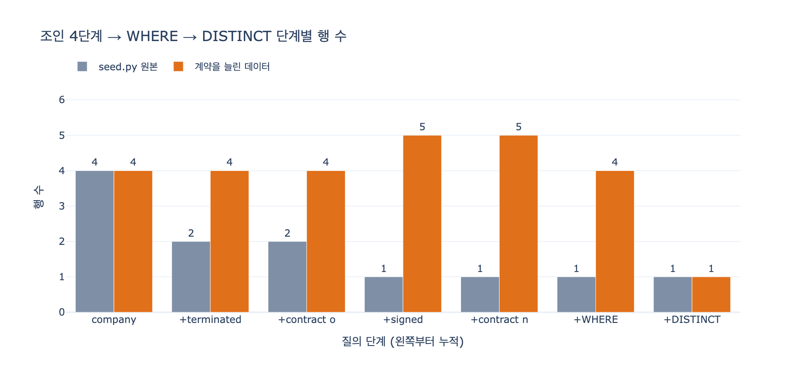

# `ex4_sql_pgq.py`의 평범한 SQL은 같은 질문을 어떻게 표현하는가?

**답**: `company`에 `terminated`·`contract`·`signed`·`contract`를 네 번 조인하고 `WHERE o.ended_on < n.started_on`으로 걸러 `DISTINCT`로 중복을 없앤다.

---

## 왜 「평범한 SQL」이 예제에 들어 있나

`ex4_sql_pgq.py`의 주석이 이유를 직접 밝힌다.

> SQL/PGQ(ISO/IEC 9075-16:2023)를 실제로 구현한 엔진이 아직 널리 퍼지지 않아서,
> 여기서는 «표준 문법»을 보여 주고 같은 뜻의 평범한 SQL 을 돌려서 답을 맞춰 본다.

즉 이 예제는 두 조각으로 되어 있다.

| 조각 | 변수 | 실행되는가 |
|---|---|---|
| SQL/PGQ 표준 문법 (`CREATE PROPERTY GRAPH` + `GRAPH_TABLE`) | `PGQ` | **아니다.** `textwrap.dedent`로 만든 문자열을 `print`만 한다 |
| 같은 뜻의 평범한 SQL | `PLAIN_SQL` | **그렇다.** `sqlite3` 인메모리 DB에서 실제로 돈다 |

그래서 「답을 계산하는 코드」는 전부 `PLAIN_SQL` 쪽이다. 질문의 대상이 이 문자열이다.

## 문제의 SQL

```sql
SELECT DISTINCT c.name AS 고객
  FROM company c
  JOIN terminated t ON t.company_name = c.name
  JOIN contract  o ON o.id = t.contract_id
  JOIN signed    s ON s.company_name = c.name
  JOIN contract  n ON n.id = s.contract_id
 WHERE o.ended_on < n.started_on
 ORDER BY 고객
```

답하려는 질문은 11장 전체를 관통하는 그 하나다.

> **해지했다가 그 뒤에 다시 계약한 고객은?**

## 테이블 네 개 — 그래프가 이렇게 흩어져 있다

`ex4_sql_pgq.py`의 `setup()`이 만드는 스키마다.

```sql
CREATE TABLE company    (name TEXT PRIMARY KEY, grade TEXT);
CREATE TABLE contract   (id TEXT PRIMARY KEY, started_on TEXT, ended_on TEXT);
CREATE TABLE signed     (company_name TEXT, contract_id TEXT);
CREATE TABLE terminated (company_name TEXT, contract_id TEXT);
```

- `company`, `contract` = **노드 테이블**
- `signed`, `terminated` = **간선 테이블** (SQL/PGQ 선언에서도 각각 `VERTEX TABLES` / `EDGE TABLES`로 대응된다)

그래프로 그리면 찾고 싶은 그림은 이렇다.

```
              Terminated              Signed
   Company ─────────────▶ Contract(o)     ┌──▶ Contract(n)
      c ───────────────────────────────────┘
      (같은 c 노드)

              조건: o.ended_on < n.started_on
```

노드 하나에서 나가는 화살표가 **두 갈래**이고, 두 갈래의 끝 노드끼리 날짜를 비교한다.

## 조인 4단계를 하나씩 따라가기

핵심 규칙: **간선 하나를 따라가려면 조인이 두 번 든다.** 간선 테이블 한 번, 도착 노드 테이블 한 번.
Cypher 화살표 2개 = SQL 조인 4개. 여기서 숫자 4가 나온다.

### 1단계 — `JOIN terminated t ON t.company_name = c.name`

회사에 **해지 간선**을 붙인다. Cypher의 `(c)-[:Terminated]->` 부분에 해당.
`INNER JOIN`이므로 해지 이력이 없는 회사는 여기서 조용히 탈락한다.
`seed.py` 데이터에서 회사 4개가 2행으로 줄어든다(가온테크·라온에너지만 남는다).

### 2단계 — `JOIN contract o ON o.id = t.contract_id`

해지 간선의 끝, 즉 **옛 계약 노드**를 붙인다. Cypher의 `->(o:Contract)`.
이제야 `o.ended_on`(해지일)을 참조할 수 있다. 별칭 `o`는 old의 o다.

### 3단계 — `JOIN signed s ON s.company_name = c.name`

여기가 가장 중요한 조인이다. 조건이 `s.company_name = t.company_name`이 아니라
**다시 `c.name`**이다. 이 한 줄이 「해지한 회사와 서명한 회사가 **같은 회사**」라는 제약을 건다.

Cypher/PGQ에서는 이게 그냥 변수 이름을 두 번 쓰는 일이다.

```cypher
MATCH (c:Company)-[:Terminated]->(o:Contract),
      (c)-[:Signed]->(n:Contract)     -- ← 같은 c. 끝.
```

SQL에서는 조인 조건으로 명시해야 하고, 여기서 실수하면 「어떤 회사가 해지했고 **아무** 회사가 서명했다」는 전혀 다른 질의가 되어 **조용히** 틀린 답을 낸다.

이 단계에서 곱집합이 발생한다. 회사 하나가 해지 계약 $m$개, 서명 계약 $k$개를 가지면 그 회사 몫이 $m \times k$행이 된다.

### 4단계 — `JOIN contract n ON n.id = s.contract_id`

서명 간선의 끝, **새 계약 노드**를 붙인다. `n`은 new의 n.
같은 `contract` 테이블을 `o`와 `n` 두 개의 별칭으로 두 번 조인하는 게 포인트다.
그림에서는 노드가 둘인 게 자명하지만, SQL에서는 별칭 관리가 사람 몫이다.

### 요약 표

| # | 조인 | 붙이는 것 | Cypher 대응 |
|---|---|---|---|
| 1 | `terminated t` on `c.name` | 회사 → 해지 간선 | `(c)-[:Terminated]->` |
| 2 | `contract o` on `t.contract_id` | 해지 간선 → 옛 계약 노드 | `->(o:Contract)` |
| 3 | `signed s` on **`c.name`** | 같은 회사 → 서명 간선 | `(c)-[:Signed]->` |
| 4 | `contract n` on `s.contract_id` | 서명 간선 → 새 계약 노드 | `->(n:Contract)` |

## `WHERE o.ended_on < n.started_on` — 순서가 질문이다

조인 4개가 만들어 낸 건 「해지 계약 하나와 서명 계약 하나」의 **모든 조합**이다.
아직 답이 아니다. 부등호 한 줄이 질문을 확정한다.

$$\text{o.ended\_on} \;<\; \text{n.started\_on}$$

「옛 계약이 끝난 날이 새 계약이 시작한 날보다 **앞**」 = **해지한 뒤에 다시 계약했다**.

조건을 바꿔 보면 이 줄이 질문의 전부라는 게 드러난다(expy 실행 결과).

| 조건 | 뜻 | 결과 |
|---|---|---|
| `o.ended_on < n.started_on` | 해지 → 재계약 (원본) | `['가온테크']` |
| `o.ended_on > n.started_on` | 재계약 → 해지 (갱신 중 정리) | `[]` |
| 조건 없음 | 해지 이력과 계약 이력이 둘 다 있는 고객 | `['가온테크']` |

**조인은 어떤 사실들을 이어 붙일지만 정하고, 부등호가 어떤 조합이 답인지를 정한다.**

### `NULL` 함정

`seed.py`에서 살아 있는 계약은 `ended_on = NULL`, 해지된 계약은 `started_on = NULL`이다.
SQL 3값 논리에서 `NULL < '2025-06-02'`는 참이 아니라 `NULL`이라, 해당 행은 아무 경고 없이 탈락한다.
이 예제에서는 마침 원하는 동작이 되지만, **데이터가 그렇게 생겨서 우연히 맞은 것**이다.
`o`가 해지 계약, `n`이 서명 계약이라는 보장은 테이블 구조가 아니라 간선 테이블 이름에만 있다.

## `DISTINCT`는 왜 필요한가 — 경로를 물었는데 노드를 답으로 받고 싶어서

`seed.py` 원본 데이터로는 `DISTINCT`가 아무 일도 하지 않는다. 회사마다 해지 계약이 최대 1개, 서명 계약이 최대 1개뿐이라 중복이 생길 여지가 없다.

계약을 조금만 늘리면 즉시 드러난다. 가온테크에 해지 계약 하나(`M-2019-002`), 서명 계약 하나(`C-2027-001`)를 더 주면:

$$\text{행 수}(c) \;=\; |\text{해지 계약}(c)| \times |\text{서명 계약}(c)| \;=\; 2 \times 2 \;=\; 4$$

```
가온테크  M-2019-002 (2023-05-01)  →  C-2025-118 (2025-06-02)
가온테크  M-2019-002 (2023-05-01)  →  C-2027-001 (2027-01-01)
가온테크  M-2021-077 (2024-03-11)  →  C-2025-118 (2025-06-02)
가온테크  M-2021-077 (2024-03-11)  →  C-2027-001 (2027-01-01)
```

네 행 모두 `c.name = '가온테크'`다. **서로 다른 네 개의 경로가 같은 답 하나로 겹친다.**
질의가 돌려주는 건 `c.name` 하나뿐인데, 조인 결과는 경로 단위로 나오기 때문이다.
`DISTINCT`가 이 겹침을 눌러 회사 이름 하나로 접는다.

여기서 오해하기 쉬운 지점 하나. **`DISTINCT`는 SQL만의 세금이 아니다.**
Cypher도 SQL/PGQ도 패턴 매칭 결과를 경로 단위로 낸다. 원래 예제의 Cypher 질의 역시
가온테크가 계약을 여럿 가지면 `가온테크`를 네 번 돌려준다. `RETURN DISTINCT`가 필요해진다.
`DISTINCT`는 표기법의 결함이 아니라 **「경로를 물었지만 노드를 답으로 받고 싶다」의 대가**다.

## 같은 질문, 세 가지 표기

### Cypher (`ex1_three_languages.py`)

```cypher
MATCH (c:Company)-[:Terminated]->(o:Contract),
      (c)-[:Signed]->(n:Contract)
WHERE o.endedOn < n.startedOn
RETURN c.name AS 고객
ORDER BY 고객
```

### SQL/PGQ (`ex4_sql_pgq.py`, 질의부)

```sql
SELECT * FROM GRAPH_TABLE (biz
  MATCH (c IS Company)-[IS Terminated]->(o IS Contract),
        (c)-[IS Signed]->(n IS Contract)
  WHERE o.ended_on < n.started_on
  COLUMNS (c.name AS 고객)
);
```

여기에 **일회성** `CREATE PROPERTY GRAPH biz` DDL 14줄이 별도로 필요하다.
`VERTEX TABLES`로 노드 테이블 둘, `EDGE TABLES`로 간선 테이블 둘의 `SOURCE KEY` / `DESTINATION KEY`를 선언하는 부분이다.

### 평범한 SQL (`ex4_sql_pgq.py`, 실제로 도는 쪽)

```sql
SELECT DISTINCT c.name AS 고객
  FROM company c
  JOIN terminated t ON t.company_name = c.name
  JOIN contract  o ON o.id = t.contract_id
  JOIN signed    s ON s.company_name = c.name
  JOIN contract  n ON n.id = s.contract_id
 WHERE o.ended_on < n.started_on
 ORDER BY 고객
```

### 나란히 세면

| 표기 | 줄 수 | `JOIN` | `->` | 일회성 선언 | `DISTINCT` |
|---|---|---|---|---|---|
| Cypher | 5 | 0 | 2 | 스키마 정의만 | 데이터 늘면 필요 |
| SQL/PGQ (질의부) | 6 | 0 | 2 | `CREATE PROPERTY GRAPH` 14줄 | 데이터 늘면 필요 |
| 평범한 SQL | 8 | **4** | 0 | 없음 | **명시** |

### 여기서 읽어 낼 것

- **줄 수 차이는 생각보다 작다.** 5 / 6 / 8줄이다. 「SQL은 스무 줄이 된다」는 11장의 지적은
  **가변 길이 경로**(`ex2_path_queries.py`의 `WITH RECURSIVE`) 이야기고,
  고정 길이 2홉짜리 질문에서는 SQL도 그럭저럭 버틴다.
- **차이는 줄 수가 아니라 무엇을 적는가에 있다.** Cypher/PGQ에는 화살표 2개가 있고 조인이 0개다.
  평범한 SQL에는 화살표가 없고 조인이 4개다. 후자를 읽는 사람은
  `t.company_name = c.name`을 보고 「아 이게 간선이구나」를 매번 머리로 복원해야 한다.
  **의도가 표기에 남지 않는다.**
- **틀릴 자리가 다르다.** 3단계 조인 조건, `o`/`n` 별칭 혼동, `DISTINCT` 누락 —
  세 곳 모두 에러 없이 조용히 틀린 답을 낸다. 그래서 `ex3`의 조언(「이 질의가 어떤 질문에 답하는가를 주석으로 남긴다」)이 SQL 쪽에서 특히 절실하다.
- **조인 폭발은 표기를 바꿔도 남는다.** `ex4_sql_pgq.py`의 마지막 문단이 그대로 말한다.

  > 옮기지 않아도 된다는 게 공짜라는 뜻은 아니다. 조인 폭발은 그대로 남는다(3장).
  > 저장 위치가 아니라 «따라가는 값»이 문제였으니까.

  SQL/PGQ의 값어치는 「데이터를 옮기지 않아도 된다」(두 벌 운영 비용 없음)이지
  「따라가기가 싸진다」가 아니다.
- **2026년 8월 기준 SQL/PGQ는 프로덕션 사례가 사실상 없다.** 그래서 예제조차
  표준 문법은 `print`만 하고 답은 평범한 SQL로 낸다. 「표준이 나왔다」와
  「표준대로 돌아간다」 사이의 간격이 GQL(`ex3`)뿐 아니라 SQL/PGQ에도 똑같이 있다.

## 1차 출처

| 항목 | 링크 |
|---|---|
| SQL/PGQ — ISO/IEC 9075-16:2023 | https://www.iso.org/standard/79473.html |
| GQL — ISO/IEC 39075:2024 | https://www.iso.org/standard/76120.html |
| Cypher Manual | https://neo4j.com/docs/cypher-manual/current/ |

## 시각화

`expy.py`는 조인을 하나씩 붙이며 단계별 행 수를 센다.
회색은 `seed.py` 원본(계약이 회사당 최대 1개씩이라 중복이 없다),
주황은 가온테크에 계약을 하나씩 더 준 데이터다.
주황 쪽에서 `+signed` 단계에 4 → 5로 늘고, `+WHERE`가 4행으로 걸러 낸 뒤
`+DISTINCT`가 4 → 1로 접는 게 보인다. 그 4행이 바로 위에서 본 경로 중복이다.


