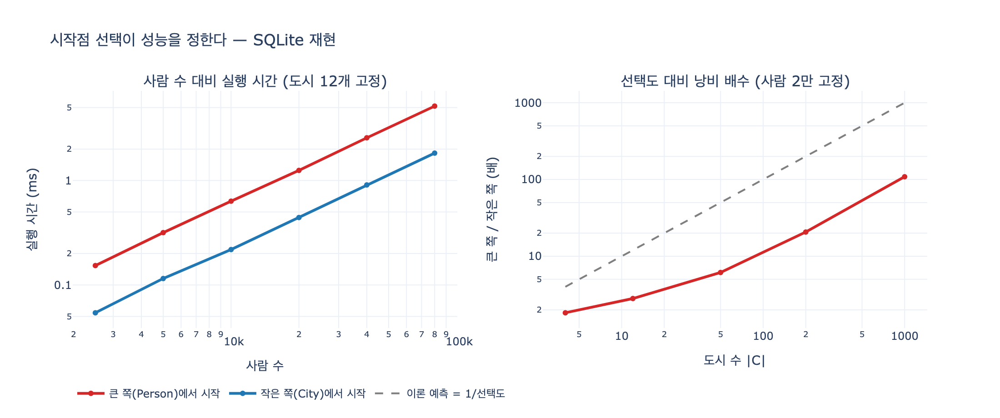

# `ex5_read_plan.py`가 비교하는 두 질의의 차이

## 한 줄 답

**같은 답을 내는 두 질의를, 서로 반대쪽 끝에서 시작하도록 쓴 것이다.** 하나는 작은 쪽(City 12개)에서 출발하고, 다른 하나는 큰 쪽(Person 2만 명)에서 출발한다. 질의문의 글자 수는 비슷하지만 **시작점 선택이 성능을 정한다.**

---

## 1. 두 질의문 그대로

`ex5_read_plan.py`의 핵심은 이 네 줄이다.

```python
q_city_first   = ("MATCH (c:City)<-[:LivesIn]-(p:Person) "
                  "WHERE c.name = '도시3' RETURN COUNT(p)")
q_person_first = ("MATCH (p:Person)-[:LivesIn]->(c:City) "
                  "WHERE p.city = '도시3' RETURN COUNT(p)")
```

데이터는 이렇게 만든다.

```python
N_PERSON = 20_000
N_CITY   = 12
```

- `City` 12개 (`도시0` ~ `도시11`), `name`이 **PRIMARY KEY**
- `Person` 20,000명, 각자 `city` 문자열 속성을 들고 있고 (`i % 12`로 배분), `id`가 PRIMARY KEY
- `LivesIn` 간선 20,000개 (Person → City)
- 따라서 도시 하나에 사는 사람은 약 `20000 / 12 ≈ 1,667`명

두 질의가 반환하는 값은 **똑같다** (`도시3` 거주자 수, 약 1,667). 다른 것은 **어느 집합을 먼저 붙잡는가**뿐이다.

| | 시작 집합 | 걸러내는 방법 | 첫 단계 후보 수 |
|---|---|---|---|
| `q_city_first` | `City` (12개) | `c.name = '도시3'` — **PK 조회** | **1** |
| `q_person_first` | `Person` (20,000명) | `p.city = '도시3'` — 색인 없는 속성 | **20,000** (전부 훑고 필터) |

여기서 미묘하지만 중요한 점: 두 질의는 **시작점만 다른 게 아니라 걸러내는 열도 다르다.** 작은 쪽은 `City.name`(주 키)을 때리고, 큰 쪽은 `Person.city`(색인 없는 중복 문자열)를 때린다. 그래서 실제로 두 가지가 동시에 뒤바뀐다 — **① 어느 쪽에서 시작하는가**, **② 색인을 타는가.** 예제가 보여 주려는 건 이 둘이 계획에서 어떻게 다르게 찍히는지다.

---

## 2. 실행 결과 (Kuzu 0.11.3, 실제 실행)

```
사람 20,000명, 도시 12개

  작은 쪽(City)에서 시작        결과 1행     0.39 ms
  큰 쪽(Person)에서 시작       결과 1행     0.84 ms
```

`결과 1행`은 `COUNT(p)` 한 줄이라는 뜻이다. 반환 행수는 같은데 **걸린 시간이 2배 차이**다. 데이터가 2만 건밖에 안 되고 Kuzu가 벡터화된 열 지향 엔진이라 이 정도로만 벌어졌다. 행 단위로 도는 엔진, 디스크 접근이 섞이는 규모에서는 이 격차가 훨씬 커진다 — 아래 `expy.py`에서 SQLite로 재현한다.

---

## 3. 실행 계획을 읽어 보면 (`EXPLAIN`)

### 작은 쪽(City)에서 시작 — 아래에서 위로 읽는다

```
┌────────────────────────────────────┐
│         SCAN_REL_TABLE[1]          │
│          Tables: LivesIn           │
│       Direction: (c)<-[]-(p)       │
└─────────────────┬──────────────────┘
┌─────────────────┴──────────────────┐
│   PRIMARY_KEY_SCAN_NODE_TABLE[0]   │
│            Key: 도시3              │
│              Alias: c              │
│         Expressions: c.name        │
└────────────────────────────────────┘
```

맨 아래가 시작점이다. **`PRIMARY_KEY_SCAN_NODE_TABLE`** — 주 키로 노드 **하나**를 콕 집는다. 그다음 `SCAN_REL_TABLE`이 그 한 노드에 붙은 간선만 역방향(`(c)<-[]-(p)`)으로 따라간다. 만지는 것은 `1 + 1,667`.

### 큰 쪽(Person)에서 시작

```
┌───────────────────────────────┐
│       SCAN_REL_TABLE[2]       │
│        Tables: LivesIn        │
│    Direction: (p)-[]->(c)     │
└───────────────┬───────────────┘
┌───────────────┴───────────────┐
│           FILTER[1]           │
│        EQUALS(p.city)         │
└───────────────┬───────────────┘
┌───────────────┴───────────────┐
│      SCAN_NODE_TABLE[0]       │
│        Tables: Person         │
│           Alias: p            │
│      Properties: p.city       │
└───────────────────────────────┘
```

여기 맨 아래는 **`SCAN_NODE_TABLE`** — `PRIMARY_KEY_` 접두어가 없다. **전체 스캔**이다. 20,000행을 다 읽어 `FILTER[1] EQUALS(p.city)`로 1,667행만 남기고, 그다음에야 간선을 탄다. 만지는 것은 `20,000 + 1,667`.

### 계획에서 볼 것 셋 (예제가 직접 말하는 것)

예제 마지막 출력이 그대로 체크리스트다.

```
계획에서 볼 것은 셋이다.
  1. 어느 테이블부터 훑는가 («스캔» 이 어디에 있나)
  2. 색인을 타는가 아니면 전체를 훑는가
  3. 중간 결과가 몇 행으로 추정되는가
```

위 두 계획에 대입하면 — ① 시작 테이블이 `City`냐 `Person`이냐, ② `PRIMARY_KEY_SCAN`이냐 맨 `SCAN`+`FILTER`냐, ③ 첫 단계 산출이 1행이냐 20,000행이냐. 세 항목이 전부 같은 방향으로 갈린다.

> 참고: 위 출력의 `NumOutputTuples: 0`, `ExecutionTime: 0.000000`은 `EXPLAIN`이 계획만 뽑고 **실제로 돌리지 않았기** 때문이다. 실측 수치를 보고 싶으면 `EXPLAIN` 대신 `PROFILE`을 쓴다. ③의 "추정 행수"를 계획에서 확인하려면 이 구분이 중요하다.

---

## 4. 왜 작은 쪽이 유리한가 — 선택도와 카디널리티

### 비용을 식으로

간선 수를 $|E|$, 도시 수를 $|C|$, 사람 수를 $|P|$라 하자. 이 데이터에서는 $|E| = |P| = 20{,}000$, $|C| = 12$.

**작은 쪽에서 시작:**

$$\text{cost}_{\text{city}} \approx \underbrace{1}_{\text{PK 조회}} + \underbrace{\frac{|E|}{|C|}}_{\text{그 도시의 간선}} = 1 + 1{,}667$$

**큰 쪽에서 시작:**

$$\text{cost}_{\text{person}} \approx \underbrace{|P|}_{\text{전체 스캔}} + \underbrace{\frac{|E|}{|C|}}_{\text{살아남은 간선}} = 20{,}000 + 1{,}667$$

비율은

$$\frac{\text{cost}_{\text{person}}}{\text{cost}_{\text{city}}} \approx \frac{|P|}{|E|/|C|} = |C| = 12$$

즉 **낭비 배수는 필터 선택도의 역수**다. `c.name = '도시3'`의 선택도가 $\sigma = 1/12$이므로 잘못 시작하면 대략 $1/\sigma = 12$배 **더 많은 행을 만진다.**

주의할 점: 이건 *접촉 행수*의 배수이고, *시간*의 배수는 그보다 작게 나오는 게 보통이다. 큰 쪽의 2만 행은 순차 스캔이라 한 행이 싸고, 작은 쪽이 남기는 1,667행은 색인 탐색 + 조회라 한 행이 비싸기 때문이다. 아래 `expy.py`의 SQLite 실측에서 접촉 작업량은 6.6배, 시간은 2.8배로 갈렸다. Kuzu 실측도 2배였다. **비용 모형은 방향을 알려 주고, 실측이 크기를 알려 준다.**

### 선택도(selectivity)와 카디널리티(cardinality)

- **선택도** $\sigma$: 조건이 남기는 비율. `City.name = '도시3'`은 $1/12 \approx 0.083$. `Person.city = '도시3'`도 비율로는 $1/12$이지만, **색인이 없으면 그 비율을 알아내기 위해 전부 읽어야 한다.** 선택도가 좋아도 그 선택도를 값싸게 적용할 수단(색인)이 없으면 이득이 안 난다.
- **카디널리티**: 각 단계가 내놓는 행 수의 절대값. 그래프 질의는 단계마다 곱셈으로 부푼다. $|C| \to 1 \to 1{,}667$처럼 **작은 절대값에서 출발하면 뒤 단계 전체가 작아지고**, $20{,}000 \to 1{,}667 \to \dots$처럼 부풀린 뒤 줄이면 이미 낸 비용은 못 돌려받는다.

핵심 원칙 하나: **필터는 최대한 앞으로, 카디널리티는 최대한 작게 유지한다** (predicate pushdown). 두 질의의 차이는 필터가 "시작점 자체"인가 "시작한 뒤 걸러내는 것"인가의 차이다.

### 규모가 커지면

$|C|$가 고정이면 비율은 일정하게 유지되지만 **절대 격차는 $|P|$에 비례해 커진다.** 그리고 도시 수가 늘면(예: 전국 3,500개 읍면동) 선택도가 $1/3500$으로 좋아지고, 그만큼 **비율 자체가 벌어진다.** `expy.py` 실측에서 도시 4개일 때 1.8배였던 격차가 도시 1,000개에서 101배가 됐다. 3장의 "조인 폭발"이 여기서 다시 나타난다 — 시작점을 틀리면 첫 단계에서 이미 폭발한다.

---

## 5. 선언형 언어의 대가 — 그리고 내가 개입할 수 있는 곳

`ex5_read_plan.py`가 정말 하려는 말은 이거다.

```
선언형 언어의 대가가 여기 있다. 무엇을 원하는지만 적으면 편한데,
느릴 때 «왜 느린지»를 알려면 계획을 읽어야 한다.
```

Cypher·SPARQL·SQL은 전부 선언형이다. "무엇을 원하는가"만 쓰고 "어떻게 구할까"는 최적화기(optimizer)가 정한다. **시작점 선택도 원칙적으로는 최적화기의 일이다.** 그래서 위 두 질의가 성숙한 최적화기에서는 **같은 계획으로 수렴할 수도 있다.** 실제로 Kuzu에서도 두 계획 모두 결과는 정확히 같고, `SCAN_REL_TABLE` 아래에서만 갈렸다.

그러면 사용자가 할 수 있는 건 뭔가. 세 층으로 나뉜다 — **위에서 아래로 갈수록 강제력은 세지고 이식성은 나빠진다.**

### (a) 질의 재작성 — 최적화기에게 정보를 준다

최적화기가 잘못된 계획을 고르는 이유는 대개 **통계가 없거나 조건이 최적화기 눈에 안 보이기 때문**이다.

- **색인/주 키를 타는 조건으로 바꾼다.** `p.city = '도시3'` 대신 `c.name = '도시3'`. 이게 `ex5`의 두 질의 차이 그 자체다. 논리적으로 같은 조건이라도 **어느 쪽 열에 쓰는지**가 계획을 바꾼다.
- **필터를 안쪽으로 밀어 넣는다.** 서브질의/CTE로 작은 집합을 먼저 확정한 뒤 확장한다.
- **패턴 방향을 명시한다.** `(c:City)<-[:LivesIn]-(p:Person)`처럼 시작 별칭을 앞에 두면, 방향 정보가 부족한 엔진에서는 힌트처럼 작동한다.
- **불필요한 속성 반환을 줄인다.** `RETURN COUNT(p)`처럼 필요한 것만 받으면 프로젝션 단계 비용이 줄고, 열 지향 엔진에서는 읽는 열 수 자체가 줄어든다.
- **통계를 갱신한다.** RDBMS라면 `ANALYZE`. 통계가 낡으면 최적화기의 선택도 추정이 어긋나 시작점을 틀린다.

### (b) 색인 — 최적화기가 쓸 도구를 준다

`Person.city`에 색인이 있었다면 `SCAN_NODE_TABLE` + `FILTER` 대신 색인 탐색이 가능하다. 즉 **큰 쪽에서 시작하는 게 나쁜 게 아니라, 색인 없이 큰 쪽에서 시작하는 게 나쁜 것이다.**

- 그래프 DB에서는 흔히 노드 속성 색인 / 주 키가 이 역할을 한다.
- 다만 색인은 쓰기 비용과 저장 공간을 낸다. 그리고 이 예제의 `Person.city`는 애초에 **비정규화된 중복 문자열**이다 — 간선 `LivesIn`이 같은 사실을 이미 담고 있다. 색인을 더할지 열을 없앨지는 설계 문제다.

### (c) 힌트 — 최적화기의 결정을 덮어쓴다

- SQL: Oracle `/*+ LEADING(...) */`, MySQL `JOIN_ORDER`/`STRAIGHT_JOIN`, SQLite `CROSS JOIN`(재정렬 금지)·`INDEXED BY`.
- Cypher(Neo4j): `USING INDEX` / `USING SCAN` 힌트.
- 힌트는 **최후 수단**이다. 데이터 분포가 바뀌면 힌트가 오히려 발목을 잡고, 엔진 고유 문법이라 11장이 강조한 "이식 대비"와 정면으로 충돌한다(엔진 고유 요소는 격리해 두라고 한 것이 이것이다).

### 할 수 없는 것

**계획을 직접 쓰는 것.** 선언형 언어에는 "이 순서로 실행하라"를 명령형으로 적을 문법이 없다. 그래서 Gremlin 같은 **명령형/순회형** 언어와 갈린다 — Gremlin은 걸음 순서를 사용자가 정하니까 시작점 선택이 코드에 그대로 드러난다. 대신 최적화기의 도움을 못 받는다. 11.1절의 "그림 / 문장 / 걸음" 대비가 성능 관점에서 다시 나오는 지점이다.

---

## 6. 시험에 나올 요약

- 두 질의의 차이 = **시작점**. 작은 쪽(City 12개) vs 큰 쪽(Person 2만).
- 계획에서 그 차이가 찍히는 곳 = 맨 아래 스캔 연산자. `PRIMARY_KEY_SCAN_NODE_TABLE`(1행) vs `SCAN_NODE_TABLE` + `FILTER`(20,000행).
- 만지는 행 수의 낭비 배수 ≈ 필터 선택도의 역수 ≈ 도시 수. 선택도가 좋아질수록 시작점 실수의 대가가 커진다.
- 계획에서 볼 것 셋: **① 어디부터 훑나 ② 색인 타나 ③ 중간 결과 몇 행인가.**
- 선언형이므로 시작점은 최적화기가 고른다. 사용자의 개입은 **질의 재작성 → 색인 → 힌트** 순서로, 이식성을 덜 해치는 쪽부터.
- `EXPLAIN`은 계획만, 실측은 `PROFILE`.
- 11장은 "계획을 읽을 줄 알아야 한다"까지만. 고치는 법은 33장.

## 시각화


