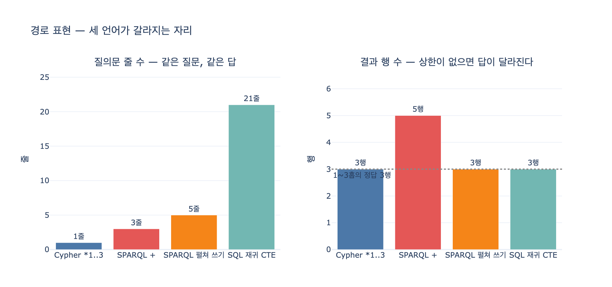

# 세 언어의 차이가 가장 크게 벌어지는 지점

**질문**: 세 언어의 차이가 가장 크게 벌어지는 지점은 어디인가?

**답**: **경로 표현**이다. Cypher는 상한을 쓸 수 있고, SPARQL은 표준에 상한 표기가 없고, SQL은 재귀 CTE 스무 줄이 된다.

---

## 왜 «경로 표현»인가

11장은 같은 질문을 세 언어로 쓴다. "해지했다가 그 뒤에 다시 계약한 고객은?" 같은 질문에서
세 언어는 **문장 모양만** 다르다.

| 언어 | 은유 | 패러다임 | 표기 예 |
|---|---|---|---|
| Cypher | **그림** | 선언형 | `(c)-[:Signed]->(n)` — 화이트보드에 그린 모양 |
| SPARQL | **문장** | 선언형 | `?c ex:signed ?n .` — 사실을 한 줄씩 늘어놓기 |
| Gremlin | **걸음** | 명령형에 가까움 | `.out('signed')` — 어디로 갈지 순서대로 지시 |

이 수준에서는 세 언어가 서로 **거의 번역이 된다**. `MATCH`/`WHERE`/`RETURN` 을
`?s ?p ?o` 트리플과 `FILTER` 로, 또는 `.out()`/`.where()` 걸음으로 옮기면 끝난다.

번역이 깨지는 자리가 하나 있다. **가변 길이 경로**(variable-length path)다.
"n단계 아래 자회사 전부", "친구의 친구의 친구", "이 부품이 들어가는 완제품 전부" 같은 질문.
여기서 세 언어는 «표기가 다르다» 수준을 넘어 **표현할 수 있는 것 자체가 달라진다**.

---

## 세 언어를 나란히

```
Cypher : -[:ParentOf*1..3]->      상한을 «반드시» 쓸 수 있다
SPARQL : ex:parentOf+             상한 표기가 없다
SQL    : WITH RECURSIVE ... 20줄  (3장 참조)
```

### Cypher — 상한이 문법에 있다

```cypher
MATCH (a:Co)-[:ParentOf*1..3]->(b:Co)
RETURN a.name, b.name ORDER BY a.name, b.name
```

`*1..3` 이 전부다. 하한 1, 상한 3. 엔진은 4홉으로 내려가지 않는다.
분기수 $d$ 에 홉 수 $k$ 면 탐색 후보가 $O(d^k)$ 로 자라는데, 그 폭발을
**질의문 몇 글자**로 막는다. `*..3`, `*2..`, `*` 같은 변형도 있다.

### SPARQL — 상한 표기가 표준에 없다

```sparql
SELECT ?p ?c WHERE { ?a ex:parentOf+ ?b . ?a ex:name ?p . ?b ex:name ?c }
```

SPARQL 1.1 [속성 경로](https://www.w3.org/TR/sparql11-query/#propertypaths)가 제공하는 건 이 정도다.

| 연산자 | 뜻 |
|---|---|
| `p` | 정확히 1회 |
| `p?` | 0 또는 1회 |
| `p*` | 0회 이상 |
| `p+` | 1회 이상 |
| `p1/p2` | 이어 붙이기 |
| `p1\|p2` | 둘 중 하나 |
| `^p` | 역방향 |

**`{1,3}` 같은 횟수 상한 문법이 없다.** 작업 초안 단계에 `{n,m}` 표기가 있었지만
최종 권고안에서 빠졌다. 그래서 SPARQL 로는 «1~3홉»을 물어볼 수 없고,
«1홉 이상 전부»만 물어본 다음 **홉 수가 지워진 답**을 받는다.

결과가 어떻게 달라지는가. 5단계 사슬(`가온테크 → 가온소프트 → 가온연구소 → 가온랩스 → 가온마이크로 → 가온나노`)에서
뿌리를 물으면

- Cypher `*1..3` → 3행 (가온소프트, 가온연구소, 가온랩스)
- SPARQL `+` → 5행 (4홉·5홉인 가온마이크로, 가온나노가 딸려온다)

같은 질문에 **다른 답**이 나온다. 그래서 9장의 «상한을 걸어라»를 SPARQL 에서는
**언어 밖에서** 지켜야 한다.

1. 질의 **타임아웃** (엔진/프록시 설정)
2. 결과 **개수 제한** (`LIMIT`)
3. 깊이를 **명시적으로 펼쳐 쓰기** ← 실무 해법

```sparql
SELECT ?p ?c WHERE {
  ?a ex:parentOf | ex:parentOf/ex:parentOf | ex:parentOf/ex:parentOf/ex:parentOf ?b .
  ?a ex:name ?p . ?b ex:name ?c
} ORDER BY ?p ?c
```

상한 3 은 대안 3개. 상한 6 이면 6개. Cypher 의 `*1..6` 한 글자가 SPARQL 에서는 줄 수로 자란다.

### SQL — 재귀 CTE

SQL 에는 «경로»라는 개념이 없다. 조인을 반복하는 재귀 블록을 직접 짜고,
그 안에서 세 가지를 **손으로** 처리한다.

```sql
WITH RECURSIVE
  descendant (root, node, depth, path) AS (
      -- 씨앗: 1홉
      SELECT p.parent, p.child, 1,
             '/' || p.parent || '/' || p.child || '/'
        FROM parent_of p
    UNION ALL
      -- 재귀: 한 홉 더. 상한과 순환 차단이 여기 들어간다
      SELECT d.root, p.child, d.depth + 1,
             d.path || p.child || '/'
        FROM descendant d
        JOIN parent_of p
          ON p.parent = d.node
       WHERE d.depth < 3
         AND d.path NOT LIKE '%/' || p.child || '/%'
  )
SELECT root, node, MIN(depth) AS depth
  FROM descendant
 WHERE root = ?
 GROUP BY root, node
 ORDER BY depth, node
```

21줄이다. 손으로 적어야 하는 것들:

| 항목 | Cypher | SPARQL | SQL |
|---|---|---|---|
| 깊이 세기 | 엔진 | 엔진(값은 안 줌) | `depth + 1` 직접 |
| **상한** | `*1..3` 문법 | **없음** | `WHERE d.depth < 3` 직접 |
| 순환 차단 | 엔진 | 집합 의미론이 처리 | `path NOT LIKE ...` 직접 |
| 중복 제거 | 엔진 | 집합 의미론 | `GROUP BY` / `DISTINCT` 직접 |

순환 차단을 빼면 상한이 없는 순간 **무한 루프**다. 즉 SQL 에서는
안전장치가 질의문 본문 안에 섞여 있고, 그걸 빼먹으면 프로덕션이 멈춘다.

---

## 이 차이가 실무에서 뜻하는 것

- **문법 취향 문제가 아니다.** «운영 안전장치를 언어가 주는가»의 문제다.
  상한을 문법으로 강제할 수 있으면 코드 리뷰에서 잡히고, 없으면 인프라 설정에 의존한다.
- **이식이 여기서 막힌다.** Cypher 질의를 SPARQL 로 옮기면 `*1..3` 을 옮길 방법이 없어
  펼쳐 쓰거나 상한을 포기한다. 반대로 SPARQL `+` 를 Cypher 로 옮기면 상한을 «새로 정해야» 한다.
- **표준이 있다고 모든 게 표준으로 되는 건 아니다.** SPARQL 은 W3C 표준인데도 이 구멍이 있고,
  GQL 은 2024년 ISO 표준(ISO/IEC 39075:2024)이 됐는데도 엔진들이 `LET`/`NEXT`/`FILTER` 같은
  표준 전용 절을 아직 안 받는다. 이런 구멍이 실무를 정한다.
- **대비책**(11장 요약): 질의문을 한곳에 모으고, `ORDER BY` 를 강제하고,
  엔진 고유 함수를 격리하고, «이 질의가 어떤 질문에 답하는가»를 주석으로 남긴다.

---

## 1차 출처

- [SPARQL 1.1 Query Language — Property Paths](https://www.w3.org/TR/sparql11-query/#propertypaths) (W3C 권고안)
- [Cypher Manual — Variable-length patterns](https://neo4j.com/docs/cypher-manual/current/)
- [ISO/IEC 39075:2024 — GQL](https://www.iso.org/standard/76120.html)
- [ISO/IEC 9075-16:2023 — SQL/PGQ](https://www.iso.org/standard/79473.html)
- [Apache TinkerPop (Gremlin) Reference](https://tinkerpop.apache.org/docs/current/reference/)
- 장 안의 실행 예제: `content/ch11/code/ex2_path_queries.py`

## 시각화



왼쪽은 같은 질문을 쓴 질의문의 줄 수, 오른쪽은 그 질의가 돌려주는 행 수다.
SPARQL `+` 만 «정답 3행»선을 넘어간다. 상한을 표현할 수 없어서다.
