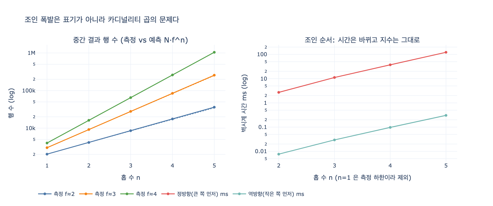

# SQL/PGQ로 옮겨도 남는 문제는 무엇인가?

**답: 조인 폭발이다. 문제는 저장 위치가 아니라 '따라가는 값'이었기 때문이다.**

11장 4절 「테이블은 그대로 두고 그래프로 보기」와 예제 `ex4_sql_pgq.py`의 마지막 문장이 이 카드의 출처입니다.

> 그리고 옮기지 않아도 된다는 게 공짜라는 뜻은 아니다.
> 조인 폭발은 그대로 남는다(3장). 저장 위치가 아니라 «따라가는 값»이 문제였으니까.

---

## 1. SQL/PGQ가 실제로 하는 일

SQL/PGQ(**ISO/IEC 9075-16:2023**, SQL 표준의 16번째 파트)는 SQL에 「속성 그래프 질의」를 얹는 표준입니다. 핵심은 두 문법입니다.

| 문법 | 역할 |
|---|---|
| `CREATE PROPERTY GRAPH` | 기존 테이블을 정점 테이블 / 엣지 테이블로 **선언**한다 |
| `GRAPH_TABLE(g MATCH ... COLUMNS (...))` | 그래프 패턴으로 매칭하고 결과를 **관계형 테이블로 되돌린다** |

여기서 결정적인 사실: **데이터는 한 바이트도 움직이지 않습니다.** `company`, `contract`, `signed`, `terminated` 테이블은 그대로 있고, 그 위에 「이건 정점, 이건 엣지」라는 **메타데이터 레이어(뷰)** 만 올라갑니다. 새 저장소도, ETL 파이프라인도, 이중 쓰기도 없습니다.

그래서 3장에서 말한 「두 벌 운영」의 비용 — RDB와 그래프 DB를 동시에 굴리며 동기화하는 비용 — 을 피할 수 있습니다. 이것이 SQL/PGQ가 매력적인 이유입니다.

```sql
-- ex4_sql_pgq.py 에서 발췌
SELECT * FROM GRAPH_TABLE (biz
  MATCH (c IS Company)-[IS Terminated]->(o IS Contract),
        (c)-[IS Signed]->(n IS Contract)
  WHERE o.ended_on < n.started_on
  COLUMNS (c.name AS 고객)
);
```

같은 뜻의 평범한 SQL은 이렇습니다.

```sql
SELECT DISTINCT c.name AS 고객
  FROM company c
  JOIN terminated t ON t.company_name = c.name
  JOIN contract   o ON o.id = t.contract_id
  JOIN signed     s ON s.company_name = c.name
  JOIN contract   n ON n.id = s.contract_id
 WHERE o.ended_on < n.started_on
```

두 문장의 **답은 같습니다**. 그리고 — 이게 요점입니다 — **실행 방식도 같습니다.**

---

## 2. 왜 조인 폭발은 문법 문제가 아닌가

### 폭발의 정체는 곱셈이다

한 노드에서 평균 $f$ 개의 엣지를 따라간다고 합시다. 시작점이 $N$ 개면 $n$ 홉 뒤의 중간 결과 행 수는

$$|R_n| \;\approx\; N \cdot f^{\,n}$$

입니다. $f=3$, $N=2000$, $n=5$면 약 48만 행. $f=10$, $n=5$면 2억 행입니다. 이 곱셈은 관계형 조인에서는 「조인 폭발」, 그래프 순회에서는 「팬아웃 폭발」로 불리지만 **같은 현상**입니다.

여기서 결정적인 관찰: 위 식에 **문법이 등장하는 자리가 없습니다.** $N$ 과 $f$ 는 데이터의 성질입니다. 「해지 계약 1건당 재계약이 평균 몇 건 딸려 오는가」, 「이 노드의 차수(degree)가 몇인가」. 질의를 `JOIN`으로 쓰든 `MATCH (a)-[:E]->(b)`로 쓰든, 엔진이 만들어야 하는 중간 튜플의 개수는 바뀌지 않습니다.

### 표기와 실행을 분리해서 보기

| 층 | SQL/PGQ가 바꾸는가 | 내용 |
|---|:---:|---|
| **표기(surface syntax)** | O | 재귀 CTE 20줄 → 패턴 한 줄. 사람이 의도를 읽을 수 있게 된다 |
| **논리 계획(logical plan)** | X | 패턴은 결국 조인 트리로 정규화된다. `->{4}` 는 「4번 조인」의 다른 이름 |
| **중간 결과 카디널리티** | X | $N \cdot f^{\,n}$. 데이터가 정하는 값 |
| **물리 연산자** | X | 여전히 중첩 루프 / 해시 조인 / 색인 탐색 |
| **데이터 이동 비용** | O | 옮길 필요가 없다. 이게 SQL/PGQ의 진짜 값어치 |

즉 SQL/PGQ는 **읽기 쉬운 표기와 저장소 통합**을 줍니다. **실행 비용의 지수**는 손대지 않습니다.

### 「따라가는 값」이 문제였다

카드 답의 두 번째 문장이 이 지점을 정확히 찌릅니다. 3장에서 조인이 폭발한 이유는 「데이터가 RDB에 있어서」가 아니었습니다. **「A에서 B로 가는 참조를 여러 단계 따라가야 해서」** 였습니다.

그래프 DB로 옮기면 한 홉의 비용은 싸집니다(인접 리스트 포인터 추적 vs. 색인 조회). 이건 진짜 이득입니다. 그런데 그건 위 식의 **상수 $C$** 를 줄이는 것입니다.

$$T(n) \;\sim\; C \cdot f^{\,n}$$

$C$ 를 100배 줄여도 $f^{\,n}$ 은 그대로입니다. $f=3$이면 홉 5개만 더 늘어나면 그 100배 이득이 지워집니다. SQL/PGQ는 $C$ 조차 줄이지 않습니다 — 저장소가 여전히 관계형이니까요. 대신 이사 비용을 안 냅니다.

---

## 3. 실행 계획으로 보는 증거

`expy.py`에서 4홉 조인 사슬의 SQLite 실행 계획을 뽑으면 이렇게 나옵니다.

```
SCAN e2
SEARCH e3 USING INDEX ix_edge_src (src=?)
SEARCH e1 USING COVERING INDEX ix_edge_dst (dst=?)
SEARCH e4 USING COVERING INDEX ix_edge_src (src=?)
```

읽는 법:

- 옵티마이저는 내가 쓴 순서(`e1→e2→e3→e4`)를 무시하고 **자기 순서**를 골랐습니다. 순서 최적화가 실제로 작동합니다.
- 색인도 잘 탑니다. `SEARCH ... USING INDEX` 는 한 단계 비용이 $O(\log)$ 라는 뜻입니다.
- 그런데 **줄 수가 4줄입니다.** 홉이 4개니까요. 중첩 루프가 4단이고, 각 단이 평균 $f$ 배로 곱해집니다.

11장 예제 5(`ex5_read_plan.py`)가 「계획에서 볼 것 셋」으로 꼽은 세 번째 항목이 정확히 이겁니다: **「중간 결과가 몇 행으로 추정되는가」.** 옵티마이저는 어느 테이블부터 훑을지, 색인을 탈지를 골라 줍니다. 곱셈 단 수를 줄여 주지는 않습니다.

---

## 4. 순서를 바꿔도 지수는 남는다 (측정 결과)

`expy.py`는 「시드 노드 5개에 $n$ 홉으로 도달하는 걷기의 개수」를 두 순서로 셉니다.

- **정방향(큰 쪽 먼저)**: 엣지 전체에서 출발해 전진 → 마지막에 시드로 필터. 중간 결과 $\approx N f^{\,n}$
- **역방향(작은 쪽 먼저)**: 시드에 꽂히는 엣지부터 거꾸로 올라감. 중간 결과 $\approx |S| f^{\,n}$

| 홉 | 결과 행 | 정방향 ms | 역방향 ms | 배속 |
|---:|---:|---:|---:|---:|
| 2 | 57 | 2.6 | 0.0 | 321x |
| 3 | 178 | 10.8 | 0.0 | 392x |
| 4 | 528 | 36.5 | 0.1 | 371x |
| 5 | 1,591 | 118.4 | 0.3 | 396x |

읽어야 할 두 가지:

1. **결과 행 수는 완전히 같습니다.** 순서를 바꾼 건 최적화지 의미 변경이 아닙니다.
2. **300배 이상 빨라졌지만, 홉당 증가율은 여전히 약 3배($\approx f$)입니다.** 역방향 시간의 홉당 배수는 x4.08 → x3.38 → x3.56 → x3.04. 상수 $C$ 가 $N/|S| = 400$ 배 줄었을 뿐 $f^{\,n}$ 은 살아 있습니다.

팬아웃을 바꿔 보면 지수의 밑이 곧 팬아웃임이 드러납니다.

```
f≈2: 2,030 → 4,156 → 8,535 → 17,536 → 36,032    (홉당 약 2배)
f≈3: 3,013 → 9,172 → 27,827 → 84,410 → 256,345  (홉당 약 3배)
f≈4: 4,013 → 16,156 → 64,846 → 260,014 → 1,042,220 (홉당 약 4배)
```

---

## 5. 그러면 무엇이 지수를 줄이는가

문법도, 저장소도, 조인 순서도 아닙니다. **질문을 바꿔야** 합니다.

| 대책 | 무엇을 건드리는가 |
|---|---|
| 홉 상한 (`*1..3`) — 9장 | $n$ 을 상수로 묶는다. Cypher는 되고 SPARQL 표준은 상한 표기가 없다(11.2절) |
| 슈퍼노드 제외 / 차수 상한 | $f$ 를 줄인다. 지수의 밑을 직접 공격 |
| `LIMIT` + 결과 개수 제한 | 폭발을 다 만들기 전에 끊는다 (SPARQL에서 상한 대신 쓰는 우회) |
| 질의 타임아웃 | 폭발을 막지는 못하지만 시스템을 지킨다 |
| 사전 계산 / 요약 테이블 | 런타임의 $f^{\,n}$ 을 오프라인으로 옮긴다 |
| 최단 경로 등 «전부 아닌» 시맨틱 | 모든 걷기가 아니라 하나만 찾으면 지수를 회피한다 |

11.2절의 「SPARQL에는 최대 몇 홉을 적는 표준 문법이 없다」가 왜 실무적으로 중요한지도 여기서 설명됩니다. 상한은 문법 장식이 아니라 **지수를 자르는 유일한 안전장치**입니다.

---

## 6. 한 줄 정리

SQL/PGQ는 「어디에 저장하느냐」 문제를 해결합니다(옮기지 않아도 됨). 「몇 개를 따라가느냐」 문제는 해결하지 않습니다. 조인 폭발은 후자에 속하므로, 표기를 바꿔도 그대로 남습니다.

덧붙여 2026년 8월 확인 시점 기준으로 SQL/PGQ를 프로덕션에서 쓰는 팀은 드뭅니다. 구현이 아직 덜 퍼졌습니다. 즉 SQL/PGQ는 「지금 성능 문제를 푸는 도구」가 아니라 「앞으로 이렇게 될 가능성」입니다 — 그리고 그 가능성이 실현되어도 조인 폭발은 여전히 우리 몫입니다.

---

## 참고 출처

- [ISO/IEC 9075-16:2023 (SQL/PGQ)](https://www.iso.org/standard/79473.html)
- [ISO/IEC 39075:2024 (GQL)](https://www.iso.org/standard/76120.html)
- [SPARQL 1.1 property paths](https://www.w3.org/TR/sparql11-query/#propertypaths)
- 11장 예제: `code/ex4_sql_pgq.py`, `code/ex5_read_plan.py`

## 시각화



왼쪽: 홉 수에 따른 중간 결과 행 수(로그 축). 세 팬아웃 모두 직선 = 지수 증가이고, 기울기가 $\log f$ 입니다. 점선은 해석식 $N \cdot f^{\,n}$ 예측치로, 측정값과 겹칩니다.

오른쪽: 같은 질의를 정방향/역방향으로 실행한 벽시계 시간(로그 축). 두 선의 **높이 차이**가 조인 순서 최적화의 이득이고, 두 선이 **거의 평행하다**는 것이 「지수는 남는다」의 증거입니다. (1홉은 측정 하한 아래라 제외했습니다. 시간 수치는 실행 환경에 따라 달라지지만 기울기는 유지됩니다.)
