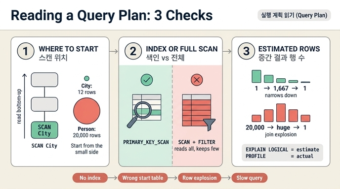

# 실행 계획에서 확인할 세 가지

> **질문** 실행 계획에서 확인할 세 가지는 무엇인가?
>
> **답** 어느 테이블부터 훑는가(스캔 위치), 색인을 타는가 아니면 전체를 훑는가, 중간 결과가 몇 행으로 추정되는가다.

## 왜 계획을 읽어야 하는가

Cypher와 SPARQL은 **선언형**이다. "무엇을 원하는지"만 쓰고 "어떻게 찾을지"는 엔진의 최적화기가 정한다. 편한 대신 대가가 있다. 질의문이 똑같이 생겼는데 하나는 빠르고 하나는 느릴 때, 질의문만 봐서는 이유를 알 수 없다. **성능을 정하는 건 질의문이 아니라 계획**이기 때문이다.

11장 `ex5_read_plan.py`는 이걸 실측으로 보여 준다. 사람 20,000명 / 도시 12개 그래프에서 논리적으로 **완전히 같은 답**을 내는 두 질의를 비교한다.

```cypher
-- A. 작은 쪽(City)에서 시작
MATCH (c:City)<-[:LivesIn]-(p:Person) WHERE c.name = '도시3' RETURN COUNT(p)

-- B. 큰 쪽(Person)에서 시작
MATCH (p:Person)-[:LivesIn]->(c:City) WHERE p.city = '도시3' RETURN COUNT(p)
```

| 질의 | 결과 | 최소 실행 시간 (Kuzu 0.11.3, 3회 중 최소) |
|---|---|---|
| A. 작은 쪽(City)에서 시작 | 1행 | **0.32 ms** |
| B. 큰 쪽(Person)에서 시작 | 1행 | 0.90 ms |

약 2.8배 차이다. 답은 같다. 계획이 다르다. 그 차이를 세 곳에서 읽는다.

---

## 세 가지를 계획의 어느 줄에서 읽는가

Kuzu의 계획은 **아래에서 위로** 읽는다. 트리의 맨 아래 잎(leaf)이 최초 데이터 접근이고, 위로 올라가면서 확장·필터·집계가 얹힌다. SQL 계획(Postgres 등)과 방향이 반대라는 점을 기억해 두면 헷갈리지 않는다.

### 1. 어느 테이블부터 훑는가 — 「스캔」이 어디에 있나

**읽는 줄**: 계획 트리의 **가장 아래 노드**. Kuzu에서는 `SCAN_NODE_TABLE` 또는 `PRIMARY_KEY_SCAN_NODE_TABLE`이고, 그 안의 `Tables:` / `Alias:` 줄이 "무엇부터 시작하는가"를 말해 준다.

A안(City 먼저)의 물리 계획 맨 아래:

```
┌─────────────────┴──────────────────┐
│         SCAN_REL_TABLE[1]          │
│          Tables: LivesIn           │
│       Direction: (c)<-[]-(p)       │   ← 확장 방향
└─────────────────┬──────────────────┘
┌─────────────────┴──────────────────┐
│   PRIMARY_KEY_SCAN_NODE_TABLE[0]   │   ← 여기서 시작: City
│            Key: 도시3              │
│              Alias: c              │
└────────────────────────────────────┘
```

B안(Person 먼저)의 맨 아래:

```
┌─────────────────┴──────────────────┐
│           FILTER[1]                │
│        EQUALS(p.city)              │
└─────────────────┬──────────────────┘
┌─────────────────┴──────────────────┐
│      SCAN_NODE_TABLE[0]            │   ← 여기서 시작: Person (20,000행)
│        Tables: Person              │
│           Alias: p                 │
│      Properties: p.city            │
└────────────────────────────────────┘
```

**핵심**: 시작점이 `City`(12행)인지 `Person`(20,000행)인지가 여기서 드러난다. 좋은 계획은 **선택도가 높은(=결과가 적게 나오는) 쪽부터** 시작해서 확장한다. 9장의 "상한을 걸어라"와 같은 원리다 — 탐색 공간을 작게 시작해야 한다.

**나쁠 때의 증상**
- 필터 조건이 걸린 작은 테이블이 아니라 **가장 큰 테이블이 트리 맨 아래에** 있다.
- 데이터가 커질수록 시간이 선형(또는 그 이상)으로 늘어난다. 결과는 1행인데 실행 시간이 데이터 총량에 비례한다.
- 개발 DB(수천 행)에서는 멀쩡하고 운영 DB(수백만 행)에서 갑자기 죽는다.
- 여러 홉짜리 경로 질의에서 중간에 메모리가 터진다. 시작점이 커서 확장 폭이 처음부터 넓다.

### 2. 색인을 타는가 아니면 전체를 훑는가

**읽는 줄**: 같은 잎 노드의 **연산자 이름**. Kuzu는 이름 자체가 답이다.

| 계획에 나오는 연산자 | 뜻 |
|---|---|
| `PRIMARY_KEY_SCAN_NODE_TABLE` + `Key: 도시3` | **색인(기본 키) 조회.** 딱 1행만 집어 온다 |
| `SCAN_NODE_TABLE` + 위쪽에 별도 `FILTER` | **전체 스캔 후 걸러내기.** 전부 읽고 나서 버린다 |

A안에는 `PRIMARY_KEY_SCAN_NODE_TABLE`이 있고 `FILTER` 노드가 **아예 없다**. `c.name`이 City의 기본 키라 조건이 스캔 안으로 밀려 들어갔기(pushdown) 때문이다. B안에는 `SCAN_NODE_TABLE`(Person 전체) 위에 `FILTER: EQUALS(p.city)`가 따로 서 있다. `p.city`는 Person의 기본 키가 아니라 그냥 속성이므로 색인이 없다. 20,000행을 다 읽고 1,667행만 남긴다.

**나쁠 때의 증상**
- 조건절 바로 위에 독립된 `FILTER` 노드가 있고, 그 아래 스캔이 테이블 전체 크기를 읽는다.
- 조건을 더 좁혀도(`= '도시3'` → `= '도시7'`) 실행 시간이 **거의 안 줄어든다**. 필터 뒤 행 수는 줄었는데 읽는 양이 그대로라서다.
- `WHERE`에 함수·형변환을 씌우면(`WHERE lower(p.city) = ...`) 색인이 있어도 못 탄다. 계획에서 색인 스캔이 전체 스캔으로 바뀌는 것으로 확인된다.
- SQL 쪽 대표 증상은 `Seq Scan`(Postgres) / `SCAN t`(SQLite)가 큰 테이블에 붙어 있는 것.

### 3. 중간 결과가 몇 행으로 추정되는가

**읽는 줄**: Kuzu에서는 계획 종류에 따라 읽는 필드가 다르다. 이게 실무에서 제일 자주 헷갈리는 지점이다.

| 명령 | 보이는 필드 | 의미 |
|---|---|---|
| `EXPLAIN LOGICAL <query>` | `Cardinality:` | 최적화기의 **추정** 행 수 |
| `EXPLAIN <query>` | `NumOutputTuples: 0` | 실행 안 했으므로 **전부 0 — 여기서 행 수를 읽으면 안 된다** |
| `PROFILE <query>` | `NumOutputTuples:` + `ExecutionTime:` | **실제** 행 수와 실제 시간 |

`EXPLAIN LOGICAL`로 두 질의의 추정치를 나란히 놓으면 차이가 한눈에 보인다.

```
A안 (City 먼저)                      B안 (Person 먼저)
  PROJECTION   Cardinality: 1666       PROJECTION   Cardinality: 1666
  EXTEND       Cardinality: 1666       EXTEND       Cardinality: 1666
  SCAN c.name  Cardinality: 1     ←    FILTER       Cardinality: 1666
                                       SCAN p.city  Cardinality: 20000  ←
```

맨 아래 시작점이 **1행 대 20,000행**이다. 최종 결과는 둘 다 1행인데 출발점 크기가 2만 배 다르다. `PROFILE`로 실제 값을 확인하면 A안은 `PRIMARY_KEY_SCAN_NODE_TABLE`이 `NumOutputTuples: 1`, 그 위 `SCAN_REL_TABLE`이 `NumOutputTuples: 1667`로 나온다 — 추정과 실제가 맞는다.

**나쁠 때의 증상**
- **추정치와 실제치가 크게 벌어진다.** `EXPLAIN LOGICAL`의 `Cardinality`가 100인데 `PROFILE`의 `NumOutputTuples`가 1,000,000이면 최적화기가 잘못된 통계로 계획을 짠 것이다. 조인 순서 선택 자체가 틀어져 있다.
- 중간 단계 행 수가 최종 결과보다 **자릿수 단위로 크다**. 3장의 「조인 폭발」이 계획에 찍힌 모습이다. 결과 10행을 얻으려고 중간에 500만 행을 만들고 있다면 계획을 고쳐야 한다.
- 단계를 올라갈수록 행 수가 계속 커진다(수렴하지 않는다). 가변 길이 경로에 상한이 없을 때 나타나는 전형적인 모양이다.
- 메모리 스파이크, 디스크 스필, OOM은 거의 전부 이 항목의 증상으로 먼저 드러난다.

---

## SQL 쪽 대응 관계

같은 세 가지를 SQL 계획에서도 읽는다. 이름만 다르다. 11장 `ex4_sql_pgq.py`의 조인 질의에 SQLite `EXPLAIN QUERY PLAN`을 붙여 보면 이렇다.

색인이 없을 때:

```
SCAN c USING COVERING INDEX sqlite_autoindex_company_1
SEARCH t USING AUTOMATIC COVERING INDEX (company_name=?)   ← 임시 색인을 즉석에서 만든다
SEARCH o USING INDEX sqlite_autoindex_contract_1 (id=?)
SEARCH s USING AUTOMATIC COVERING INDEX (company_name=?)
SEARCH n USING INDEX sqlite_autoindex_contract_1 (id=?)
```

`terminated(company_name)`, `signed(company_name)`에 색인을 만든 뒤:

```
SCAN t                                                     ← 시작 테이블이 바뀌었다
SEARCH o USING INDEX sqlite_autoindex_contract_1 (id=?)
SEARCH s USING INDEX ix_s (company_name=?)                 ← AUTOMATIC이 사라졌다
SEARCH c USING COVERING INDEX sqlite_autoindex_company_1 (name=?)
SEARCH n USING INDEX sqlite_autoindex_contract_1 (id=?)
USE TEMP B-TREE FOR DISTINCT
```

색인 하나 추가로 **시작 테이블(1번)과 접근 방식(2번)이 동시에 바뀌었다**. 계획을 안 읽었다면 이 변화를 눈으로 확인할 방법이 없다.

| 확인 항목 | Kuzu (Cypher) | SQLite | PostgreSQL |
|---|---|---|---|
| 1. 어디부터 훑는가 | 트리 맨 아래 `SCAN_*` 노드의 `Tables:` | 첫 `SCAN` / `SEARCH` 줄 | 계획 트리의 가장 안쪽(들여쓰기 깊은) 노드 |
| 2. 색인 vs 전체 | `PRIMARY_KEY_SCAN_NODE_TABLE` vs `SCAN_NODE_TABLE`+`FILTER` | `SEARCH ... USING INDEX` vs `SCAN t` | `Index Scan` / `Index Only Scan` vs `Seq Scan` |
| 3. 추정 행 수 | `EXPLAIN LOGICAL`의 `Cardinality:` | `EXPLAIN QUERY PLAN`엔 없음 (`ANALYZE`로 통계 보강) | `EXPLAIN`의 `rows=` (추정), `EXPLAIN ANALYZE`의 `actual rows=` (실제) |

PostgreSQL은 `EXPLAIN ANALYZE`에서 `rows=`(추정)와 `actual rows=`(실제)를 **한 줄에 같이** 보여 준다. 두 값의 비율이 계획 문제를 진단하는 첫 번째 신호다. 어긋나면 `ANALYZE`로 통계를 갱신하는 것이 첫 조치다. Kuzu에서는 `EXPLAIN LOGICAL`(추정)과 `PROFILE`(실제)을 각각 따로 실행해서 비교해야 한다.

---

## 세 가지가 서로 얽혀 있다

이 셋은 독립 체크리스트가 아니라 **하나의 인과 사슬**이다.

```
색인이 없다 (2번)
   → 최적화기가 큰 테이블부터 훑는 계획을 고른다 (1번)
      → 중간 결과가 폭발한다 (3번)
         → 느려지고, 메모리가 터진다
```

거꾸로 진단하는 순서는 반대다. 증상(느림)은 3번에서 먼저 보이고, 원인은 1번에 있고, 해결책은 보통 2번(색인)이나 질의문 재작성이다. 그래서 계획을 읽을 때는 **아래에서 위로(1→2→3) 읽고, 문제는 위에서 아래로 추적**하게 된다.

## 외우는 방법

| # | 한 단어 | 계획에서 찾는 것 | 물어볼 질문 |
|---|---|---|---|
| 1 | **어디서** | 트리 맨 아래 `SCAN` | 작은 쪽부터 시작하는가? |
| 2 | **어떻게** | `PRIMARY_KEY_SCAN` vs `SCAN`+`FILTER` | 색인을 타는가? |
| 3 | **얼마나** | `Cardinality` / `NumOutputTuples` | 중간이 결과보다 훨씬 큰가? |

**어디서 → 어떻게 → 얼마나**. 스캔 위치, 접근 방식, 행 수 추정.

11장은 "읽을 줄 알아야 한다"까지만 다룬다. 계획을 **고치는** 법(힌트, 색인 설계, 질의 재작성)은 33장이다.

## 함께 볼 것

- 3장 — 조인 폭발. 3번 항목의 증상이 왜 생기는지
- 9장 — 경로 상한. 1번·3번을 질의문 차원에서 막는 법
- 33장 — 계획 고치기
- [Kuzu Query Optimizer / EXPLAIN](https://docs.kuzudb.com/)
- [PostgreSQL: Using EXPLAIN](https://www.postgresql.org/docs/current/using-explain.html)

## 인포그래픽


