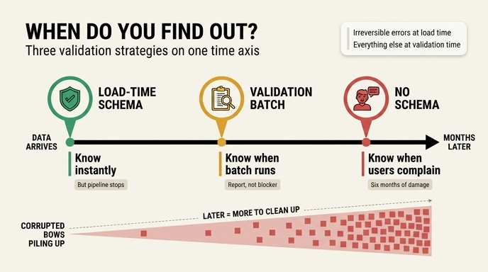

# 세 검증 방식의 진짜 차이는 무엇인가?

**답:** 언제 아느냐다. 적재 시점은 즉시(대신 파이프라인이 멈춤), 검증 시점은 배치가 돌 때, 스키마 없음은 사용자가 알려 줄 때다.

---

## 1. 세 방식은 "무엇을 잡느냐"로 나뉘지 않는다

12.3절 예제(`ex3_when_schema.py`)는 **똑같은 잘못된 데이터 두 줄**을 세 가지 방식에 넣어 본다.

```python
BAD_ROWS = [
    ("등급이 규칙 밖", "가온테크", "Z"),   # grade 가 A/B/C 가 아님
    ("이름이 비었다",  "",        "A"),   # name 이 빈 문자열
]
```

세 방식 모두 "이 데이터는 틀렸다"는 사실 자체는 언젠가 알게 된다. 다른 건 **그 사실이 나에게 도달하는 시각**이다.

| 방식 | 구현 예 | 아는 시점 | 그때까지 그래프 상태 |
|---|---|---|---|
| 스키마 강제 (적재 시점) | Kuzu `CREATE NODE TABLE ... grade STRING` | 즉시 (INSERT 가 예외를 던짐) | 오염 0건 — 애초에 안 들어감 |
| 검증 (검증 시점) | pySHACL + SHACL NodeShape | 배치가 도는 주기 (하루/일주일) | 그 주기만큼 오염이 쌓여 있음 |
| 스키마 없음 | 아무 검사 없음 | 사용자가 이상하다고 말할 때 | 6개월치 오염이 쌓여 있음 |

책의 문장 그대로:

> 세 방식의 진짜 차이는 «언제 아느냐»다.
> 적재 시점 — 즉시. 대신 적재가 실패하니 파이프라인이 멈춘다.
> 검증 시점 — 배치가 돌 때. 데이터는 들어가 있고 보고서로 안다.
> 없음 — 사용자가 알려 준다.

## 2. 왜 "언제"가 본질인가 — 지연 시간 = 오염 데이터 누적량

"무엇을 잡느냐"는 축은 별로 변별력이 없다. SHACL 로 잡을 수 있는 제약은 대체로 적재 시점 CHECK 로도 잡을 수 있고, 반대도 마찬가지다. 실제로 예제에서 Kuzu 는 타입은 막지만 **값의 범위(A/B/C 중 하나)는 못 막는다** — 이 엔진에 CHECK 제약이 없기 때문이다. 즉 "무엇"은 엔진 사정에 따라 흔들리는, 우연한 축이다.

반면 "언제"는 필연적인 축이고, 곧바로 비용으로 환산된다.

```
복구 비용 ≈ 발견 지연 시간 × 오염 유입 속도 × 하류 파급 계수
```

- **발견 지연**이 0이면 고칠 데이터가 0건이다. 파이프라인만 다시 돌리면 된다.
- **발견 지연**이 일주일이면 일주일치 오염이 그래프에 남는다. 다만 "어느 노드가 틀렸는지" SHACL 보고서가 focus node 목록으로 알려 주므로 범위가 특정된다.
- **발견 지연**이 6개월이면 오염 데이터가 이미 다른 노드와 관계를 맺고, 파생 테이블에 복제되고, 대시보드 수치에 반영되고, 그걸 근거로 의사결정까지 내려졌다. 이 시점에는 "틀린 행을 지운다"가 아니라 **어디까지 퍼졌는지 추적하는 일**이 본 작업이 된다.

같은 오류라도 발견이 늦어질수록 고칠 대상이 산술적으로가 아니라 파급적으로 늘어난다. 그래서 축이 "언제"인 것이다.

## 3. 각 방식의 트레이드오프

### 적재 시점 — 파이프라인이 멈춘다

장점은 명확하다. 그래프에 오염이 0건이고, 스택 트레이스에 어느 행에서 실패했는지 그대로 찍힌다.

대가는 **가용성**이다. 야간 ETL 이 100만 행 중 3행 때문에 죽으면, 아침에 아무도 최신 데이터를 못 본다. 원천 시스템이 남의 것이라 당장 못 고치는 경우가 흔하고, 그러면 "지금 급하니까 검증을 잠깐 끄자"가 나오고, 그 스위치는 다시 안 켜진다.

> 적재를 너무 엄격하게 잡으면 데이터가 아예 안 들어와서 그것대로 문제가 된다.

즉 적재 시점 검증의 진짜 실패 모드는 "너무 많이 잡아서 결국 검증을 꺼 버리는 것"이다.

### 검증 시점 — 오염을 일단 허용한다

데이터는 들어간다. 파이프라인은 안 죽는다. 대신 **한 배치 주기만큼의 오염을 의도적으로 감수**하는 계약을 맺은 것이다. 여기서 중요한 건 이 감수량이 **설계 변수**라는 점이다. 매시간 돌리면 1시간치, 주간이면 1주일치다. 위험한 제약일수록 주기를 짧게 가져가면 된다.

또 하나의 장점은 **보고서 형태**라는 것. SHACL 결과는 위반 건수, focus node, value node, message 를 준다. 즉 "고쳐야 할 목록"이 나온다. 적재 시점 실패는 목록이 아니라 중단이다. 트리아지에는 목록이 낫다.

같은 12장의 `ex5_schema_drift.py`(드리프트 감사)도 정확히 이 자리에 있는 도구다. 30줄짜리 배치가 "선언에 없는 키"와 "빠진 키"를 세어 준다. **문서를 믿지 않고 데이터에게 직접 묻는** 검증 시점 장치다.

### 스키마 없음 — 사용자가 QA 를 대신한다

"스키마 없이 시작해도 되는 건 혼자일 때와 버릴 데이터일 때뿐"이다. 이때는 지연이 무한대에 가깝고, 발견 경로가 **사용자 신고**다. 이건 단지 느린 게 아니라 성격이 다르다.

- 사용자는 **눈에 띄는 오류만** 신고한다. 조용히 틀린 값(예: 등급이 Z라서 필터에서 빠짐)은 영영 신고되지 않는다.
- 신고가 들어와도 "언제부터 그랬는지" 알 수 없어 소급 범위를 정할 수 없다.
- 신뢰 손실이 데이터 손실보다 크다.

그리고 책이 짚는 최악의 변종이 하나 더 있다.

> 문서만 있고 검사가 없는 게 제일 위험해요. 지키고 있다고 착각하게 됩니다.

스키마 없음 + 문서 있음 = "없음"보다 나쁘다. 없다는 걸 알면 조심이라도 하는데, 문서가 있으면 지켜지고 있다고 믿고 그 위에 질의를 쌓는다. 필수라고 적힌 키가 실제로는 절반쯤 비어 있는데 질의는 조용히 빈 결과를 낸다.

## 4. 저자의 기준: 되돌릴 수 없는 것만 적재 시점에

> 제 기준: 되돌릴 수 없는 것은 적재 시점에, 나머지는 검증 시점에.

이건 "엄격할수록 좋다"의 반대다. 판단 기준이 제약의 중요도가 아니라 **되돌릴 수 있는가(reversibility)** 라는 점이 핵심이다.

**되돌릴 수 없는 것 → 적재 시점에서 막는다**
- 기본키(PK)/식별자. 잘못된 ID로 들어가면 나중에 어느 게 진짜인지 판별 불가. 이미 그 ID로 관계가 붙기 시작하면 되돌리는 게 아니라 재구축이 된다.
- 병합(merge) 판단의 근거가 되는 키. 두 실체를 하나로 합쳐 버리면 원래 둘이었다는 정보 자체가 사라진다.
- 타입/카디널리티처럼 구조를 결정하는 것. 뒤늦게 바꾸면 마이그레이션이다.
- 삭제·상태 전이 같은 파괴적 연산의 입력.

**되돌릴 수 있는 것 → 검증 시점으로 미룬다**
- 값의 범위(등급이 A/B/C 인가), 서식(전화번호 형식), 선택 속성의 누락, 참조 무결성 중 나중에 채워질 수 있는 것.
- 이유: 나중에 UPDATE 한 방이면 정정되고, 그동안 다른 정상 데이터의 유입을 막을 이유가 없다.

이 기준이 좋은 이유는 앞의 두 트레이드오프를 동시에 해결하기 때문이다. 적재 시점 게이트를 되돌릴 수 없는 소수의 제약으로 좁히면 **파이프라인이 멈추는 빈도가 낮아져 검증을 끄고 싶은 유혹이 사라지고**, 나머지를 검증 시점으로 보내면 **오염은 허용하되 그 양이 배치 주기로 한정**된다. 게이트를 다 열거나 다 닫는 대신, 되돌릴 수 없는 문에만 자물쇠를 다는 것이다.

## 5. 한 문장 정리

세 방식은 "얼마나 엄격한가"로 줄 세울 게 아니라 **오류를 아는 시점이 언제인가**라는 하나의 시간축 위에 놓인다. 시점이 늦을수록 오염 누적량과 복구 비용이 커지고, 시점이 이를수록 파이프라인 정지 위험이 커진다. 그래서 되돌릴 수 없는 것만 앞에 두고, 나머지는 뒤로 보낸다.

## 인포그래픽


