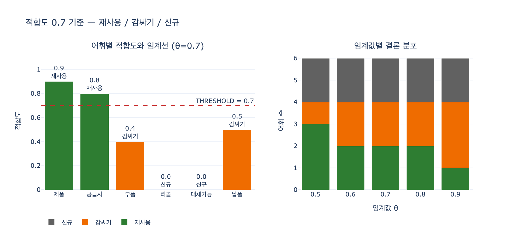

# `ex4_reuse_or_build.py` — 적합도 임계값 0.7과 세 갈래 결론

**질문**: `ex4_reuse_or_build.py`의 판단 임계값과 세 갈래 결론은 무엇인가?

**답**: 적합도 0.7이 기준이다. 0.7 이상이면 그대로 재사용, 공개 어휘가 없으면 새로 만들고, 그 사이면 우리 것을 만들고 '대략 같음'을 걸어 둔다.

---

## 1. 이 예제가 답하는 질문

12장 12.4절 「남의 어휘를 가져다 쓸까」의 실습 코드다. 온톨로지를 만들 때 매번 마주치는 갈림길이 있다.

- schema.org 같은 **공개 어휘를 그냥 가져다 쓸 것인가**
- 아니면 **우리 도메인 어휘를 새로 정의할 것인가**

이 결정을 감으로 하면 사람마다, 그날 기분마다 달라진다. `ex4_reuse_or_build.py`는 그걸 **숫자 하나(적합도)와 임계값 하나(0.7)** 로 기계적으로 갈라 버린다. 의존성 없이 순수 파이썬으로 돌아간다.

```bash
python3 ex4_reuse_or_build.py         # 의존성 없음
```

## 2. 적합도 표 (asset 원본 그대로)

`NEEDED` 딕셔너리가 우리가 필요한 개념 6개와, 각각에 대응하는 공개 어휘 후보 및 적합도를 담고 있다.

| 우리 용어 | 후보 공개 어휘 | 적합도 | 결론 (θ = 0.7) |
|---|---|---|---|
| 제품 | `schema.org/Product` | 0.9 | 그대로 재사용 |
| 공급사 | `schema.org/Organization` | 0.8 | 그대로 재사용 |
| 부품 | `schema.org/Product` | 0.4 | 우리 것 + «대략 같음» |
| 리콜 | `None` | 0.0 | 새로 만든다 |
| 대체가능 | `None` | 0.0 | 새로 만든다 |
| 납품 | `schema.org/seller` | 0.5 | 우리 것 + «대략 같음» |

원본 코드는 이렇다.

```python
NEEDED = {
    "제품":      {"공개어휘": "schema.org/Product",      "적합도": 0.9},
    "공급사":    {"공개어휘": "schema.org/Organization", "적합도": 0.8},
    "부품":      {"공개어휘": "schema.org/Product",      "적합도": 0.4},
    "리콜":      {"공개어휘": None,                       "적합도": 0.0},
    "대체가능":  {"공개어휘": None,                       "적합도": 0.0},
    "납품":      {"공개어휘": "schema.org/seller",        "적합도": 0.5},
}

THRESHOLD = 0.7
```

## 3. 분기 로직 해설

핵심은 이 `for` 루프 하나다.

```python
for term, info in NEEDED.items():
    if info["공개어휘"] is None:
        build.append(term)                                   # (1) 없다 → 만든다
    elif info["적합도"] >= THRESHOLD:
        reuse.append((term, info["공개어휘"]))                 # (2) 0.7 이상 → 그대로 쓴다
    else:
        wrap.append((term, info["공개어휘"], info["적합도"]))   # (3) 그 사이 → 만들고 이어 둔다
```

판단은 **2단계**로 이루어진다.

1. **후보가 있는가?** — `공개어휘`가 `None`이면 적합도를 볼 것도 없이 `build`. 임계값과 무관한 분기다. 리콜, 대체가능이 여기 해당한다. schema.org에 아예 대응 개념이 없으니 선택의 여지가 없다.
2. **적합도가 임계값을 넘는가?** — 후보가 있으면 `적합도 >= 0.7`로 갈린다.
   - 넘으면 `reuse`: 우리 것을 만들지 말고 공개 어휘를 그대로 쓴다. 제품(0.9), 공급사(0.8).
   - 못 넘으면 `wrap`: 우리 것을 만들되 공개 어휘와의 «대략 같음» 링크를 걸어 둔다. 부품(0.4), 납품(0.5).

비교 연산자가 `>=`라는 점이 중요하다. **적합도가 정확히 0.7이면 재사용 쪽**이다. 경계값이 재사용에 포함된다.

### 세 바구니 이름의 뜻

| 바구니 | 뜻 | 실무 조치 |
|---|---|---|
| `reuse` | 그대로 가져다 쓴다 | 우리 스키마에서 공개 어휘 IRI를 직접 참조 |
| `wrap` | 비슷한데 안 맞는다 | 우리 클래스를 정의하고 공개 어휘와 «대략 같음»만 연결 |
| `build` | 공개 어휘에 없다 | 순수 자체 정의 |

## 4. 왜 `wrap` 이라는 중간 갈래가 필요한가

이 예제가 진짜 하고 싶은 말은 세 번째 갈래다. asset은 «부품»을 사례로 든다.

> «부품»이 흥미롭다. schema.org 에도 Product 가 있지만 뜻이 다르다.
> 우리에게 부품은 «다른 제품 안에 들어가는 것»이고, 판매 단위가 아니다.

이름은 같지만 의미가 다르다. 여기서 흔히 저지르는 두 가지 실수가 있다.

- **(가) 억지로 맞춰 쓴다** → 나중에 «부품인데 왜 가격이 있지» 같은 혼란이 생긴다. 공개 어휘 정의에 안 맞는 케이스마다 예외 조항이 쌓인다.
- **(나) 아예 무시하고 다 새로 만든다** → 밖과 데이터를 주고받을 때 매번 변환해야 한다. 상호운용성을 통째로 버리는 셈이다.

정답은 중간이다. **우리 것으로 만들되, 공개 어휘와 «대략 같음»을 걸어 둔다.** 구현은 데이터 모델에 따라 다르다.

- **RDF**: `owl:sameAs`(완전 동일) 또는 `skos:closeMatch`(대략 같음). 뜻이 다른 «부품» 같은 경우엔 `owl:sameAs`가 아니라 `skos:closeMatch`가 맞다. `owl:sameAs`는 추론기가 두 개체를 동일시해 버려서, 미묘한 차이가 있는 개념에 걸면 원치 않는 추론이 전파된다.
- **LPG**(Neo4j, Kuzu 등): 추론기가 없으니 속성으로 매핑 표를 둔다. 예: 노드에 `external_mapping: "schema.org/Product"`, `mapping_kind: "closeMatch"`.

## 5. 0.7이라는 숫자에 대하여

asset이 스스로 밝힌다.

> 판단 기준 한 줄: 적합도 0.7 을 넘으면 가져다 쓰고, 아니면 만들고 이어 둔다.
> 0.7 은 제 감이다. 중요한 건 «숫자를 정해 두고 매번 같은 기준으로 판단하는 것»이다.

즉 0.7은 통계적으로 유도한 값이 아니라 **팀이 합의해 고정한 상수**다. 요점은 값의 정확성이 아니라 (a) 판단이 재현 가능해지고, (b) 리뷰에서 "왜 이건 재사용인데 저건 아니냐"라는 논쟁이 "적합도를 몇으로 매길 거냐"로 바뀐다는 것이다. 논쟁 대상이 결론에서 입력값으로 이동한다.

한 장 요약도 같은 말을 한다.

> 공개 어휘는 적합도를 숫자로 매겨 판단합니다. 억지로 맞춰 쓰면 예외 조항이 쌓입니다. 우리 것으로 만들고 사상만 걸어 두세요.

## 6. 임계값을 바꾸면 결론이 어떻게 흔들리나

`expy.py`에서 θ를 0.5~0.9로 흔들어 본 결과다.

| θ | 제품(0.9) | 공급사(0.8) | 부품(0.4) | 리콜(–) | 대체가능(–) | 납품(0.5) | 재사용/감싸기/신규 |
|---|---|---|---|---|---|---|---|
| 0.5 | 재사용 | 재사용 | 감싸기 | 신규 | 신규 | **재사용** | 3 / 1 / 2 |
| 0.6 | 재사용 | 재사용 | 감싸기 | 신규 | 신규 | 감싸기 | 2 / 2 / 2 |
| **0.7** | 재사용 | 재사용 | 감싸기 | 신규 | 신규 | 감싸기 | 2 / 2 / 2 |
| 0.8 | 재사용 | 재사용 | 감싸기 | 신규 | 신규 | 감싸기 | 2 / 2 / 2 |
| 0.9 | 재사용 | **감싸기** | 감싸기 | 신규 | 신규 | 감싸기 | 1 / 3 / 2 |

읽을 점 세 가지.

- **`build`(신규)는 항상 2로 고정**이다. 임계값과 무관한 1단계 분기이기 때문이다.
- **뒤집힘은 어휘 점수 바로 위에서 일어난다.** 납품(0.5)은 θ가 0.6이 되는 순간, 공급사(0.8)는 θ가 0.9가 되는 순간 재사용에서 감싸기로 넘어간다.
- **0.6~0.8 구간에서 결론이 전혀 안 바뀐다.** 이 데이터셋의 점수가 0.4/0.5와 0.8/0.9로 양극화돼 있어서, 0.7은 그 빈 골짜기 한가운데에 있다. 감으로 정한 값이지만 결과적으로 가장 안정적인(민감도가 낮은) 지점이다. 임계값을 0.5로 낮추면 적합도 0.5짜리 «납품»이 `schema.org/seller`에 그대로 들어가는데, 이게 바로 asset이 경고한 "억지로 맞춰 쓰기"다.

## 7. 실행 출력 (θ = 0.7)

```
그대로 가져다 쓴다 (2개)
  제품       → schema.org/Product
  공급사      → schema.org/Organization

비슷한데 안 맞는다 — 우리 것으로 만들고 «대략 같음»만 걸어 둔다 (2개)
  부품       ~ schema.org/Product  (적합도 0.4)
  납품       ~ schema.org/seller  (적합도 0.5)

공개 어휘에 없다 — 만든다 (2개)
  리콜
  대체가능
```

## 8. 한 줄 정리

| 조건 | 결론 |
|---|---|
| 공개 어휘 후보 없음 | 새로 만든다 (build) |
| 후보 있고 적합도 ≥ 0.7 | 그대로 재사용 (reuse) |
| 후보 있고 적합도 < 0.7 | 우리 것을 만들고 «대략 같음»을 걸어 둔다 (wrap) |

## 관련 출처

- [schema.org 스키마 목록](https://schema.org/docs/schemas.html) — 공용 어휘 (사실상 표준)
- [SKOS Reference](https://www.w3.org/TR/skos-reference/) — `skos:closeMatch`, `skos:exactMatch` 등 매핑 관계 정의
- [OWL 2 Profiles](https://www.w3.org/TR/owl2-profiles/) — `owl:sameAs` 의미론

## 시각화


