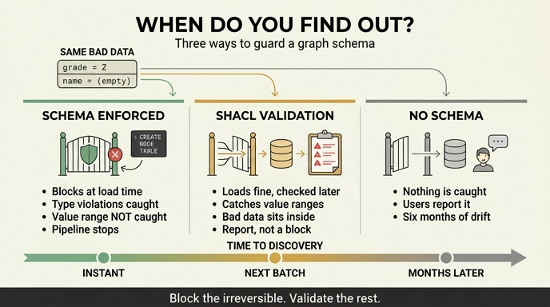

# `ex3_when_schema.py`가 비교하는 세 가지 방식

**질문**: `ex3_when_schema.py`가 비교하는 세 가지 방식은 무엇인가?

**답**: 스키마 강제(적재 시점에 막기), SHACL 검증(적재 후 보고서), 스키마 없음이다.

---

## 예제가 하려는 실험

12장 3절 「스키마를 언제 못 박을 것인가」의 예제입니다. 실험 설계가 단순합니다.

> **같은 「잘못된 데이터」를 세 가지 방식에 넣어 보고, 언제 걸리는지 본다.**

즉 이 예제의 비교축은 "어느 쪽이 더 엄격한가"가 아니라 **「오류를 언제 아느냐」(when)** 입니다. 파일 이름이 `when_schema`인 이유가 그것입니다.

넣어 보는 잘못된 데이터는 두 종류입니다.

```python
BAD_ROWS = [
    ("등급이 규칙 밖", "가온테크", "Z"),   # grade 가 A/B/C 가 아님 → 값의 «범위» 위반
    ("이름이 비었다", "", "A"),            # name 이 빈 문자열   → 값의 «존재/길이» 위반
]
```

두 오류 모두 **타입은 멀쩡한 STRING**입니다. 이게 핵심 함정입니다. 타입만 검사하는 장치는 둘 다 통과시킵니다.

---

## 방식 1 — 스키마 강제 (적재 시점에 막는다)

**코드 형태**: 엔진이 스키마를 강제하는 경우. 예제에서는 Kuzu의 `CREATE NODE TABLE`.

```python
def try_kuzu_typed():
    """적재 시점에 막는다 — 스키마가 강제되는 엔진."""
    conn.execute("CREATE NODE TABLE Company(name STRING, grade STRING, "
                 "PRIMARY KEY(name))")
    for label, name, grade in BAD_ROWS:
        try:
            conn.execute(f"CREATE (:Company {{name:'{name}', grade:'{grade}'}})")
            out.append((label, "통과 (막지 못함)"))
        except Exception as e:
            out.append((label, f"거부 — {str(e).splitlines()[0][:40]}"))
```

즉 **테이블을 선언해 두고, 그 선언에 어긋나는 `CREATE`가 예외를 던지는지** 보는 겁니다.

- **막는 것**: 선언되지 않은 속성, 타입 불일치, 기본키 중복 같은 **구조적 위반**. 적재 자체가 실패하므로 나쁜 데이터가 DB 안으로 아예 들어오지 못합니다.
- **못 막는 것**: **값의 범위**. `grade`가 A/B/C 중 하나여야 한다는 규칙은 STRING 타입 선언으로는 표현할 수 없습니다. `"Z"`도 `""`도 완벽하게 유효한 STRING이라 그냥 통과합니다. 예제 출력이 그 점을 콕 집습니다.

  ```
  → 타입은 막지만 «값의 범위»(등급이 A/B/C 중 하나)는 못 막는다.
    이 엔진에는 CHECK 제약이 없다. 엔진마다 다르다.
  ```

  관계형 DB라면 `CHECK (grade IN ('A','B','C'))`로 잡히지만, 그래프 엔진은 CHECK 제약을 지원하지 않는 것이 많습니다. **"스키마 강제"가 곧 "모든 검증"이 아니라는 것**, 그리고 어디까지 막아 주는지는 **엔진마다 다르다**는 것이 이 방식의 교훈입니다.
- **언제 아느냐**: **즉시**. 적재하는 그 순간 예외가 납니다.
- **대가**: 적재가 실패하니 **파이프라인이 멈춥니다**. 나쁜 행 하나 때문에 그날 배치 전체가 서 버릴 수 있습니다.

## 방식 2 — SHACL 검증 (적재는 되고, 나중에 보고서)

**코드 형태**: 데이터 그래프와 **형태(shape) 그래프**를 따로 두고, 검증기를 돌립니다. 예제는 rdflib + pySHACL.

```turtle
ex:CompanyShape a sh:NodeShape ;
    sh:targetClass ex:Company ;
    sh:property [ sh:path ex:name ; sh:minCount 1 ; sh:minLength 1 ;
                  sh:datatype xsd:string ] ;
    sh:property [ sh:path ex:grade ; sh:in ("A" "B" "C") ] .
```

```python
def try_shacl():
    """적재는 되고, 검증 단계에서 보고서로 잡는다."""
    data   = Graph().parse(data=DATA_TTL, format="turtle")
    shapes = Graph().parse(data=SHAPES,   format="turtle")
    ok, _, text = validate(data, shacl_graph=shapes, inference="none")
    violations = text.count("Constraint Violation")
    return ok, violations, text
```

주목할 지점이 둘 있습니다.

1. **`Graph().parse(...)`는 성공합니다.** 등급 `"Z"`도, 빈 이름도 RDF로는 아무 문제 없이 적재됩니다. RDF는 스키마 없이 트리플을 받는 모델이라, 적재 단계에서는 아무도 막지 않습니다.
2. **막는 게 아니라 「보고서」를 돌려줍니다.** 반환값이 `(ok, results_graph, results_text)`이고, 예제는 그 텍스트에서 `Constraint Violation` 개수를 세고 `Focus Node` / `Value Node` / `Message` 줄을 뽑아 찍습니다. 즉 **어느 노드의 어느 값이 왜 틀렸는지 목록으로** 나옵니다.

- **막는 것**: 방식 1이 못 막던 **값의 범위와 존재 조건**까지 잡습니다. `sh:in ("A" "B" "C")`가 `"Z"`를 잡고, `sh:minCount 1` + `sh:minLength 1`이 빈 이름을 잡습니다. 게다가 어떤 규칙을 어겼는지 사람이 읽을 수 있는 메시지로 알려 줍니다.
- **못 막는 것**: **적재 자체를 막지 못합니다.** 검증을 돌리는 그 순간까지 나쁜 데이터는 그래프 안에 살아 있고, 그 사이 누군가 그 데이터를 읽어 갔을 수 있습니다. 또 검증기를 **돌리지 않으면 아무 일도 일어나지 않습니다** — 배치가 죽어 있으면 스키마 없음과 똑같아집니다.
- **언제 아느냐**: **배치가 돌 때**. 시간 단위든 하루 단위든, 검증 주기만큼 늦게 압니다.
- **대가**: 지연. 대신 파이프라인은 안 멈추고, 위반 목록을 한꺼번에 받아 우선순위를 정해 고칠 수 있습니다.

## 방식 3 — 스키마 없음

**코드 형태**: 없습니다. 그게 요점입니다. 예제도 코드 없이 문장 하나로 처리합니다.

```
=== 방식 3: 스키마 없음 ===
  아무것도 안 걸린다. 6개월 뒤에 발견한다.
```

- **막는 것**: 없음.
- **못 막는 것**: 전부.
- **언제 아느냐**: **사용자가 알려 줍니다.** 리포트 숫자가 이상하다고, 화면에 빈칸이 보인다고 누군가 말해 줄 때 압니다. 그때는 이미 잘못된 값이 수개월치 쌓여 있어 되돌리는 비용이 가장 큽니다.

한 장 요약이 여기에 단서를 하나 답니다.

> 스키마 없이 시작해도 되는 건 **혼자일 때와 버릴 데이터일 때뿐**입니다. 그리고 **문서만 있고 검사가 없는 게 제일 위험**해요. 지키고 있다고 착각하게 됩니다.

문서상 규칙은 있는데 검사가 없는 상태는 방식 3보다 더 나쁩니다. 방식 3은 최소한 아무도 안 믿지만, 문서만 있는 상태는 사람들이 지켜지고 있다고 믿습니다. 이 「믿음과 현실의 벌어짐」을 재는 것이 같은 장의 `ex5_schema_drift.py`입니다.

---

## 세 방식 한눈에

| | 방식 1 스키마 강제 | 방식 2 SHACL 검증 | 방식 3 스키마 없음 |
|---|---|---|---|
| 어디서 | 엔진의 테이블 선언 | 별도 형태 그래프 + 검증기 | — |
| 적재 | 실패한다 | 성공한다 | 성공한다 |
| 타입 위반 | 막는다 | 잡는다(보고) | 못 잡는다 |
| 값 범위 위반 (`grade="Z"`) | **못 막는다** (CHECK 없음) | 잡는다 (`sh:in`) | 못 잡는다 |
| 결과물 | 예외 | 위반 보고서 | 없음 |
| **언제 아느냐** | **즉시** | **배치가 돌 때** | **사용자가 알려 줄 때** |
| 대가 | 파이프라인이 멈춤 | 그때까지 나쁜 데이터가 존재 | 6개월치 오염 |

## 저자의 기준

예제 마지막 문장이 결론입니다.

> 세 방식의 진짜 차이는 «언제 아느냐»다.
> 제 기준: **되돌릴 수 없는 것은 적재 시점에, 나머지는 검증 시점에.**
> 적재를 너무 엄격하게 잡으면 데이터가 아예 안 들어와서 그것대로 문제가 된다.

셋 중 하나를 고르는 문제가 아니라 **섞어 쓰는** 문제입니다. 기본키·필수 관계처럼 틀리면 되돌릴 수 없는 것은 방식 1로 문 앞에서 막고, 등급 코드값처럼 나중에 고칠 수 있는 것은 방식 2로 받아 두고 보고서로 처리합니다. 방식 1을 전부에 적용하면 데이터가 아예 안 들어오는 반대 방향의 사고가 납니다.

## 함께 보면 좋은 것

- [SHACL — Shapes Constraint Language (W3C)](https://www.w3.org/TR/shacl/) — `sh:in`, `sh:minCount`, `sh:minLength` 등 제약 어휘의 1차 출처
- [ISO/IEC 39075:2024 GQL](https://www.iso.org/standard/76120.html) — 그래프 스키마 선언의 표준화 흐름
- 같은 장 `ex5_schema_drift.py` — 「문서는 거짓말을 하고 데이터는 안 한다」, 드리프트를 재는 30줄
- 13장 「검증하지 않은 그래프는 그냥 링크 뭉치다」 — 이 장이 두 번 언급한 검증을 본격적으로 다룸

## 인포그래픽


