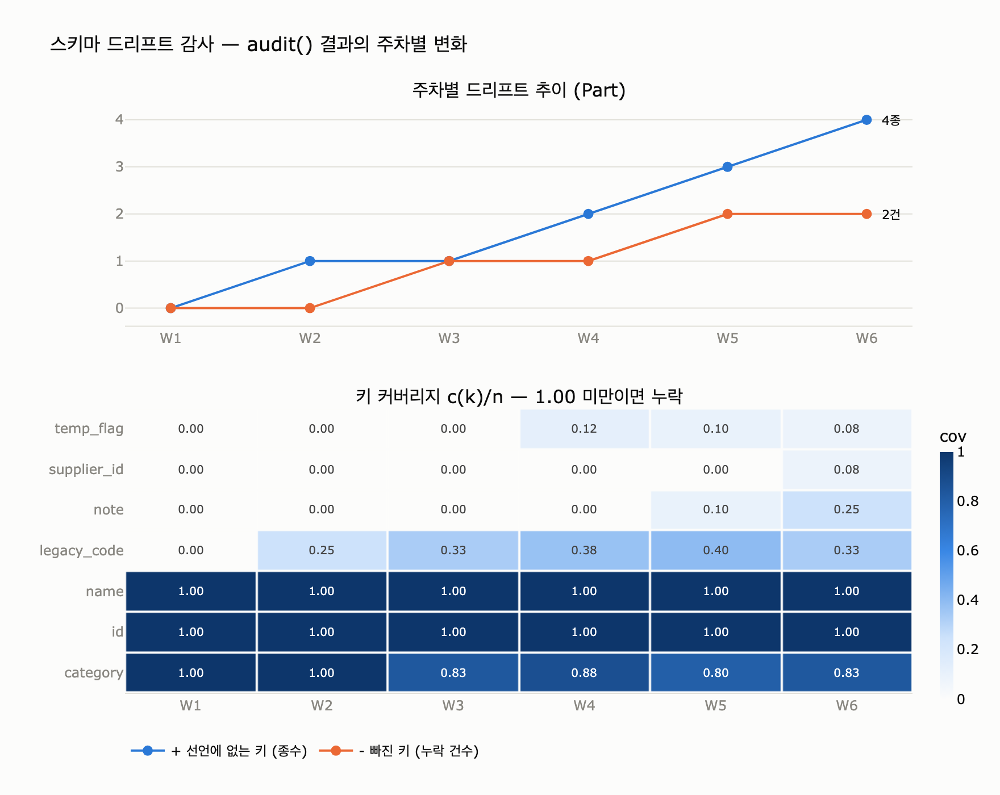

# `ex5_schema_drift.py`의 `audit()`는 무엇을 계산하는가

**답.** 라벨별 레코드 수를 세고, **선언에 없는 키(추가된 키)** 와 **모든 레코드에 있어야 하는데 누락된 키** 를 집계한다.

---

## 1. 이 함수가 놓인 자리 — 12.5절 「문서 말고 데이터에게 물어보라」

12장의 결론 중 하나는 이렇다.

> 문서는 거짓말을 하고 데이터는 안 합니다. 드리프트 감사를 배치로 돌리세요. 30줄이면 됩니다.

「스키마 드리프트(schema drift)」는 **설계 문서에 적힌 스키마**와 **운영 데이터에 실제로 들어 있는 키**가
시간이 지나며 벌어지는 현상이다. 아무도 악의로 어긴 게 아니다. 급한 이관 배치가 컬럼 하나를 남기고,
누가 디버깅용 플래그를 붙였다 잊고, 어떤 적재기가 선택 필드로 취급해 버린다. 한 주에 하나씩 늘어난다.

`audit()`는 그 벌어진 틈을 **숫자로 재는** 30줄짜리 함수다. 설계 문서를 읽지 않고, 데이터만 읽는다.

---

## 2. 입력과 출력

### 입력 두 개

```python
DECLARED = {                                   # 설계 문서에 적힌 것
    "Part":    {"id", "name", "category"},
    "Product": {"id", "name", "released_on"},
    "Supplier":{"id", "name"},
}

ACTUAL_ROWS = [                                # 실제 데이터에 나타난 키 (운영 6개월 뒤)
    ("Part", {"id", "name", "category"}),
    ("Part", {"id", "name", "category", "legacy_code"}),
    ("Part", {"id", "name", "category", "legacy_code", "temp_flag"}),
    ("Part", {"id", "name"}),                       # category 가 빠졌다
    ...
]
```

`ACTUAL_ROWS`의 각 원소는 `(라벨, 그 레코드가 실제로 가진 키의 집합)`이다.
값은 보지 않는다. **키의 유무만** 본다.

### 출력 — 라벨마다 딕셔너리 하나

```python
report[label] = {
    "건수":          n,        # 그 라벨의 레코드 수
    "선언에 없는 키": extra,    # {키: 그 키가 나타난 건수}   →  출력에서 '+' 표시
    "빠진 키":       missing,  # {키: 그 키가 누락된 건수}   →  출력에서 '-' 표시
}
```

즉 **세 가지**를 계산한다: 건수 / `+` 추가된 키 / `-` 누락된 키.

---

## 3. 집합 연산으로 다시 쓰기

라벨 $L$의 레코드 집합을 $R_L=\{r_1,\dots,r_n\}$이라 하자.
각 $r_i$는 그 레코드가 실제로 가진 키의 집합이고, $n=|R_L|$이 **건수**다.
선언 스키마를 $D_L$이라 두면 —

$$
U_L=\bigcup_{i=1}^{n} r_i \quad\text{(관측 키 합집합: 한 번이라도 나타난 키)}
$$

$$
I_L=\bigcap_{i=1}^{n} r_i \quad\text{(전건 공통 키: 모든 레코드가 다 가진 키)}
$$

감사 결과 두 축은 각각 **차집합 하나**다.

$$
\boxed{\,E_L = U_L \setminus D_L\,}\quad(\texttt{+}\ \text{선언에 없는 키})
$$

$$
\boxed{\,M_L = D_L \setminus I_L\,}\quad(\texttt{-}\ \text{빠진 키})
$$

키의 출현 횟수를 $c_L(k)=|\{\,i: k\in r_i\,\}|$라 하면 보고서에 붙는 숫자는

$$
\text{extra}[k]=c_L(k)\ \ (k\in E_L), \qquad \text{missing}[k]=n-c_L(k)\ \ (k\in M_L)
$$

커버리지 $\mathrm{cov}_L(k)=c_L(k)/n$로 보면
$k\in I_L \iff \mathrm{cov}_L(k)=1$, $k\in U_L \iff \mathrm{cov}_L(k)>0$ 이다.

---

## 4. 코드 한 줄씩 — 왜 저 차집합이 되는가

```python
def audit(declared, rows):
    seen = defaultdict(Counter)          # ①
    counts = Counter()                   # ②
    for label, keys in rows:
        counts[label] += 1               # ③  n 을 센다
        for k in keys:
            seen[label][k] += 1          # ④  c_L(k) 를 센다
    report = {}
    for label, want in declared.items():
        got = seen[label]                # ⑤  Counter: 키 -> c_L(k)
        n = counts[label]
        extra   = {k: v for k, v in got.items() if k not in want}          # ⑥
        missing = {k: n - got.get(k, 0) for k in want if got.get(k, 0) < n} # ⑦
        report[label] = {"건수": n, "선언에 없는 키": extra, "빠진 키": missing}
    return report
```

**① `seen = defaultdict(Counter)`** — 라벨별로 「키 → 출현 횟수」 카운터를 둔다. 이게 $c_L$이다.
`defaultdict`라서 처음 보는 라벨이 와도 `KeyError` 없이 빈 `Counter`가 생긴다.

**② `counts`** — 라벨별 레코드 수 $n$. 답의 「라벨별 레코드 수를 센다」가 바로 이것.

**③④ 한 번의 순회** — 레코드를 한 바퀴 돌면서 $n$과 $c_L(k)$를 동시에 모은다.
$O(\sum_i |r_i|)$ 한 패스. 이게 30줄로 끝나는 이유다.

**⑤ `got = seen[label]`** — 여기서 `got.keys()`가 곧 $U_L$이다.
「한 번이라도 나타난 키」는 카운터에 항목이 생긴 키와 같기 때문이다.

**⑥ `extra` = $U_L \setminus D_L$**
`got.items()`(= 관측 키 전부)를 훑으며 `k not in want`(= $\notin D_L$)인 것만 남긴다.
값 `v`는 그 키가 몇 건에 나타났는지($c_L(k)$)라, **얼마나 퍼졌는지**까지 같이 알려 준다.
`legacy_code 2건`처럼 나온다.

**⑦ `missing` = $D_L \setminus I_L$**
선언 키 `want`만 훑으며 `got.get(k, 0) < n`인 것을 남긴다. 그런데

$$
c_L(k) < n \iff \text{어떤 } r_i \text{ 에 } k \text{ 가 없다} \iff k \notin I_L
$$

이므로 조건 `c < n`은 정확히 「$I_L$에 속하지 않음」이다.
따라서 `missing`의 키 집합은 $D_L \setminus I_L$. 값 `n - c`는 **누락 건수**다.

> **핵심 대칭**: `extra`는 *합집합* 기준으로 「하나라도 있으면 걸린다」,
> `missing`은 *교집합* 기준으로 「하나라도 없으면 걸린다」.
> 선언에 없는 키는 한 건만 있어도 문제고, 필수 키는 한 건만 없어도 문제이기 때문이다.

### 경계 조건 두 가지

- **선언에 없는 라벨**은 보고서에 아예 안 나온다. 바깥 루프가 `declared.items()`를 돌기 때문이다.
  실무에서는 `set(seen) - set(declared)`(미선언 라벨)도 같이 봐야 한다.
- **$n=0$인 라벨**(선언만 있고 데이터가 없는 라벨)은 `got.get(k,0) = 0`, `n = 0`이라
  `0 < 0`이 거짓이므로 `missing`이 빈 딕셔너리가 된다. 「문서와 일치」로 조용히 통과한다.
  데이터가 아예 없는 것도 신호이므로 `n == 0` 경고를 따로 두는 게 낫다.

---

## 5. 실행 결과와 읽는 법

```
[Part]  5건
    + legacy_code    2건 — 문서에 없다
    + temp_flag      1건 — 문서에 없다
    + note           1건 — 문서에 없다
    - category       1건에서 누락

[Product]  3건
    + recall_reason  1건 — 문서에 없다
    - released_on    1건에서 누락

[Supplier]  2건
    + contact        2건 — 문서에 없다
    + tier           1건 — 문서에 없다
```

`Part`를 손으로 풀어 보면 이렇다.

| 집합 | 값 |
|---|---|
| $D$ 선언 | `{category, id, name}` |
| $U$ 관측 합집합 | `{category, id, legacy_code, name, note, temp_flag}` |
| $I$ 전건 공통 | `{id, name}` |
| $E=U\setminus D$ (`+`) | `{legacy_code, note, temp_flag}` |
| $M=D\setminus I$ (`-`) | `{category}` |

**`+`가 붙은 키는 셋 중 하나로 처리한다** (책의 처방).

1. **정식으로 스키마에 넣는다** — `recall_reason`처럼 실제로 필요해진 것
2. **지운다** — `temp_flag`처럼 임시로 넣고 잊은 것
3. **별도 영역으로 옮긴다** — `legacy_code`처럼 이전 시스템 잔재

`Supplier`의 `contact`는 2건 중 2건, 즉 **커버리지 100%인데 문서에만 없는** 경우다.
사실상 정착한 키이므로 1번(정식 편입) 후보다. 커버리지가 함께 나오는 이유가 여기 있다.

**`-`는 더 급하다.** 선언한 필수 키가 실제로는 없다는 뜻이고,
`WHERE category = ...` 같은 질의가 그 레코드를 **조용히 빼먹고** 있을 가능성이 높다.
에러가 안 나므로 아무도 모른다. 이것이 12장이 「검증 없는 문서가 제일 위험하다」고 말하는 이유다.

---

## 6. 실제 그래프 DB에서 관측 키($U_L$, $c_L(k)$) 뽑기

예제는 `ACTUAL_ROWS`를 손으로 적었지만, 운영에서는 DB에 직접 물어본다.

### Neo4j (Cypher) — 스키마가 느슨한 쪽

노드마다 실제 프로퍼티 키를 `keys(n)`으로 꺼낼 수 있으므로 $c_L(k)$를 바로 집계한다.

```cypher
MATCH (n:Part)
WITH count(n) AS n_total, collect(keys(n)) AS all_keys
UNWIND all_keys AS ks
UNWIND ks AS k
RETURN k AS key, count(*) AS c, n_total,
       toFloat(count(*)) / n_total AS coverage
ORDER BY coverage ASC, key
```

`coverage < 1.0`인 선언 키가 `-`, 선언 목록에 없는 `key`가 `+`다.
선언 쪽($D_L$)은 제약으로 확인한다.

```cypher
SHOW CONSTRAINTS YIELD labelsOrTypes, properties
RETURN labelsOrTypes, properties
```

DB 전체 관측 스키마를 한 번에 보고 싶으면 `CALL db.schema.nodeTypeProperties()`
(또는 APOC의 `apoc.meta.nodeTypeProperties()`)가 라벨×프로퍼티×존재비율을 준다.

### Kuzu — 스키마가 고정인 쪽

Kuzu는 `CREATE NODE TABLE`로 컬럼이 못 박혀 있어서 **미선언 키($E_L$)가 애초에 못 들어온다.**
대신 드리프트가 **NULL 비율**과 **적재 실패**로 나타난다.

```sql
CALL TABLE_INFO('Part') RETURN *;      -- D_L: 선언된 컬럼 목록

MATCH (p:Part)
RETURN count(*)                            AS n,
       count(p.category)                   AS c_category,   -- NULL 은 안 센다
       1.0 * count(p.category) / count(*)  AS cov_category;
```

이게 12.3절 「스키마를 언제 못 박을 것인가」의 실물이다.
**못 박으면 `+`가 사라지는 대신 적재 파이프라인이 깨지고,
풀어 두면 적재는 되는 대신 `+`가 조용히 쌓인다.** 드리프트는 사라지지 않고 형태만 바뀐다.

### SPARQL / RDF — 술어가 곧 키

```sparql
# c_L(k) : 술어별 주어 수
SELECT ?p (COUNT(DISTINCT ?s) AS ?c)
WHERE {
  ?s a ex:Part .
  ?s ?p ?o .
}
GROUP BY ?p
ORDER BY ?c

# n : 분모
SELECT (COUNT(DISTINCT ?s) AS ?n) WHERE { ?s a ex:Part }
```

RDF 세계에서는 이 감사를 손으로 짜는 대신 **SHACL**([W3C SHACL](https://www.w3.org/TR/shacl/))에 맡길 수 있다.

```turtle
ex:PartShape a sh:NodeShape ;
    sh:targetClass ex:Part ;
    sh:closed true ;                       # 선언에 없는 술어 → 위반  (E_L)
    sh:ignoredProperties ( rdf:type ) ;
    sh:property [ sh:path ex:category ; sh:minCount 1 ] .   # 누락 → 위반 (M_L)
```

`sh:minCount 1` 위반이 `-`, `sh:closed true` 위반이 `+`에 해당한다.
`audit()`가 하는 일을 표준 어휘로 선언해 둔 것과 같다.
차이는 SHACL이 **위반 여부**를 주는 반면 `audit()`는 **건수와 커버리지**를 준다는 점이다.
드리프트를 「고칠 것 / 편입할 것」으로 분류하려면 후자의 숫자가 필요하다.

---

## 7. 왜 배치로 「매주」 돌리는가

한 번 돌리면 사진 한 장이고, 매주 돌리면 추세가 된다.
아래 시각화는 `Part` 라벨에 레코드가 주차별로 누적되는 합성 시나리오의 감사 결과다.

| 주차 | n | `+` | `-` |
|---|---|---|---|
| W1 | 2 | — | — |
| W2 | 4 | `legacy_code(1)` | — |
| W3 | 6 | `legacy_code(2)` | `category(1)` |
| W4 | 8 | `legacy_code(3)`, `temp_flag(1)` | `category(1)` |
| W5 | 10 | `legacy_code(4)`, `note(1)`, `temp_flag(1)` | `category(2)` |
| W6 | 12 | `legacy_code(4)`, `note(3)`, `supplier_id(1)`, `temp_flag(1)` | `category(2)` |

W1은 「문서와 일치」였는데 6주 뒤 미선언 키가 4종이 됐다.
**한 주도 요란하게 깨지지 않았다**는 게 요점이다. 드리프트는 사고가 아니라 침식이라,
매주 재지 않으면 6개월 뒤에 한꺼번에 발견하고 「온톨로지를 3주 만에 갈아엎게」 된다.

`note`의 커버리지가 W5 0.10 → W6 0.25로 오르는 것도 신호다.
**퍼지는 중인 미선언 키**는 삭제가 아니라 정식 편입 후보라는 뜻이다.

---

## 한 줄 정리

`audit()`는 데이터를 한 번 훑어 라벨별 건수 $n$과 키 출현 횟수 $c_L(k)$를 모은 뒤,
**$U_L \setminus D_L$로 `+`(선언에 없는 키)**, **$D_L \setminus I_L$로 `-`(빠진 키)** 를 계산한다.
문서를 읽지 않고 데이터에게 직접 물어보는 30줄짜리 드리프트 감사다.

## 시각화


