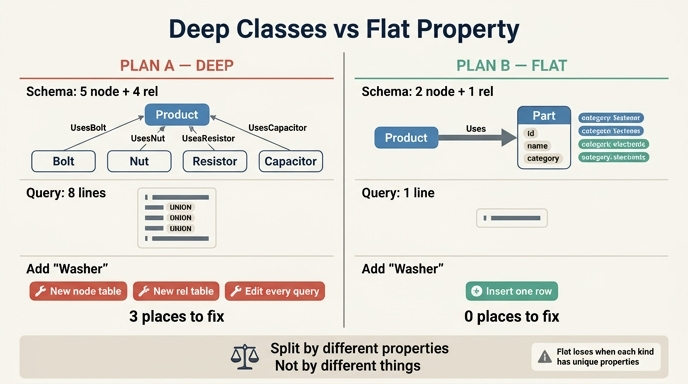

# B안(얕은 분류)은 어떤 구조인가?

**답**: Part 노드 테이블 하나에 `category` 속성을 두고 Uses 관계 하나만 쓴다. 질의는 한 줄로 끝난다.

---

## 1. 무엇을 비교하는 문제인가

12.2절 「쪼갤 것인가 속성으로 둘 것인가」의 실험(`code/ex2_deep_vs_flat.py`)입니다.
같은 질문 — **「제품 P1이 쓰는 부품 전부」** — 에 답하는 두 가지 스키마를 실제로 만들어 보고,
결과가 같은지 확인한 뒤 **유지 비용**을 숫자로 재 봅니다.

- **A안 (깊은 분류, deep)**: 부품 종류마다 노드 테이블과 관계 테이블을 따로 만든다. 도메인 전문가가 처음 제시한 방식.
- **B안 (얕은 분류, flat)**: 부품은 `Part` 하나뿐이고, 종류는 `category` **속성 값**으로 구분한다. 역량 질문에서 거꾸로 뽑은 방식.

핵심은 「A안이 틀렸다」가 아니라 **「분류를 나누는 기준이 무엇이어야 하는가」** 입니다.

---

## 2. B안의 실제 구조

### 스키마 — 노드 테이블 2개, 관계 테이블 1개

```cypher
CREATE NODE TABLE Part(id STRING, name STRING, category STRING, PRIMARY KEY(id))
CREATE NODE TABLE Product(id STRING, PRIMARY KEY(id))
CREATE REL TABLE Uses(FROM Product TO Part)
```

볼트든 너트든 저항이든 커패시터든 **전부 `Part` 노드 한 종류**입니다.
「무엇인가」는 라벨(테이블)이 아니라 `category` 라는 **한 칸의 문자열**로 표현됩니다.

### 데이터 — 종류가 달라도 같은 모양의 행

```cypher
CREATE (:Part {id:'B1', name:'M6 볼트',        category:'체결'})
CREATE (:Part {id:'N1', name:'M6 너트',        category:'체결'})
CREATE (:Part {id:'R1', name:'10k 저항',       category:'전자'})
CREATE (:Part {id:'C1', name:'100uF 커패시터', category:'전자'})

MATCH (p:Product{id:'P1'}),(x:Part{id:'B1'}) CREATE (p)-[:Uses]->(x)
MATCH (p:Product{id:'P1'}),(x:Part{id:'R1'}) CREATE (p)-[:Uses]->(x)
```

관계도 `UsesBolt` / `UsesResistor` 로 나뉘지 않고 **`Uses` 하나**입니다.

### 질의 — 한 줄

```cypher
MATCH (p:Product {id:'P1'})-[:Uses]->(x:Part) RETURN x.name AS 부품
```

「부품 전부」라는 개념이 스키마에 **이미 들어 있으므로**, 질의가 종류를 열거할 필요가 없습니다.
종류별로 좁히고 싶으면 `WHERE x.category = '전자'` 한 조건을 더할 뿐입니다.

---

## 3. A안(깊은 분류)과의 대비

### A안의 모습

```cypher
CREATE NODE TABLE Bolt(id STRING, name STRING, PRIMARY KEY(id))
CREATE NODE TABLE Nut(...)
CREATE NODE TABLE Resistor(...)
CREATE NODE TABLE Capacitor(...)
CREATE NODE TABLE Product(id STRING, PRIMARY KEY(id))
CREATE REL TABLE UsesBolt(FROM Product TO Bolt)
CREATE REL TABLE UsesNut(FROM Product TO Nut)
CREATE REL TABLE UsesResistor(FROM Product TO Resistor)
CREATE REL TABLE UsesCapacitor(FROM Product TO Capacitor)
```

같은 질문에 답하려면 종류마다 한 줄씩 UNION 해야 합니다.

```cypher
MATCH (p:Product {id:'P1'})-[:UsesBolt]->(x:Bolt)           RETURN x.name AS 부품
UNION
MATCH (p:Product {id:'P1'})-[:UsesNut]->(x:Nut)             RETURN x.name AS 부품
UNION
MATCH (p:Product {id:'P1'})-[:UsesResistor]->(x:Resistor)   RETURN x.name AS 부품
UNION
MATCH (p:Product {id:'P1'})-[:UsesCapacitor]->(x:Capacitor) RETURN x.name AS 부품
```

### 숫자로 본 대비 (예제 출력)

| 항목 | A안 (깊게) | B안 (얕게) |
|---|---:|---:|
| 노드 테이블 수 | 5 | 2 |
| 관계 테이블 수 | 4 | 1 |
| 질의문 줄 수 | 8 | 1 |
| **부품 종류 추가 시 고칠 곳** | **3** | **0** |

두 안의 **질의 결과는 완전히 같습니다**(예제가 `deep == flat` 을 확인합니다).
차이는 답이 아니라 **비용**에서 납니다.

### 확장 비용 — 이게 진짜 핵심

「와셔(washer)」를 새로 추가한다고 해 봅시다.

- **A안**: ① 노드 테이블 `Washer` 생성 ② 관계 테이블 `UsesWasher` 생성 ③ 「부품 전부」 질의에 `UNION` 한 줄 추가 → **고칠 곳 3군데**.
  게다가 ③은 하나가 아닙니다. 「부품 전부」를 훑는 질의가 서른 개면 서른 곳을 고쳐야 하고, **한 곳을 빠뜨리면 에러가 아니라 조용히 결과가 빠집니다.** 이게 가장 나쁜 실패 방식입니다.
- **B안**: `CREATE (:Part {id:'W1', name:'M6 와셔', category:'체결'})` — **행 하나. 스키마 변경 0, 질의 변경 0.**

즉 A안에서는 종류의 증가가 **스키마 변경 + 마이그레이션 + 코드 배포**를 부르고,
B안에서는 **데이터 입력**으로 끝납니다. 종류가 자주 늘어나는 도메인일수록 이 차이가 복리로 벌어집니다.

---

## 4. 그럼 B안이 항상 옳은가 — B안이 불리해지는 경우

책이 곧바로 못 박습니다.

> 그럼 A안이 무조건 나쁜가. 아니다.
> **「볼트에만 있는 속성」(나사산 규격 같은 것)이 많고 그걸로 질의한다면 A안이 맞다.**
> 분류를 나누는 기준은 **「다른 속성을 갖는가」**이지 「다른 물건인가」가 아니다.

B안이 불리해지는 구체적 상황들입니다.

1. **종류마다 고유 속성이 많을 때 (희소 컬럼 문제)**
   볼트에는 `thread_pitch`, `head_type`, 저항에는 `resistance`, `tolerance`, 커패시터에는 `capacitance`, `voltage_rating`.
   이걸 전부 `Part` 한 테이블에 밀어 넣으면 대부분의 행에서 대부분의 칸이 NULL인 **희소(sparse) 테이블**이 됩니다.
   「종류를 봐야 어떤 칸이 의미 있는지 알 수 있는」 상태 — 스키마가 자기 뜻을 스스로 설명하지 못합니다.

2. **종류별 제약을 엔진이 강제해야 할 때**
   A안이면 `UsesBolt(FROM Product TO Bolt)` 라는 관계 테이블 정의 자체가 「제품은 볼트만 이 관계로 연결한다」를 **엔진 수준에서 보장**합니다.
   B안의 `Uses(FROM Product TO Part)` 는 아무 부품이나 허용하므로, 「전자 부품은 회로에만 붙는다」 같은 규칙을 걸려면 12.3절의 **검증 계층(SHACL, 배치 검사)** 을 따로 얹어야 합니다.
   검사 없이 문서에만 적어 두는 게 제일 위험한 상태라는 게 12.3절의 결론입니다.

3. **종류별 질의가 압도적으로 많고 성능이 문제일 때**
   대부분의 질의가 「저항만」이라면, A안은 라벨이 곧 인덱스라 `Resistor` 테이블만 스캔합니다.
   B안은 `Part` 전체를 훑고 `category` 로 거릅니다(물론 `category` 인덱스로 대부분 완화됩니다).

4. **`category` 값이 통제되지 않을 때**
   문자열 속성은 자유롭습니다. `'전자'`, `'전자부품'`, `'electronics'` 가 뒤섞이면 분류가 조용히 무너집니다.
   B안을 택했다면 `category` 의 허용 값 집합을 반드시 검증(SHACL `sh:in`, 또는 12.5절의 드리프트 감사)으로 지켜야 합니다.
   **A안이 스키마로 공짜로 얻던 것을, B안은 검증으로 사서 써야 합니다.**

### 판단 규칙 한 줄

> **종류가 많거나 자주 늘면 → 속성(B안). 종류마다 다른 속성으로 질의하면 → 클래스(A안).**

「다른 물건인가」로 나누면 A안의 214개 클래스가 나오고,
「다른 속성을 갖는가」로 나누면 실제로 질의에 필요한 열 개 남짓이 남습니다(12.1절).

---

## 5. 헷갈리기 쉬운 지점

- **B안 = 분류를 버리는 것이 아닙니다.** 분류 정보는 그대로 `category` 에 살아 있습니다. 달라진 건 **어디에 담느냐**(라벨 vs 속성)뿐입니다.
- **하이브리드가 흔한 정답입니다.** 대부분은 `Part` 하나에 `category` 를 두되, 속성이 정말 다른 소수만(예: `Resistor`) 별도 라벨로 승격시킵니다. 라벨을 여러 개 붙일 수 있는 엔진(Neo4j 등)이면 `:Part:Resistor` 로 둘 다 취할 수도 있습니다. 다만 이 장의 예제 엔진인 Kuzu는 노드가 정확히 한 테이블에 속하는 구조라 그 절충이 불가능합니다.
- **되돌리는 비용은 대칭이 아닙니다.** B안 → A안(속성을 라벨로 쪼개기)은 나중에 데이터를 보고 할 수 있지만, A안 → B안(라벨 통합)은 이미 흩어진 테이블과 그 위에 쌓인 질의를 전부 걷어내야 합니다. **잘 모르겠으면 얕게 시작하는 쪽이 싸게 틀립니다.**

---

## 6. 한 문장 정리

B안은 **`Part` 노드 테이블 하나 + `category` 속성 + `Uses` 관계 하나**로,
종류를 스키마가 아니라 **데이터**로 표현하는 구조입니다.
그래서 질의가 한 줄이고, 종류가 늘어도 고칠 곳이 0입니다 —
**단, 종류마다 고유 속성이 많아지는 순간 이 이점은 사라집니다.**

## 인포그래픽


