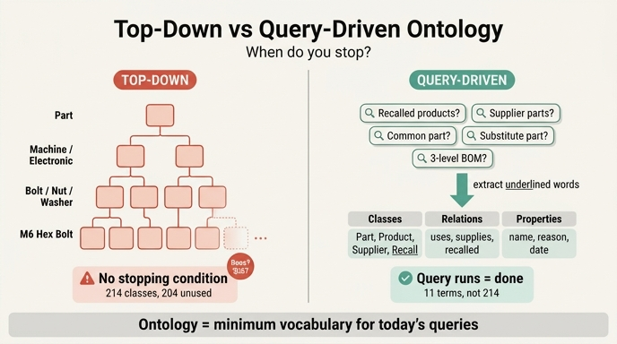

# 온톨로지를 위에서 아래로 짓는 방식의 문제

**질문**: 온톨로지를 위에서 아래로 짓는 방식의 문제는 무엇인가?

**답**: 끝나는 조건이 없다. 질의에서 거꾸로 뽑으면 "질의가 돌면 끝"이라는 종료 조건이 생긴다.

---

## 한 줄 핵심

> 온톨로지는 도메인의 진리가 아니라 **지금 우리 질의가 필요로 하는 최소 어휘**다.

위에서 아래로(top-down) 짓는다는 건 "이 도메인에 존재하는 모든 것을 빠짐없이 분류하자"로 시작한다는 뜻이다. 그런데 도메인은 무한히 쪼개진다. 그래서 **언제 멈춰야 하는지를 아무도 말해 줄 수 없다.**

## 왜 "끝나는 조건이 없다"가 치명적인가

### 1. 완성도를 측정할 수 없다

top-down 방식에서 "온톨로지가 다 됐다"의 판정 기준은 무엇인가? 도메인 전문가에게 물으면 언제나 더 나눌 게 남아 있다. 12장 예제의 전문가 분류를 보자.

```
부품 → 기계부품 → 체결부품 → 볼트 → 육각볼트
     → 스테인리스육각볼트 → M6스테인리스육각볼트 → ...
```

`M6스테인리스육각볼트`는 **틀린 분류가 아니다. 정확한 분류다.** 그리고 그 아래로 `M6x20스테인리스육각볼트`도 만들 수 있다. 그 아래로 또. 정확함은 멈추라는 신호를 주지 않는다.

### 2. 진척률이 아니라 소진률만 남는다

끝나는 조건이 없으니 일정은 "언제 끝나는가"가 아니라 "언제 지치는가"로 결정된다. [4장](../../../ch04)의 6개월짜리 온톨로지가 아무에게도 안 쓰인 이유가 이것이다. 6개월은 완성의 표시가 아니라 인내심이 바닥난 시점의 표시였다.

### 3. 만든 것의 대부분이 쓰이지 않는다

12장 예제 1(`ex1_vocab_from_questions.py`)이 재는 게 정확히 이 낭비다.

| 구분 | 개수 |
|---|---|
| 도메인 전문가가 제시한 클래스 | 214개 |
| 역량 질문 다섯 개에서 뽑은 어휘 | 약 10개 |
| 다섯 질문에 답하는 데 **쓰이지 않는** 분류 | 204개 |

> 필요해지는 순간이 오면 그때 넣으면 된다.
> 그때 넣는 비용보다, 안 쓰는 분류 190개를 유지하는 비용이 크다.

유지 비용은 공짜가 아니다. 클래스가 늘면 적재 코드, 질의문, 문서, 교육, 마이그레이션이 전부 같이 늘어난다(12장 예제 2가 이 비용을 표로 잰다 — 깊은 분류에서는 "와셔" 하나를 추가하는 데 노드 테이블 + 관계 테이블 + 질의문 UNION 한 줄이 필요하지만, 얕은 분류에서는 행 하나면 끝난다).

## 대안: 질의에서 거꾸로 뽑기 (bottom-up from competency questions)

먼저 **역량 질문(competency question)**을 적는다. 이 온톨로지가 답해야 할 질문 목록이다. 12장의 다섯 문장은 이렇다.

1. 부품 X 를 쓴 제품 중 리콜된 것은?
2. 공급사 A 가 납품한 부품이 들어간 제품은?
3. 리콜 사유가 "과열"인 제품에 공통으로 들어간 부품은?
4. 부품 X 의 대체 부품은 무엇이고, 언제부터 대체 가능한가?
5. 제품 P 의 부품 목록을 3단계까지 펼치면?

그다음 **질문에서 밑줄 그은 낱말만** 뽑는다. 이게 어휘의 전부다.

| 종류 | 어휘 |
|---|---|
| 클래스 | 부품, 제품, 공급사, 리콜 |
| 관계 | 사용한다, 납품한다, 리콜되었다, 대체가능하다 |
| 속성 | 이름, 사유, 유효시작일 |

열한 개. 214개가 아니라.

### 여기서 생기는 것이 바로 **종료 조건**

- top-down: "이 도메인을 다 기술했는가?" → 판정 불가, 무한
- 질의 역산: "다섯 질문의 질의가 도는가?" → **예/아니오로 판정 가능, 유한**

질의가 돌면 끝이다. 새 질문이 생기면 그때 어휘를 늘리고, 다시 "그 질의가 도는가"로 판정한다. 온톨로지가 **증분적으로, 그리고 필요에 의해서만** 자란다.

## 자주 하는 오해

- **"그럼 부실한 온톨로지 아닌가?"** — 아니다. 부실함의 기준도 질의다. 답해야 할 질문에 답하지 못하면 부실한 것이고, 답한다면 충분한 것이다. 안 물어본 질문에 대한 어휘는 자산이 아니라 재고다.
- **"나중에 질문이 늘면 다 뜯어고쳐야 하지 않나?"** — 늘어나는 비용보다 안 쓰는 204개를 유지하는 비용이 크다는 것이 이 장의 판단이다. 게다가 뜯어고칠 때는 "무엇이 실제로 쓰이는지"를 알고 고치게 된다.
- **"전문가의 분류가 틀렸다는 뜻인가?"** — 아니다. 정확하지만 **지금 필요가 없다**. 정확함과 필요함은 다른 축이다.

## 함께 보면 좋은 것

- 12장 요약: "위에서 아래로 지으면 끝나는 조건이 없고, 질의에서 거꾸로 뽑으면 「질의가 돌면 끝」이 됩니다."
- 역량 질문 1차 출처: [Ontology Development 101 (Noy & McGuinness)](https://protege.stanford.edu/publications/ontology_development/ontology101.pdf)
- 관련 예제: `code/ex1_vocab_from_questions.py`, `code/questions.py`, `code/ex2_deep_vs_flat.py`

## 인포그래픽


