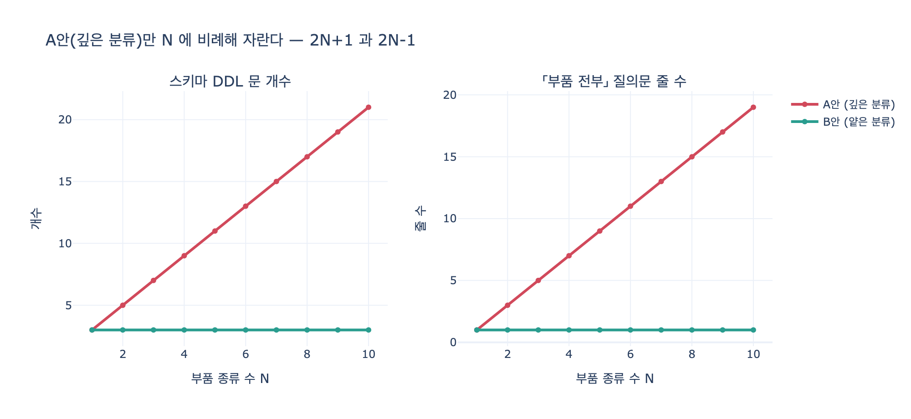

# `ex2_deep_vs_flat.py`의 A안(깊은 분류)은 어떤 구조인가?

## 답

**Bolt, Nut, Resistor, Capacitor를 각각 노드 테이블로 두고, UsesBolt·UsesNut 등 관계 테이블도 종류마다 따로 만든다.**

즉 부품의 「종류」를 **데이터가 아니라 스키마로** 표현한다. 종류 하나가 곧 테이블 하나(정확히는 노드 테이블 하나 + 관계 테이블 하나)다.

---

## 1. A안의 실제 스키마

12장 `ex2_deep_vs_flat.py`의 `DEEP_SCHEMA`는 이렇게 생겼다.

```python
DEEP_SCHEMA = [
    "CREATE NODE TABLE Bolt(id STRING, name STRING, PRIMARY KEY(id))",
    "CREATE NODE TABLE Nut(id STRING, name STRING, PRIMARY KEY(id))",
    "CREATE NODE TABLE Resistor(id STRING, name STRING, PRIMARY KEY(id))",
    "CREATE NODE TABLE Capacitor(id STRING, name STRING, PRIMARY KEY(id))",
    "CREATE NODE TABLE Product(id STRING, PRIMARY KEY(id))",
    "CREATE REL TABLE UsesBolt(FROM Product TO Bolt)",
    "CREATE REL TABLE UsesNut(FROM Product TO Nut)",
    "CREATE REL TABLE UsesResistor(FROM Product TO Resistor)",
    "CREATE REL TABLE UsesCapacitor(FROM Product TO Capacitor)",
]
```

포인트가 두 개다.

1. **노드 테이블이 종류마다 하나씩** — `Bolt`, `Nut`, `Resistor`, `Capacitor` (+ `Product`). 「부품」이라는 공통 테이블이 아예 없다.
2. **관계 테이블도 종류마다 하나씩** — `UsesBolt`, `UsesNut`, `UsesResistor`, `UsesCapacitor`. Kuzu 같은 LPG 엔진의 `REL TABLE`은 `FROM ... TO ...` 로 끝점 타입이 못 박히므로, 끝점 타입이 다르면 관계 이름도 따로 만들 수밖에 없다. 이게 노드 쪼개기가 **관계 쪼개기까지 전염되는** 지점이다.

이 A안은 4장의 「도메인 전문가가 처음 제시한 214개 클래스」와 같은 사고방식이다. `questions.py`의 `EXPERT_TAXONOMY`가 그 축소판이다.

```
부품, 기계부품, 전자부품, 체결부품, 볼트, 너트, 와셔, 리벳, 육각볼트,
십자볼트, 스테인리스육각볼트, M6스테인리스육각볼트, 저항, 커패시터, ...
```

「다른 물건이니까 다른 클래스」라는 직관을 그대로 스키마로 옮긴 것이다.

## 2. 대비되는 B안(얕은 분류)

```python
FLAT_SCHEMA = [
    "CREATE NODE TABLE Part(id STRING, name STRING, category STRING, PRIMARY KEY(id))",
    "CREATE NODE TABLE Product(id STRING, PRIMARY KEY(id))",
    "CREATE REL TABLE Uses(FROM Product TO Part)",
]
```

`Part` 하나에 종류는 `category` **속성값**으로 들어간다(`'체결'`, `'전자'`). 관계도 `Uses` 하나뿐이다. 종류가 스키마가 아니라 **데이터**가 된다.

| | A안 (깊은 분류) | B안 (얕은 분류) |
|---|---|---|
| 노드 테이블 | Bolt, Nut, Resistor, Capacitor, Product → **5** | Part, Product → **2** |
| 관계 테이블 | UsesBolt, UsesNut, UsesResistor, UsesCapacitor → **4** | Uses → **1** |
| 「P1이 쓰는 부품 전부」 질의문 | **7줄** (MATCH 4개를 UNION 3개로 연결) | **1줄** |
| 부품 종류 추가 시 고칠 곳 | **3군데** | **0군데** |

## 3. 질의문에서 차이가 드러난다

같은 질문 「제품 P1이 쓰는 부품 전부」를 A안은 이렇게 써야 한다.

```cypher
MATCH (p:Product {id:'P1'})-[:UsesBolt]->(x:Bolt)           RETURN x.name AS 부품
UNION
MATCH (p:Product {id:'P1'})-[:UsesNut]->(x:Nut)             RETURN x.name AS 부품
UNION
MATCH (p:Product {id:'P1'})-[:UsesResistor]->(x:Resistor)   RETURN x.name AS 부품
UNION
MATCH (p:Product {id:'P1'})-[:UsesCapacitor]->(x:Capacitor) RETURN x.name AS 부품
```

B안은 한 줄이다.

```cypher
MATCH (p:Product {id:'P1'})-[:Uses]->(x:Part) RETURN x.name AS 부품
```

**두 질의의 답은 완전히 같다.** 예제가 `deep == flat` 로 확인해 주는 것이 그 점이다. 다른 것은 정확성이 아니라 **비용**이다.

부품 종류 수를 $N$이라 두면 비용은 이렇게 자란다.

$$\text{A안 스키마 DDL} = 2N + 1, \qquad \text{A안 질의문 줄 수} = 2N - 1$$
$$\text{B안 스키마 DDL} = 3, \qquad\qquad\ \ \text{B안 질의문 줄 수} = 1$$

A안은 종류 수에 **선형**으로, B안은 **상수**다.

## 4. 「와셔를 추가한다」가 결정타

- **A안**: `CREATE NODE TABLE Washer(...)` 하나, `CREATE REL TABLE UsesWasher(FROM Product TO Washer)` 하나, 그리고 「부품 전부」 질의문에 `UNION MATCH ... UsesWasher ...` 한 덩이. 게다가 **이미 배포된 질의문 전부를 찾아 고쳐야** 한다. 어디에 몇 개나 흩어져 있는지는 아무도 모른다.
- **B안**: `CREATE (:Part {id:'W1', name:'M6 와셔', category:'체결'})` 행 하나. 스키마도 질의문도 그대로.

12장이 이 예제로 말하는 것은 「A안이 틀렸다」가 아니라 **변경 비용이 어디에 쌓이는가**다. A안은 새 종류가 생길 때마다 DDL과 애플리케이션 질의문을 동시에 건드려야 하는 구조다.

## 5. 그럼 A안은 무조건 나쁜가 — 아니다

예제의 마지막 문단이 핵심이다.

> 「볼트에만 있는 속성」(나사산 규격 같은 것)이 많고 그걸로 질의한다면 A안이 맞다.
> 분류를 나누는 기준은 **「다른 속성을 갖는가」**이지 **「다른 물건인가」**가 아니다.

판단 기준을 정리하면:

| 상황 | 선택 |
|---|---|
| 종류별 고유 속성이 많고, 그 속성으로 질의한다 (`Bolt.thread_spec`, `Resistor.ohm`) | **A안** — 쪼갠다 |
| 속성이 거의 같고, 종류가 자주 늘어난다 | **B안** — `category` 속성으로 둔다 |
| 종류별 제약(필수 필드, 값 범위)이 다르다 | **A안** 또는 B안 + SHACL/CHECK |
| 「부품 전부」 같은 **종류를 가로지르는 질의**가 주력이다 | **B안** |

B안으로 종류별 고유 속성을 억지로 담으면 `Part` 테이블이 NULL 투성이가 된다. 반대로 A안으로 속성이 거의 같은 종류를 쪼개면 테이블만 늘고 얻는 게 없다. `expy.py` 7절에서 이 NULL 희소도를 실제로 계산해 본다(예시 값 기준 약 69%).

## 6. 12장 전체 맥락에서

- 어휘는 **질의에서 거꾸로 뽑는다**(12.1). 다섯 개 역량 질문에서 나온 클래스는 `부품 / 제품 / 공급사 / 리콜` 네 개뿐이었다. `Bolt`, `Nut`, `Resistor`, `Capacitor`는 그 질문 어디에도 등장하지 않는다.
- 그러니 A안은 「필요해서 만든 구조」가 아니라 **「도메인이 그러니까 만든 구조」**다. 12장 한 장 요약의 문장이 이걸 겨눈다.

> 온톨로지는 도메인의 진리가 아니라 지금 우리 질의가 필요로 하는 최소 어휘입니다.
> 종류가 많거나 자주 늘면 클래스가 아니라 속성으로 두세요.

## 한 줄 정리

**A안(깊은 분류)은 부품 종류마다 노드 테이블을 따로 만들고 관계 테이블(`UsesBolt`, `UsesNut`, …)까지 종류마다 따로 만드는 구조**로, 스키마 개수는 $2N+1$, 「부품 전부」 질의문은 $2N-1$줄로 선형 증가한다. B안은 둘 다 상수다. 쪼갤지 말지는 「다른 물건인가」가 아니라 **「다른 속성을 갖는가」**로 정한다.

## 시각화


