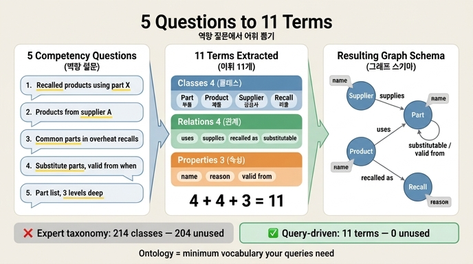

# 다섯 역량 질문에서 뽑은 어휘 11개

## 질문

다섯 역량 질문에서 뽑은 어휘는 어떻게 구성되는가?

## 답

**클래스 4개**(부품·제품·공급사·리콜), **관계 4개**(사용한다·납품한다·리콜되었다·대체가능하다), **속성 3개**(이름·사유·유효시작일) — 총 **11개**다.

## 어디서 나온 숫자인가

12장 예제 코드 `code/questions.py`에 그대로 박혀 있다.

```python
QUESTIONS = [
    "부품 X 를 쓴 제품 중 리콜된 것은?",
    "공급사 A 가 납품한 부품이 들어간 제품은?",
    "리콜 사유가 «과열»인 제품에 공통으로 들어간 부품은?",
    "부품 X 의 대체 부품은 무엇이고, 언제부터 대체 가능한가?",
    "제품 P 의 부품 목록을 3단계까지 펼치면?",
]

# 질문에서 밑줄 그은 낱말만 뽑는다. 이게 어휘의 전부다.
VOCAB_FROM_QUESTIONS = {
    "클래스": ["부품", "제품", "공급사", "리콜"],
    "관계": ["사용한다", "납품한다", "리콜되었다", "대체가능하다"],
    "속성": ["이름", "사유", "유효시작일"],
}
```

4 + 4 + 3 = 11. `ex1_vocab_from_questions.py`는 이 딕셔너리의 값 길이를 그냥 합산해서 총 개수를 출력한다.

## 질문 → 어휘 추적표

| # | 역량 질문 | 여기서 새로 뽑히는 낱말 |
|---|---|---|
| 1 | 부품 X 를 쓴 제품 중 **리콜**된 것은? | 부품(클래스), 제품(클래스), 리콜(클래스), 사용한다(관계), 리콜되었다(관계) |
| 2 | **공급사** A 가 **납품**한 부품이 들어간 제품은? | 공급사(클래스), 납품한다(관계) |
| 3 | 리콜 **사유**가 「과열」인 제품에 공통으로 들어간 부품은? | 사유(속성) |
| 4 | 부품 X 의 **대체** 부품은, **언제부터** 대체 가능한가? | 대체가능하다(관계), 유효시작일(속성) |
| 5 | 제품 P 의 부품 목록을 3단계까지 펼치면? | 새 낱말 없음 — 1번의 「사용한다」를 여러 홉 타면 된다 |

여기서 「이름」은 어느 질문에나 결과를 사람에게 보여 주려면 필요한 최소 표시용 속성으로 붙는다. 5번 질문이 새 어휘를 하나도 만들지 않는다는 점이 중요하다. **깊이(3단계)는 어휘가 아니라 질의문의 문제**이기 때문이다 — 가변 길이 경로 한 줄이면 끝난다.

## 왜 세 갈래(클래스·관계·속성)로 나누는가

역량 질문의 낱말을 품사처럼 분류한 결과다.

- **클래스(노드)** — 「무엇이 있는가」에 해당하는 명사. 독립적으로 존재하고 식별자를 갖는 것.
- **관계(엣지)** — 「무엇이 무엇과 엮이는가」에 해당하는 동사. 그래프에서 실제로 걸어 다니는 길.
- **속성(프로퍼티)** — 「어떤 값인가」에 해당하는 수식어. 필터·표시에 쓰이지만 그 자체로 걸어 다닐 수는 없다.

이 셋만 정해지면 그래프 스키마가 바로 나온다.

```
(공급사)-[납품한다]->(부품)<-[사용한다]-(제품)-[리콜되었다]->(리콜)
                        |
                   [대체가능하다] (유효시작일)
                        v
                     (부품)

속성: 부품.이름 / 제품.이름 / 공급사.이름 / 리콜.사유 / 대체가능하다.유효시작일
```

## 대비: 214개 vs 11개

같은 파일에 도메인 전문가가 처음 제시한 분류 체계가 함께 들어 있다.

```python
EXPERT_TAXONOMY = [
    "부품", "기계부품", "전자부품", "체결부품", "볼트", "너트", "와셔",
    "리벳", "육각볼트", "십자볼트", "스테인리스육각볼트", "M6스테인리스육각볼트",
    "저항", "커패시터", "세라믹커패시터", "전해커패시터", "반도체", "다이오드",
    "트랜지스터", "MOSFET", "N채널MOSFET",
]
```

전체 214개 클래스 중 일부다. `ex1`은 이 목록에서 다섯 질문에 실제로 쓰이는 낱말(「부품」 하나)을 빼고 나머지를 「쓰이지 않는 분류」로 출력한다. 214개 중 204개가 여기 해당한다.

책의 핵심 문장은 이렇다.

> 「M6스테인리스육각볼트」는 틀린 분류가 아니다. 정확한 분류다. 다만 이 다섯 질문에 답하는 데는 필요가 없다. (…) 나중에 넣는 비용보다, 안 쓰는 분류 190개를 유지하는 비용이 크다.

즉 온톨로지는 **도메인의 진리가 아니라 지금 우리 질의가 필요로 하는 최소 어휘**다.

## 이 방식이 주는 실질적 이득

| 항목 | 위에서 아래로 짓기 | 질의에서 거꾸로 뽑기 |
|---|---|---|
| 끝나는 조건 | 없음 (도메인은 무한히 세분화됨) | 「다섯 질의가 돌면 끝」 |
| 산출물 크기 | 클래스 214개 | 어휘 11개 |
| 검증 방법 | 전문가 리뷰 (주관적) | 질의 실행 (객관적) |
| 미사용 비율 | 204/214가 죽은 어휘 | 0 — 모든 낱말이 질의에 쓰임 |

역량 질문(competency question)은 Noy & McGuinness의 Ontology Development 101에서 온 사실상 표준 기법이고, 「온톨로지가 답할 수 있어야 하는 질문 목록」을 먼저 적어 두고 그것을 완성 기준으로 삼는다.

## 자주 헷갈리는 지점

- **11개는 최종형이 아니다.** 여섯 번째 질문이 생기면 어휘도 늘어난다. 「나중에 필요해지면 그때 넣는다」가 이 장의 태도다.
- **「부품」을 볼트·너트·저항으로 쪼개지 않은 이유**는 12.2절 주제다. 분류를 나누는 기준은 「다른 물건인가」가 아니라 「다른 속성을 갖는가」다. 볼트에만 있는 속성(나사산 규격)이 많고 그걸로 질의한다면 그때 쪼개면 된다. `ex2_deep_vs_flat.py`가 깊은 분류(노드 5·관계 4·와셔 추가 시 고칠 곳 3)와 얕은 분류(노드 2·관계 1·고칠 곳 0)를 숫자로 비교한다.
- **「리콜」이 클래스인 이유**는 리콜 자체가 사유(속성)를 갖고 여러 제품에 걸리는 독립 개체이기 때문이다. 만약 리콜에 사유 하나뿐이고 제품당 최대 1건이었다면 제품의 속성으로 두는 게 맞다.
- **「유효시작일」은 관계의 속성**이다. 「대체가능하다」가 언제부터 유효한지를 담으므로 노드가 아니라 엣지에 붙는다. RDF라면 이 지점에서 reification이나 RDF-star가 필요해진다.

## 인포그래픽


