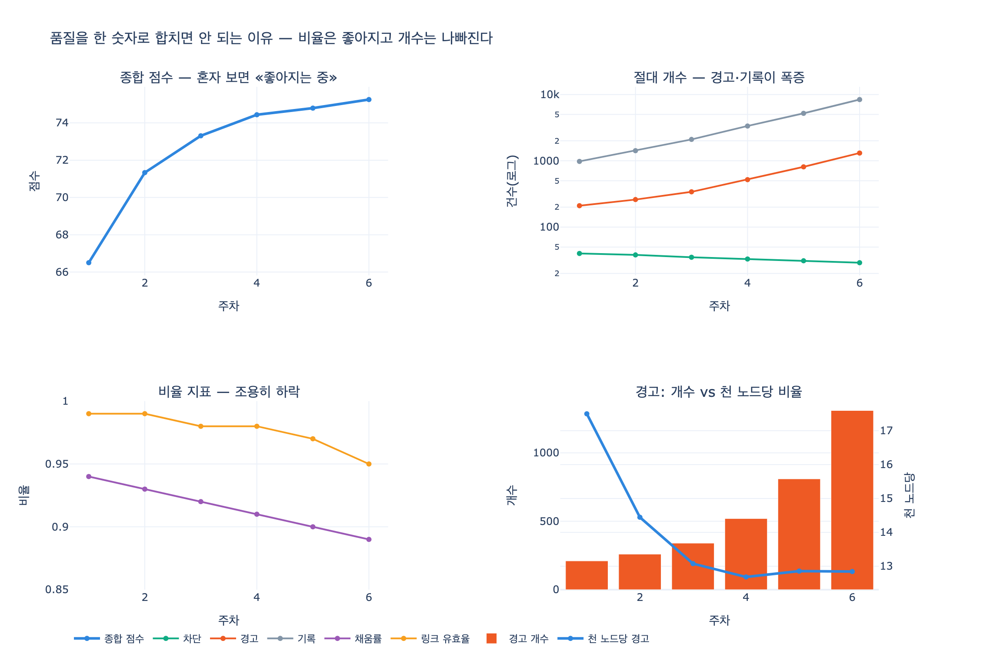

# 품질을 한 숫자로 합치면 안 되는 이유

> **Q.** 품질을 한 숫자로 합치면 안 되는 이유는 무엇인가?
>
> **A.** 데이터가 늘면 비율은 좋아지고 절대 개수는 나빠진다. 둘 다 적어야 속지 않는다.

출처: 13장 「검증하지 않은 그래프는 그냥 링크 뭉치다」 13.5절 *품질을 한 숫자로 만들지 마라* / `code/ex5_quality_metrics.py`

---

## 1. 문제 상황 — 대시보드에 «종합 품질 점수»를 걸었다

품질 지표는 원래 여러 개다. 13장 앞 절들에서 나온 것만 세어도 이렇다.

| 지표 | 성격 | 어디서 나왔나 |
|---|---|---|
| 차단(Violation) 위반 수 | 절대 개수 | 13.2절, `sh:Violation` |
| 경고(Warning) 수 | 절대 개수 | 13.2절, `sh:Warning` |
| 기록(Info) 수 | 절대 개수 | 13.2절, `sh:Info` |
| 필수 속성 채움률 | 비율 | 완전성(completeness) |
| 링크 유효율 | 비율 | 참조 무결성 |

경영진 대시보드에 다섯 줄을 올리기는 부담스럽다. 그래서 흔히 하는 일이 **하나로 합치는 것**이다.
`ex5_quality_metrics.py`가 재현하는 종합 점수는 이렇게 생겼다.

```python
def composite(row):
    """흔히 쓰는 «품질 점수» — 위반율을 뒤집어 100점 만점으로."""
    _, n, blk, warn, info, fill, link = row
    bad = blk * 10 + warn * 3 + info
    return max(0.0, 100 * (1 - bad / (n * 0.5)))
```

수식으로 쓰면

$$\text{bad} = 10 \cdot \text{차단} + 3 \cdot \text{경고} + 1 \cdot \text{기록}$$

$$\text{score} = \max\left(0,\; 100 \times \left(1 - \frac{\text{bad}}{0.5\,N}\right)\right)$$

심각도에 10 : 3 : 1 가중치를 주고, 전체 노드 수 $N$의 절반을 «최악의 경우» 분모로 삼아 100점 만점 척도로 뒤집었다.
꽤 그럴듯해 보인다. 여기서 사고가 난다.

## 2. 6주 데이터 — 점수는 오르고 현실은 무너진다

`WEEKS` 표는 그래프가 커지는 6주를 담고 있다.

| 주 | 노드 | 차단 | 경고 | 기록 | 채움률 | 링크 | **종합 점수** |
|---:|---:|---:|---:|---:|---:|---:|---:|
| 1 | 12,000 | 40 | 210 | 980 | 0.94 | 0.99 | **66.5** |
| 2 | 18,000 | 38 | 260 | 1,420 | 0.93 | 0.99 | **71.3** |
| 3 | 26,000 | 35 | 340 | 2,100 | 0.92 | 0.98 | **73.3** |
| 4 | 41,000 | 33 | 520 | 3,350 | 0.91 | 0.98 | **74.4** |
| 5 | 63,000 | 31 | 810 | 5,200 | 0.90 | 0.97 | **74.8** |
| 6 | 102,000 | 29 | 1,310 | 8,400 | 0.89 | 0.95 | **75.3** |

종합 점수만 보면 66.5 → 75.3. 6주 내내 단조 증가다. 보고서에 「품질 지속 개선 중」이라고 쓸 수 있다.

그런데 같은 표를 지표별로 읽으면 이야기가 완전히 다르다.

| 지표 | 1주 | 6주 | 변화 | 판정 |
|---|---:|---:|---:|---|
| 차단 | 40 | 29 | −27.5% | **좋아짐** |
| 경고 | 210 | 1,310 | +523.8% | **나빠짐** |
| 기록 | 980 | 8,400 | +757.1% | **나빠짐** |
| 채움률 | 0.94 | 0.89 | −5.3% | **나빠짐** |
| 링크 유효율 | 0.99 | 0.95 | −4.0% | **나빠짐** |
| 종합 점수 | 66.5 | 75.25 | +13.2% | 좋아짐(?) |

다섯 개 중 넷이 나빠졌는데 이들을 합친 한 개는 좋아졌다. 이게 이 절의 전부다.

## 3. 왜 이런 일이 벌어지는가 — 분모가 데이터 크기다

핵심은 $\text{score}$의 분모에 $N$(전체 노드 수)이 들어간다는 것이다.
분자와 분모를 갈라 보면 즉시 보인다.

| 주 | bad(가중합) | 분모 $0.5N$ | $\text{bad}/0.5N$ | 점수 |
|---:|---:|---:|---:|---:|
| 1 | 2,010 | 6,000 | 0.3350 | 66.5 |
| 2 | 2,580 | 9,000 | 0.2867 | 71.3 |
| 3 | 3,470 | 13,000 | 0.2669 | 73.3 |
| 4 | 5,240 | 20,500 | 0.2556 | 74.4 |
| 5 | 7,940 | 31,500 | 0.2521 | 74.8 |
| 6 | 12,620 | 51,000 | 0.2475 | 75.3 |

- 분자(위반 가중합): 2,010 → 12,620. **6.28배**
- 분모(노드 수): 12,000 → 102,000. **8.50배**

$$\frac{\text{bad}_6}{\text{bad}_1} = 6.28 \;<\; \frac{N_6}{N_1} = 8.50 \;\;\Longrightarrow\;\; \text{비율 하락} \;\Longrightarrow\; \text{점수 상승}$$

**데이터가 위반보다 빨리 자라기만 하면 점수는 저절로 오른다.**
즉 이 «품질 점수»는 품질이 아니라 **데이터 성장률**을 재고 있다.
적재를 더 세게 돌릴수록 점수가 오르는 지표를, 품질 개선의 KPI로 걸어 놓은 셈이다.

## 4. 두 갈래로 나눠 보기 — 비율 vs 절대 개수

「경고」 하나만 두 방식으로 적어 보면 답이 정반대로 나온다.

| 주 | 경고 개수 | 천 노드당 경고 |
|---:|---:|---:|
| 1 | 210 | 17.50 |
| 2 | 260 | 14.44 |
| 3 | 340 | 13.08 |
| 4 | 520 | 12.68 |
| 5 | 810 | 12.86 |
| 6 | **1,310** | **12.84** |

- **비율**: 17.50 → 12.84. 단위 데이터당 품질은 **정말로 나아졌다**. 파이프라인 개선이 효과가 있었다는 뜻이다.
- **개수**: 210 → 1,310. **사람이 손으로 치워야 할 일감이 6.2배**가 됐다. 데이터 스튜어드 인원은 그대로다.

둘 다 참이다. 그래서 둘 다 적어야 한다.

| 어느 것만 적으면 | 어떻게 속나 |
|---|---|
| **비율만** 적으면 | 일감의 절대 크기를 못 본다. 「12.8‰라 괜찮다」고 하는 동안 백로그가 1,300건 쌓인다. 대응 인력·SLA 산정이 무너진다. |
| **개수만** 적으면 | 성장을 벌준다. 데이터를 8.5배 늘렸는데 위반이 6.3배만 늘었다면 실제로는 개선인데, 개수만 보면 「망했다」가 된다. 개선 노력이 묻힌다. |
| **합쳐서 한 숫자로** 적으면 | 위 둘 다 못 본다. 게다가 방향이 반대인 지표들이 서로를 지운다. |

## 5. 합치면 방향이 반대인 지표가 서로를 지운다

종합 점수 안에서 실제로 벌어진 상쇄를 뜯어 보면 이렇다.

- 차단 위반 40 → 29. **진짜 개선이다.** 되돌릴 수 없는 문제를 팀이 잡아 냈다.
- 경고 210 → 1,310. **악화다.** 질의가 조용히 틀릴 수 있는 데이터가 늘고 있다.
- 링크 유효율 0.99 → 0.95. **가장 급하다.** 그래프의 존재 이유인 «연결»이 5%나 끊겨 있다.

한 숫자로 합치면 이 세 문장이 「75.3점」 하나로 붕괴한다.
**축하할 일(차단 감소)도, 불 끄러 가야 할 일(링크 유효율)도 둘 다 사라진다.**
지표를 합치는 순간 정보량이 줄어드는 것은 정의상 당연한 일인데,
문제는 없어진 정보가 하필 **행동을 결정하는 정보**라는 점이다.

## 6. 배경 — 심슨의 역설과 같은 구조

이 함정은 통계에서 말하는 **심슨의 역설**(Simpson's paradox)과 뿌리가 같다.
크기가 다른 부분집합을 하나로 합칠 때, 부분집합별 결론과 전체 결론이 뒤집히는 현상이다.

expy 6번 셀의 예:

| | 깨끗한 도메인 | 더러운 도메인 | 전체 오류율 |
|---|---|---|---|
| 전 | 10 / 1,000 = **1.00%** | 300 / 1,000 = **30.00%** | 310 / 2,000 = **15.50%** |
| 후 | 750 / 50,000 = **1.50%** | 320 / 1,000 = **32.00%** | 1,070 / 51,000 = **2.10%** |

- 부분집합 오류율은 **둘 다 나빠졌다** (1.00→1.50%, 30.00→32.00%).
- 전체 오류율은 15.50% → 2.10%로 **급격히 좋아졌다**고 보고된다.
- 그리고 실제로 고쳐야 할 건수는 310 → 1,070으로 **3.5배**가 됐다.

크고 비교적 깨끗한 도메인이 합류하면서 가중 평균이 통째로 끌려간 것이다.
그래프는 원래 이렇게 자란다. 새 소스가 붙고, 도메인이 늘고, 크기가 제각각이다.
**그러니 그래프 품질에서는 이 역설이 예외가 아니라 기본값이다.**

## 7. 그래서 어떻게 해야 하나

원문이 제시하는 규칙은 두 줄이다.

> 1. 지표를 하나로 합치지 않는다. 넷이면 넷을 다 보여 준다.
> 2. 절대 개수와 비율을 **둘 다** 적는다. 하나만 적으면 반드시 속는다.

실무로 옮기면:

- **심각도별로 따로 센다.** 13.2절의 차단/경고/기록 세 단계를 하나로 뭉개지 말 것. 차단은 «되돌릴 수 없는가»가 기준이라 성격 자체가 다르다.
- **비율 옆에 개수를 나란히 적는다.** 대시보드 한 칸에 `12.84‰ (1,310건)`처럼 쓴다. 한 칸이 아까워서 하나만 적는 순간 속는다.
- **분모를 명시한다.** 어떤 비율이든 무엇으로 나눴는지 옆에 적는다. 「채움률 0.89」가 아니라 「필수 속성 채움률 0.89 (필수 속성 슬롯 N개 중 M개 비어 있음)」처럼 분모와 빈 칸 수를 함께 노출한다.
- **추세는 지표별로 본다.** 종합 점수 하나의 추세선이 아니라, 지표별 스파크라인 다섯 개를 나란히 둔다.
- **굳이 요약이 필요하면 «최악 지표»를 쓴다.** 평균이나 가중합 대신 「가장 나쁜 지표의 이름과 값」을 헤드라인으로 올리면 상쇄가 안 일어난다.
- **개수 지표에는 절대 임계값을, 비율 지표에는 상대 임계값을 건다.** 「경고 1,000건 초과 시 알림」과 「링크 유효율 0.97 미만 시 알림」은 서로 다른 것을 잡는다.

## 8. 한 줄 정리

| 질문 | 답 |
|---|---|
| 왜 합치면 안 되나 | 분모에 데이터 크기가 들어가서, 데이터가 위반보다 빨리 자라면 점수가 저절로 오른다 |
| 무엇이 사라지나 | 방향이 반대인 지표가 서로 상쇄되어, 개선(차단↓)도 위기(링크 유효율↓)도 안 보인다 |
| 비율만 적으면 | 일감의 절대 크기를 못 본다 (백로그 1,310건) |
| 개수만 적으면 | 성장을 벌준다 (8.5배 성장에 6.3배 증가는 사실 개선) |
| 결론 | **비율과 절대 개수를 둘 다, 지표별로 따로 적는다** |

## 시각화



왼쪽 위 종합 점수 혼자만 우상향한다. 오른쪽 위(로그 축) 경고·기록은 폭증,
왼쪽 아래 비율 지표는 꾸준히 하락, 오른쪽 아래는 같은 「경고」를 개수(막대)와 천 노드당 비율(선)로
나란히 놓은 것이다. 막대는 오르고 선은 내려간다 — 이 한 칸이 이 절의 요약이다.
