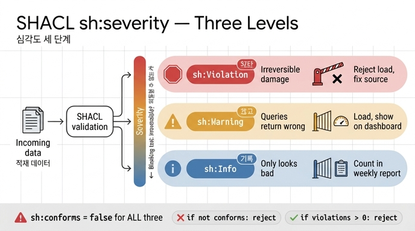

# SHACL 심각도 세 단계

## 질문

SHACL의 심각도 세 단계는 무엇이고 각각 무엇을 뜻하는가?

## 답

`sh:Violation`(차단, 되돌릴 수 없는 것), `sh:Warning`(경고, 질의가 틀리는 것), `sh:Info`(기록, 보기 나쁠 뿐인 것)다.

---

## 왜 세 단계가 필요한가

13장의 도입부가 이 질문의 배경이다.

> 적재를 막았더니 데이터가 안 들어왔습니다. 다음 날 저는 검증을 껐습니다. 그리고 3개월 뒤에 다시 켤 때까지, 데이터는 다시 썩었습니다.

검증은 **전부 막거나 전부 끄거나** 두 가지밖에 없으면 반드시 실패한다.

- 전부 막으면 → 데이터가 안 들어온다 → 사람들이 **검증을 우회한다** → 우회 경로가 주 경로가 된다(최악).
- 전부 끄면 → 데이터가 썩는다.

그래서 중간 단계가 필요하다. SHACL은 이걸 `sh:severity`라는 **표준 술어**로 제공한다. 심각도가 표준에 들어가 있다는 사실 자체가, 「모든 위반이 같은 무게가 아니다」를 명세 저자들도 인정했다는 뜻이다.

## 세 단계 정리

| 심각도 IRI | 이 책의 이름 | 판정 기준 | 실무 처리 |
|---|---|---|---|
| `sh:Violation` | 차단 | **되돌릴 수 없는가** | 적재 거부. 사람이 원천을 고쳐야 한다 |
| `sh:Warning` | 경고 | 질의가 틀리는가 | 적재는 하고 대시보드에 올린다 |
| `sh:Info` | 기록 | 보기 나쁠 뿐인가 | 주간 보고서에 숫자만. 추세가 나빠지면 그때 본다 |

세 값 모두 `sh:Severity` 클래스의 인스턴스이고, SHACL 명세가 미리 정의해 둔 것이다. 표준 참조: [SHACL — sh:severity](https://www.w3.org/TR/shacl/#severity).

### 차단 기준은 딱 하나 — 「되돌릴 수 없는가」

차단 목록을 늘리기 시작하면 끝이 없다. 기준을 하나로 고정하는 게 이 장의 핵심 조언이다.

- **되돌릴 수 있다** → 나중에 고치면 된다 → 차단하지 마라.
- **되돌릴 수 없다** → 지금 막아야 한다 → 차단.

예제의 `ex:bizNumber`가 전형이다. 사업자번호가 없거나 형식이 깨진 회사 노드는 나중에 **다른 노드와 병합될 수 없다**. 식별자가 없으니 동일성을 판단할 근거가 사라진다. 일단 들어오면 그래프 안에 중복이 영구히 남는다 — 되돌릴 수 없다. 그러니 차단이다.

반면 `rdfs:label`이 없는 노드는 나중에 라벨만 채우면 그만이다. 되돌릴 수 있으므로 기록이다.

### `sh:severity`를 안 적으면?

기본값은 **`sh:Violation`**이다. 즉 아무것도 안 쓰면 모든 제약이 차단이 되고, 「전부 막으면 아무것도 안 들어온다」의 함정에 그대로 빠진다. 세 단계를 쓰겠다면 shape마다 명시적으로 적어야 한다.

또 `sh:severity`는 셋 중 하나로 제한되지 않는다. 명세상 `sh:Severity`의 인스턴스면 무엇이든 쓸 수 있어서 조직 고유의 등급(예: `ex:Blocker`)을 정의할 수도 있다. 다만 소비하는 도구가 알아듣지 못하면 의미가 없으므로, 실무에서는 표준 셋으로 버티는 편이 안전하다.

---

## `shapes.ttl` 실제 예시

`content/ch13/code/shapes.ttl`에서 심각도 세 단계가 그대로 나타난다.

```turtle
@prefix sh:   <http://www.w3.org/ns/shacl#> .
@prefix ex:   <http://example.org/> .
@prefix xsd:  <http://www.w3.org/2001/XMLSchema#> .
@prefix rdfs: <http://www.w3.org/2000/01/rdf-schema#> .

# --- 심각도 세 단계. SHACL 은 sh:severity 로 이걸 표준 지원한다. ---
#   sh:Violation — 차단. 되돌릴 수 없는 것.
#   sh:Warning   — 경고. 질의가 틀리는 것.
#   sh:Info      — 기록. 보기 나쁠 뿐인 것.

ex:CompanyShape a sh:NodeShape ;
    sh:targetClass ex:Company ;

    # 차단 — 사업자번호가 없으면 이 노드는 다른 것과 병합될 수 없다
    sh:property [
        sh:path ex:bizNumber ;
        sh:minCount 1 ; sh:maxCount 1 ;
        sh:pattern "^[0-9]{3}-[0-9]{2}-[0-9]{5}$" ;
        sh:severity sh:Violation ;
        sh:message "사업자번호가 없거나 형식이 틀렸다" ] ;

    # 경고 — 등급으로 필터하는 질의가 조용히 빈 결과를 낸다
    sh:property [
        sh:path ex:grade ;
        sh:minCount 1 ;
        sh:in ("A" "B" "C") ;
        sh:severity sh:Warning ;
        sh:message "등급이 없거나 A/B/C 밖이다" ] ;

    # 기록 — 화면에 빈칸이 보일 뿐
    sh:property [
        sh:path rdfs:label ;
        sh:minCount 1 ;
        sh:severity sh:Info ;
        sh:message "표시 이름이 없다" ] .

ex:ContractShape a sh:NodeShape ;
    sh:targetClass ex:Contract ;

    # 차단 — 계약인데 회사가 없으면 고아 노드다
    sh:property [
        sh:path [ sh:inversePath ex:signed ] ;
        sh:minCount 1 ;
        sh:severity sh:Violation ;
        sh:message "이 계약을 체결한 회사가 없다 (고아 노드)" ] ;

    # 경고 — 금액이 음수면 집계가 틀린다
    sh:property [
        sh:path ex:amount ;
        sh:datatype xsd:integer ;
        sh:minInclusive 0 ;
        sh:severity sh:Warning ;
        sh:message "금액이 없거나 음수다" ] .
```

각 제약이 왜 그 등급인지 다시 읽으면 기준이 선명해진다.

| 제약 | 등급 | 이유 |
|---|---|---|
| `ex:bizNumber` 형식 | 차단 | 식별자가 깨지면 **병합 불가**. 중복이 영구히 남는다 |
| `ex:signed` 역경로 | 차단 | 체결 회사가 없는 계약 = **고아 노드**. 붙일 데가 없다 |
| `ex:grade` ∈ {A,B,C} | 경고 | 등급 필터 질의가 **조용히 빈 결과**를 낸다 |
| `ex:amount` ≥ 0 | 경고 | 금액 **집계가 틀린다** |
| `rdfs:label` 존재 | 기록 | 화면에 **빈칸이 보일 뿐** |

---

## 함정 — `sh:conforms`만 보면 안 된다

`ex1_shacl_severity.py`가 노리는 지점이 이것이다.

```python
ok, report, _ = validate(data, shacl_graph=shapes, inference="none", advanced=True)
```

SHACL 명세상 `sh:conforms`는 **검증 결과가 하나도 없을 때만** `true`다. 심각도는 고려하지 않는다. 즉:

> 「표시 이름이 없다」(`sh:Info`) 하나만 걸려도 `ok`는 `False`가 된다.

그래서 `if not ok: reject()` 같은 코드를 쓰면, 라벨 빠진 노드 하나 때문에 파이프라인 전체가 선다. 이게 「적재를 막았더니 데이터가 안 들어왔습니다」의 정체다.

올바른 소비 방식은 **`sh:conforms`가 아니라 리포트를 심각도별로 세는 것**이다.

```python
SH = Namespace("http://www.w3.org/ns/shacl#")
LEVEL = {"Violation": "차단", "Warning": "경고", "Info": "기록"}

for r in report.subjects(URIRef(str(SH) + "resultSeverity"), None):
    sev = str(report.value(r, SH.resultSeverity)).rsplit("#", 1)[-1]
    ...

cnt = Counter(r[0] for r in rows)
# 게이트는 이렇게 건다
if cnt["차단"] > 0:
    reject_batch()
```

핵심: **게이트 조건은 `not ok`가 아니라 `Violation 개수 > 0`**이다.

---

## 심각도별 실무 처리 방식

### 차단 (`sh:Violation`) — 적재 거부 후 원천 수정

- 배치/트랜잭션을 **거부**한다. 그래프에 넣지 않는다.
- 자동 보정하지 않는다. 되돌릴 수 없는 항목을 기계가 추측해서 채우면 잘못된 값이 영구히 남는다.
- **사람이 원천 시스템을 고친다.** 파이프라인 중간이 아니라 원천이다. 중간에서 고치면 다음 배치에 같은 오류가 또 온다.
- 운영 형태: 거부 사유(`sh:resultMessage` + `sh:focusNode`)를 원천 담당자에게 티켓으로 되던진다.

### 경고 (`sh:Warning`) — 적재하되 대시보드

- **적재는 한다.** 데이터가 없는 것보다 불완전하게라도 있는 편이 낫다.
- 대신 **대시보드에 올린다.** 질의가 틀릴 수 있다는 사실을 소비자가 알아야 한다.
- 「등급이 Z」인 회사는 `grade IN ("A","B","C")` 질의에서 조용히 빠진다. 에러가 안 나고 결과 개수만 줄어든다 — 이런 건 대시보드에 세워 두지 않으면 아무도 모른다.
- 운영 형태: 경고 건수를 시계열로 추적하고, 임계치를 넘으면 알림. 특정 소스에서 경고가 급증하면 그 소스를 조사한다.

### 기록 (`sh:Info`) — 주간 보고서 숫자만

- 적재하고, 알림도 안 울린다.
- **주간 보고서에 숫자만** 남긴다. 추세가 나빠지면 그때 본다.
- 라벨 없는 노드 12개는 문제가 아니지만, 3주째 12 → 40 → 300으로 늘고 있다면 어딘가 파이프라인이 깨진 것이다. **절대 개수의 추세**가 신호다.
- 주의: 이 등급을 알림으로 올리면 알람 피로가 생기고, 결국 사람들이 전체 알림을 무시하게 된다. 그러면 차단·경고까지 같이 묻힌다.

### 한 줄 요약

| 등급 | 게이트 | 알림 | 소비처 |
|---|---|---|---|
| 차단 | 적재 거부 | 즉시 | 원천 담당자 티켓 |
| 경고 | 통과 | 임계치 초과 시 | 품질 대시보드 |
| 기록 | 통과 | 없음 | 주간 보고서 숫자 |

---

## 연결되는 이야기

- **13.1** 추론기와 검증기는 다른 물건이다 — OWL은 없으면 **있다고 결론**내고, SHACL은 없으면 **위반이라고 적는다**. 심각도는 SHACL 쪽에만 있는 개념이다. 추론기에는 「경고」가 없다.
- **13.5** 품질을 한 숫자로 만들지 마라 — 심각도를 나눠 놓고 다시 하나의 점수로 합치면 나눈 의미가 사라진다. 데이터가 늘면 비율은 좋아지고 절대 개수는 나빠진다. 등급별로, 비율과 개수를 **둘 다** 적어야 한다.

## 한 문장으로

`sh:Violation`은 되돌릴 수 없어서 막는 것, `sh:Warning`은 질의가 틀리니 보여 주는 것, `sh:Info`는 보기 나쁠 뿐이라 세기만 하는 것 — 그리고 `sh:conforms`는 이 셋을 구분하지 않으므로 절대 게이트로 쓰면 안 된다.

## 인포그래픽


