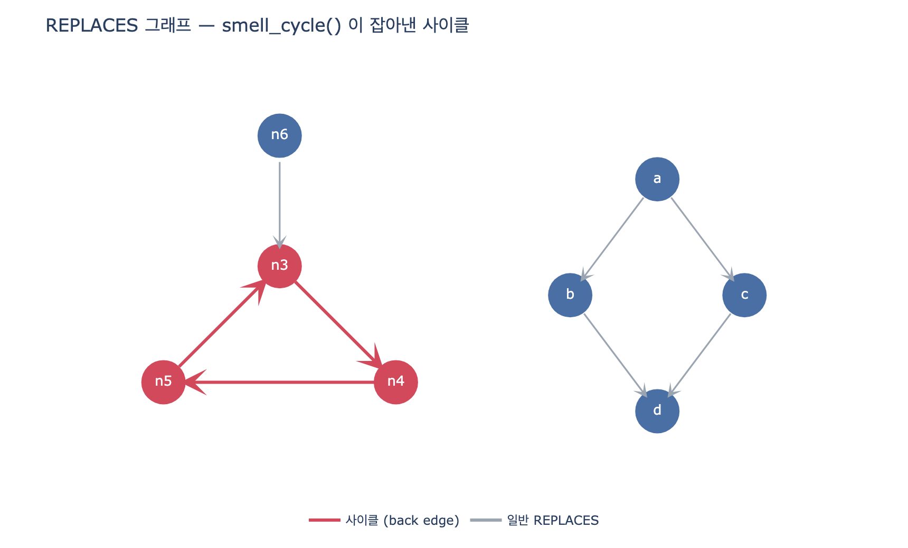

# `smell_cycle()`은 사이클을 어떻게 검출하는가?

**답:** DFS 중 현재 스택(`stack`)에 있는 노드를 다시 만나면, 경로에서 그 노드부터 잘라 사이클로 기록한다.

---

## 1. 이 함수가 왜 필요한가

13.3절 「SHACL로 못 잡는 것들」의 다섯 가지 그래프 스멜 중 하나가 **사이클**이다. 책이 그 이유를 한 줄로 적는다.

> 사이클    — SHACL 에 «순환 없음» 제약이 없다

SHACL은 «이 노드의 이 속성이 이런 모양인가»를 검사한다. 노드 하나를 보면 답이 나오는 질문이다. 그런데 「`n3`이 `n4`로 대체되고, `n4`가 `n5`로, `n5`가 다시 `n3`으로 대체된다」는 **경로 전체를 따라가 봐야** 알 수 있다. 형태 제약의 어휘로는 표현할 수가 없다. 그래서 2층(스멜)에서 코드로 세어 본다.

`ex3_graph_smells.py`에 심어 둔 데이터가 이거다.

```python
EDGES += [
    ...
    ("n3", "REPLACES", "n4"), ("n4", "REPLACES", "n5"),
    ("n5", "REPLACES", "n3"),                            # 사이클
    ...
]
```

## 2. 실제 코드

`content/ch13/code/ex3_graph_smells.py`:

```python
def smell_cycle(edges, rel):
    adj = defaultdict(list)
    for a, r, b in edges:
        if r == rel:
            adj[a].append(b)
    seen, stack, out = set(), set(), []

    def go(u, path):
        if u in stack:                                    # ①
            out.append(path[path.index(u):] + [u]); return
        if u in seen:                                     # ②
            return
        seen.add(u); stack.add(u)                         # ③
        for v in adj[u]:
            go(v, path + [u])
        stack.discard(u)                                  # ④

    for u in list(adj):
        go(u, [])
    return out
```

읽는 순서는 이렇다.

| 지점 | 하는 일 |
|---|---|
| 준비 | `rel`(여기선 `REPLACES`)인 엣지만 골라 인접 리스트 `adj`를 만든다. 관계가 섞여 있으면 사이클 판정이 무의미해지니까 |
| ① | **`u`가 지금 밟고 있는 경로 위에 있다** → 사이클. `path`에서 `u`가 처음 나온 자리부터 끝까지 잘라 `+ [u]`로 닫아 기록 |
| ② | `stack`에는 없는데 `seen`에는 있다 → 이미 다 파고 나온 가지. 다시 안 판다 |
| ③ | 처음 보는 노드 → `seen`과 `stack`에 **둘 다** 넣고 자식으로 내려간다 |
| ④ | 자식을 다 돌고 돌아 나올 때 `stack`에서만 뺀다. `seen`에는 그대로 남는다 |

`for u in list(adj)`로 모든 노드를 시작점으로 한 번씩 시도한다. 그래프가 여러 조각으로 끊겨 있어도, 어느 노드에서 시작해도 못 닿는 사이클이 있어도 놓치지 않기 위해서다. (사이클 위의 노드는 반드시 나가는 엣지가 있으므로 `adj`의 키에 들어 있다.)

## 3. 핵심 — white / gray / black

방향 그래프 DFS의 교과서적 상태 구분이다. 이 코드는 색 이름을 쓰지 않지만 정확히 같은 걸 한다.

| 색 | 뜻 | 이 코드에서 |
|---|---|---|
| **white** (흰색) | 아직 방문 안 함 | `seen`에도 `stack`에도 없음 |
| **gray** (회색) | 지금 재귀 호출 스택 위에 있음. 진입은 했는데 아직 자식을 다 못 돌았다 | `stack`에 있음 |
| **black** (검정) | 자식을 다 돌고 되돌아 나왔다 | `seen`에 있고 `stack`에는 없음 |

노드는 white → gray → black 순으로만 이동한다. ③에서 white가 gray가 되고, ④에서 gray가 black이 된다. 되돌아가는 전이는 없다.

그리고 여기서 정리 하나가 나온다. **엣지 `u → v`를 밟았을 때 `v`의 색이 gray라면, 그건 back edge이고 그래프에 사이클이 있다.** 역도 성립한다. 방향 그래프에 사이클이 있으면 DFS는 반드시 back edge를 하나 이상 만난다. 그래서 이 알고리즘은 «있는 사이클을 못 찾는 일»이 없다.

엣지의 네 종류로 정리하면 이렇다.

| 도착 노드의 색 | 엣지 종류 | 사이클인가 |
|---|---|---|
| white | tree edge | 아니다. 그냥 더 내려간다 |
| **gray** | **back edge** | **그렇다** |
| black | forward / cross edge | **아니다** |

`smell_cycle()`의 ①과 ②가 이 표의 gray 행과 black 행이다.

## 4. 왜 «이미 방문»과 «현재 스택 위»를 섞으면 안 되는가

이게 이 카드의 진짜 요점이다. `seen`과 `stack`은 둘 다 「이미 만나 본 노드」의 집합이고, 언제나

$$\text{stack} \subseteq \text{seen}$$

이다. 그래서 헷갈리기 쉽다. 하지만 **둘을 바꿔 쓰면 정반대 방향으로 두 가지 버그가 난다.**

### (A) `stack` 없이 `seen`만 쓰면 → 오탐 (없는 사이클을 신고)

무향 그래프에서 사이클을 찾을 때는 「이미 방문한 노드를 또 만나면 사이클」이 대체로 맞다. 그 감각으로 이렇게 쓰면:

```python
def go(u, path):
    if u in seen:                                    # ← stack 을 안 만든다
        out.append(path[path.index(u):] + [u]); return
    seen.add(u)
    for v in adj[u]:
        go(v, path + [u])
```

다이아몬드 모양(`a → b`, `a → c`, `b → d`, `c → d`)에서 터진다. `d`는 `b`를 거쳐 한 번, `c`를 거쳐 또 한 번, 총 두 번 도달한다. 하지만 이건 **사이클이 아니라 그냥 합류**다. `d`는 두 번째로 닿았을 때 이미 black이다.

방향 그래프에서 「같은 노드에 두 번 닿았다」는 사이클의 증거가 아니다. 부품 `d`를 부품 `b`와 `c`가 둘 다 대체한다는, 지극히 정상적인 상황이다.

거기다 이 버전은 **`path.index(u)`에서 `ValueError`로 터지기도 한다.** `u`가 black이면 `path`(현재 조상 목록) 안에 없기 때문이다. 잘라 낼 자리 자체가 없다.

실무적 피해는 「예외가 난다」보다 「가짜 항목이 목록에 섞인다」쪽이 크다. 책이 못 박은 대로 2층 스멜 검사의 일은 **자동으로 고치는 게 아니라 사람이 볼 목록을 뽑아 주는 것**이다.

> 2층은 자동으로 고치지 않는다. 목록만 뽑아 주는 게 일이다.

오탐이 섞이면 사람이 그 목록을 안 보게 된다. 그러면 13.2절에서 말한 「우회 경로가 주 경로가 되는」 그 실패와 같은 자리로 간다.

### (B) `seen` 검사를 `stack` 검사보다 먼저 하면 → 미탐 (있는 사이클을 놓침)

두 줄의 순서만 바꿔 보자.

```python
def go(u, path):
    if u in seen:                                    # ← 먼저 검사
        return
    if u in stack:                                   # ← 여기 절대 도달 못 함
        out.append(path[path.index(u):] + [u]); return
    seen.add(u); stack.add(u)
    ...
```

`stack ⊆ seen`이므로 `u`가 `stack`에 있으면 `u`는 반드시 `seen`에도 있다. 첫 `if`에서 전부 걸려 `return`한다. 두 번째 `if`는 **도달 불가능한 죽은 코드**다.

결과는 «사이클 0건». 예외도 안 나고, 로그도 안 남고, 그냥 조용히 아무것도 안 잡는다. **오탐보다 이쪽이 더 위험하다.** 검사가 돌고 있다고 믿는데 실은 안 돌고 있는 상태고, 사이클이 없어서 0건인지 코드가 고장 나서 0건인지 구분할 방법이 없다.

그래서 원본 코드에서 ①이 ②보다 **위에 있는 것은 스타일이 아니라 정확성 요구사항**이다.

### 그리고 ④ `stack.discard(u)`를 빼면

`stack`이 영영 안 줄어서 `seen`과 사실상 같아진다. 그러면 (A)와 같은 오탐 상태가 된다. gray를 black으로 바꿔 주는 게 ④이고, 이 한 줄이 「경로 위」와 「이미 끝남」을 가른다.

## 5. 사이클 경로를 잘라 내는 방법

```python
out.append(path[path.index(u):] + [u])
```

`path`는 «`u`까지 오는 데 밟은 조상들의 리스트»다. `u` 자신은 아직 안 들어 있다(호출이 `go(v, path + [u])` 꼴이라 부모까지만 담긴다). `u`가 `stack` 위에 있다는 건 `path` 어딘가에 `u`가 이미 있다는 뜻이고, 그 위치가

$$i = \text{path.index}(u), \qquad \text{cycle} = \text{path}[i:] + [u]$$

이다. 앞쪽의 «사이클로 들어오기만 한 꼬리»는 버린다.

예를 들어 `n0 → n9 → n3 → n4 → n5` 로 내려와서 `n5`가 다시 `n3`을 가리키면:

```
path        = ['n0', 'n9', 'n3', 'n4', 'n5']
index('n3') = 2
버려지는 꼬리 = ['n0', 'n9']            ← 사이클 밖이다
사이클       = ['n3', 'n4', 'n5', 'n3']  ← 첫 노드와 끝 노드가 같다
```

책의 출력이 `n3 → n4 → n5 → n3` 으로 닫힌 고리가 되는 이유다.

## 6. 복잡도와 한계

노드·엣지를 한 번씩 보므로 $O(V + E)$. 다만 `path + [u]`가 매 호출마다 리스트를 복사하므로 깊이 $d$에서 $O(d)$가 더 붙는다. 스멜 검사용 소규모 데이터에는 문제없지만 대형 그래프에는 못 쓴다.

알아 둘 한계 셋.

- **모든 사이클을 열거하지 않는다.** back edge 하나당 대표 경로 하나만 기록한다. 전부 열거하려면 Johnson 알고리즘 같은 게 필요하다. 다만 스멜 검사의 목적은 「사람이 볼 목록」이므로 «여기 순환이 있다» 한 건이면 충분하다.
- **재귀 깊이 한계.** 파이썬 기본 재귀 한계는 1000이다. 대체 체인이 길면 명시적 스택을 쓴 반복문 버전으로 바꿔야 한다.
- **관계 하나만 본다.** `rel` 인자로 `REPLACES` 하나를 받으므로, 여러 관계가 섞여 도는 순환은 못 잡는다.

## 7. 한 줄로

`seen`은 «가 봤다», `stack`은 «지금 그 위에 서 있다». 사이클은 후자에서만 나온다.

## 시각화



왼쪽 빨간 삼각형이 `smell_cycle()`이 잡아낸 back edge 사이클(`n3 → n4 → n5 → n3`)이고, `n6 → n3`은 사이클 밖에서 들어오기만 하는 회색 엣지다. 오른쪽 다이아몬드는 `d`에 두 번 도달하지만 사이클이 아니다 — `seen`만 쓰는 버전이 여기서 오탐을 낸다.
