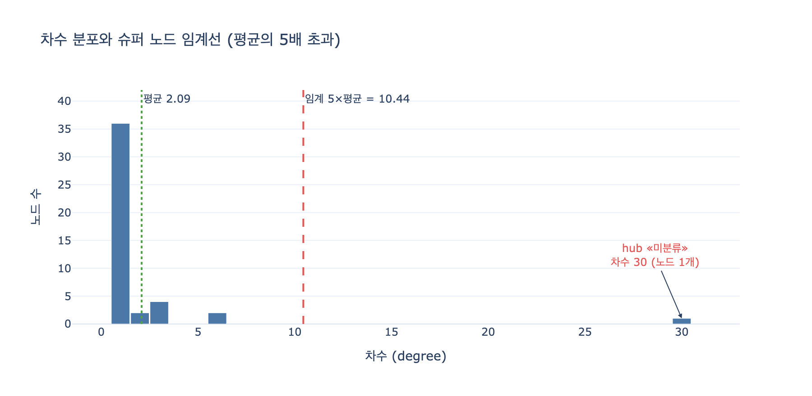

# 슈퍼 노드 판정 기준 — 「전체 평균 차수의 5배 초과」

**질문**: `ex3_graph_smells.py`에서 슈퍼 노드는 어떤 기준으로 판정하는가?

**답**: 전체 평균 차수의 5배를 초과하는 노드다. '미분류' 카테고리 노드가 대표적인 예다.

---

## 1. 실제 코드

판정 로직은 함수 두 개가 전부다.

```python
from collections import Counter

def degrees(edges):
    d = Counter()
    for a, _, b in edges:
        d[a] += 1; d[b] += 1
    return d


def smell_supernode(nodes, edges, factor=5):
    d = degrees(edges)
    if not d:
        return []
    avg = sum(d.values()) / len(d)
    return [(v, n) for v, n in d.most_common() if n > avg * factor]
```

읽는 순서대로 뜯어보면 이렇다.

1. **`degrees(edges)`** — 엣지 `(a, rel, b)`를 훑으면서 **양쪽 끝** 노드의 카운트를 각각 1씩 올린다. 방향을 구분하지 않으므로 여기서 나오는 값은 진입 차수도 진출 차수도 아닌 **무방향 총 차수**다. 슈퍼 노드는 "이 노드에 뭐가 얼마나 매달려 있느냐"가 문제라서 방향을 굳이 나누지 않는다.
2. **`avg = sum(d.values()) / len(d)`** — 분자는 차수의 총합, 즉 `2 × |E|`다(엣지 하나가 두 번 세어지므로). 분모는 `len(d)`, 즉 **엣지에 한 번이라도 등장한 노드의 수**다. `len(nodes)`가 아니라는 점이 중요하다. 고아 노드(`orph`)는 `Counter`에 키 자체가 없으므로 평균 계산에서 빠진다.
3. **`n > avg * factor`** — `factor`의 기본값이 `5`. 그래서 "평균 차수의 5배 **초과**"다. `>=`가 아니라 `>`이므로 정확히 5배인 노드는 걸리지 않는다.
4. 반환값은 `d.most_common()` 순서를 그대로 물려받아 **차수 내림차순**으로 정렬된 `(노드ID, 차수)` 리스트다.

호출부는 그냥 목록만 찍는다. **자동으로 고치지 않는다**는 게 이 절의 핵심이다.

```python
sn = smell_supernode(NODES, EDGES)
print(f"[슈퍼 노드] 평균 차수의 5배 초과 — {len(sn)}건")
for v, n in sn:
    print(f"    {v} ({NODES[v].get('name','')}) 차수 {n}")
```

## 2. 예제 데이터에서 숫자가 실제로 어떻게 나오는가

예제 그래프는 이렇게 생겼다.

```python
NODES = {f"n{i}": {"label": "Part"} for i in range(1, 41)}
NODES.update({
    "hub":  {"label": "Category", "name": "미분류"},   # ← 문제의 노드
    "cat1": {"label": "Category", "name": "체결"},
    "cat2": {"label": "Category", "name": "전자"},
    "orph": {"label": "Part", "name": "고아 부품"},
    "dupA": {"label": "Supplier", "name": "가온테크"},
    "dupB": {"label": "Supplier", "name": "가온테크(주)"},
})

EDGES = []
for i in range(1, 31):
    EDGES.append((f"n{i}", "IN_CATEGORY", "hub"))       # 슈퍼 노드
for i in range(31, 36):
    EDGES.append((f"n{i}", "IN_CATEGORY", "cat1"))
for i in range(36, 41):
    EDGES.append((f"n{i}", "IN_CATEGORY", "cat2"))
EDGES += [
    ("n1", "SUPPLIED_BY", "dupA"),
    ("n2", "SUPPLIED_BY", "dupB"),                       # 중복 엔티티
    ("n3", "REPLACES", "n4"), ("n4", "REPLACES", "n5"),
    ("n5", "REPLACES", "n3"),                            # 사이클
    ("n6", "IN_CATEGORY", "cat1"), ("n6", "IN_CATEGORY", "cat2"),
]
```

직접 계산해 보면 (실행으로 검증한 값):

| 항목 | 값 |
|---|---|
| 엣지 수 $\|E\|$ | 47 |
| 차수 총합 $\sum_v \deg(v) = 2\|E\|$ | 94 |
| 차수가 잡힌 노드 수 (= `len(d)`) | 45 (전체 46개 중 `orph` 제외) |
| 평균 차수 $\bar{d}$ | $94 / 45 \approx 2.0889$ |
| 임계값 $5\bar{d}$ | $\approx 10.4444$ |
| 판정된 슈퍼 노드 | `hub` (차수 **30**) — **1건** |

차수 상위권은 `hub`(30), `cat1`(6), `cat2`(6), `n3`/`n4`/`n5`(각 3)다. 2등인 `cat1`·`cat2`도 평균의 약 2.9배지만 임계선 10.44에는 한참 못 미친다. **1등과 2등 사이가 5배**로 벌어져 있어서 판정이 깔끔하게 떨어진다.

수식으로 쓰면 판정 조건은

$$
\text{supernode}(v) \iff \deg(v) > 5 \cdot \bar{d},
\qquad
\bar{d} = \frac{\sum_{u \in V_E} \deg(u)}{|V_E|} = \frac{2|E|}{|V_E|}
$$

여기서 $V_E$는 엣지에 등장하는 노드 집합이다.

## 3. 왜 '미분류' 같은 fallback 카테고리가 슈퍼 노드가 되는가

`hub`의 `name`이 하필 **`"미분류"`**인 건 우연이 아니다. fallback 카테고리는 구조적으로 슈퍼 노드가 될 수밖에 없다.

**(1) fallback은 "나머지 전부"를 받는 통이다.** 분류 체계를 만들 때 `체결`, `전자` 같은 진짜 카테고리는 각각 특정 부품 집합만 가져간다. 그런데 어느 쪽에도 안 들어가는 부품은 전부 `미분류` 하나로 간다. 진짜 카테고리는 $N$개로 나눠 갖고, fallback은 안 나눈다. 예제에서 40개 부품 중 30개가 `hub`에 붙은 게 정확히 이 모양이다.

**(2) NOT NULL 압박이 fallback을 키운다.** 스키마에 "부품은 카테고리가 반드시 하나 있어야 한다"는 제약(`sh:minCount 1`)을 걸면, 분류를 모르는 부품도 뭔가는 넣어야 한다. 그래서 파이프라인이 `미분류`를 자동으로 채운다. 13.4절의 `ex4_regression.py`가 바로 그 시나리오다.

```python
# 스키마 변경 — «카테고리 없음»을 None 대신 «미분류»로 채우기로 했다
def migrate(rows):
    out = []
    for r in rows:
        r = dict(r)
        if r.get("type") == "부품" and not r.get("category"):
            r["category"] = "미분류"
        out.append(r)
    return out
```

이 마이그레이션은 형태 검사를 **통과시키려고** 만든 것이다. 그런데 통과시키는 대가로 `미분류` 노드의 차수를 부풀린다. 게다가 `ex4`가 보여 주듯 "카테고리 없는 부품" 질의가 빈 답을 내게 만든다. **결측을 지운 게 아니라 눈에 안 보이게 옮겼을 뿐**이다.

**(3) 그래서 SHACL로는 못 잡는다.** `미분류`에 30개가 붙어 있든 3개가 붙어 있든, **각 엣지 하나하나는 스키마상 완벽히 합법**이다. `Part --IN_CATEGORY--> Category`라는 형태 제약을 어긴 게 없다. 위반은 개별 트리플이 아니라 **분포**에 있다. 예제 코드 마지막 설명이 이 점을 딱 집어 말한다.

> 슈퍼 노드 — «평균의 5배»는 데이터 전체를 봐야 나오는 상대값이다

SHACL은 focus node 단위로 형태를 검사하는 언어라 "전체를 다 세고 나서 상대적으로 판정"하는 걸 자연스럽게 표현하지 못한다. 그래서 이 장의 결론이 **2층 구조**다.

- **1층 SHACL** — 참/거짓이 분명한 형태 제약. 위반이면 막는다.
- **2층 스멜** — 세어 보고 이상하면 사람이 본다. **자동으로 고치지 않는다.**

`미분류`가 슈퍼 노드로 뜬 건 "버그"가 아니라 "분류 체계에 구멍이 있다"는 신호다. 노드를 지우거나 엣지를 쳐 내는 게 답이 아니라, 카테고리를 더 쪼개거나 `미분류`를 상태 플래그로 빼는 게 답이다. 이건 도메인이 정하는 일이라 자동화 대상이 아니다.

## 4. 슈퍼 노드가 실제로 무엇을 망가뜨리는가

### 4.1 질의 성능 — 팬아웃 폭발

그래프 DB의 질의 계획은 대개 "시작점을 잡고 인접 리스트를 따라간다"는 형태다. 슈퍼 노드를 지나가는 순간 중간 결과가 그 노드의 차수만큼 불어난다.

```
MATCH (p:Part)-[:IN_CATEGORY]->(c:Category)<-[:IN_CATEGORY]-(sibling:Part)
```

"같은 카테고리의 형제 부품" 질의는 카테고리 차수 $k$에 대해 $O(k^2)$ 쌍을 만든다. `체결`(6)은 36쌍, `미분류`(30)는 900쌍이다. 실제 운영 그래프에서 fallback 카테고리 차수가 수십만이면 이 한 줄이 곱하기 수백억이 된다. **질의문은 그대로인데 데이터 하나 때문에 응답 시간이 자릿수로 바뀐다.**

부수 효과도 크다. 슈퍼 노드의 인접 리스트가 캐시/페이지 하나에 안 들어가서 디스크 I/O가 튀고, 트랜잭션이 그 노드를 잠그면 **쓰기 경합의 병목**이 된다. 여러 워커가 동시에 "카테고리 붙이기"를 하면 전부 같은 `미분류` 노드를 건드린다.

### 4.2 순회 — 최단 경로가 거짓말을 한다

BFS/DFS나 최단 경로 알고리즘에서 슈퍼 노드는 **모든 것을 모든 것과 이어 주는 지름길**이 된다. `미분류`를 거치면 임의의 두 부품이 홉 2에 연결된다. 그런데 그 연결은 "둘 다 분류를 모른다"는 뜻일 뿐, 의미상 아무 관계가 없다.

- 그래프 RAG의 다중 홉 컨텍스트 수집이 `미분류`를 타고 아무 상관없는 문서를 끌어온다.
- 추천/연관 탐색이 "미분류끼리라서 비슷하다"는 결론을 낸다.
- 홉 2~3짜리 BFS의 프론티어가 슈퍼 노드 하나로 그래프 전체에 가까워져 탐색이 사실상 전수 스캔이 된다.
- PageRank·중심성 계산에서 fallback 노드가 최상위로 올라온다. "가장 중요한 개념은 미분류입니다"라는 결과가 나온다.

방어책은 보통 **순회에서 슈퍼 노드를 제외(denylist)** 하거나, 차수 상한을 두고 샘플링하거나, 엣지를 관계 타입·시간대로 쪼개는 것이다. 다만 어느 쪽이든 "이 노드가 슈퍼 노드다"라는 걸 먼저 알아야 하고, 그게 `smell_supernode`가 하는 일이다.

### 4.3 임베딩 — 이웃 정보가 뭉개진다

노드 임베딩(node2vec, GraphSAGE, GNN 계열)은 "이웃을 집계해서 나를 표현한다"는 전제 위에 서 있다. 슈퍼 노드는 이 전제를 두 방향에서 깬다.

**바깥으로**: 랜덤 워크가 `미분류`에 자주 빠지고, 거기서 나가는 30개 방향 중 하나로 튄다. 그 결과 `미분류`를 공유하는 부품들의 워크 시퀀스가 서로 섞이고, **의미상 무관한 노드들의 임베딩이 가까워진다**. 벡터 검색에서 "왜 이게 비슷하다고 나오죠?"의 흔한 범인이다.

**안으로**: GNN의 평균/합 집계는 이웃 30개(운영에서는 수십만 개)를 한 벡터로 뭉개므로 슈퍼 노드 자신의 표현이 거의 무정보한 평균값이 된다. 그리고 메시지 패싱 한 스텝마다 그 무정보 벡터가 이웃 전원에게 뿌려져 **over-smoothing**을 가속한다. 미니배치 학습에서는 이웃 샘플링 비용도 이 노드에서 폭발한다.

### 4.4 그 외

- **파티셔닝/샤딩** — 그래프를 나눠 저장할 때 슈퍼 노드는 어느 파티션에 넣어도 cross-partition 엣지를 대량으로 만든다.
- **시각화** — 힘 기반 레이아웃이 슈퍼 노드 중심의 헤어볼이 된다.
- **의미** — 가장 근본적인 문제. `미분류`가 카테고리로 앉아 있으면 "카테고리를 가진 부품 30개"라는 통계가 나온다. 사실은 "분류 못 한 부품 30개"인데.

## 5. 임계값 5배의 함정 — 평균이 슈퍼 노드에게 끌려간다

`factor=5`는 마법의 숫자가 아니다. 그리고 이 판정에는 알아 둬야 할 구조적 약점이 하나 있다.

**평균 자체가 슈퍼 노드의 차수를 포함해서 계산된다.** 즉 잡으려는 대상이 임계선을 위로 끌어올린다. 예제에서 `hub`의 차수 30은 총합 94의 32%다. `hub`를 빼고 평균을 내면 $(94-30)/44 \approx 1.45$가 되고, 임계값은 7.27로 내려간다. 슈퍼 노드가 여러 개 있거나 하나가 훨씬 더 클수록 이 자기 마스킹 효과가 심해진다. 극단적으로, 그래프가 전부 별 모양(star)이면 어떤 노드도 평균의 5배를 못 넘길 수 있다.

실무에서 쓰는 대안:

| 기준 | 특징 |
|---|---|
| 평균 × 배수 (예제 방식) | 계산이 가장 싸고 설명이 쉽다. 대상이 평균을 끌어올리는 자기 마스킹에 약하다. |
| **중앙값 × 배수** | 이상치에 둔감(robust). 슈퍼 노드가 몇 개 있어도 기준선이 안 흔들린다. |
| **백분위수 (P99 등)** | "상위 1%"로 정의. 잡히는 건수를 예측할 수 있어 운영 알림에 좋다. |
| **MAD 기반** ($\text{median} + k \cdot \text{MAD}$) | 중앙값의 로버스트 버전. 통계적으로 가장 튼튼하다. |
| **절대 임계값** (예: 차수 > 10,000) | 시스템 한계에 맞춘 기준. 그래프가 커져도 안 흔들린다. |
| **관계 타입별로 따로** | `IN_CATEGORY` 차수와 `SUPPLIED_BY` 차수를 섞지 않는다. 실무에서 제일 유용하다. |

차수 분포는 대개 **멱법칙(power-law)에 가까운 두꺼운 꼬리**를 가지므로 평균은 애초에 대표값으로 적절하지 않다. 그래도 예제가 평균을 쓴 건 의도적이다. 이 절의 요지는 정교한 이상치 탐지가 아니라 **"전체를 세어 봐야 나오는 상대값이라 SHACL로는 못 잡는다"**는 사실 자체이기 때문이다. 실제 프로젝트에서는 배수를 그대로 쓰지 말고, 자기 그래프의 차수 분포를 한 번 그려 보고 정하는 게 맞다.

## 6. 한 줄 정리

`smell_supernode`는 무방향 차수를 세고, **엣지에 등장한 노드들의 평균 차수를 구한 뒤, 그 5배를 초과하는 노드**를 차수 내림차순으로 돌려준다. 예제에서는 평균 2.09, 임계 10.44, 걸리는 건 차수 30짜리 `미분류`(`hub`) 하나다. fallback 카테고리는 "나머지 전부"를 받기 때문에 구조적으로 슈퍼 노드가 되고, 개별 엣지는 전부 합법이라 SHACL로 잡히지 않으며, 질의 팬아웃·순회 지름길·임베딩 오염을 동시에 일으킨다. 그래서 자동 수정 대상이 아니라 **사람이 보는 목록**이다.

## 시각화


