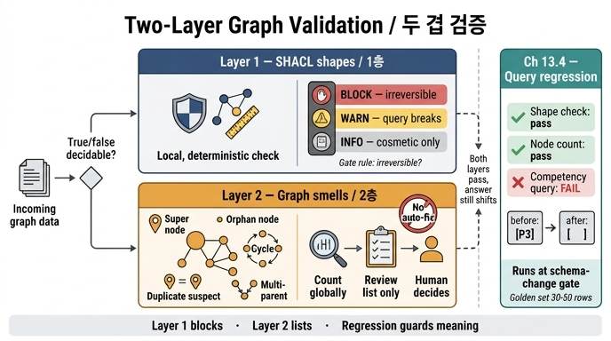

# 13장이 제시하는 두 겹 검증 구조

> **Q.** 13장이 제시하는 두 겹 검증 구조는 무엇인가?
>
> **A.** 1층은 SHACL로 참/거짓이 분명한 형태 제약을 검사하고, 2층은 스멜을 세어 보고 이상하면 사람이 본다. 2층은 자동 수정하지 않는다.

---

## 1. 이 구조가 나온 자리

`ex3_graph_smells.py`의 마지막 출력이 이 카드의 원문입니다.

```
그래서 검증은 두 겹으로 간다.
  1층 SHACL — 참/거짓이 분명한 형태 제약
  2층 스멜  — 세어 보고 «이상하면 사람이 본다»
2층은 자동으로 고치지 않는다. 목록만 뽑아 주는 게 일이다.
```

앞의 두 절이 이 결론을 밀어 올립니다. 13.1이 「추론기(OWL) 말고 검증기(SHACL)를 써라」로 1층의 도구를 확정하고, 13.2가 「전부 막으면 아무것도 안 들어온다」로 1층 안에서도 차단선을 어디에 그을지를 정하고, 13.3이 「SHACL로 못 잡는 것들」을 보여 주며 2층을 요구합니다.

---

## 2. 1층 — SHACL 형태 제약

| 항목 | 내용 |
|---|---|
| 입력 | 적재하려는 데이터 그래프 + 형태 그래프(`shapes.ttl`) |
| 판정 방식 | 노드 하나를 놓고 형태와 대조하는 **국소적·결정적** 검사. `sh:minCount`, `sh:maxCount`, `sh:pattern`, `sh:in`, `sh:datatype`, `sh:minInclusive`, `sh:inversePath` 등 |
| 판정 성격 | **참/거짓이 분명하다.** 사업자번호가 `^[0-9]{3}-[0-9]{2}-[0-9]{5}$`에 맞거나 안 맞거나 둘 중 하나다 |
| 출력 | SHACL 검증 보고서(`sh:ValidationReport`). 위반마다 `sh:focusNode`, `sh:resultMessage`, `sh:resultSeverity` |
| 조치 | **차단(적재 거부)** 을 포함한 자동 조치. 파이프라인에 붙어 게이트 역할 |
| 실행 시점 | 적재 직전. 데이터 한 건 단위로 즉시 판정 가능 |

### 1층 안의 심각도 세 단계

1층이 「전부 차단」이 아니라는 게 13.2의 요지입니다. 전부 막으면 데이터가 안 들어오고, 그러면 사람들이 검증을 우회하고, **우회 경로가 주 경로가 되는 게 최악**입니다. 그래서 `sh:severity`로 세 갈래를 냅니다.

| 심각도 | 기준 | 조치 | `shapes.ttl` 예 |
|---|---|---|---|
| `sh:Violation` (차단) | **되돌릴 수 없는 것** | 적재 거부. 사람이 원천을 고쳐야 한다 | 사업자번호 누락/형식 오류(→ 나중에 다른 노드와 병합 불가), 계약을 체결한 회사가 없음(고아 노드) |
| `sh:Warning` (경고) | 질의가 틀리는 것 | 적재는 하고 대시보드에 올린다 | 등급이 A/B/C 밖, 금액이 음수 |
| `sh:Info` (기록) | 보기 나쁠 뿐인 것 | 주간 보고서에 숫자만. 추세가 나빠지면 그때 본다 | `rdfs:label` 없음 |

**차단 기준은 「되돌릴 수 없는가」 하나입니다.** 지금 막지 않으면 나중에 고칠 수 없게 되는 것만 차단합니다. 사업자번호가 그래서 차단인데, 식별자가 없는 채로 들어온 노드는 이후에 동일 회사 노드와 병합할 근거가 사라지기 때문입니다(14장 엔티티 해소의 전제). 반면 `rdfs:label`은 나중에 언제든 채울 수 있으니 기록입니다.

### 1층의 함정 — 「전체 통과 여부」 하나만 보면 안 된다

`ex1_shacl_severity.py`가 짚는 지점입니다. pySHACL이 돌려주는 `conforms`(전체 통과 여부)는 **기록 등급 하나만 걸려도 `False`** 입니다. 이 불리언 하나로 적재를 막으면 「표시 이름이 없다」 때문에 파이프라인이 섭니다. 보고서를 심각도별로 갈라서 차단만 게이트에 연결해야 합니다.

### 1층이 OWL이면 안 되는 이유 (13.1)

`ex2_infer_vs_validate.py`가 같은 규칙 「회사는 담당자가 최소 하나 있어야 한다」를 두 방식으로 씁니다.

- **OWL `owl:minCardinality 1`** — 열린 세계 가정. 담당자가 없는 나루소프트를 보고 **오류를 내지 않고 「어딘가 있겠지」로 추론**해 트리플을 늘립니다(빈 노드가 생기기도 함).
- **SHACL `sh:minCount 1`** — 닫힌 세계에 가까운 형태 검사. **없으면 위반**으로 잡아 보고서에 적습니다.

OWL은 「세상에 무엇이 있는가」를 말하고 SHACL은 「우리 데이터가 어떤 모양이어야 하는가」를 말합니다. 품질 검사를 OWL로 짜면 3주를 날립니다. 추론기가 고장 난 게 아니라 도구를 잘못 고른 것입니다.

---

## 3. 2층 — 그래프 스멜

| 항목 | 내용 |
|---|---|
| 입력 | 이미 적재된 그래프 **전체**(또는 큰 부분집합)와 그 통계 |
| 판정 방식 | **세어 본다.** 차수 분포, 도달 가능성, 이름 정규화 후 그룹핑, 관계 개수 등 전역 집계 |
| 판정 성격 | **참/거짓이 아니다.** 임계값·유사도·도메인 판단이 끼어드는 「의심 신호」 |
| 출력 | **후보 목록**(노드 ID + 스멜 종류 + 수치). 위반 보고서가 아니라 리뷰 큐 |
| 조치 | **차단하지 않고 자동 수정하지도 않는다.** 사람이 본다 |
| 실행 시점 | 배치/주기적. 적재 건별이 아니라 그래프 스냅샷 단위 |

### 다섯 가지 스멜과 「왜 SHACL로 못 잡는가」

`ex3_graph_smells.py`가 각각 이유를 다르게 답니다.

| 스멜 | 탐지 방법 | SHACL로 못 잡는 이유 |
|---|---|---|
| **슈퍼 노드** | 평균 차수의 5배 초과 노드(`hub`, 차수 30) | 「평균의 5배」는 **데이터 전체를 봐야 나오는 상대값**. SHACL은 노드 단위 국소 검사 |
| **고아 노드** | 어떤 엣지에도 안 닿은 노드(`orph`) | 형태 제약으로 잡히긴 하는데, **종류가 많아 일일이 못 쓴다** |
| **사이클** | `REPLACES` 관계 DFS로 순환 탐지(n3→n4→n5→n3) | **SHACL에 「순환 없음」 제약이 없다** |
| **중복 의심** | 이름 정규화(`(주)`·공백 제거) 후 같은 그룹(`dupA`/`dupB` = 가온테크) | 「비슷하다」는 판정이라 **참/거짓이 아니다** |
| **다중 소속** | 같은 노드의 `IN_CATEGORY`가 2개 이상(n6) | **위반이 아닐 수도 있다. 도메인이 정한다** |

> 참고: `shapes.ttl`은 고아 계약을 `sh:inversePath ex:signed` + `sh:minCount 1`로 1층에서 차단합니다. 즉 고아 노드는 「타입을 특정할 수 있으면 1층, 종류가 너무 많아 다 못 쓰면 2층」인 경계 사례입니다.

### 왜 2층은 자동 수정하지 않는가

판정 근거가 **확률적이고 맥락 의존적**이기 때문입니다. `dupA`(가온테크)와 `dupB`(가온테크(주))를 자동 병합하면 실제로 다른 법인 두 개를 하나로 뭉개고, 그 병합은 되돌리기가 매우 어렵습니다. 다중 소속은 도메인에 따라 정상일 수 있고, 슈퍼 노드는 「미분류」 카테고리처럼 설계상 의도된 것일 수도 있습니다. 잘못된 자동 수정은 잘못된 데이터보다 나쁩니다 — 흔적이 남지 않으니까요. 그래서 2층의 일은 **목록만 뽑아 주는 것**이고, 자동 병합의 위험은 14장이 본편으로 다룹니다.

---

## 4. 두 층을 가르는 두 개의 축

층을 나누는 근거는 딱 두 가지 질문입니다.

**축 1 — 참/거짓 판정이 가능한가?** (어느 층에 놓을까)

- 예 → **1층**. 형식 정규식, 필수 속성, 값 집합, 데이터 타입, 카디널리티. 기계가 단독으로 옳고 그름을 말할 수 있다.
- 아니오 → **2층**. 임계값·유사도·도메인 판단이 필요하다. 기계는 "이상해 보인다"까지만 말하고 판단은 사람에게 넘긴다.

**축 2 — 되돌릴 수 없는가?** (1층 안에서 차단할까)

- 예 → `sh:Violation`, 적재 거부.
- 아니오 → `sh:Warning`(질의가 틀린다) 또는 `sh:Info`(보기 나쁠 뿐). 통과시키고 세어 둔다.

두 축은 층위가 다릅니다. 축 1은 **검사를 어느 층에 배치할지**를 정하고, 축 2는 **1층 검사 중 무엇을 게이트로 쓸지**를 정합니다. 축 2를 2층에 적용하지 않는 이유가 명확한데, 2층은 참/거짓 판정 자체가 불가능하므로 차단 여부를 물을 자격이 없기 때문입니다. 그래서 2층에는 애초에 차단이라는 선택지가 없습니다.

```
                  참/거짓 판정 가능?
                 ┌────────┴────────┐
               예                  아니오
                │                    │
             1층 SHACL            2층 스멜
                │                    │
        되돌릴 수 없는가?        (차단 선택지 없음)
        ┌───────┼───────┐            │
       예      아니오   아니오     목록 → 사람
        │        │        │
      차단     경고      기록
```

---

## 5. 13.4의 역량 질의 회귀 테스트는 어디에 놓이는가

**두 층 어디에도 안 들어갑니다. 축이 다른 세 번째 검사이고, 실행 시점도 다릅니다.**

1층과 2층은 둘 다 「지금 그래프가 어떤 상태인가」를 봅니다. 회귀 테스트는 「**스키마/데이터를 바꿨을 때 답이 달라졌는가**」를 봅니다. 즉 상태 검사가 아니라 **변경 검사**이고, 적재 파이프라인이 아니라 **스키마 변경/마이그레이션 배포 게이트**에 붙습니다.

`ex4_regression.py`가 세 검사를 나란히 돌려 이걸 보여 줍니다.

1. **형태 검사** — 「카테고리 누락 0건」 → **통과**
2. **노드·엣지 수 검사** — 노드 수·타입 분포 전후 동일 → **통과**
3. **역량 질의 검사** — 「카테고리 없는 부품」이 `["P3"]` → `[]` → **실패**

「카테고리 없음(`None`)을 `미분류`로 채운다」는 마이그레이션은 데이터를 더 깨끗하게 만들고, 형태 검사를 통과하고, 노드 수도 그대로입니다. 그런데 그 질의에 기대던 화면이 **조용히 비었습니다.** 위반 0건만 보면 놓치는 게 이것입니다.

| 구분 | 1층 SHACL | 2층 스멜 | 13.4 역량 질의 회귀 |
|---|---|---|---|
| 보는 것 | 노드의 모양 | 그래프의 분포·구조 | 질의 **답**의 변화 |
| 시제 | 지금 상태 | 지금 상태 | 변경 전 ↔ 후 |
| 기준 | 형태 그래프 | 임계값·정규화 | 사람이 고정한 기대값 |
| 붙는 자리 | 적재 게이트 | 주기 배치 → 리뷰 큐 | CI / 스키마 변경 배포 게이트 |
| 자동 조치 | 차단(Violation만) | 없음 | 배포 중단 |

**골든 데이터셋 규칙:** 손으로 만든 작은 표본에 사람이 답을 확인해 고정합니다. **30~50건이면 충분하고, 크기보다 경계 사례가 중요합니다.** `GOLDEN`에 `category: None`인 P3, 리콜된 D1과 안 된 D2가 들어 있는 게 그 경계 사례입니다.

---

## 6. 곁들여 — 13.5의 지표 규칙

두 층이 뱉는 숫자를 **하나로 합치지 마세요.** `ex5_quality_metrics.py`에서 종합 점수는 1주 66.5 → 6주 75.3으로 「좋아지고」 있지만, 뜯어 보면 경고는 210 → 1,310으로 6배 늘었고 채움률은 0.94 → 0.89, 링크 유효율은 0.99 → 0.95로 계속 떨어지고 있습니다. 데이터가 늘면 **비율은 좋아지고 절대 개수는 나빠집니다.**

> 규칙 두 가지 — ① 지표를 하나로 합치지 않는다. 넷이면 넷을 다 보여 준다. ② 절대 개수와 비율을 **둘 다** 적는다. 하나만 적으면 반드시 속는다.

---

## 7. 한 줄 정리

**1층은 기계가 참/거짓을 말할 수 있는 것만 SHACL로 잡아 「되돌릴 수 없는 것」만 차단하고, 2층은 세어 봐야 보이는 스멜을 목록으로만 뽑아 사람에게 넘기며 절대 자동 수정하지 않는다. 그리고 두 층이 다 통과해도 답이 달라질 수 있으므로, 역량 질의 회귀 테스트를 스키마 변경 게이트에 따로 둔다.**

## 참고

- [SHACL — Shapes Constraint Language (W3C)](https://www.w3.org/TR/shacl/)
- [sh:severity (W3C SHACL)](https://www.w3.org/TR/shacl/#severity)
- [SHACL Advanced Features (W3C)](https://www.w3.org/TR/shacl-af/)
- [OWL 2 Profiles (W3C)](https://www.w3.org/TR/owl2-profiles/)
- [ISO/IEC 25012 — 데이터 품질 모델](https://www.iso.org/standard/35736.html)
- [Ontology Development 101 — 역량 질의](https://protege.stanford.edu/publications/ontology_development/ontology101.pdf)

## 인포그래픽


