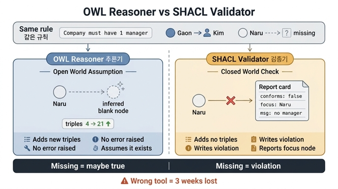

# 추론기(OWL)와 검증기(SHACL)의 근본적 차이

## 한 줄 답

**OWL은 없으면 있다고 결론 내고(열린 세계), SHACL은 없으면 위반이라고 적는다. 품질 검사에 추론기를 쓰면 3주를 날린다.**

---

## 1. 두 물건은 애초에 목적이 다르다

| | OWL 추론기 | SHACL 검증기 |
|---|---|---|
| 답하는 질문 | 「세상에 무엇이 있는가」 | 「우리 데이터가 어떤 모양이어야 하는가」 |
| 하는 일 | 트리플을 **추가**한다 (연역적 폐포) | 위반 **보고서**를 만든다 |
| 없는 값을 만나면 | 「어딘가 있겠지」 → 오류 없음 | 「minCount 위반」 → 보고서에 기록 |
| 세계 가정 | 열린 세계 가정 (OWA) | 닫힌 세계 + 이름 유일성 (검증 시점 기준) |
| 출력물 | 확장된 그래프 | ValidationReport (focusNode, message, severity) |
| 쓸 자리 | 분류 체계, 등가 추론, 지식 확장 | 적재 게이트, 품질 검사, CI |

핵심은 **"OWL이 틀렸다"가 아니라 "품질 검사라는 일에 잘못된 도구를 골랐다"** 는 것이다. 원문 표현 그대로 — "추론기는 고장 나지 않았다. 제가 잘못된 도구를 골랐을 뿐이다."

---

## 2. 열린 세계 가정(OWA)이란 무엇인가

RDF/OWL은 웹을 위해 설계됐다. 웹에서는 내가 가진 그래프가 세상의 전부일 리가 없다. 그래서 OWL은 이렇게 판단한다.

> 「나루소프트에 담당자 트리플이 없다」 ≠ 「나루소프트에 담당자가 없다」
> 단지 **아직 모를 뿐**이다.

이것을 열린 세계 가정(Open World Assumption)이라 한다. 여기에 이름 유일성 가정도 없다(Non-Unique Name Assumption) — `ex:Kim`과 `ex:김철수`가 같은 사람일 수도 있다고 본다.

반면 SQL, JSON Schema, 그리고 SHACL은 **닫힌 세계**로 동작한다. 「내가 지금 검사하는 그래프가 전부다. 없으면 없는 거다.」

품질 검사는 본질적으로 닫힌 세계 작업이다. "지금 이 배치 파일에 사업자번호가 빠졌는가"를 묻는 일이지, "우주 어딘가에 사업자번호가 존재할 가능성이 있는가"를 묻는 일이 아니다.

---

## 3. 같은 문장을 두 언어로 써 보면 (`ex2_infer_vs_validate.py`)

규칙은 하나다. **「회사는 담당자가 최소 하나 있어야 한다」**

### OWL 방식 — 클래스 제약으로 선언

```turtle
ex:Company a owl:Class ;
    rdfs:subClassOf [ a owl:Restriction ;
        owl:onProperty ex:managedBy ;
        owl:minCardinality 1 ] .
```

### SHACL 방식 — 형태로 선언

```turtle
ex:CompanyShape a sh:NodeShape ;
    sh:targetClass ex:Company ;
    sh:property [ sh:path ex:managedBy ; sh:minCount 1 ;
                  sh:message "담당자가 없다" ] .
```

### 같은 데이터를 넣는다

```turtle
ex:Gaon a ex:Company ; ex:managedBy ex:Kim .   # 담당자 있음
ex:Naru a ex:Company .                          # 담당자 없음
```

### 결과가 정반대다

**OWL 추론기(`owlrl.DeductiveClosure`)**
- 트리플 개수가 **늘어난다**. 추론으로 새 사실이 생긴다.
- 나루소프트에 대해 오류를 내지 **않는다**. `minCardinality 1`을 "담당자가 하나 있어야 한다"는 **제약**이 아니라 "담당자가 하나 있다"는 **사실 선언**으로 읽는다.
- 그래서 필요하면 이름 없는 개체(블랭크 노드)를 담당자 자리에 세워 놓기까지 한다. 「없으면 있다고 결론 낸다」가 바로 이것이다.

**SHACL 검증기(`pyshacl.validate`)**
- 트리플을 건드리지 않는다. 대신 `sh:ValidationReport`를 만든다.
- `conforms: False`, `Focus Node: ex:Naru`, `Message: 담당자가 없다`.

같은 문장을 적었는데 **하나는 데이터를 늘리고, 하나는 문제를 적는다.**

> 주의: OWL로 정말 위반을 잡으려면 `owl:maxCardinality`나 `owl:disjointWith` 같은 **모순(inconsistency)** 을 만드는 축을 써야 한다. "최소 하나"는 모순을 못 만들기 때문에 절대 안 잡힌다. 이 미묘함 때문에 사람들이 "규칙을 썼는데 왜 아무것도 안 잡히지?" 하며 몇 주를 태운다.

---

## 4. 3주를 날린다는 게 정확히 어떤 모양인가

품질 검사를 OWL로 짜면 실패가 **조용하다**. 아래가 전형적인 3주짜리 함정이다.

1. **위반 0건이 나온다.** → "데이터가 깨끗하구나"로 오해한다. 실제로는 추론기가 위반이라는 개념 자체를 갖고 있지 않다.
2. **어느 노드가 문제인지 알 수 없다.** 추론기가 모순을 잡아도 결과는 "이 온톨로지는 inconsistent합니다" 한 줄이다. `focusNode`도, `resultPath`도, 사람이 읽을 메시지도 없다. SHACL 보고서는 이 셋을 표준으로 준다.
3. **심각도를 나눌 수 없다.** OWL에는 「이건 차단, 이건 경고」가 없다. 모순은 그냥 모순이다. SHACL은 `sh:severity`로 `sh:Violation` / `sh:Warning` / `sh:Info`를 표준 지원한다(13.2절의 심각도 3단계가 여기서 나온다).
4. **비용이 폭발한다.** OWL DL 추론은 최악의 경우 지수 시간이다. 데이터 수십만 건에 완전 추론을 돌리면 CI가 끝나지 않는다. SHACL 검증은 형태별 대상 노드만 훑는다.
5. **없던 데이터가 생겨 있다.** 추론 결과를 그대로 적재하면 그래프에 블랭크 노드와 유추된 타입이 섞여 들어간다. 다음 검사에서 그게 다시 "정상"으로 통과한다.

그래서 `ex2`가 심각도별 처리를 도입하기 전에 먼저 이 장의 맨 앞에 배치돼 있다. **도구 선택이 틀리면 그 뒤의 모든 설계가 무의미하기 때문**이다.

---

## 5. 그러면 OWL은 언제 쓰나

버리라는 얘기가 아니다. 축이 다를 뿐이다.

**OWL이 잘하는 일 (지식을 늘리는 일)**
- `rdfs:subClassOf` 체인을 타고 「부품 → 기계부품 → 체결부품」 상위 타입을 자동 부여
- `owl:inverseOf`로 `signed` ↔ `signedBy` 양방향 자동 생성
- `owl:TransitiveProperty`로 부품 전개(BOM) 전이 폐포 계산
- `owl:sameAs`로 서로 다른 소스의 같은 개체 통합
- OWL 2 프로필(EL / QL / RL)을 골라 추론 비용을 통제 — `owlrl`이 쓰는 것이 RL 프로필이다

**SHACL이 잘하는 일 (데이터를 막는 일)**
- 사업자번호 정규식 `^[0-9]{3}-[0-9]{2}-[0-9]{5}$`
- `sh:minCount` / `sh:maxCount` 필수·중복 검사
- `sh:in ("A" "B" "C")` 값 목록 제약
- `sh:inversePath`로 고아 노드 잡기 — 「이 계약을 체결한 회사가 없다」
- `sh:minInclusive 0` 으로 음수 금액 잡기

실무 조합은 보통 **"추론 먼저, 검증 나중"** 이다. 상위 타입을 추론으로 채운 뒤 그 확장된 그래프를 SHACL로 검증한다. `pyshacl`의 `inference=` 옵션이 이 순서를 한 번에 해 준다 — 이 장의 예제가 `inference="none"`을 명시하는 이유는 **두 물건의 차이를 섞지 않고 보여 주려는** 의도다.

---

## 6. 외우는 문장

> **OWL은 "없으면 있다고 결론 낸다"(열린 세계, 그래프를 늘린다).**
> **SHACL은 "없으면 위반이라고 적는다"(닫힌 세계, 보고서를 만든다).**
> **품질 검사는 후자의 일이다. 전자로 짜면 3주가 사라진다.**

---

## 관련 1차 출처

- [Shapes Constraint Language (SHACL) — W3C](https://www.w3.org/TR/shacl/)
- [sh:severity — SHACL 심각도](https://www.w3.org/TR/shacl/#severity)
- [SHACL Advanced Features](https://www.w3.org/TR/shacl-af/)
- [OWL 2 Profiles (EL / QL / RL)](https://www.w3.org/TR/owl2-profiles/)
- 예제: `content/ch13/code/ex2_infer_vs_validate.py`

## 인포그래픽


