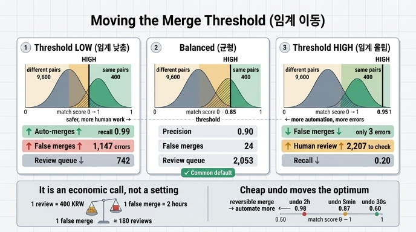

# 임계를 낮추거나 올릴 때 각각 무엇이 늘어나는가?

> **답**: 낮추면 자동 병합이 늘고 오병합도 늘어난다. 올리면 안전하지만 사람이 검토할 건수가 늘어난다.

---

## 1. 먼저 구조를 잡자 — 임계는 하나가 아니라 두 개다

14.2절의 설계는 임계가 **두 개**다. 이 구분을 놓치면 "임계를 올렸다"는 말이 무슨 뜻인지 알 수 없다.

```
점수 1.0 ─────────────────────────────
              [ 자동 병합 ]
HIGH ────────────────────────────────  ← 자동 병합 / 검토 큐 경계
              [ 사람 검토 ]
LOW  ────────────────────────────────  ← 검토 큐 / 무시 경계
              [ 무시 ]
점수 0.0 ─────────────────────────────
```

`ex2_scoring.py`에 그대로 박혀 있다.

```python
HIGH, LOW = 0.85, 0.55
...
if s >= LOW:
    verdict = "자동 병합" if s >= HIGH else "사람 검토"
```

그래서 카드의 답은 **주로 HIGH를 움직였을 때** 벌어지는 일이다. HIGH를 내리면 자동 병합 구간이 아래로 넓어지고, HIGH를 올리면 그만큼이 검토 큐로 내려앉는다. 하지만 LOW를 움직이면 전혀 다른 일이 벌어진다. 3절에서 따로 본다.

## 2. 근거 — `ex4_threshold_tuning.py` 실행 결과

예제는 실제 데이터에서 뽑은 모양을 흉내 낸 점수 분포를 만든다. 핵심은 **두 분포가 겹친다**는 것이다.

```python
SAME = [ ... random.gauss(0.86, 0.11) ... for _ in range(400)]     # 같은 쌍 400개
DIFF = [ ... random.gauss(0.42, 0.15) ... for _ in range(9_600)]   # 다른 쌍 9,600개
```

겹치지 않는다면 임계를 그 사이 아무 데나 두면 끝이고, 이 장은 필요 없다. 트레이드오프는 **겹침 때문에 생긴다.**

`python3 ex4_threshold_tuning.py` 실행 결과 (그대로):

```
같은 쌍 400개, 다른 쌍 9,600개

   자동임계     검토하한     정밀도     재현율     오병합      놓침      사람검토
--------------------------------------------------------------
   0.95     0.80   0.963   0.195       3     136       243
   0.90     0.70   0.911   0.357      14      35       514
   0.85     0.55   0.898   0.527      24       0     2,053
   0.75     0.55   0.701   0.797     136       0     1,833
   0.65     0.50   0.379   0.975     638       0     2,262
   0.55     0.50   0.175   1.000   1,888       0     1,002
```

여기서 읽어야 할 것:

- **임계를 내리면**: 재현율 0.195 → 1.000 (자동으로 더 많이 병합한다), 정밀도 0.963 → 0.175, 오병합 3건 → **1,888건**. 자동 병합이 늘어난 값을 오병합으로 지불한다.
- **임계를 올리면**: 오병합 1,888 → 3건으로 안전해진다.

다만 이 표는 HIGH와 LOW를 **같이** 움직여서 두 효과가 섞여 있다. 그래서 "사람검토" 열이 단조롭게 움직이지 않는다 (243 → 514 → 2,053 → 1,833 → 2,262 → 1,002). 아래에서 하나씩 고정하고 본다.

## 3. 두 손잡이를 따로 돌려 보기

같은 `evaluate()` 함수를 재사용해 한 번에 하나만 움직인 결과다.

### A) LOW를 0.55에 고정하고 HIGH만 움직인다

| HIGH | 정밀도 | 재현율 | 오병합(FP) | 놓침(FN) | 검토 큐 |
|---|---|---|---|---|---|
| 0.95 | 0.963 | 0.195 | 3 | 0 | 2,207 |
| 0.90 | 0.911 | 0.357 | 14 | 0 | 2,131 |
| **0.85** | **0.898** | **0.527** | **24** | **0** | **2,053** |
| 0.80 | 0.815 | 0.660 | 60 | 0 | 1,964 |
| 0.75 | 0.701 | 0.797 | 136 | 0 | 1,833 |
| 0.70 | 0.544 | 0.912 | 306 | 0 | 1,617 |
| 0.65 | 0.379 | 0.975 | 638 | 0 | 1,260 |
| 0.60 | 0.258 | 0.998 | 1,147 | 0 | 742 |

**HIGH는 「자동 병합 ↔ 검토 큐」 경계다.**

- HIGH를 **내리면**: 자동 병합이 는다(재현율 0.195→0.998). 오병합이 3→1,147로 **382배** 는다. 검토 큐는 오히려 줄어든다 — 원래 사람이 볼 것을 기계가 대신 삼켰기 때문이다.
- HIGH를 **올리면**: 오병합이 준다(안전). 삼키지 않은 만큼이 검토 큐로 내려온다.
- **놓침(FN)은 0으로 고정**이다. HIGH는 무엇을 버릴지 결정하지 않는다. 자동으로 처리할지, 사람에게 넘길지만 결정한다.

정밀도가 0.85 아래에서 급격히 무너지는 것을 보라. 0.90→0.85는 오병합 10건 차이인데, 0.70→0.65는 332건 차이다. `DIFF` 분포(평균 0.42)의 꼬리에 손을 넣는 순간 **9,600개라는 모집단 크기가 곱해진다.** 이게 엔티티 해상도가 언제나 정밀도 쪽으로 기울어야 하는 구조적 이유다. 같은 쌍은 400개인데 다른 쌍은 9,600개다.

### B) HIGH를 0.85에 고정하고 LOW만 움직인다

| LOW | 정밀도 | 재현율 | 오병합(FP) | 놓침(FN) | 검토 큐 |
|---|---|---|---|---|---|
| 0.40 | 0.898 | 0.527 | 24 | 0 | 5,501 |
| 0.50 | 0.898 | 0.527 | 24 | 0 | 3,055 |
| **0.55** | **0.898** | **0.527** | **24** | **0** | **2,053** |
| 0.60 | 0.898 | 0.527 | 24 | 1 | 1,311 |
| 0.65 | 0.898 | 0.527 | 24 | 10 | 793 |
| 0.70 | 0.898 | 0.527 | 24 | 35 | 436 |
| 0.75 | 0.898 | 0.527 | 24 | 81 | 220 |
| 0.80 | 0.898 | 0.527 | 24 | **136** | 89 |

**LOW는 「검토 큐 ↔ 무시」 경계다.** 그리고 이 표는 위험하다.

- **정밀도·재현율·오병합이 전부 그대로다** (0.898 / 0.527 / 24). LOW는 자동 병합에 손도 대지 않는다.
- LOW를 0.55 → 0.80으로 올리면 검토 큐가 2,053 → 89로 **23배 줄어든다.** 운영 관점에서 엄청나게 매력적으로 보인다.
- 그런데 놓침이 0 → **136건**이 된다. 같은 쌍 400개 중 **34%가 사라진다.**

**여기가 핵심 함정이다.** 정밀도·오병합 지표만 보는 대시보드에서는 이 열화가 **전혀 보이지 않는다.** 숫자가 한 자리도 안 움직인다. 검토 큐만 시원하게 줄어드니 개선처럼 읽힌다. 그리고 놓친 136쌍은 에러를 내지 않는다. 그냥 같은 회사가 그래프에 두 노드로 계속 앉아 있을 뿐이다. 아무도 신고하지 않는다.

> LOW를 올리면 놓친 쌍이 **조용히** 사라진다.

이게 13장의 주제와 이어진다. 오병합은 시끄럽다(누군가 "왜 우리 회사가 저 회사랑 합쳐졌죠"라고 항의한다). 미병합은 조용하다. 그래서 미병합은 측정을 따로 만들어야만 잡힌다 — 정답 표본(`records.py`의 `TRUTH` 같은 것)을 주기적으로 재라벨링해 FN을 직접 세는 것 말고는 방법이 없다.

또 `ex1_blocking.py`의 재현율 문제와도 겹친다. 블로킹에서 후보에 못 들어온 쌍은 점수 계산조차 안 된다. LOW 위로 올라올 기회도 없다. **놓침은 블로킹과 LOW 두 곳에서 새고, 둘 다 조용하다.**

### 두 손잡이 요약

| | 내리면 | 올리면 | 건드리지 않는 것 |
|---|---|---|---|
| **HIGH** | 자동 병합 ↑, 오병합 ↑, 검토 ↓ | 오병합 ↓(안전), **검토 ↑** | 놓침(FN) |
| **LOW** | 검토 ↑, 놓침 ↓ | **검토 ↓**, 놓침 ↑(조용히) | 정밀도·재현율·오병합 |

카드의 답 "올리면 안전하지만 검토가 는다"는 **HIGH** 이야기다. LOW를 올리면 검토는 오히려 **줄고**, 대신 놓침이 늘어난다. 방향이 반대다.

## 4. 왜 이게 「설정」이 아니라 「경제 판단」인가

`ex4`의 마무리가 이 장의 결론이다.

```
어디를 고를까. «오병합 하나의 값»과 «사람 한 건 검토 비용»을 비교하면 된다.

제 경우를 숫자로 적으면 이랬다.
  사람 한 건 검토: 약 40초, 인건비로 환산해 400원
  오병합 하나 수습: 평균 2시간 (원인 파악 + 되돌리기 + 영향 받은 질의 확인)
  → 오병합 하나가 검토 180건과 맞먹는다
```

**설정값이라면 「권장값」이 존재할 것이다.** 0.85가 좋은 값이라고 문서에 적어 두고 끝낼 수 있다. 하지만 그런 값은 없다. 이유는 세 가지다.

1. **최적점이 두 개의 비용에 의해 결정되고, 그 비용은 데이터가 아니라 조직에 있다.** 검토 한 건 400원은 인건비와 UI 품질의 함수다. 오병합 2시간은 되돌리기 도구의 함수다. 점수 분포를 아무리 들여다봐도 알 수 없는 값이다.
2. **오병합과 검토는 단위가 다르다.** 정밀도 0.898과 검토 2,053건은 직접 비교가 불가능하다. **같은 단위(돈, 시간)로 환산해야만** 비교가 성립한다. 그 환산율(위 예에서 1:180)이 최적점을 정한다.
3. **트레이드오프 곡선은 「고를 수 있는 것들의 목록」일 뿐, 「무엇을 골라야 하는지」는 말해 주지 않는다.** 곡선은 데이터가 주고, 곡선 위의 점은 경제가 고른다.

`ex2`에 그 값이 실화로 붙어 있다.

```
r06–r07(나루소프트/나루소프트(주))은 0.550 으로 애매 구간 바닥에 걸렸고,
사람이 «다르다»고 판정했다. 사업자번호가 다르니까.
자동 병합 임계를 0.55 로 낮췄다면 모회사와 자회사를 합쳐 버렸을 것이다.
제가 실제로 그렇게 했고, 되돌리는 데 사흘 걸렸다.
```

임계를 0.85에서 0.55로 내린다는 것은 설정 파일에서 두 글자 바꾸는 일이다. 그 결과는 사흘이었다. 이게 "설정이 아니다"의 실물이다.

그리고 **이행성이 비용을 증폭시킨다.** `ex2`가 자동 병합 쌍을 union-find로 묶는다.

```python
for a, b in auto:
    union(a, b)
```

오병합 하나의 비용은 그 쌍 하나가 아니다. 잘못된 간선 하나가 두 군집을 이어 붙이면 양쪽 구성원 전체가 오염된다. `ex2`의 경고가 그것이다.

```
이행성도 공짜가 아니다. 잘못된 병합 하나가 군집 전체를 오염시킨다.
그래서 군집 크기에 상한을 두거나, 커지면 사람에게 보내는 게 안전하다.
```

즉 오병합 비용은 건수에 **선형이 아니다.** 검토 비용은 건당 400원으로 선형인데, 오병합은 초선형이다. 두 곡선의 모양이 다르기 때문에 최적점은 안전한 쪽으로 더 밀린다.

## 5. 되돌리기 비용이 최적점을 옮긴다

`ex4`의 마지막 두 줄이 이 장에서 가장 중요한 부분이다.

```
다만 이건 «되돌리기가 비싼» 경우다. 되돌리기가 싸면 계산이 달라진다.
앞 예제처럼 unmerge 가 대입 한 번이면 오병합 값이 2시간에서 5분이 된다.
```

이걸 숫자로 확인해 보자. LOW=0.55로 고정(FN=0)하고 HIGH만 움직이며,

```
총비용 = 검토건수 × 400원 + 오병합건수 × 되돌리기비용
```

| HIGH | 오병합 | 검토 큐 | 되돌리기 2시간(72,000원) | 되돌리기 5분(3,000원) | 되돌리기 30초(300원) |
|---|---|---|---|---|---|
| 0.98 | 0 | 2,239 | **895,600** | 895,600 | 895,600 |
| 0.95 | 3 | 2,207 | 1,098,800 | 891,800 | 883,700 |
| 0.92 | 9 | 2,161 | 1,512,400 | 891,400 | 867,100 |
| 0.90 | 14 | 2,131 | 1,860,400 | 894,400 | 856,600 |
| 0.87 | 18 | 2,082 | 2,128,800 | **886,800** | 838,200 |
| 0.85 | 24 | 2,053 | 2,549,200 | 893,200 | 828,400 |
| 0.80 | 60 | 1,964 | 5,105,600 | 965,600 | 803,600 |
| 0.75 | 136 | 1,833 | 10,525,200 | 1,141,200 | 774,000 |
| 0.70 | 306 | 1,617 | 22,678,800 | 1,564,800 | 738,600 |
| 0.65 | 638 | 1,260 | 46,440,000 | 2,418,000 | 695,400 |
| 0.60 | 1,147 | 742 | 82,880,800 | 3,737,800 | **640,900** |

**최적 HIGH가 움직인다.**

| 되돌리기 비용 | 최적 HIGH | 그때의 총비용 |
|---|---|---|
| 2시간 (72,000원) | **0.98** | 895,600원 |
| 5분 (3,000원) | **0.87** | 886,800원 |
| 30초 (300원) | **0.60** | 640,900원 |

같은 데이터, 같은 점수 분포, 같은 검토 단가다. **오직 되돌리기 비용만 바꿨는데 최적 임계가 0.98에서 0.60으로 내려간다.** 자동 병합 재현율로 치면 0.195에서 0.998이다. 다섯 배 넘게 자동화한 것이다.

여기서 나오는 결론이 14.3절의 순서를 설명한다.

> **되돌릴 수 있으면 훨씬 공격적으로 자동화할 수 있다.**

이건 미묘한 인과다. 흔히 "먼저 임계를 잘 잡고, 나중에 되돌리기를 만든다"고 생각한다. 그런데 위 표는 반대를 말한다. **되돌리기를 먼저 싸게 만들면, 임계 튜닝이라는 문제 자체가 쉬워진다.** 곡선 위에서 좋은 점을 찾으려 애쓰는 대신, 곡선 전체를 아래로 끌어내린 것이다. 0.60에서의 총비용 640,900원은 되돌리기가 비쌀 때의 어떤 임계보다도 싸다.

`ex3_reversible_merge.py`가 그 "싸게"의 정체다. 원본 노드를 지우지 않고 포인터만 바꾼다.

```python
def merge(self, a, b, by, reason):
    ...
    self.canonical[drop] = keep      # 지우지 않는다. 가리키게만 한다.
    self.events.append({"op": "merge", "keep": keep, "drop": drop,
                        "by": by, "reason": reason})

def unmerge(self, dropped):
    ...
    self.canonical[dropped] = dropped   # 되돌리기가 대입 한 번
```

되돌리기가 대입 한 번인 이유는 **r07의 속성이 그대로 남아 있기 때문이다.** 노드를 실제로 지우고 속성을 합쳐 버렸다면 "원래 어느 값이 어디서 왔는지"를 모르니 쪼갤 수 없다. `ex3`의 대가 계산도 정직하다.

```
대가는 저장 공간과 조회 비용이다. 조회할 때마다 resolve 를 거쳐야 한다.
제 경우 노드 수가 1.4배가 됐고, 조회에 인덱스 조회 한 번이 더 붙었다.
사흘짜리 사고를 다시 안 겪는 값으로는 쌌다.
```

노드 1.4배와 인덱스 조회 하나를 지불해서, 위 표의 "2시간" 열에서 "5분" 열로 넘어간다. 그것만으로 자동화 가능 범위가 재현율 0.195에서 0.527(또는 그 이상)로 올라간다.

## 6. 점수와 임계로 풀 수 없는 것 — 거부권 규칙

마지막으로, 트레이드오프 곡선 자체를 바꾸는 방법이 하나 더 있다. 한 장 요약의 항목이다.

> 점수 위에 「절대 안 되는」 거부권 규칙을 두세요. 사업자번호가 다르면 다른 법인입니다. 다른 게 아무리 같아도요.

r06/r07이 왜 0.550이라는 애매한 점수를 받았는지 보라. 가중 평균이기 때문이다. 주소·대표자·전화가 전부 같아서 점수를 밀어 올렸고, 사업자번호 불일치(가중치 0.45)는 그중 하나의 항목으로 희석됐다. **임계를 어디에 두든 이 문제는 해결되지 않는다.** 0.55로 내리면 오병합하고, 0.85로 두면 사람이 봐야 한다.

거부권은 다르다. "사업자번호가 둘 다 있고 서로 다르면 점수와 무관하게 병합 금지"는 이 쌍을 곡선에서 **빼 버린다.** 정밀도를 올리면서 검토 건수도 줄인다. 곡선 위에서 점을 옮기는 게 아니라 곡선을 개선하는 일이다.

임계 튜닝에서 곡선이 마음에 안 들면 순서는 이렇다.

1. **거부권 규칙** — 확실히 다른 것을 곡선에서 제거한다
2. **블로킹 재현율** — 후보에 못 들어온 쌍을 구제한다 (전략 여러 개 합집합)
3. **되돌리기를 싸게** — 곡선 전체를 아래로 내린다
4. **그다음에** HIGH/LOW를 고른다 — 이때 비로소 경제 계산이 답을 준다

1~3을 건너뛰고 4만 반복하는 것이 흔한 실수다. 임계를 아무리 정교하게 튜닝해도 그것은 주어진 곡선 위를 오가는 일에 불과하다.

## 7. 한 문장으로

**HIGH를 내리면 자동 병합과 오병합이 함께 늘고, 올리면 안전해지는 대신 사람 검토가 는다. LOW를 올리면 검토는 줄지만 놓친 쌍이 지표에 흔적도 없이 사라진다. 어느 쪽을 얼마나 감수할지는 정밀도-재현율 곡선이 정해 주지 않는다 — 오병합 하나의 수습 비용과 검토 한 건의 비용이 정하고, 되돌리기를 싸게 만들면 그 최적점이 자동화 쪽으로 크게 이동한다.**

## 인포그래픽


