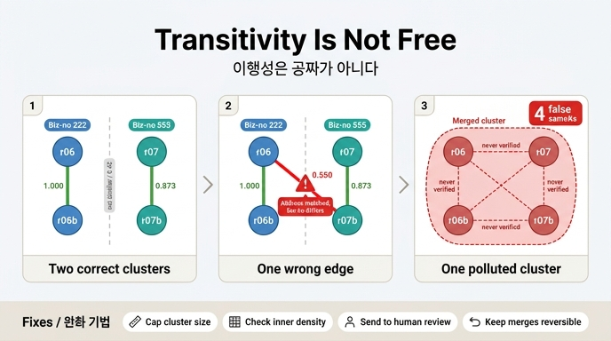

# 이행성으로 묶는 것은 왜 공짜가 아닌가

> **Q.** 이행성(transitivity)으로 묶는 것이 공짜가 아닌 이유는 무엇인가?
>
> **A.** 잘못된 병합 하나가 군집 전체를 오염시킨다. 군집 크기에 상한을 두거나 커지면 사람에게 보내는 것이 안전하다.

---

## 1. 먼저, 이행성은 왜 필요했나

14장 `ex2_scoring.py`는 쌍 점수를 매긴 다음 **유니온-파인드**로 군집을 만듭니다.

```python
parent = {k: k for k in BY_ID}
def find(x):
    while parent[x] != x:
        parent[x] = parent[parent[x]]; x = parent[x]
    return x
def union(x, y):
    parent[find(x)] = find(y)
for a, b in auto:          # 자동 병합 임계를 넘은 쌍만
    union(a, b)
```

이걸 넣는 이유는 명확합니다. **쌍 점수만으로는 못 잡는 쌍을 주워 오기 때문**입니다.

`records.py`의 실제 레코드로 점수를 다시 계산해 보면(가중치 사업자번호 0.45 / 이름 0.25 / 주소 0.15 / 대표자 0.10 / 전화 0.05, 한쪽이 비면 그 항목은 «모름»으로 제외):

| 쌍 | 점수 | 근거 |
|---|---|---|
| r01–r02 | **1.000** | 사업자번호·주소·대표자·전화 전부 일치 |
| r01–r03 | **0.973** | 사업자번호가 r03에 없어서 이름·주소·대표자·전화로만 |
| r02–r03 | **0.973** | 같음 |
| r01–r04 | 0.643 | 사업자번호는 같지만 이름이 영문, 나머지 전부 빈 값 |
| r02–r04 | 0.643 | 같음 |
| **r03–r04** | **0.000** | **겹치는 필드가 하나도 없다** |

r03(`가온테크 주식회사`, 사업자번호 없음)과 r04(`GAON TECH`, 주소·대표자·전화 없음)는 **비교 가능한 근거가 이름밖에 없고**, 2-gram 자카드로 `가온테크` vs `GAONTECH`는 0입니다. 그런데 정답은 `{r01, r02, r03, r04}` 한 군집입니다.

r03–r04를 직접 이어 주는 엣지는 영원히 안 생깁니다. r01을 **경유해서** 이어질 뿐입니다.

```
r03 ──0.973── r01 ──0.643(사람 판정)── r04
       ↑                                 ↑
   이 두 엣지의 이행적 폐쇄가 r03–r04(0.000)를 만들어 낸다
```

즉 이행성은 **재현율을 공짜로 올려 주는 장치**입니다. 그리고 바로 그 성질 때문에 대가가 있습니다.

---

## 2. 대가의 정체: 유사도는 이행적이지 않다

동일성(`owl:sameAs`)은 OWL 2 명세상 **동치 관계**입니다. 반사적·대칭적·이행적입니다. 그래서 A=B, B=C가 선언되면 추론기는 A=C를 자동으로 만들어 냅니다.

하지만 우리가 실제로 측정한 것은 동일성이 아니라 **유사도**입니다. 그리고 유사도는 이행적이지 않습니다.

> A ≈ B, B ≈ C 인데 A ≉ C

`records.py`의 나루소프트 사례를 조금만 확장해서(같은 법인의 별칭이 여러 개 있는, 현실에서 늘 있는 상황) 계산해 보면 이 성질이 눈에 보입니다.

| id | 이름 | 사업자번호 | 주소 | 대표자 | 전화 |
|---|---|---|---|---|---|
| r06 | 나루소프트 | 222-33-44444 | 서울 마포구 월드컵로 2 | 이서연 | 02-2222-3333 |
| r06b | 나루소프트 주식회사 | 222-33-44444 | 서울 마포구 월드컵로 2 | 이서연 | — |
| r07 | 나루소프트(주) | 555-66-77777 | 서울 마포구 월드컵로 2 | 이서연 | 02-2222-3333 |
| r07b | 나루소프트랩 | 555-66-77777 | 서울 마포구 월드컵로 2 8층 | 이서연 | 02-2222-3399 |

같은 점수 함수를 돌린 결과입니다.

| 쌍 | 점수 | 해석 |
|---|---|---|
| r06–r06b | **1.000** | 같은 법인(222)의 별칭. 맞다 |
| r07–r07b | **0.873** | 같은 법인(555)의 별칭. 맞다 |
| **r06–r07** | **0.550** | **주소·대표자·전화가 같아서 높다. 하지만 사업자번호가 다른 별개 법인** |
| r06–r07b | 0.423 | 임계 아래 |
| r06b–r07 | 0.526 | 임계 아래 |
| r06b–r07b | 0.445 | 임계 아래 |

여기가 정확히 A ≈ B, B ≈ C, A ≉ C 입니다.

- r06 ≈ r07 (0.550) — 주소·대표자·전화 근거
- r07 ≈ r07b (0.873) — 사업자번호 근거
- r06 ≉ r07b (0.423) — **어떤 근거로도 붙지 않는다**

각 엣지가 서로 **다른 근거**로 붙었기 때문입니다. 주소로 붙은 엣지와 사업자번호로 붙은 엣지를 이어 붙일 이유는 어디에도 없습니다. 그런데 유니온-파인드는 근거를 안 봅니다. 엣지만 봅니다.

---

## 3. 오염 메커니즘: 체인 병합(chain merge)

14장 `ex4_threshold_tuning.py`가 보여 주는 대로, 자동 병합 임계를 0.85에서 0.55로 내리면 자동 병합이 늘어납니다. 이때 r06–r07(0.550)이 자동 병합 목록에 들어옵니다. 저자가 실제로 저질렀다는 그 사고입니다.

> 자동 병합 임계를 0.55로 낮췄다면 모회사와 자회사를 합쳐 버렸을 것이다.
> 제가 실제로 그렇게 했고, 되돌리는 데 사흘 걸렸다.
> — `ex2_scoring.py`

유니온-파인드로 묶은 결과를 비교하면 이렇습니다.

**임계 0.85 (엣지 3개: r06–r06b, r07–r07b)**

```
[r06, r06b]        [r07, r07b]
   법인 222           법인 555
```

**임계 0.55 (엣지 3개 + r06–r07 하나 추가)**

```
[r06, r06b, r07, r07b]   ← 한 군집
   법인 222 + 법인 555이 한 노드가 되어 버렸다
```

**엣지 하나가 군집 두 개를 하나로 합쳤습니다.** 이게 체인 병합입니다.

### 왜 «전체» 오염인가 — 숫자로

군집은 이행적 폐쇄이므로, 크기 *k*의 군집은 내부에 *k(k−1)/2*개의 동일성 주장을 함축합니다. 크기 *m*과 *n*인 두 군집이 잘못된 엣지 하나로 합쳐지면 **거짓 주장 m×n개**가 한꺼번에 생깁니다.

| 상황 | 함축되는 동일성 쌍 | 그중 거짓 | 점수로 «검증된» 거짓 |
|---|---|---|---|
| 올바른 두 군집 (2+2) | 1 + 1 = 2 | 0 | 0 |
| 잘못된 엣지 하나 추가 | 4×3/2 = **6** | **4** | **1** |

거짓 4개 중 **실제로 점수를 넘긴 것은 r06–r07 하나뿐**입니다. r06–r07b(0.423), r06b–r07(0.526), r06b–r07b(0.445)는 **한 번도 임계를 넘은 적이 없는데도** 동일성 주장으로 승격됩니다. 아무도 판정하지 않은 결론이 데이터에 들어앉는 겁니다.

`records.py`의 가온테크 쪽으로 계산해도 같습니다. 정답 군집 `{r01..r04}`(4개, 6쌍)에 r05(`가온테크놀로지`, 사업자번호 999-88-77777, 부산)를 잘못 잇는 엣지 하나가 들어오면:

```
{r01, r02, r03, r04, r05}  → 10쌍 (거짓 4쌍)
r01–r05 = 0.125   r02–r05 = 0.125
r03–r05 = 0.227   r04–r05 = 0.000
```

**거짓 4쌍 모두 점수가 0.25 미만**입니다. 즉 오염된 쌍의 점수가 낮다는 사실은 시스템도 «알고» 있는데, 군집 구조가 그 정보를 무시합니다.

### 거부권 규칙까지 무력화된다

14장이 강조하는 안전장치가 **거부권(veto) 규칙**입니다.

> 점수 위에 「절대 안 되는」 거부권 규칙을 두세요. 사업자번호가 다르면 다른 법인입니다.

그런데 거부권은 **쌍 단위**로 적용됩니다. r06–r07은 사업자번호가 달라서 거부권으로 막힙니다. 하지만 체인 병합으로 만들어진 군집 `{r06, r06b, r07, r07b}` 안에는 사업자번호 222와 555가 **공존**합니다. 쌍 검사를 통과한 엣지들만 이어 붙였는데 결과 군집이 규칙을 위반하는 상태가 됩니다.

**이행적 묶음은 쌍 단위 거부권을 우회합니다.** 그래서 거부권은 군집 단위로 한 번 더 검사해야 합니다.

### 병합 결과값까지 오염된다

`ex5_survivorship.py`의 생존 규칙은 군집 «구성원»에서 값을 고릅니다. 오염된 구성원이 들어오면 고를 후보 자체가 오염됩니다. `ex3_reversible_merge.py`의 `_richness` 기준으로 보면 r01과 r05는 채워진 필드 수가 똑같이 5개라 **동점**입니다. 동점 처리는 입력 순서에 달려 있고, r05가 앞서면 대표 노드가 r05가 되어 「가온테크」를 조회한 사람에게 **부산 해운대 주소와 사업자번호 999-88-77777**이 돌아갑니다. 원인은 엣지 하나인데, 증상은 조회 결과 전체입니다.

---

## 4. 이건 알려진 병입니다: 단일 연결의 사슬 효과

임계 초과 엣지에 유니온-파인드를 돌리는 것은 **임계에서 자른 단일 연결 군집화(single-linkage clustering)**와 정확히 같습니다. 연결 요소를 구하는 것이니까요.

단일 연결은 군집 간 거리를 **가장 가까운 두 점 사이 거리**로 정의합니다. 두 군집이 접점 하나만 가까우면 나머지가 아무리 멀어도 합쳐집니다. 군집화 문헌이 오래전부터 **사슬 효과(chaining effect)**라고 부르며 경고해 온 성질입니다.

- **단일 연결**: 한 쌍만 가까우면 합친다 → 사슬 효과, 오염에 취약
- **완전 연결(complete-linkage)**: 모든 쌍이 가까워야 합친다 → 지나치게 보수적, r03–r04(0.000)를 절대 못 잡음
- **평균 연결(average-linkage)**: 그 사이

14장이 굳이 유니온-파인드를 쓴 건 r03–r04를 주워 오기 위해서였습니다. 완전 연결로 바꾸면 오염은 사라지지만 애초에 이행성을 넣은 이유도 사라집니다. **그래서 «공짜가 아니다»입니다. 재현율과 오염 저항성을 맞바꾼 것입니다.**

시맨틱 웹 쪽에는 똑같은 이야기의 다른 판본이 있습니다. `owl:sameAs`가 이행적이므로 링크드 데이터에서 잘못된 `sameAs` 하나가 추론을 타고 무한정 번집니다. Halpin 등(ISWC 2010)이 실증적으로 분석한 문제이고, 결론은 「많은 경우 `owl:sameAs`는 너무 강하다」였습니다. 14장 키워드 표에 `skos:closeMatch`(느슨한 동일성)가 같이 올라와 있는 이유가 이것입니다.

---

## 5. 완화 기법

### (1) 군집 크기 상한 — 카드의 정답

가장 값싸고 효과가 큽니다. 사업자 데이터에서 별칭이 4~5개는 정상, 40개는 병합 사고입니다.

```python
MAX_CLUSTER = 5

def union_guarded(x, y):
    rx, ry = find(x), find(y)
    if rx == ry:
        return "이미 같은 군집"
    if size[rx] + size[ry] > MAX_CLUSTER:
        return "보류 → 사람에게"      # 자동 병합하지 않는다
    parent[rx] = ry
    size[ry] += size[rx]
    return "병합"
```

두 가지 이점이 있습니다.

- **오염 확산을 조기에 자른다.** 체인 병합은 군집을 «크게» 만듭니다. 크기가 곧 신호입니다.
- **사람 검토를 비용이 정당한 곳에 몰아 준다.** `ex4`의 계산대로 오병합 하나 수습이 2시간(검토 180건)이라면, 큰 군집 하나를 사람에게 보내는 건 압도적으로 남는 장사입니다.

### (2) 군집 내부 밀도 검사

크기만으로는 큰 정답 군집(대기업 별칭 30개)과 오염 군집을 구별하지 못합니다. **밀도**를 같이 봅니다.

```
density(C) = (C 내부에서 임계를 넘은 쌍 수) / (|C| * (|C|-1) / 2)
```

`records.py`로 임계 0.55 기준으로 계산하면:

| 군집 | 임계 초과 쌍 / 전체 쌍 | 밀도 | 판정 |
|---|---|---|---|
| `{r01, r02, r03, r04}` (정답) | 5 / 6 | **0.833** | 통과 |
| `{r01..r04, r05}` (오염) | 5 / 10 | **0.500** | 의심 |
| `{r06, r06b, r07, r07b}` (오염) | 3 / 6 | **0.500** | 의심 |

정답 군집은 촘촘하고(직접 근거가 거의 다 있음), 체인 병합 군집은 **성형(星形)·사슬형**입니다. 밀도 하한(예: 0.7)을 두면 오염 군집이 걸립니다.

같은 아이디어의 변형들:

- **관절점(articulation point) 검사**: 지우면 군집이 쪼개지는 엣지 = 병합 근거가 그 엣지 하나뿐이라는 뜻. 그 엣지만 사람에게 보내면 됩니다. r06–r07이 정확히 이런 엣지입니다.
- **군집 단위 거부권**: 군집 안에 서로 다른 사업자번호가 있으면 그 자체로 실격. 위 3절에서 본 우회를 막습니다.
- **군집 내 최저 점수(=완전 연결 근사)**: 최저 점수가 하한(0.4 등) 미만이면 보류. r04–r05(0.000), r06–r07b(0.423)가 걸립니다.

### (3) 상관 군집화(correlation clustering)

유니온-파인드는 **양성 엣지만** 봅니다. 「닮았다」는 증거만 쌓고 「안 닮았다」는 증거는 버립니다. 상관 군집화는 이 비대칭을 없앱니다.

Bansal·Blum·Chawla(*Machine Learning* 56, 2004)의 정식화는 이렇습니다. 완전 그래프의 각 엣지에 `+`(닮음) 또는 `−`(다름) 라벨이 붙어 있고, **불일치 최소화** 군집화를 찾습니다.

- 같은 군집 안의 `−` 엣지 = 불일치 1
- 다른 군집으로 갈린 `+` 엣지 = 불일치 1

군집 수도, 거리 임계도 미리 정하지 않습니다. 목적함수가 알아서 고릅니다. 나루소프트 예에 적용하면 `{r06,r06b}` `{r07,r07b}`로 쪼개는 해의 불일치는 1(r06–r07의 `+` 하나를 끊음)이지만, 넷을 다 합치는 해의 불일치는 3(내부의 `−` 세 개)입니다. **상관 군집화는 쪼개는 쪽을 고릅니다.** 유니온-파인드는 무조건 합칩니다.

대가는 계산 비용입니다. 문제 자체가 NP-난해라 근사 알고리즘을 씁니다(원 논문의 3-근사, 이후 LP 완화 기반 개선들). 그래서 실무에서는 «블로킹으로 후보를 좁힌 뒤 각 후보 덩어리 안에서만 상관 군집화» 형태로 씁니다. 14장 `ex1_blocking.py`가 만들어 준 블록이 그대로 입력이 됩니다.

### (4) 되돌릴 수 있게 만들어 두기

`ex3_reversible_merge.py`가 이미 답을 줍니다. **원본을 지우지 않고 대표 노드를 가리키게만** 하면 되돌리기가 포인터 대입 한 번입니다.

```python
def unmerge(self, dropped):
    ...
    self.canonical[dropped] = dropped     # 이게 전부다
```

이게 있으면 오병합 비용이 2시간에서 5분으로 떨어지고, `ex4`의 손익 계산이 바뀌어 **임계를 더 공격적으로 낮출 수 있습니다.** 오염을 «막는» 기법이 아니라 **오염의 값을 깎는** 기법이라는 점이 다릅니다. 둘 다 필요합니다.

---

## 6. 한 줄 정리

이행성은 근거가 없는 쌍(r03–r04, 0.000)을 주워 와 재현율을 올려 주지만, **근거를 보지 않고 엣지만 보기 때문에** 잘못된 엣지 하나도 똑같이 멀리 전파합니다. 크기 *m*, *n* 군집이 합쳐지면 거짓 동일성 *m×n*개가 한꺼번에 생기고, 그중 대부분은 한 번도 검증되지 않은 쌍이며, 쌍 단위 거부권도 우회됩니다. 그래서 **군집 크기에 상한을 두고, 내부 밀도를 검사하고, 넘으면 사람에게 보내고, 그래도 틀리면 되돌릴 수 있게** 만들어 둡니다.

---

## 참고

- [When owl:sameAs Isn't the Same: An Analysis of Identity in Linked Data (ISWC 2010)](https://link.springer.com/chapter/10.1007/978-3-642-17746-0_20)
- [Correlation Clustering — Bansal, Blum, Chawla, Machine Learning 56 (2004)](https://link.springer.com/article/10.1023/B:MACH.0000033116.57574.95)
- [Correlation Clustering (FOCS 버전 PDF)](https://pages.cs.wisc.edu/~shuchi/papers/corrclusteringFOCS.pdf)
- [owl:sameAs — OWL 2 Syntax](https://www.w3.org/TR/owl2-syntax/#Individual_Equality)
- [skos:closeMatch — SKOS Reference](https://www.w3.org/TR/skos-reference/#mapping)
- [Deep Learning for Entity Matching (VLDB 2018)](https://www.vldb.org/pvldb/vol11/p1454-mudgal.pdf)

## 인포그래픽


