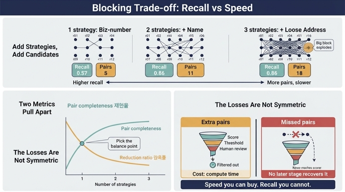

# 블로킹 전략을 늘리면 어떤 트레이드오프가 생기는가?

> **답**: 재현율은 올라가지만 후보 쌍이 늘어 느려진다. 그 균형이 설계다.

---

## 1. 왜 블로킹이 필요한가

엔티티 해상도의 첫 단계는 "누구와 누구를 비교할지" 고르는 일입니다. 전수 비교는 쌍의 수가 레코드 수의 제곱으로 늘어납니다.

| 레코드 수 | 전수 비교 쌍 |
|---|---|
| 12 | 66 |
| 1,000 | 499,500 |
| 100,000 | 4,999,950,000 |

14장 예제(`ex1_blocking.py`)의 첫 출력이 그대로 이 얘기입니다. "10만 개라면 4,999,950,000쌍. 하루로 안 끝난다."

그래서 **블로킹(blocking)** 을 씁니다. 레코드마다 키를 뽑아 같은 키끼리 한 칸(block)에 몰아넣고, **같은 칸 안에서만** 쌍을 만듭니다. 비교 대상을 O(n²)에서 확 줄이는 대신, 칸이 갈린 두 레코드는 **영원히 만나지 못합니다.**

---

## 2. 두 개의 지표: pair completeness와 reduction ratio

블로킹은 정밀도/재현율이 아니라 전용 지표 두 개로 평가합니다 (Christen, *Data Matching*; Papadakis et al., *Blocking and Filtering Techniques for Entity Resolution: A Survey*).

| 지표 | 정의 | 뜻 |
|---|---|---|
| **pair completeness (PC)** = 재현율 | 후보에 들어온 정답 쌍 / 전체 정답 쌍 | 놓치지 않았나 |
| **reduction ratio (RR)** = 감축률 | 1 − (후보 쌍 / 전수 쌍) | 얼마나 줄였나 |
| *(참고)* pairs quality (PQ) | 후보 중 정답 쌍 / 후보 쌍 | 후보가 얼마나 알찬가 |

**PC와 RR은 서로를 잡아먹습니다.** 키를 느슨하게 하거나 전략을 더 붙이면 PC는 올라가고 RR은 내려갑니다. 키를 엄격하게 하거나 전략을 줄이면 그 반대입니다.

---

## 3. 실제 레코드로 계산해 보기

14장 `records.py`의 12개 레코드를 씁니다. 정답(`TRUTH`)은 `{r01, r02, r03, r04}`와 `{r11, r12}` — 정답 쌍 **7개**, 전수 쌍 **66개**입니다.

```
정답 쌍 7개:
  (r01,r02) (r01,r03) (r01,r04) (r02,r03) (r02,r04) (r03,r04) (r11,r12)
```

### 3-1. 전략별 단독 성적

| 전략 (키) | 칸 수 | 후보 쌍 | 감축률 RR | 재현율 PC |
|---|---|---|---|---|
| 사업자번호 완전일치 | 3 | 5 | **0.924** | 0.571 (4/7) |
| 이름 앞 3글자 | 3 | 8 | 0.879 | 0.429 (3/7) |
| 주소 앞 2어절 | 3 | 5 | **0.924** | 0.571 (4/7) |
| 전화번호 숫자만 | 3 | 5 | **0.924** | 0.571 (4/7) |
| 이름 첫 글자 (느슨) | 3 | 8 | 0.879 | 0.429 (3/7) |
| 주소 시/도 1어절 (느슨) | 3 | 12 | 0.818 | 0.571 (4/7) |

혼자서 재현율 1.0을 내는 전략은 **하나도 없습니다.** 어느 전략이든 자기가 못 보는 구멍이 있습니다.

- 사업자번호만 → `r03`은 번호가 빈 값이라 어느 칸에도 못 들어감
- 이름만 → `r04`(`GAON TECH`)는 앞 3글자가 `GAO`라 `가온테`와 갈림
- 주소·전화만 → `r04`는 주소·전화가 전부 빈 값

### 3-2. 전략을 누적해서 붙이면 (핵심 표)

| # | 누적 전략 | 후보 쌍 | 감축률 RR | 재현율 PC | 놓친 정답 쌍 | 신규 쌍 |
|---|---|---|---|---|---|---|
| 0 | (블로킹 없음, 전수) | 66 | 0.000 | **1.000** | — | — |
| 1 | 사업자번호 | 5 | **0.924** | 0.571 | (r01,r03) (r02,r03) (r03,r04) | +5 |
| 2 | +이름 앞 3글자 | 11 | 0.833 | **0.857** | (r03,r04) | **+6** |
| 3 | +주소 앞 2어절 | 11 | 0.833 | 0.857 | (r03,r04) | +0 |
| 4 | +전화번호 숫자만 | 11 | 0.833 | 0.857 | (r03,r04) | +0 |
| 5 | +주소 시/도 (느슨) | 18 | 0.727 | 0.857 | (r03,r04) | **+7** |

이 표에 트레이드오프의 세 가지 얼굴이 다 들어 있습니다.

**(a) 전략 1 → 2: 트레이드오프가 남는 장사인 경우.**
후보 쌍 5 → 11 (2.2배 느려짐), 재현율 0.571 → 0.857. 놓친 쌍 3개 중 2개를 건졌습니다. 쌍 6개 더 채점하는 값으로는 아주 쌉니다.

**(b) 전략 3, 4: 비용도 이득도 0인 경우.**
주소·전화 전략이 만든 쌍은 모두 이미 앞의 두 전략이 만든 쌍이었습니다. 합집합이니까 **후보 쌍이 늘지 않고**, 그래서 느려지지도 않습니다. 다만 이건 이 12건짜리 데이터의 우연입니다. 실전 10만 건에서는 `r03`처럼 사업자번호가 비어 있고 이름 표기가 튄 레코드가 반드시 있고, 그때는 주소·전화가 유일한 다리입니다. **"이번에 아무것도 안 건진 전략"이 다음 배치에서 유일하게 건지는 전략입니다.**

**(c) 전략 5: 손해인 경우.**
"주소 시/도"는 느슨한 키입니다. 후보 쌍이 11 → 18로 64% 늘었는데 재현율은 0.857 그대로입니다. **비용만 내고 아무것도 못 건졌습니다.** 이유는 블록 크기입니다. `서울` 칸 하나에 5개(`r01 r02 r03 r06 r07`)가 몰려 혼자서 10쌍을 만들었습니다.

> 칸 하나가 만드는 쌍은 칸 크기의 **제곱**입니다. 후보 쌍 총합은 가장 큰 칸이 지배합니다. 실전에서 `서울`로 블로킹하면 수십만 레코드가 한 칸에 들어와 감축률이 사실상 0이 됩니다. 그래서 블록 크기 상한(max block size)을 두고, 넘치는 칸은 버리거나 부차 키로 다시 쪼갭니다.

### 3-3. 감축률 83%는 충분한가

12건에서는 66 → 11이 훌륭해 보이지만, 스케일을 올리면 다르게 읽힙니다.

| 레코드 수 | 전수 쌍 | RR 0.833 적용 후 |
|---|---|---|
| 100,000 | 4,999,950,000 | 834,991,650 |

**8.3억 쌍도 하루로 안 끝납니다.** 실무에서 필요한 감축률은 0.83이 아니라 **0.9999 이상**입니다. 이 표의 숫자는 트레이드오프의 *모양*을 보여주는 것이고, 절대값은 데이터 규모에 따라 요구 수준이 완전히 달라집니다.

---

## 4. 비대칭성: 놓친 쌍은 뒷단이 회복하지 못한다

여기가 이 카드의 진짜 핵심입니다. **재현율 손실과 속도 손실은 대칭이 아닙니다.**

| | 늘어난 후보 쌍 (RR 하락) | 놓친 정답 쌍 (PC 하락) |
|---|---|---|
| 뒷단에서 어떻게 되나 | 점수가 낮으니 임계에서 걸러짐 | **아무 일도 일어나지 않음** |
| 대가 | 계산 시간 · 비용 | 영구 유실 |
| 어떻게 만회하나 | 장비 추가, 병렬화, 샤딩, 배치 시간 늘리기 | **없음** |
| 눈에 띄나 | 러닝타임으로 즉시 드러남 | **조용함. 지표에도 안 잡힘** |

후보 쌍이 늘어서 생긴 잡음은 뒷단 파이프라인 전체가 방어합니다. 점수 매기기, 두 개의 임계, 거부권 규칙, 사람 검토 — 전부 "필요 없는 쌍을 떨어내는" 장치입니다. 반면 후보에 못 든 쌍은 채점기에 아예 도착하지 않습니다. 점수도, 임계도, 사람 검토도 그 쌍을 볼 기회가 없습니다.

`ex1_blocking.py`의 마지막 문장이 이걸 말합니다.

> 블로킹의 성패는 «재현율»이다. **후보에 못 들면 영영 못 만난다.**

### 실증: `r03`을 후보에서 빼면

`records.py`와 `ex2_scoring.py`의 채점기(사업자번호 0.45, 이름 0.25, 주소 0.15, 대표자 0.10, 전화 0.05 / HIGH 0.85, LOW 0.55)를 실제로 돌린 결과입니다.

| 후보 집합 | 후보 쌍 | 자동 병합 | 사람 검토 | 최종 군집 |
|---|---|---|---|---|
| 전수 (RR 0) | 66 | 4 | 3 | `{r01,r02,r03}` `{r11,r12}` |
| 3전략 합집합 (RR 0.833) | 11 | 4 | 3 | `{r01,r02,r03}` `{r11,r12}` |
| 사업자번호만 (RR 0.924) | 5 | 2 | 2 | `{r01,r02}` `{r11,r12}` |

**전수 66쌍을 다 채점한 결과와 블로킹 11쌍만 채점한 결과가 완전히 같습니다.** 자동 병합 4쌍, 사람 검토 3쌍, 최종 군집까지 동일합니다. 감축률 83%를 얻고 잃은 게 없다는 뜻입니다. 이게 블로킹이 제대로 먹힌 모습입니다.

그런데 전략을 하나로 줄이면(사업자번호만) `r03`이 무너집니다. `(r01,r03)`의 점수는 **0.973** — 자동 병합 임계 0.85을 여유롭게 넘는 강한 신호입니다. 그런데 사업자번호 블로킹은 `r03`을 어느 칸에도 넣지 못하므로 **그 0.973은 계산조차 되지 않습니다.** 채점기가 아무리 좋아도, 임계를 아무리 잘 잡아도, 사람이 아무리 성실해도 회복되지 않습니다. 이 실패는 정밀도 지표에도, 사람 검토 큐에도 흔적을 남기지 않습니다. `r03`은 그냥 별개 회사로 조용히 남습니다.

### 다만 이행성이 일부를 주워오기도 한다

3전략 합집합에서도 `(r03,r04)`는 끝까지 후보에 못 들어옵니다(PC 0.857). 그런데 흥미롭게도, 후보에 넣었어도 **점수는 0.000**입니다 — 사업자번호는 한쪽이 비고, 이름은 `가온테크` vs `GAONTECH`로 2-gram 교집합이 없고, 주소·대표자·전화도 한쪽이 전부 빔. 직접 신호가 정말로 없습니다.

이 쌍은 결국 `ex2_scoring.py`에서 **이행성**으로 붙습니다. 사람이 `(r01,r04)`를 "같음"으로 판정하면 `r01`을 경유해 `r03`과 `r04`가 같은 군집에 들어갑니다.

여기서 정확히 읽어야 할 것은 이렇습니다.

- 이행성은 블로킹의 재현율 구멍을 **일부 보완할 수 있다** — 다른 다리 하나만 살아 있으면 됩니다.
- 그러나 그건 **보증이 아니라 부수효과**입니다. `r03`처럼 군집 안에 다리가 아예 하나도 남지 않으면 이행성도 못 살립니다.
- 그리고 이행성은 공짜가 아닙니다. `ex2`의 경고대로 잘못된 병합 하나가 군집 전체를 오염시킵니다. 재현율을 이행성에 의존해 벌충하려 하면 오병합 위험을 같이 사게 됩니다.

즉 **재현율은 블로킹 단계에서 확보하는 게 정석**이고, 이행성은 보험일 뿐입니다.

---

## 5. 그래서 "균형이 설계다"

두 손실이 비대칭이니, 결론도 대칭이 아닙니다.

> **속도는 돈으로 살 수 있고, 재현율은 살 수 없다. 의심스러우면 재현율 쪽으로 기운다.**

단, 무제한으로 기울 수는 없습니다. 후보 쌍이 폭발하면 배치가 아예 안 끝나고, 안 끝나는 파이프라인의 재현율은 0입니다. 그래서 설계 손잡이를 구체적으로 잡습니다.

**설계 손잡이**

1. **전략 개수**: 서너 개를 서로 다른 필드에서 뽑아 합집합. 한 필드가 비어도 다른 다리가 남게. (14장 요약: "전략을 서너 개 돌리고 합집합을 쓰세요")
2. **전략의 다양성 > 개수**: 주소 앞 2어절과 주소 시/도처럼 **같은 필드에서 뽑은 두 키**는 새 쌍만 늘리고 새 정답은 못 건집니다(표의 전략 5). 전략끼리 실패 모드가 달라야 합집합이 의미가 있습니다.
3. **키 엄격도**: 느슨한 키 하나 대신 엄격한 키 여러 개. 큰 칸 하나가 비용을 지배하기 때문입니다.
4. **블록 크기 상한**: 임계 크기를 넘는 칸은 부차 키로 재분할하거나(예: `서울` + 대표자 첫 글자) 버립니다.
5. **정답 셋으로 측정**: 사람이 확인한 정답 몇백 쌍을 두고 전략을 추가할 때마다 PC/RR을 **실제로 계산**합니다. `ex1_blocking.py`가 `TRUTH`로 하는 게 정확히 이 일입니다.
6. **놓친 쌍을 감사**: 새 전략 후보로 삼을 근거는 "무엇을 놓쳤나"에서 나옵니다. `r03`을 놓친 걸 알았기 때문에 이름 전략을 붙일 수 있었습니다.

**하지 말아야 할 것**

- 전략 하나로 시작해서 "돌아가네" 하고 넘어가기 → 놓친 쌍은 조용해서 눈에 안 띕니다.
- 감축률 좋다고 자랑하기 → 재현율을 같이 적지 않은 감축률은 아무 의미가 없습니다. 후보를 0개로 만들면 감축률 1.0입니다.
- 재현율을 이행성이나 뒷단 채점기로 벌충하려 하기 → 앞에서 버린 쌍은 뒷단에 도착하지 않습니다.

---

## 6. 세 줄 정리

1. 블로킹 전략을 늘리면 **pair completeness(재현율)** 는 올라가고 **reduction ratio(감축률)** 는 내려간다 — 후보 쌍이 늘어 느려진다.
2. 두 손실은 비대칭이다. 늘어난 쌍은 뒷단(임계·거부권·사람 검토)이 걸러 주지만, **놓친 쌍은 채점기에 도착조차 하지 않아 어디서도 회복되지 않는다.**
3. 그래서 기본 태도는 "재현율 쪽으로 기울되, 배치가 끝나는 선에서". 전략을 서로 다른 필드에서 서너 개 뽑아 합집합하고, 정답 셋으로 PC/RR을 매번 측정하고, 큰 칸에 상한을 둔다. **그 균형점을 고르는 일이 곧 설계다.**

---

## 참고

| 키워드 | 출처 |
|---|---|
| 엔티티 해상도 | [Deep Learning for Entity Matching (VLDB)](https://www.vldb.org/pvldb/vol11/p1454-mudgal.pdf) |
| 블로킹 | [Blocking and Filtering Techniques for Entity Resolution: A Survey](https://dl.acm.org/doi/10.1145/3355491.3355496) |
| 확률적 레코드 연결 | [Fellegi–Sunter model](https://www.tandfonline.com/doi/abs/10.1080/01621459.1969.10501049) |

계산에 쓴 코드: `content/ch14/code/records.py`, `content/ch14/code/ex1_blocking.py`, `content/ch14/code/ex2_scoring.py`

## 인포그래픽


