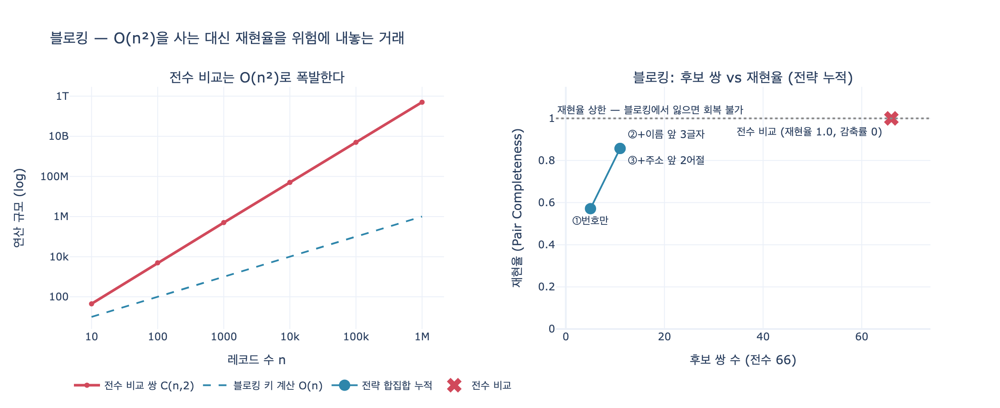

# 블로킹(blocking)은 무엇이며 성패를 정하는 지표는 무엇인가?

> **한 줄 답**: 전수 비교 대신 **후보 쌍을 좁히는 기법**이다. 성패는 **재현율(recall)** 인데, 후보에 못 들면 영영 만나지 못하기 때문이다.

## 1. 왜 필요한가 — 전수 비교의 벽

엔티티 해상도(entity resolution)는 「같은 사람/회사가 서로 다른 표기로 여러 노드에 앉아 있는」 상황을 정리하는 일이다. 가장 순진한 방법은 모든 레코드 쌍을 비교하는 것이다. 그런데 쌍의 개수는 레코드 수의 제곱으로 자란다.

$$\text{쌍의 수} = \binom{n}{2} = \frac{n(n-1)}{2} \sim O(n^2)$$

| 레코드 수 $n$ | 전수 비교 쌍 |
|---|---|
| 12 | 66 |
| 1,000 | 499,500 |
| 100,000 | 4,999,950,000 |
| 1,000,000 | 약 5,000억 |

14장 예제(`ex1_blocking.py`)가 첫 줄에서 하는 말이 정확히 이것이다.

```
레코드 12개 → 전수 비교 쌍 66개
10만 개라면 4,999,950,000쌍. 하루로 안 끝난다.
```

10만 건은 「큰 데이터」도 아니다. 그런데도 쌍이 50억이다. 쌍마다 문자열 유사도를 몇 개씩 계산하면 하루로 안 끝난다. **비교 대상 자체를 줄여야 한다.**

## 2. 블로킹이란 무엇인가

**블로킹**은 레코드마다 값싼 **블로킹 키(blocking key)** 를 뽑아 같은 키를 가진 것들만 한 「칸(block)」에 모으고, **같은 칸 안에서만** 쌍을 만드는 기법이다.

```
전체 레코드 ──[키 함수]──▶ 칸 여러 개 ──▶ 칸 안에서만 쌍 만들기 ──▶ 후보 쌍
                                                                    │
                                                          비싼 점수 계산은 여기만
```

핵심 성질은 두 가지다.

- 키 계산은 **레코드당 O(1)** 이다. 정렬/해싱으로 $O(n)$ ~ $O(n \log n)$ 에 칸을 만든다.
- **다른 칸에 떨어진 쌍은 아예 비교되지 않는다.** 이게 절약의 원천이면서, 동시에 위험의 원천이다.

14장 예제의 세 전략을 보자.

| 전략 | 키 함수 | 의도 |
|---|---|---|
| 사업자번호 | `r[2]` 그대로 | 식별자가 있으면 가장 강력 |
| 이름 앞 3글자 | 법인격 표기(`(주)`, `주식회사`)·공백 제거 후 앞 3글자 | 표기 차이 흡수 |
| 주소 앞 2어절 | `"서울 강남구"` | 지역이 같은 것끼리 |

이름 키에서 `norm_name`이 먼저 도는 게 중요하다. 정규화 없이 앞 3글자를 자르면 `가온테크`는 `가온테`, `(주)가온테크`는 `(주)`가 되어 **같은 회사가 다른 칸으로 갈라진다.** 블로킹 키는 「정규화 + 절단」의 조합이다.

## 3. 성패를 정하는 지표: 재현율

블로킹의 출력은 후보 쌍 집합 $C$ 다. 정답(같은 실체인) 쌍 집합을 $M$ 이라 하면 두 지표가 대립한다.

$$\text{재현율(Pair Completeness)} = \frac{|C \cap M|}{|M|}, \qquad
\text{감축률(Reduction Ratio)} = 1 - \frac{|C|}{\binom{n}{2}}$$

- **감축률**은 「얼마나 아꼈나」다. 높으면 빠르다.
- **재현율**은 「정답 쌍을 후보에 담았나」다.

성패를 정하는 건 재현율이다. 이유는 **비대칭적 회복 가능성**에 있다.

| 실수 | 결과 | 뒷단에서 고칠 수 있나 |
|---|---|---|
| 후보를 너무 많이 담았다 (감축률 낮음) | 느려진다 | **고칠 수 있다.** 점수 계산이 가짜 쌍을 걸러낸다 |
| 정답 쌍을 후보에서 빠뜨렸다 (재현율 낮음) | 영영 못 만난다 | **못 고친다.** 점수를 매길 기회조차 없다 |

블로킹에서 놓친 쌍은 파이프라인 뒤쪽의 어떤 단계도 구제하지 못한다. 점수 함수를 정교하게 만들든, 임계를 낮추든, 사람을 붙이든 소용없다. **애초에 그 쌍이 계산 대기열에 없기 때문이다.** 정밀도는 나중에 회복 가능한 자원이지만 재현율은 여기서 한 번 잃으면 끝난다. 그래서 예제의 결론이 이렇게 적혀 있다.

> 블로킹의 성패는 «재현율»이다. 후보에 못 들면 영영 못 만난다.

### 재현율의 상한이라는 관점

블로킹의 재현율은 전체 엔티티 해상도 재현율의 **상한(ceiling)** 이다. 블로킹이 90%를 담아 왔다면, 그 뒤 단계가 완벽하더라도 최종 재현율은 90%를 넘을 수 없다. 그래서 지표를 볼 때 「블로킹 재현율 = 우리가 도달할 수 있는 천장」으로 읽는 습관이 필요하다.

## 4. 전략 하나로는 안 된다 — 합집합

예제 데이터에서 각 전략이 뭘 놓치는지 보면 이 원칙이 저절로 나온다.

| 놓치는 쌍 | 왜 | 어느 전략이 실패하나 |
|---|---|---|
| `r03` (가온테크 주식회사) | 사업자번호가 **빈 값** | 사업자번호 전략 |
| `r04` (GAON TECH) | 이름이 **영문**, 주소·대표자·전화 전부 빔 | 이름 전략, 주소 전략 |

- 사업자번호만 썼다면 → `r03`을 놓친다 (키가 `None`이라 어느 칸에도 못 들어간다)
- 이름만 썼다면 → `r04`를 놓친다 (`GAO`와 `가온테`는 다른 칸)
- 주소만 썼다면 → `r04`를 놓친다 (주소가 빔)

그래서 **여러 전략을 각각 돌리고 후보 쌍의 합집합을 쓴다.**

$$C = C_{\text{bizno}} \cup C_{\text{name3}} \cup C_{\text{addr}}$$

합집합은 재현율에 대해 **단조 증가**한다. 전략을 추가하면 재현율은 절대 떨어지지 않는다(같거나 오른다). 대신 후보 쌍이 늘어 느려진다. 예제의 마지막 문장이 그 균형을 가리킨다.

> 전략을 늘리면 후보가 늘어 느려진다. 그 균형이 설계다.

실무 규칙으로 정리하면:

1. **키를 여러 개 만든다.** 서로 다른 필드, 서로 다른 실패 모드를 노린다. 한 전략이 죽는 지점을 다른 전략이 덮게 짠다.
2. **빈 값은 키가 아니다.** 예제의 `block()`은 `if k:`로 `None`/빈 문자열을 버린다. 빈 값을 하나의 칸으로 묶으면 「값 없는 것들」 전부가 서로 비교되어 폭발한다.
3. **거대한 칸을 감시한다.** 흔한 키(예: `"서울 강남구"`)는 칸이 수만 개짜리로 자라 $O(n^2)$ 이 국지적으로 되살아난다. 칸 크기 상한을 두고 넘치면 키를 더 세분한다.
4. **재현율을 측정한다.** 사람이 라벨링한 정답 쌍 표본(예제의 `TRUTH`)을 두고, 블로킹이 그 쌍들을 후보에 담았는지 매번 확인한다. 측정 없는 블로킹은 조용히 데이터를 버린다.

## 5. 파이프라인 안에서의 위치

```
레코드 ─▶ ①정규화 ─▶ ②블로킹 ─▶ ③점수 ─▶ ④임계 두 개 ─▶ ⑤되돌릴 수 있는 병합
                       │            │         │
                    재현율 승부   정밀도   자동/검토/무시
```

블로킹(②)은 재현율을 담당하고, 점수·임계(③④)는 정밀도를 담당한다. 역할이 갈려 있으니 지표도 갈아서 봐야 한다. ③④에서 임계를 만지며 정밀도를 조정하는 건 언제든 다시 할 수 있지만, ②에서 잃은 재현율은 재계산을 다시 돌리지 않는 한 회복되지 않는다.

## 6. 한 줄로 외울 문장

> 블로킹은 $O(n^2)$ 을 사는 대신 **재현율을 위험에 내놓는** 거래다. 후보에 못 들면 영영 못 만나니, 전략을 서너 개 돌리고 합집합을 써라.

## 참고

- [Blocking (ACM)](https://dl.acm.org/doi/10.1145/3355491.3355496) — 14장 키워드 표의 1차 출처, [사실상 표준]
- [Deep Learning for Entity Matching (VLDB)](https://www.vldb.org/pvldb/vol11/p1454-mudgal.pdf) — 엔티티 해상도 전반
- 예제 코드: `content/ch14/code/ex1_blocking.py`, `content/ch14/code/records.py`

## 시각화


